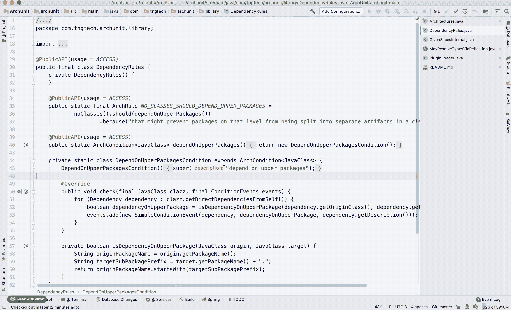
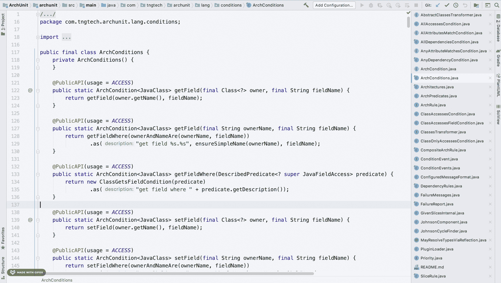
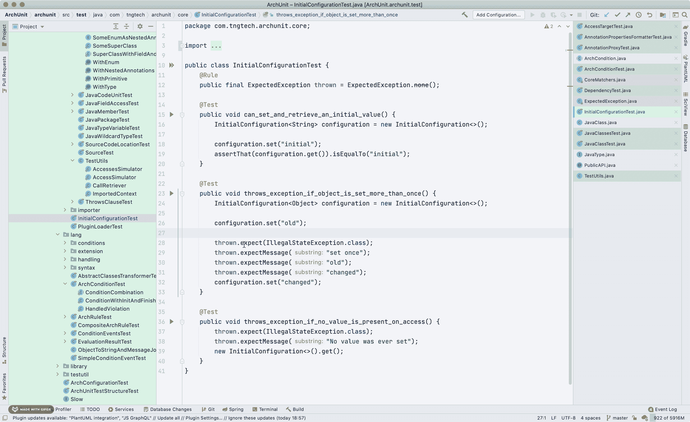
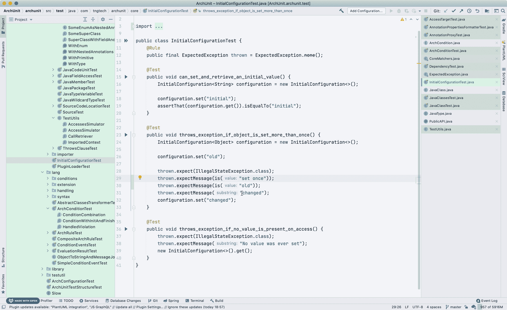
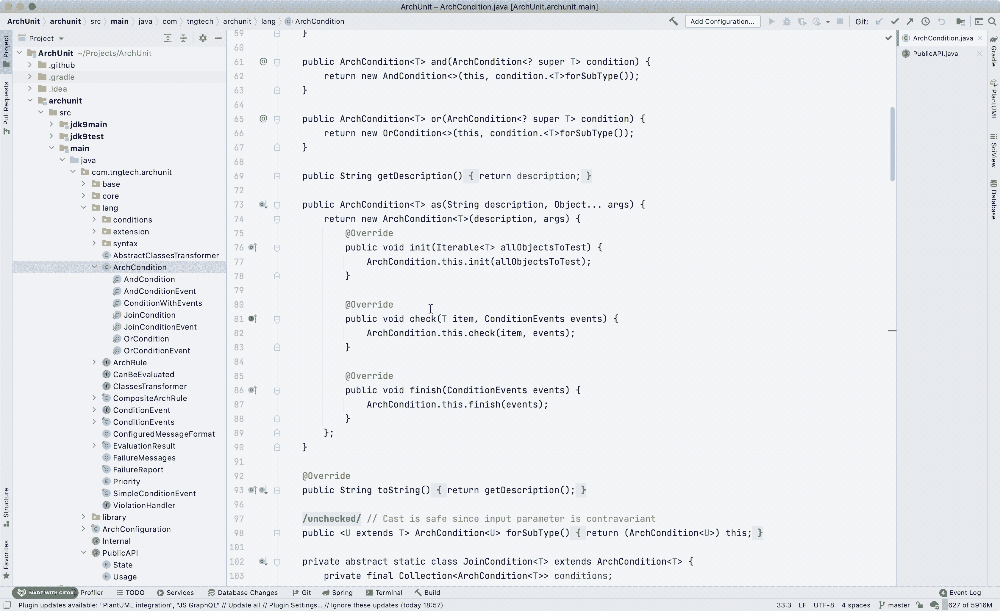
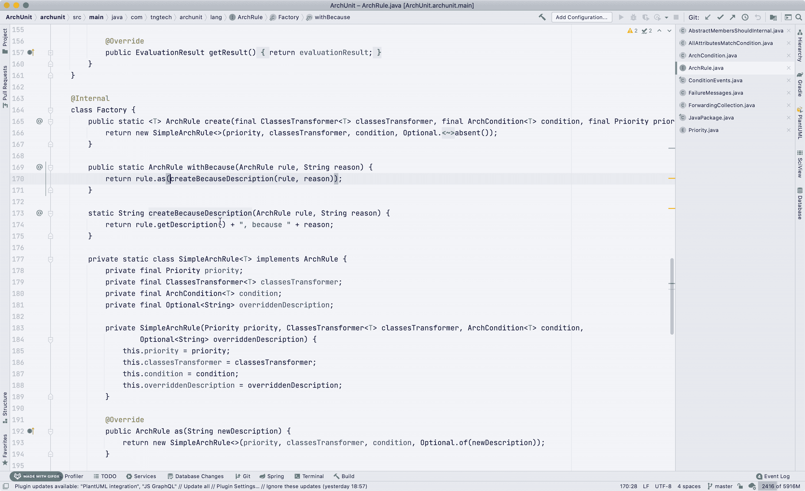

# 我最喜欢的 IntelliJ 知识

> 原文：<https://medium.com/javarevisited/my-favourite-intellij-know-hows-75dfa5a83b89?source=collection_archive---------1----------------------->

[胡安·戈麦斯](https://unsplash.com/@nosoylasonia?utm_source=medium&utm_medium=referral)在 [Unsplash](https://unsplash.com?utm_source=medium&utm_medium=referral) 上拍照

IntelliJ IDEA 是 JVM 社区中最受欢迎的编辑器。这是我个人最喜欢的，我已经用了很多年了。在这篇文章中，我想分享在我的日常工作中帮助我充分利用 IntelliJ 的东西。

*免责声明:您的快捷键可能会因您使用的键映射* *而有所不同——我的是“IntelliJ IDEA Classic keymap ”,带有一些定制。*

# 重新连线工具窗口快捷键

IntelliJ 提供了许多有用的工具窗口，允许您深入了解项目并访问/运行整个项目生态系统。我发现默认工具 windows 快捷键分配相当不错，但我很快意识到其中一些我从未使用过。因此我重新分配了他们:

## 从`Favourites`到数据库的“'⌘ + 2”

这个非常简单——我经常需要查看不同的数据库，但以前从未真正使用过`Favourites`,至少直到最近——现在我将`.http`暂存文件与我想要保留的 HTTP 请求一起保存在`Favourites`中，而不用将它们签入 VCS。

## “'⌘ + 6”从问题到终结

终端是软件开发人员的必备工具，拥有一个快捷方式可以减少我切换到终端的时间。我强烈支持尽可能少的认知开关，所以在我的 IDE 中有可能访问终端帮助我实现了这一点。

## `⌘ + 7 `从结构到 Git 分支

我所工作的项目有许多短命的分支，因此自然地，有许多分支之间的切换。我最初的方法是:

*   切换到终端
*   从原点获取
*   列出分支机构(通常，你不会记住分支机构的名称)
*   复制分支名称
*   签出分支(也可能提取最新的变更)
*   切换回 IDE

不得不切换、复制、运行不同的命令，再切换是很烦人的。我喜欢 IntelliJ 中的 VCS 插件，但是它右下角的“Git: *branch_name* ”选项也没有吸引我。是时候进行一些定制了！

重新连接 **⌘+7** 打开分支的快捷方式让我可以用一个强大的过滤器快速浏览所有分支，而不必切换到另一个工具。我还在屏幕中间放置了分支弹出窗口。作为一种习惯，在我签出一个分支后，我点击 **⌘+T** 来获取最新的变化。

这也是创建新分支的一种便捷方式:

# 快速访问最近查看的代码

IntelliJ 会记住你在当前会话中访问过的所有代码位置。当你从一个类跳到另一个类(或从一个地方跳到另一个地方)时，这是非常有用的，尤其是在一个不熟悉的项目中。

使用 **⌘+E** 访问最近的文件:

和 **⌘+⇧+E** 访问最近的位置:

您可以通过转至首选项-编辑器-常规-限制来配置 IntelliJ 记忆的文件/位置数量。

如果您想永久标记特定的代码位置，请尝试“书签”( **F10** 在您想要添加书签的行)。

# 使用多个光标加速(不同的变化)

代码不断变化，能够快速重构代码总是很方便的。当处理文本更改时(例如，在一个测试类的所有测试中编辑相同的模拟验证)，我已经使用了替换功能 **(⌘+R)** 很多次，但是我总是在替换输入区域缺少代码完成。⌘+ **control+G** 为我解决了这个问题，因为它选择并放置了一个光标，用于当前光标所在元素的所有精确匹配，有效地允许我一次编辑所有的出现:

对于更细粒度的控制，我使用 **control+G** ，它只将光标添加到下一个事件:

您也可以使用**⌥+⇧+click**(alt/option+shift+click)在任意位置放置额外的光标:

# 用调用层次结构跟踪方法的调用堆栈

假设我们有一个项目，它具有非常通用的服务器层架构，我们想要跟踪哪个 API 调用导致了对某个存储库方法的调用。在我学习调用层次结构之前，我会找到存储库方法的所有用法，锁定那个选项卡，然后找到调用那个存储库方法的服务方法的用法。很复杂，对吧？通过调用层次**(控制+⌥+H)** ，IntelliJ 会为您完成这项工作，甚至允许您进一步过滤:

我希望这些建议对你有用！