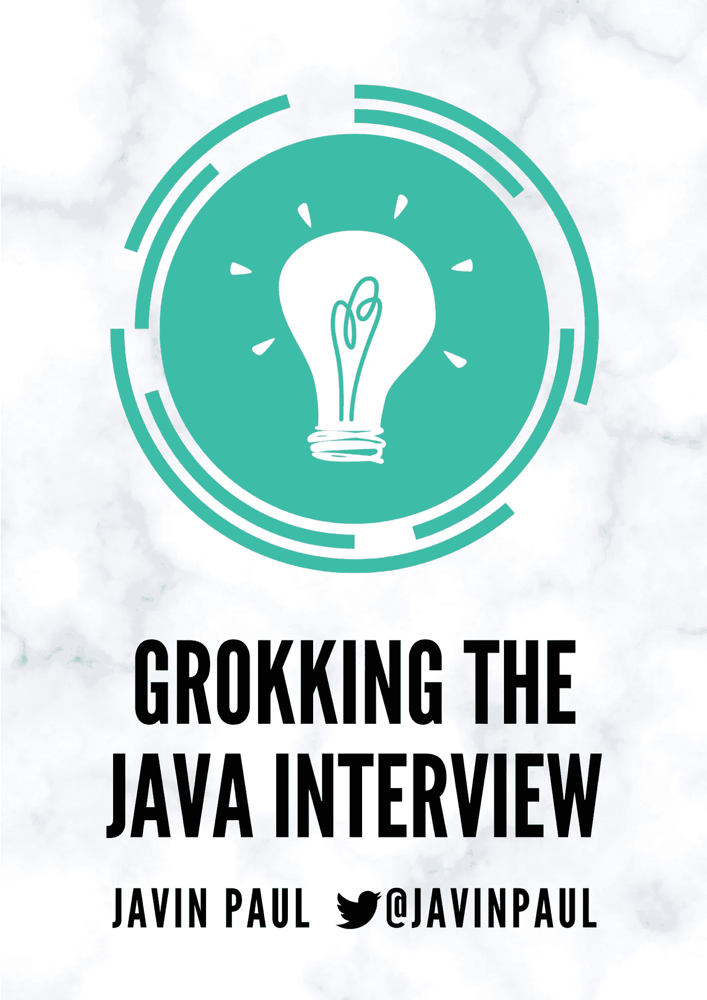
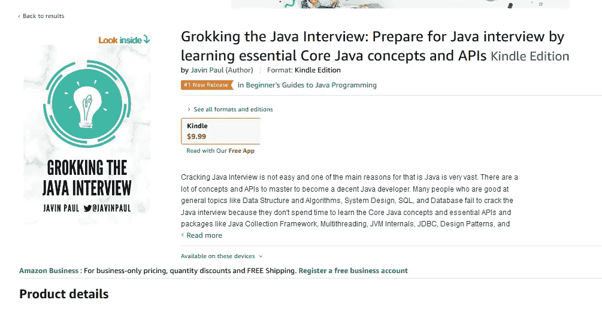

# 我写博客 10 年后的第一本书——探索 Java 访谈

> 原文：<https://medium.com/javarevisited/my-first-book-after-10-years-of-blogging-grokking-java-interviews-fba4239d42cb?source=collection_archive---------2----------------------->

大家好，

我非常兴奋地宣布，在我写了 10 年的 Java 文章和 Java 面试问题之后，我的第一本书出版了，这些文章和问题已经被数百万开发者阅读过。

虽然我写博客已经有 10 年了，但我从来没有真正卖出过任何东西，没有任何书、课程或任何数码产品。

最后，现在我有了我的第一本书，它将帮助 Java 开发人员破解面试— **探索 Java 面试**。你现在可以在 GumRoad 上以 10.99 美元的特价购买这本书。

下面是链接— [**搜 Java 面试**。](https://gumroad.com/l/QqjGH)

这是我长久以来的愿望，让我的内容以一种结构化和有组织的方式提供更多的价值，这本书做到了。它提供了一种结构化的方法来准备 Java 面试和学习基本的核心 Java 概念。

我向我所有的 Javareivsited 会员提供特别折扣，你可以在亚马逊上只花 9.9 美元购买课程

**这里是购买 Kindle 版本的链接—** [**在亚马逊上搜 Java 访谈**](https://www.amazon.com/dp/B08P55JZBX/?tag=javamysqlanta-20)

感谢您的支持，它已经成为 Java 编程类别中排名第一的新版本。

如果你买了这本书，如果你认为它有价值，请考虑留下评论，这将对我和其他读者有很大帮助。如果你有任何问题或反馈或任何其他想法来进一步改善这本书，请随时回复我。

再次感谢大家成为 JAvarevisitd 的关注者并支持我们的社区。

感恩节快乐

贾文