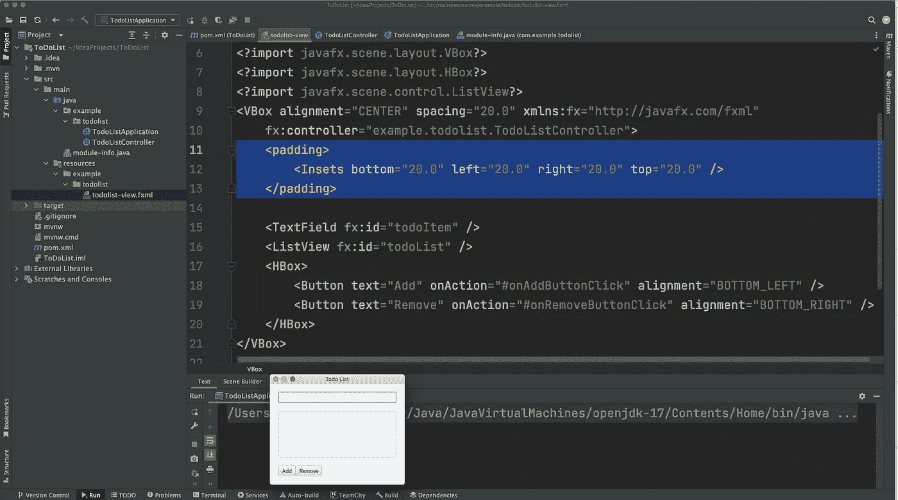
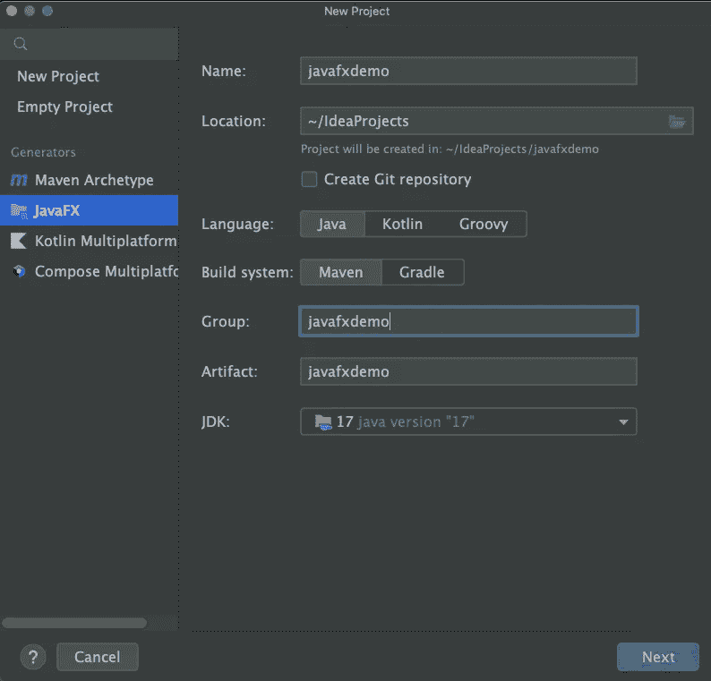
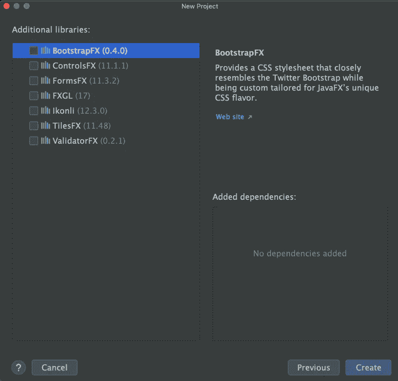
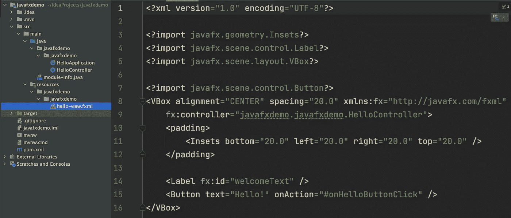
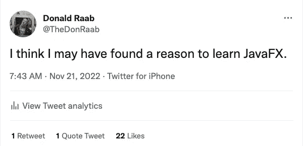
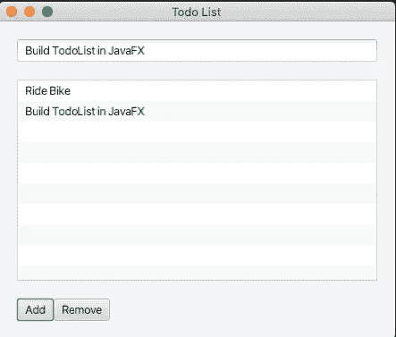

# 我的第一个 JavaFX 应用程序

> 原文：<https://medium.com/javarevisited/my-first-javafx-application-ee70a1d48cb3?source=collection_archive---------1----------------------->

通过在 IntelliJ 中构建简单的 TodoList 应用程序来学习 JavaFX



IntelliJ 显示 todolist-view.fxml 文件并在视图中运行 todolist 应用程序

# 我的 UI 构建之旅

22 年前，我是一名专业的 IBM VisualAge Smalltalk 开发人员。我甚至参加了一个考试，成为 IBM 认证的 VisualAge Smalltalk 助理开发人员。我偶尔会向与我一起工作的其他开发人员演示 VisualAge Smalltalk 功能。我在 VisualAge Smalltalk 中给出的最令人印象深刻(也是最简单)的演示是在不到两分钟的时间内构建一个工作在内存中的 ToDoList 应用程序。

在我开始写这个博客后，我决定做一些研究，看看是否有人在 YouTube 上录制了一个用 VisualAge Smalltalk 创建 ToDoList 的视频。我找不到任何视频，但是经过一番挖掘，我找到了 VAST 的在线[文档，它包含了我曾经演示过的完全相同的 ToDoList 示例，在标题为“构建你的第一个可视化应用程序”的一节中](https://www.instantiations.com/vast-support/documentation/1101/#page/gs/getsta28.html#) [VAST](https://www.instantiations.com/vast-platform/) 是 IBM VisualAge Smalltalk 的继任者，现在是[实例化](https://www.instantiations.com/)的产物。

我喜欢在 VisualAge Smalltalk 中构建桌面应用程序。在我用 Java 工作的前十年，我甚至喜欢用 Swing 用 Java 构建桌面应用程序。Java 中的桌面应用程序经常被 Java web 应用程序取代，最终在前端被 JavaScript 应用程序取代。我最终完全停止了构建 ui，并主要致力于后端 Java 代码。

虽然我从来不擅长用任何语言来构建好看的 UI，但是我很怀念能够把一个功能性的 UI 放在一起，这样我就可以快速演示一些东西。我希望能够在两分钟之内用 Java 构建一个可用的 UI。我认为直接的 Java Swing 编程会导致我经历严格的强力编码和记忆，所以我决定甚至不考虑这个选项。我渴望能像 VisualAge Smalltalk 一样提高我的工作效率。我很确定即使在今天也没有类似的东西存在，但是我想也许会有一些东西让我更接近于再次成为一名 UI 开发人员。

# 智能救援

我决定在本周的某一天打开 IntelliJ，看看它能为我做些什么。正如我对过去 20 年来我最喜欢的 IDE 的期望一样，IntelliJ 给了我一个惊喜。我点击了“新项目”，这是我找到的。



我决定尝试创建一个新的 JavaFX 项目

我从生成器列表中选择了 JavaFX。在我更改项目名称和组，并点击“下一步”，然后我得到了这个屏幕的提示。



其他 JavaFX 库

我没有选择任何一个，因为我不认为我会需要任何花哨的简单 ToDoList。于是我就点击了“创建”。


IntelliJ 创建了一个工作的 Hello JavaFX 应用程序！

瞧啊。IntelliJ 用 Maven build 和一切创建了一个工作的`HelloApplication` all 设置。它生成两个类(`HelloApplication`、`HelloController`)和一个 XML 文件(`hello-view.xml`)，该文件包含一个 UI 的声明性布局。在上面，我只是点击了`HelloApplication`类旁边的“运行”按钮，带有一个设置标签的工作按钮的用户界面出现了。

我做的下一件事是打开名为`hello-view.xml`的 XML 文件。



hello-view.xml

看着这个文件，我大概能明白这是如何工作的，以及如何将代码转化成我自己的 ToDoList 应用程序。在这一点上，我绝对没有读过任何关于 JavaFX 的文档。我熟悉声明式用户界面，因为我以前在 Adobe Flex 中开发过，并且在高盛工作时管理过一个名为 GLUI 的专有声明式 Java UI 框架的开发。GLUI 框架有 Swing、Web 和 iOS 呈现器，此外还有一个用于测试的无头呈现器。如果你读过我的关于乐高 CI build 监控机器人的博客，那么你已经看到 GLUI 在 iPad 上运行，而没有意识到你在看什么。GLUI 是一个美好但遥远的记忆。

此时，我已经看了足够多的 IntelliJ 和 JavaFX，我觉得我可以在 30 分钟内轻松地开发一个 ToDoList 应用程序。这是我决定在推特上发布我刚刚开始的新旅程的时候。



我关于学习 JavaFX 的第一条推文

# 制作待办事项列表应用程序

在让`HelloApplication`工作之后，我等了几天才回来尝试 IntelliJ 中的东西。这是几个小时前的事了。现在我有了一个可以工作的`TodoListApplication`(图在这个博客的顶部)。

这是我从原来的`hello-view.xml`文件变形而来的`todolist-view.xml`文件。

```
<?import javafx.scene.layout.VBox?>
<?import javafx.scene.layout.HBox?>
<?import javafx.scene.control.ListView?>
<VBox alignment="CENTER" spacing="20.0" xmlns:fx="http://javafx.com/fxml"
    fx:controller="example.todolist.TodoListController">
    <padding>
        <Insets bottom="20.0" left="20.0" right="20.0" top="20.0" />
    </padding>

    <TextField fx:id="todoItem" />
    <ListView fx:id="todoList" />
    <HBox>
        <Button text="Add" onAction="#onAddButtonClick" alignment="BOTTOM_LEFT" />
        <Button text="Remove" onAction="#onRemoveButtonClick" alignment="BOTTOM_RIGHT" />
    </HBox>
</VBox>
```

为了让它工作，我必须做一些研究来了解一下`HBox`标签，它允许我将添加和删除按钮水平地放在一起。我还查找了`TextField`和`ListView`组件，发现我需要给它们 id，就像`hello-view.xml`中的标签一样。

这是我的`TodoListController`。我添加了 todoItem 和 todoList 作为字段，并使用了 FXML 标记。我不太清楚这一切是如何工作的(还不知道)，但只是尝试一下就很简单，而且正如我预期的那样工作。

```
package example.todolist;

import javafx.fxml.FXML;
import javafx.scene.control.ListView;
import javafx.scene.control.TextField;

public class TodoListController
{
    @FXML
    private TextField todoItem;

    @FXML
    private ListView todoList;

    @FXML
    protected void onAddButtonClick()
    {
        this.todoList.getItems().add(this.todoItem.getText());
    }

    @FXML
    protected void onRemoveButtonClick()
    {
        int indexToRemove = this.todoList.getSelectionModel().getSelectedIndex();
        this.todoList.getItems().remove(indexToRemove);
    }
}
```

基于`HelloApplication`的例子，我能够弄清楚如何将事件与动作联系起来。IntelliJ 似乎知道如何将 XML 文件中的事件与控制器中相应的动作关联起来。我只是点击了 IntelliJ 代码助手，发现列表视图有一个选择模型，我可以从那里获得列表中某个项目的选定索引。

这是我的`TodoListApplication`。

```
package example.todolist;

import javafx.application.Application;
import javafx.fxml.FXMLLoader;
import javafx.scene.Scene;
import javafx.stage.Stage;

import java.io.IOException;

public class TodoListApplication extends Application
{
    @Override
    public void start(Stage stage) throws IOException
    {
        FXMLLoader fxmlLoader = new FXMLLoader(
                TodoListApplication.class.getResource("todolist-view.fxml"));
        Scene scene = new Scene(fxmlLoader.load(), 320, 240);
        stage.setTitle("Todo List");
        stage.setScene(scene);
        stage.show();
    }

    public static void main(String[] args)
    {
        TodoListApplication.launch();
    }
}
```

在这里，我真正需要改变的只是 XML 文件的名称，但这是 IntelliJ 自动重构的一部分，当时我将`hello-view.xml`文件重命名为`todolist-view.xml`。

这是正在运行的应用程序。这已经足够好了，我对学习一些基本 JavaFX 的第一次实验感到满意。



设置我昨天的个人日程表

# 我的 TodoList 应用程序的后续步骤

现在，我已经使用 JavaFX 快速建立并运行了一个基本的 UI，我还想探索更多的东西。在我构建了 TodoList UI 之后，通过手工编辑 XML 文件和 Java 文件，我发现有一个用于 JavaFX 的 UI 构建器在 IntelliJ 中工作，名为 [SceneBuilder](https://www.jetbrains.com/help/idea/opening-fxml-files-in-javafx-scene-builder.html) 。 [SceneBuilder](https://gluonhq.com/products/scene-builder/) 是一个由[glon](https://gluonhq.com/)构建的用于 JavaFX 的 OSS UI 构建器。我想很快看看 SceneBuilder，看看我能否使用拖放功能添加更复杂的组件。

我还将为一个`TodoItem`引入一个简单的域概念。我可能只是让它包含一个`String`和一个`Date`来开始。这将使我有机会在 JavaFX 中试验`DatePicker`。

一旦我有了一个`TodoItem`，我将希望能够在启动时保存和恢复它们。我可能会从一个叫做 [Reladomo](https://github.com/goldmansachs/reladomo) 的 ORM 开始，我已经有一段时间没有使用它了。我可能还会尝试一些其他的持久性存储选项。

这对我来说会很有趣。我会写下我一路上的发现。

# 最后

我开始了这次旅程，试图取代我很久以前失去的东西。我希望能够用 Java 快速构建和演示桌面 ui，就像我 22 年前使用 VisualAge Smalltalk 一样。我意外地发现了一些我没有预料到的东西——Java FX 的声明式 UI 功能。这肯定比在 Swing 中手工编写 UI 有趣得多，所以我期待着学习更多。虽然我用 VisualAge Smalltalk 开发的可视化编程环境在我见过的任何语言中似乎都没有对等物，但声明式 UI 是我在 Java 中非常熟悉的东西。我已经开始喜欢用 JavaFX 进行开发了，这真的只是 4 或 5 个小时的探索，包括写这篇博客。

感谢您的阅读！

我是由[*Eclipse Foundation*](https://projects.eclipse.org/projects/technology.collections)*管理的*[*Eclipse Collections*](https://github.com/eclipse/eclipse-collections)*OSS 项目的创建者和提交者。Eclipse Collections 为* [*投稿*](https://github.com/eclipse/eclipse-collections/blob/master/CONTRIBUTING.md) *打开。*

您可能喜欢的其他 Java 文章:

*   Java 8 中日期和时间的 20 个例子([教程](https://javarevisited.blogspot.com/2015/03/20-examples-of-date-and-time-api-from-Java8.html))
*   Java 8 中如何使用 Stream 类([教程](http://www.java67.com/2014/04/java-8-stream-examples-and-tutorial.html))
*   如何在 Java 8 中使用 filter()方法([教程](http://www.java67.com/2016/08/java-8-stream-filter-method-example.html))
*   如何在 Java 8 中使用 forEach()方法([例](http://www.java67.com/2016/01/how-to-use-foreach-method-in-java-8-examples.html))
*   如何在 Java 8 中连接字符串([示例](http://www.java67.com/2016/08/java-8-stringjoin-example.html))
*   Java 8 中如何将列表转换为映射([解](http://javarevisited.blogspot.com/2016/04/10-examples-of-converting-list-to-map.html))
*   如何在 Java 8 中使用 peek()方法([例](http://www.java67.com/2016/08/java-8-stream-filter-method-example.html))
*   Java 8 中如何将流转换成数组([教程](http://javarevisited.blogspot.sg/2017/01/3-ways-to-convert-java-8-stream-to-array.html))
*   Java 8 认证常见问题([指南](http://javarevisited.blogspot.sg/2017/07/ocajp-8-faq-oracle-certified-associate-certification-1z0-808-exam.html))
*   Java 8 模拟考试和实践测试([测试](http://www.java67.com/2017/05/10-free-java-8-certification-sample-questions-OCAJP8-OCPJP8-Mock-Exams.html))

</javarevisited/the-java-programmer-roadmap-f9db163ef2c2>  </javarevisited/top-22-skills-professional-java-programmers-can-learn-in-2022-to-upgrade-themselves-bc3da73d7491> 