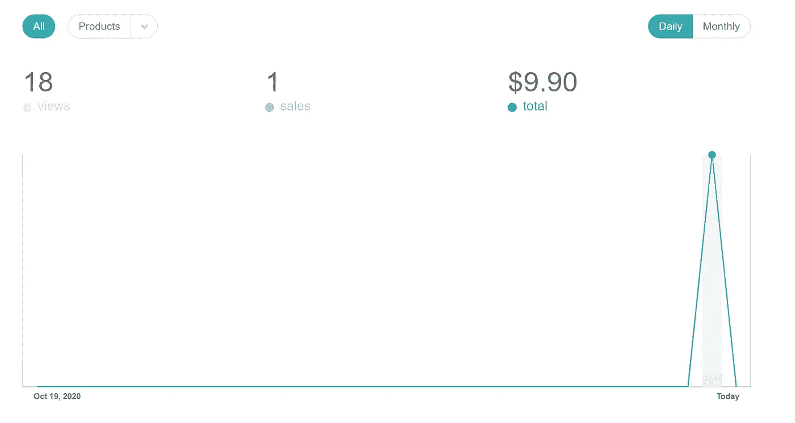

# 我写博客 10 年后的第一笔销售

> 原文：<https://medium.com/javarevisited/my-first-sale-after-10-years-of-blogging-6460a57ee38c?source=collection_archive---------1----------------------->

## 我是如何在写了 10 年博客后，用 Gumroad 做了第一笔销售，并创作出一本电子书的

我写博客 10 年后的第一笔销售

朋友们，你们好，我非常兴奋地宣布，我昨天拿到了我的第一笔销售。虽然我已经写了 10 年的博客，但我从未真正卖出过任何东西，没有任何书、课程或数码产品。终于，现在我有了我的书— [**在@Gumroad 上预售的 Java 访谈**](https://gumroad.com/l/QqjGH) ，并且拿到了我的第一笔销售(预购)。

破解 Java 面试并不容易，其中一个主要原因是 Java 非常庞大。要成为一名优秀的 Java 开发人员，需要掌握很多概念和 API。

许多擅长数据结构和算法、系统设计、SQL 和数据库等一般主题的人未能通过 Java 面试，因为他们没有花时间学习核心 Java 概念和基本 API 和软件包，如 Java 集合框架、多线程、JVM 内部、JDBC、设计模式和面向对象编程。

本书旨在填补这一空白，并向您介绍这些主题中的经典 Java 面试问题。这本书是我最好的 Java 访谈文章的汇编，有数百万开发者阅读。通过阅读这些问题和主题，你不仅可以扩展你的知识，还可以为下一次 Java 面试做好准备。

如果您正在准备 Java 面试，那么我强烈建议您在电话面试或面对面面试之前仔细阅读这些问题，您不仅会获得回答问题的信心和知识，还会学会如何让 Java 面试对您有利。

作为一名 Java 开发人员，这是我能给你的最重要的提示。永远记住，你的答案决定面试，这些问题会告诉你如何让面试官了解你的强项。

如果你对这本书感兴趣，你可以在 Gumroad **上以特价**$ 9.9**——**[**搜索 Java 访谈**](https://gumroad.com/l/QqjGH)**】**

我非常感谢独立黑客社区和你们所有人，我在 Twitter 和 Medium for inspiration 上的读者，特别是丹尼尔·瓦萨洛，他的 [**每个人都可以建立一个 Twitter 受众**](https://gumroad.com/a/703100019/PBkrO) 课程和推文激励我努力创作自己的书。免责声明-我也是丹尼尔的 AWS 书籍和 Twitter 课程的会员。