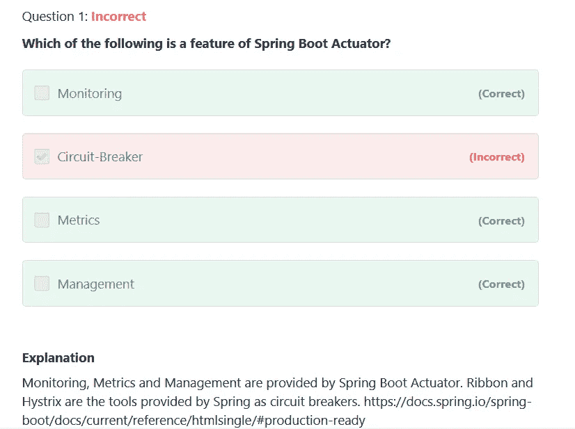

# 2023 年我在 Udemy 上的春季专业认证课程和实践考试

> 原文：<https://medium.com/javarevisited/my-first-udemy-course-spring-professional-certification-practice-test-for-java-developers-ca2fdeb10d7f?source=collection_archive---------0----------------------->

## 做了 10 年的 Java 博客之后，我在 Udemy 上创建了一个 Spring 专业认证测试，为您准备 Vmware Spring 认证。

大家好，我非常兴奋地宣布，我在 Udemy 上的第一个产品— [**春季专业实践测试**](https://www.udemy.com/course/spring-professional-practice-test-questions-vmware-edu-certification/?referralCode=7419B0A2C8AB79F0520E) 现已上线，在 Udemy 上只需 29.9 美元即可购买。

这是为您的 spring 认证考试做准备的一个练习，也是破解 Spring 专业认证考试的一个练习，Spring 专业认证考试是 Java 开发人员最需要的认证之一。

<https://www.udemy.com/course/spring-professional-practice-test-questions-vmware-edu-certification/?referralCode=7419B0A2C8AB79F0520E>  

如果你正在准备春季认证，那么你会喜欢这些测试。这些是为春季专业认证( [VMware EDU-1202](/javarevisited/spring-professional-certification-vmware-edu-1202-the-ultimate-guide-to-pass-spring-11dab8d311c3) )做准备的 250 多个独特且高质量的模拟测试。

如果你不知道，Spring 专业认证是一个非常受欢迎的认证，也是提高你的 [Spring 框架](/javarevisited/10-best-online-courses-to-learn-spring-framework-in-2020-f7f73599c2fd)技能的好方法。通过 Spring 认证有许多有形和无形的好处，这些实践测试对此很有帮助。

所有这些 250 多个问题分为 5 个模拟测试，您将有 90 分钟的时间来回答这些问题。**及格分数 76%。一旦你完成了测试，你也可以通过 spring 文档的链接来查看详细的解释，以深入理解这个主题。**

这是本课程中的一个例子:

使用我的链接在 Udemy 上购买，仅需 9.9 美元

以下是我的 Udemy 课程中关于春季认证的几个自由练习题:

**2。在 bean 的生命周期中，下面哪个方法会被首先调用？**

1.初始化 Bean 接口中的 afterPropertiesSet 方法

2.Spring XML 配置中指定的 init 方法

3.任何用@PostConstruct 注释的方法

4.任何名为“init”的方法

**正确答案**是 3“任何用@PostConstruct 标注的方法”

**解释:**对于容器中的每个 bean，其生命周期如下:

使用 bean 元数据创建 bean 的实例。

设置 bean 的属性和依赖项。

BeanPostProcessor 的任何实例都有机会处理新 bean

初始化前后的实例。

bean 实现类中用`@PostConstruct`标注的任何方法都是

已调用。

该处理由 BeanPostProcessor 执行。

bean 实现类中实现的任何 afterPropertiesSet 方法

调用 InitializingBean 接口。

该处理由 BeanPostProcessor 执行。如果相同的初始化

方法已经被调用，它将不会被再次调用。

-调用任何自定义 bean 初始化方法。

Bean 初始化方法可以在 init-method 的值中指定

属性放在 Spring XML 配置中相应的<bean>元素中，或者放在</bean>

@Bean 批注的 initMethod 属性。

该处理由 BeanPostProcessor 执行。如果相同的初始化

方法已经被调用，它将不会被再次调用。

-豆子已经可以用了。

**3。使用@DataJpaTest 时，下列哪些是自动配置的？**

1.Spring 存储库

2.春天安全

3.数据源

4.信息源

正确答案是 1，3

解释:" [@DataJpaTest](https://javarevisited.blogspot.com/2021/09/difference-between-webmvctest-and-da.html) 注释自动配置以下内容:

-缓存

- Spring 数据 JPA 存储库

- Flyway 数据库迁移工具

-数据源-默认情况下，数据源将使用嵌入式内存数据库(测试数据库)。

-数据源事务管理器-用于单个数据源的事务管理器。

-JDBC 模板

- Liquibase 数据库迁移工具

-[休眠](https://javarevisited.blogspot.com/2018/01/top-5-hibernate-and-jpa-courses-for-java-programmers-learn-online.html)的基于 JPA 的配置

-春季交易

-测试数据库

-用于测试的 JPA 实体管理器

**4。以下哪一项可确保在出现任何问题时，系统恢复后更改仍会保留？**

1.原子数

2.一致性

3.隔离

4.持久性

正确答案:4

说明:一个事务的影响不会对另一个[事务](https://javarevisited.blogspot.com/2011/11/database-transaction-tutorial-example.html)产生任何影响，所以它们是相互独立的。他们彼此完全隔绝。

**6。配置外部 MySQL 数据库需要以下哪些属性？**

1.spring .数据源.密码

2.spring .数据源.用户名

3.spring .数据源. url

4.spring . data source . driver-class-name

正确答案:1，2，3，4

解释:所有这些都是必需的。根据数据库提供者的不同，有时不需要提供驱动程序类名。

**7。哪个类用于事务的编程使用？**

1.交易模板

2.事务执行程序

3.@事务性

4.回滚管理器

正确答案:1

解释:[@ Transactional](https://javarevisited.blogspot.com/2021/08/spring-transactional-example-how-to.html)Spring 中的注释是用于声明性用法，不是编程性的。

完成测试后，您可以回顾问题，以了解您做错了哪个问题以及原因。这是提高你对这门学科的知识的最好方法。为了取得好成绩，你必须对考试主题有很好的了解，解释会帮助你。

您可以使用这些练习测试来提高通过 Java 开发人员认证所需的速度和准确性。该认证现在由 VMware 颁发，也称为 VMware EDU-1202 考试。

[Spring 专业认证考试](https://javarevisited.blogspot.com/2018/08/how-to-crack-spring-core-professional-certification-exam-java-latest.html#axzz5j90KOik7) (VMware EDU-1202)旨在测试和验证您对 [Spring 框架](/javarevisited/top-10-free-courses-to-learn-spring-framework-for-java-developers-639db9348d25)和 [Spring Boot](/javarevisited/10-advanced-spring-boot-courses-for-experienced-java-developers-5e57606816bd?source=collection_home---4------0-----------------------) 核心方面的理解和熟悉程度，例如:

*   配置，组件扫描，AOP
*   数据访问和交易
*   [静止](/javarevisited/top-5-books-and-courses-to-learn-restful-web-services-in-java-using-spring-mvc-and-spring-boot-79ec4b351d12?source=---------17------------------)，[弹簧安全](/javarevisited/top-10-courses-to-learn-spring-security-and-oauth2-with-spring-boot-for-java-developers-8f0222d6066d?source=---------5-----------------------) y
*   自动配置、执行器、Spring Boot 测试

模拟测试涵盖所有考试主题，问题的数量也根据其在实际考试中的权重进行分配，以便在实际示例之前为您提供真正的测试

以下是本次考试包含的主题及其权重:

1.  **集装箱(20%)**
2.  **AOP (8%)**
3.  **JDBC (4%)**
4.  **交易量(8%)**
5.  **MVC (8%)**
6.  **安全(6%)**
7.  **休息(6%)**
8.  **JPA 春季数据(4%)**
9.  **测试(4%)**
10.  **开机简介(8%)**
11.  **启动自动配置(8%)**
12.  **启动执行器(8%)**
13.  **开机测试(8%**

我也可以回答支持部分的任何问题。如果您有任何疑问，请在 QnA 中提问，我们将尝试回答这些问题。祝你春季职业认证考试一切顺利。

如果你对这门课程感兴趣，这里有一个链接，只需 9.9 美元就可以在 Udemy — [**春季专业认证考试**](https://www.udemy.com/course/spring-professional-practice-test-questions-vmware-edu-certification/?couponCode=5DAYPROMO) 上获得

很长一段时间(将近 10 年)我都没有像书或课程这样的产品出售，但在今年年初，我决定创建一个，它终于来了。上个月，我发布了我写博客 10 年后的第一本书——[**【Java 访谈】**](https://gumroad.com/l/QqjGH)**，今天，我发布了我的第一个 Udemy 课程。**

**以上是关于**最佳春季认证实践考试**的全部内容，你可以在 Udemy 上购买，以便第一次通过春季专业考试。正如我所说，这也是我的第一个 Udemy 课程。这对我来说是一个重要的时刻，因为我长久以来的梦想实现了。**

**如果你喜欢我的课程和书籍，这里是全部收藏**

1.  **[钻研 Java 面试](https://gumroad.com/l/QqjGH)**
2.  **[Udemy 春季认证实务考试](https://www.udemy.com/course/spring-professional-practice-test-questions-vmware-edu-certification/?couponCode=5DAYPROMO)**
3.  **[Udemy 上的 AZ 300 模拟测试](https://www.udemy.com/course/az-303-microsoft-azure-architect-technologies-practice-tests/?couponCode=5DAYSPECIAL)**
4.  **Udemy 上的 ACP-100 模拟测试**
5.  **[Udemy 上的 AZ-900 模拟试验](https://www.udemy.com/course/az-900-practice-test-azure-fundamentls-certification-exam/?referralCode=C335B28D838A48DEDFA1)**

**感谢大家的支持，我期待你们中的许多人在这次模拟测试中发现价值。**

**请随意提出任何问题或疑问。**