# 我的 IT 书籍

> 原文：<https://medium.com/javarevisited/my-it-books-5e150bbb79ad?source=collection_archive---------1----------------------->

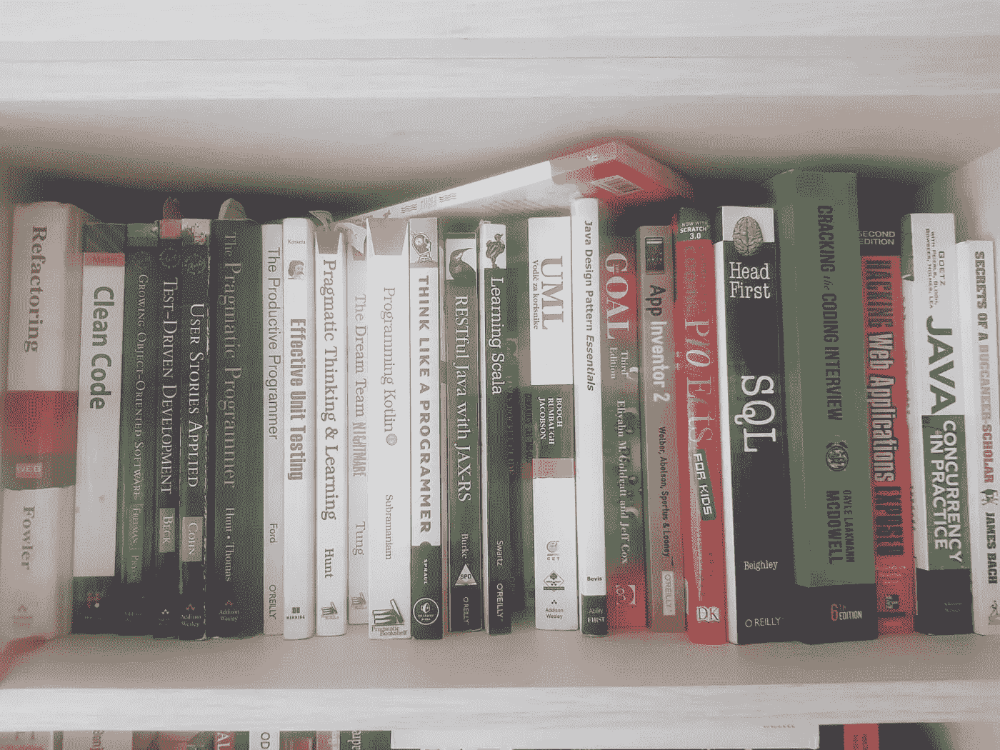

在我作为 Java 程序员的职业生涯中，我确实读过一些书，有些书对我的影响或多或少。有些我真的很喜欢阅读，有些我不太喜欢。我打算给他们拍些照片，并分享我的想法。

不幸的是，由于多年来的搬迁，我失去了一些，但我希望我仍然有他们的照片。例如，我记得丢失了《用 Java 思考》(b .埃凯尔)、《在 JVM 内部》(j .波什)、《有效处理遗留代码》(M.C. Feathers)。那些确实是对我有很大影响的好书。但不管怎样，让我给你看看我书架上还剩下什么。

[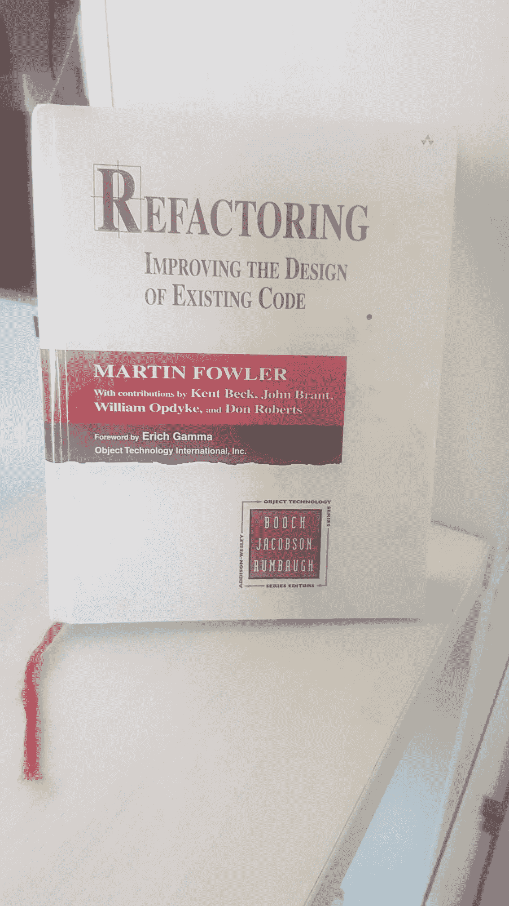](https://medium.com/javarevisited/6-coding-books-every-programmers-and-software-developers-should-read-620124886c8f?source=---------20------------------)

这是我书架上的第一本书，我也想成为这篇文章的第一本书。当谈到用 Java 编码时，重构是我最喜欢的活动之一。我只是觉得移动大块的代码，删除和消除重复是如此令人满意。代码读起来要好得多，在你花了一些时间进行重构之后，读起来也很有趣。就像完成一幅画或某种手工工艺，你后退一步，看着它，感觉很好。另外，这本书的一个好处是它更像一本字典，你不只是从头到尾读一遍，就这样，你可以很容易地回去查阅，找到你需要的具体重构。是我发现更有用的书籍之一，我偶尔会回到它，检查特定类型的重构是如何完成的。它有一个很大的词汇表，易于浏览，每个重构都有很好的分类，还包括图表和代码样本。

[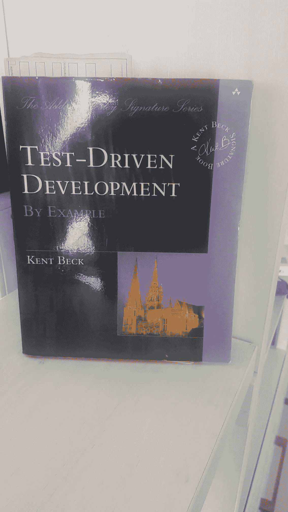](https://medium.com/javarevisited/5-best-junit-and-test-driven-development-books-for-java-developers-2d3fecb5c9ac?source=user_profile---------31----------------------------)

这是我第一本关于测试驱动开发的书。这绝对是任何对 TDD 感兴趣的人的必读之作，不管经验水平如何。这本书是完全使用芝加哥风格的 TDD 构建的银行应用程序的一步一步的例子。它从一开始就很实用，你可以跟着你的电脑走，所有的代码都在那里。

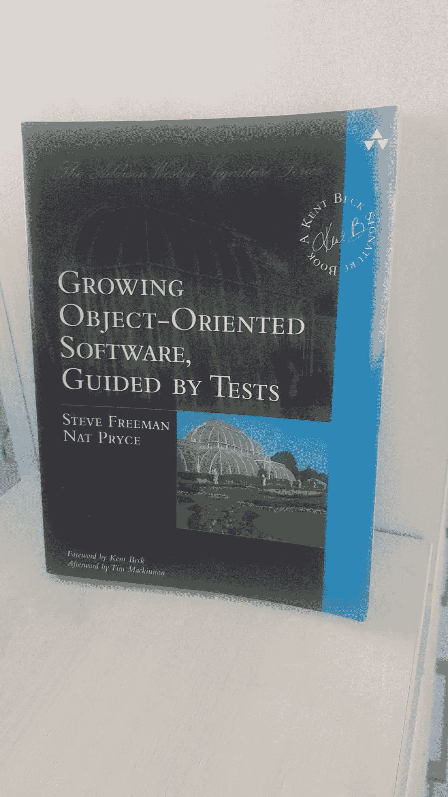

在我读了 Kent Beck 的书 TDD by Example 几年后，我偶然发现了这本书。办公室里的许多人都在谈论它，我甚至有机会在伦敦的一个酒吧聚会上见到了这本书的两位作者。这本书在伦敦被戏称为古斯书。我决定得到它。是一本很棒的书，它很好地解释了 TDD 的另一种风格，伦敦风格，以及如何使用模拟来逐渐发展和改进你的代码设计。也非常实用，例子也很容易理解。另一个必须阅读在我看来。

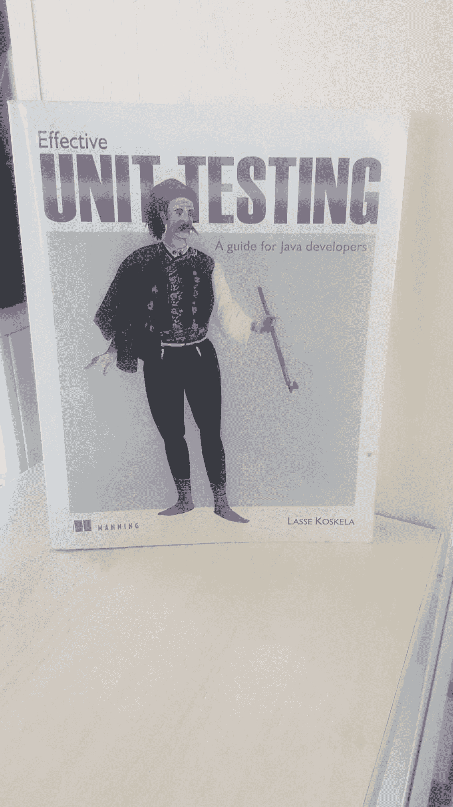

哦，哇，这是另一个关于单元测试的。哦，我的上帝，我是如此的热衷于 TDD，我真的想尽我所能去学习。这本书也很棒，有时对许多人来说有点不为人知，但不可低估。有很多先进的技术和有用的东西。解释得很好。这本书对我有很大的影响。事实上，我写了一篇关于这本书的评论，不久前也在博客上发表了。如果你有兴趣了解更多关于这本书的内容，这里就是:[https://medium . com/Java re visited/effective-unit-testing-a-must-read-book-for-programmers-a 6 da 83 f 0 b 23 b](/javarevisited/effective-unit-testing-a-must-read-book-for-programmers-a6da83f0b23b)

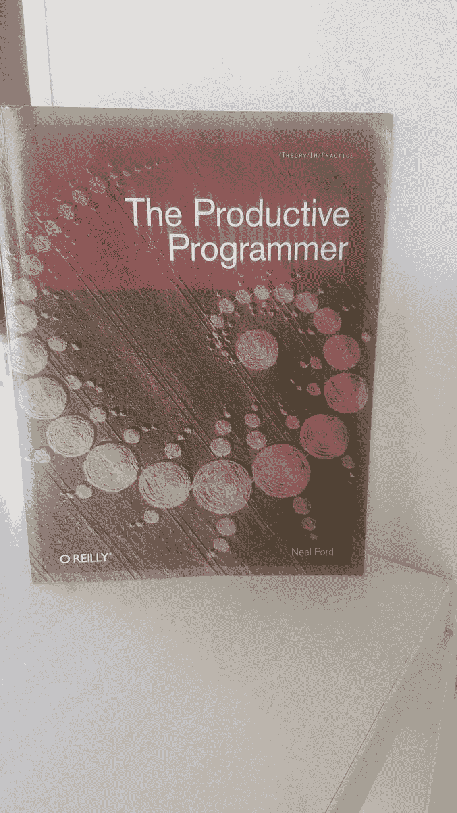

在我开始做程序员的时候，我非常重视 TDD，但是我工作的第一批公司中的一个似乎并不太关心它，而且在公司文化中也有一些坏习惯，对我来说开始显得有点不专业或者至少没有生产力。我开始在网上研究如何成为一名优秀的程序员，因为我不知道我在那家公司看到的其他更高级的程序员做的事情是好是坏。我主要关心的是测试和重构，但也有许多其他的态度，不一定与编码本身相关。《高效程序员》是一本好书，它帮助我剥去了成为一名优秀程序员的外衣。这本书可能不是非常有影响力，但它足够强大，给我指明了一个方向，这个方向后来成为我对软件的最大热情之一，那就是软件工艺。

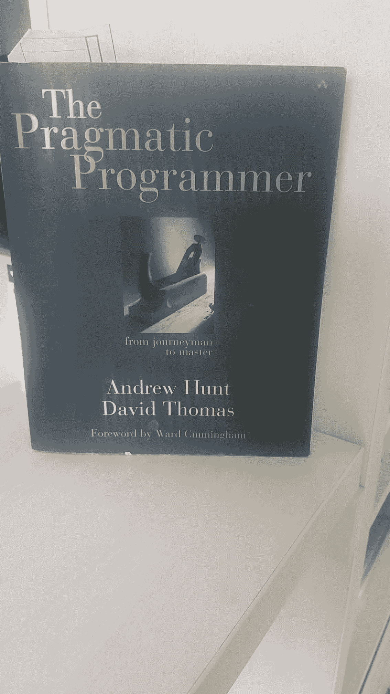

看完《高效程序员》后，我和一个同事在食堂评论，他告诉我他也看了。他开始引用一些我不记得的例子，过了一会儿，我们意识到我们实际上读的是标题相似的不同的书。我读《高效程序员》，他读《实用程序员》。所以那天晚上我毫不犹豫地在亚马逊上订购了《实用程序员》。这是一本很棒的书，可能是我最喜欢的书之一，我强烈推荐它。我喜欢这本书里的故事和轶事，它们是如此有力和真实。一本令人惊叹的书，可能是我进入专业和软件工艺领域的早期启蒙之一。

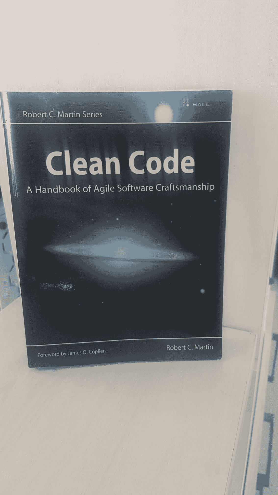

软件工艺实际上是我在早期职业生涯中离开都柏林一家公司的原因。为了在这个领域获得更多的理解，我决定搬到伦敦，在那里我有机会参加多个与这个领域相关的会议，也有机会会见和聆听许多重要的软件人物谈论敏捷和软件工艺。在其中一次活动中，我遇到了 R . C Martin(鲍勃叔叔),我决定买他的书《干净的代码》。这本书很经典，必读。写得很好，有很多例子。我喜欢阅读它，并遵循的例子。鲍勃叔叔也非常有魅力，我喜欢看他演讲，喜欢关注他非常酷的视频，尤其是 clean coders 系列中的那些视频。我知道鲍勃叔叔还有一本关于建筑的书，我没读过，但听说也很不错。

一旦我在这个行业工作了 3 年左右，我意识到我经常很难理解这些要求。当时没有 JIRA，或者至少不像今天这样。罚单被打印在纸上，并用 bluetack 粘在一个物理敏捷看板上。我想我真的很喜欢这个板，我对交付的生命周期过程和持续交付本身非常感兴趣，但我尤其对如何编写好的需求非常感兴趣。我得到这本书是为了更好地理解用户故事以及如何最好地制作它们，因为我当时开始学习的编码技术被称为 ATDD，它是 TDD，但不是从单元测试开始，而是从验收测试开始(因此是“A”)。我知道自动化验收测试是把事情做好的一个非常重要的方面，但是为了能够自动化验收标准，知道如何编写好的验收标准也很重要。许多公司很难将他们的要求用语言表达出来。这本书非常有助于理解在准备用户故事时的一些技巧、偏见和陷阱。

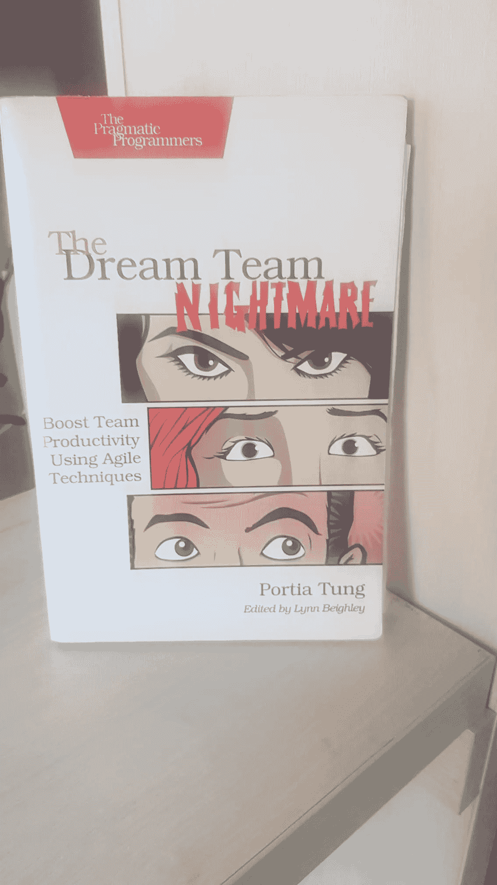

在我职业生涯的早期，敏捷的话题真的很大，我痴迷于敏捷实践、回顾、用户故事、TDD 等等。一天，我在食堂吃午饭，听到其他开发人员谈论这本书，这是一本关于敏捷的有趣的小说。我决定买下它，我玩得很开心。原来这本书其实是一本选择自己的冒险游戏/书。作为一个软件项目的团队领导，你刚到一家公司，你有很多选择，根据你的选择，你的项目和团队会走向不同的方向。这真的很有趣，也有一些有用的教导，不仅仅是关于敏捷，还有领导力。

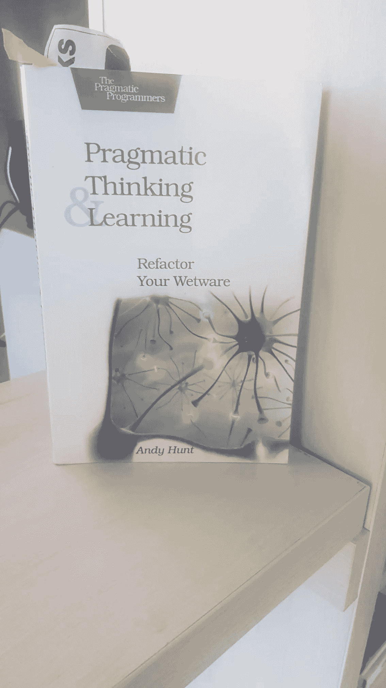

我认为《实用程序员》是我最喜欢的社论之一。他们有非常好的书，我喜欢我从他们那里买的所有的书。这个真的很好。我想更好地理解思维过程是如何工作的，尤其是学习的过程。人是怎么学习的？这本书太棒了。很小但也很强大。我真的很喜欢。它有很多视觉效果，图表和很好的解释。我认为，学习如何学习这个话题不仅对程序员非常重要，对任何人都非常重要，不管是什么职业。你不需要成为一个程序员来阅读这本书。

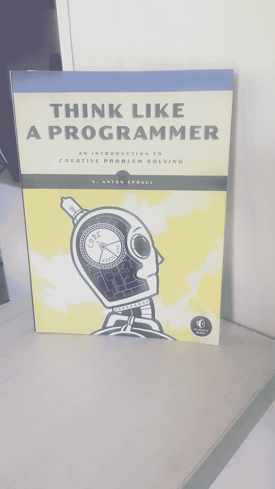

读完这本关于实用主义思维和学习的书后，我想找些其他的话题。这是我的下一本书，主题是学习和思考。但是这次我没有看完整，我觉得上一本书更好。这还不错，但我很快就有点厌倦了，它有很好的和有趣的例子，但更多的是面向代码和专注于解决问题，而不是学习和认知的动力，这是我当时感兴趣的。我认为我没有犯错误买它，但我犯了一个错误，认为它涵盖了与前一本书相同的主题，所以这就是为什么在中途停止阅读它。但这本书一点也不差，它在网络论坛上有非常好的评论家。

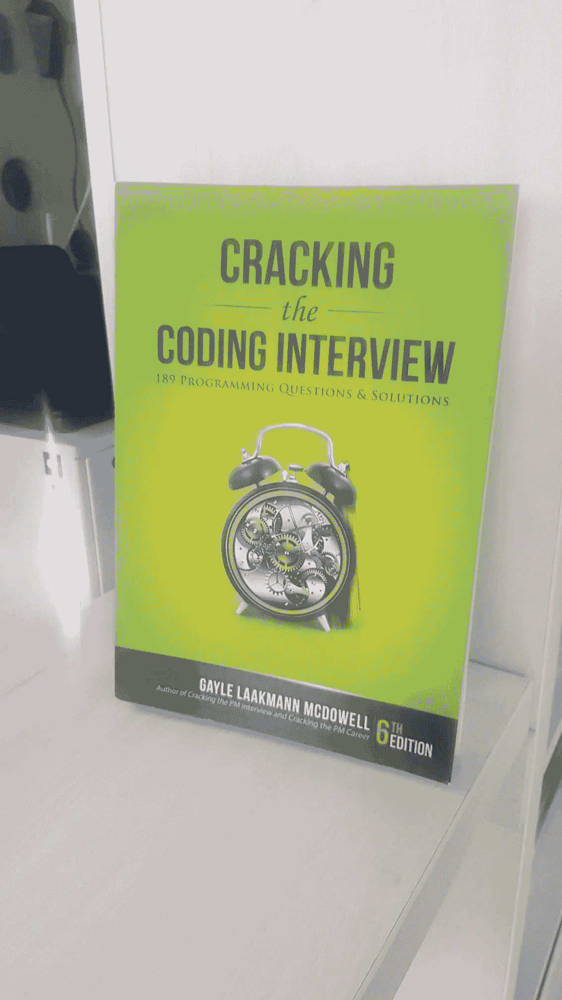

曾经有一段时间，我非常热衷于在 stackoverflow 和 T2 project Euler 中提问和回答，以至于我想找一些好的问题汇编来解决，只是为了娱乐和练习。一个朋友告诉我，这本书有很多问题，这也很有帮助，因为很多问题有时是面试问题。所以我决定买下它。哇，这本书太大了，我连 10%都没读，但我偶尔会随意读一些。通过术语表发现问题也很有趣。这是一本非常好的学习和准备书，可以多次重温。我个人只在工作/合同间隙使用它。我做一两个练习只是为了解决一些问题，我认为这确实有助于激励我去面试。

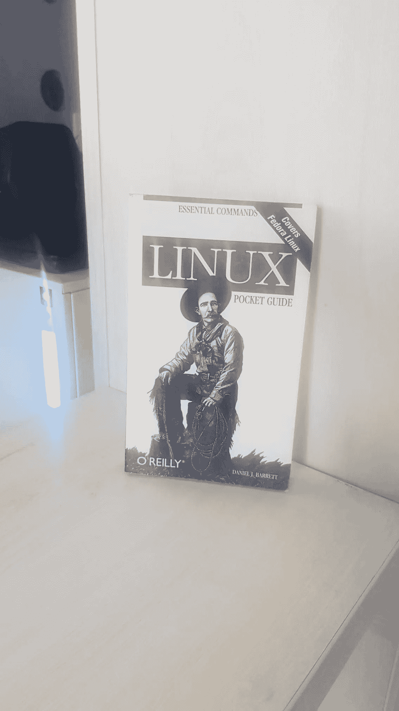

我从我工作的第一批公司之一借了这本书，然后我忘记归还它。我意识到，在我离开大约 3 年后，我仍然拥有它。这只是一个很好的 Linux 袖珍指南。当你是一个初学程序员时，linux 终端是你需要学习的基本东西之一，这本袖珍指南在我的书桌上放了很长时间。我确实从中学到了很多有用的东西。

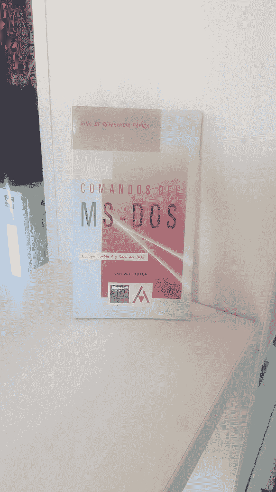

鉴于我放了 Linux 指南，我想向你展示我也有 DOS 指南也会很有趣。这本小册子是 1991 年的。那时我还是个孩子，我有一台旧电脑，当时我对编程一无所知，但这本书帮助我学习了一些基本的 DOS 命令，我主要用来复制文件、创建文件夹和用软盘安装游戏。我最喜欢的 DOS 游戏是“波斯王子”。当我成功安装它时，我非常高兴，因为我的一张光盘损坏了，所以我必须去一个朋友家克隆他的一张软盘才能完成安装。

> 旁注:我不仅仅阅读英语，我的一些书也有西班牙语或塞尔维亚-克罗地亚语版本。只是说万一你注意到一些标题是用其他语言写的。

说到旧书，让我给你看这本。是我从大学时代保留下来的为数不多的几本书之一。我在贝尔格莱德读完了大学，大部分书用完后我都送人了，或者我只是把它们放在一个盒子里，放在我父母的阁楼上。但这张我决定留下。有趣的是，在大学的最开始，当我开始对编程感兴趣时，我真的认为我将使用 CASE(计算机辅助软件工程)工具来创建软件，所以我决定我真的需要了解 UML。这本书是上一代的另一个学生给我的，我几乎从头到尾读了一遍。10 年后，UML 对我的职业生涯并没有太大的影响。老实说，一个开发人员即使不知道 [UML](/javarevisited/5-best-uml-books-and-courses-for-java-programmers-13c551a9235d) 如果在工作中显示 UML 图，这从来都不是问题。但是我想这对于那些更喜欢系统架构并且喜欢向他们工作的公司和团队展示想法和概念的人来说仍然是有用的。我把它作为大学时代的记忆，但我真的从来没有提到它。

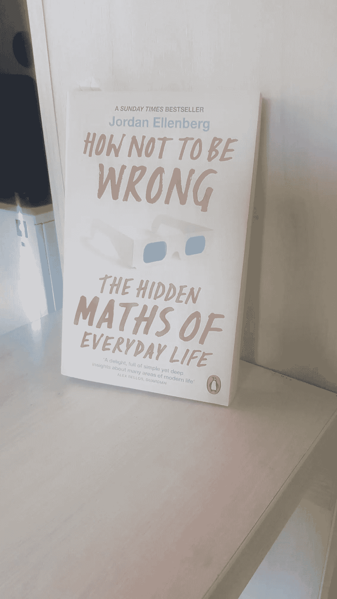

当我买《破解编码面试》这本书的时候，亚马逊向我推荐了这本书，价格是额外的 5 欧元，因为它已经上市了。所以我也买了。这是一本有趣的数学书，我确实读了一些，但从未读完。但是里面有非常有趣的杂七杂八的数据会让你大吃一惊。

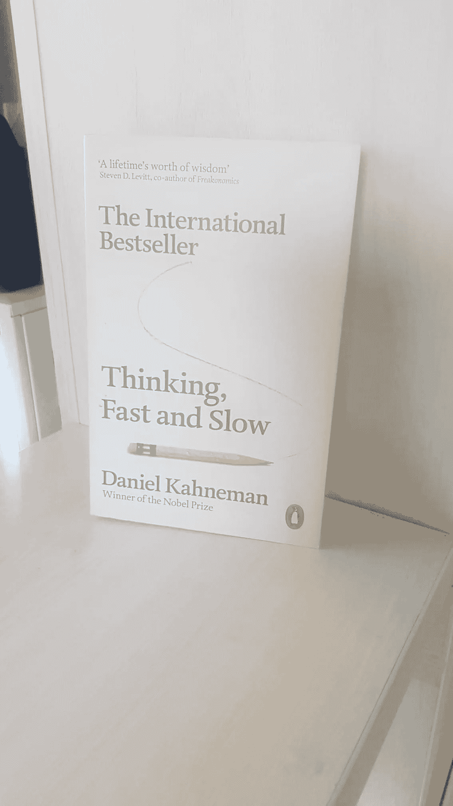

大约三年前，我从一个家庭成员那里得到了这个。我评论说，头脑和思维过程的主题对我来说很有趣，我收到了这本书。我开始读它，但老实说，我发现它有点难读，所以我停了下来。也许将来有更多的时间我会回到那里。但是这本书的评论家真的很好。不幸的是，我没有读过太多，所以我不能多做评论。但是在我的书架上。

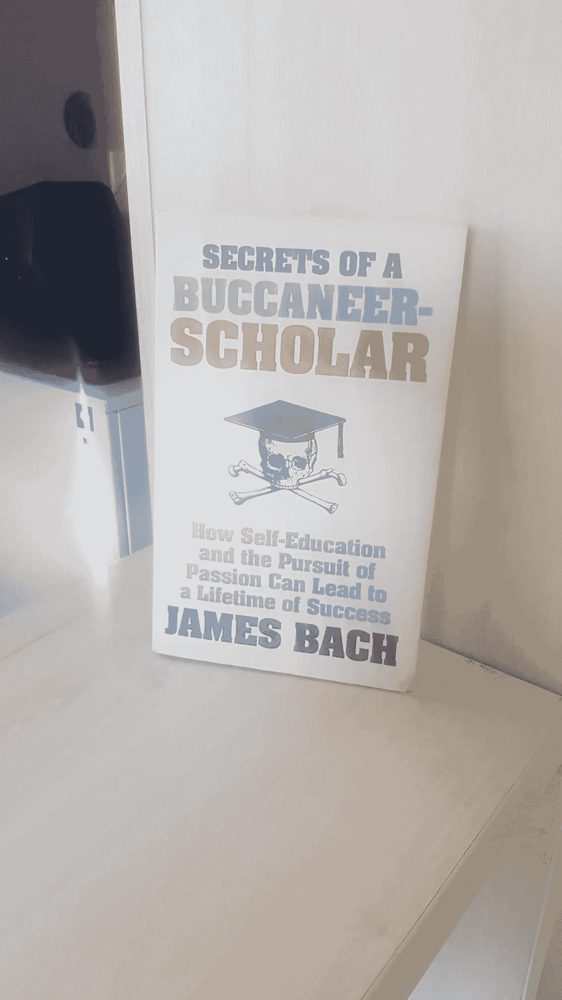

不读一本书或读到一半是不应该真正困扰我们的事情。这只是从《海盗学者的秘密》中可以学到的许多关于自我教育的有趣课程之一。在我的职业生涯中，我很快意识到软件中的许多东西需要“自学”。因为事物发展得很快，所以事物要么变得过时，要么有新的需要我们学习的东西，这并不罕见。这本书很有趣，我读得很开心。如果你对自学领域感兴趣，想变得更加自学成才。这是一本好书。

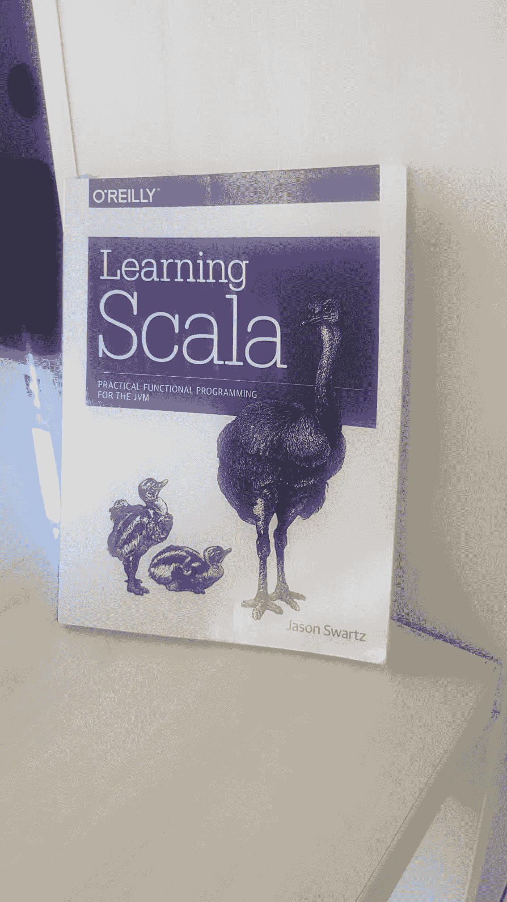

Java 要死了！这句话我听过很多次了...有一次，我被邀请参加一个由一些招聘公司在伦敦的 Heron Tower 组织的会议，他们的全部宣传就是 scala 有多好，java 有多差，却没有真正解释太多。他们只是想给我们洗脑，让我们换工作，银行部门的一些人会认为我们是 Scala。他们免费给了我们一些书。我确实学习了 Scala 一段时间，甚至在一些场合使用过，但是我从来没有真正追求过 Scala 职业。我不后悔放弃 Scala，至少我尝试过。我发现学习曲线非常陡峭，我就是不想被打扰。Java 一直存在，所以我坚持使用它。我非常尊重 Scala devs，因为我知道这种语言非常通用，而且对很多人来说也不容易学。

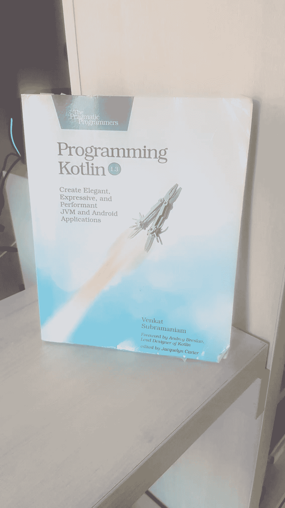

对我来说，斯卡拉没有，但科特林有。科特林是我两年前的新欢。我只是喜欢这种语言。我确实在 udemy 完成了一门不错的课程，甚至决定创建一个博客来上传一些 kotlin 视频并记录我的转变:【http://kotlin4j.blogspot.com/】T2 我后来买了这本书来补充我的学习，这本书很好，我想完成阅读，我想我读了大约 60%，然后我停顿了一下，因为我有其他优先事项。我已经有机会专业地编写一些 Kotlin 代码，我甚至在一个个人项目中尝试了一下 Android，只是想看看是什么样的。在不久的将来，我看到自己完全过渡到 Kotlin，作为 Java 的替代。我注意到一些公司甚至已经在后端系统中雇佣 Kotlin 开发人员。这是我目前的实际目标之一。这本书真的很好，正如我已经说过我喜欢那篇社论，我很乐意推荐他们的任何一本书。

哦，看这个。我现在工作的大多数应用程序都是 RESTful 的，但是几年前许多系统仍然使用 SOAP 架构。这是我用来通过 Oracle 认证(OCE-WSD，Oracle 认证专家 Web 服务开发人员)的学习书籍之一。

这是一本很好的学习书籍，但我也建议用一些关于 API 设计的好书或指南来补充，因为设计好的 REST API 的主题总是很受欢迎和需要的。

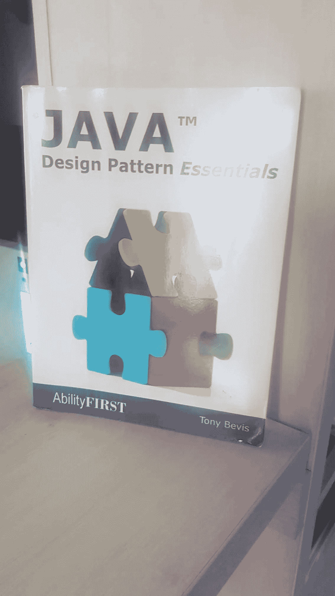

我不喜欢这本书。我在职业生涯早期确实读过它，因为我真的很喜欢设计模式，但我对它的写法和图表都有点失望。我得到它是因为我认为如果用 Java 写的话，我会更好地理解这些例子，但是我错了。

有一本关于设计模式的更好的书叫做《g Of(四人帮)》，实际上我最终下载了 pdf 格式的书并阅读了它，而不是这本，即使 GOF 书上的例子是用 C++写的
这是 GOF 书的链接:[https://www.amazon.com/gp/product/0201633612](https://www.amazon.com/gp/product/0201633612/ref=as_li_tl?ie=UTF8&camp=1789&creative=9325&creativeASIN=0201633612&linkCode=as2&tag=martinfowlerc-20)

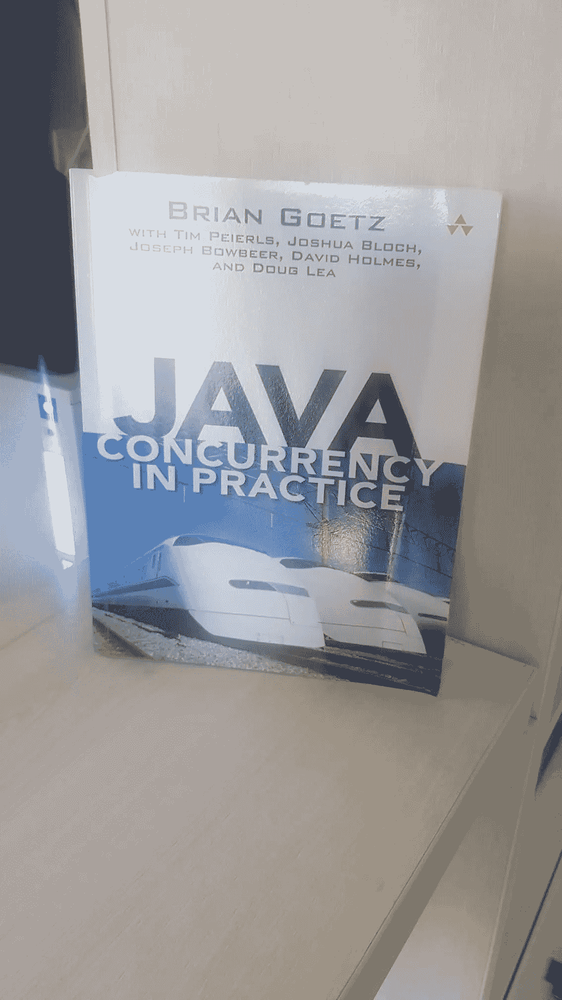

我也不喜欢这本书。许多人说这是一本伟大的书，它可能是，但当我打开它时，它只是给我一点焦虑和头痛。事情是这样的，它是几年前得到的，因为我工作的一个应用程序非常依赖 Java 的多线程 api，所以我想学习一些 Java 并发的基础知识。但在我换工作后不久，由于我工作过的大多数后端应用程序都没有这种并发问题，因为它们是以函数式风格编写的，并且也旨在实现无状态。所以，是的，感谢上帝首先 [VAVR(以前的 Java 俚语)](https://www.vavr.io/)提供了不可变集合和一点后来的 Java 8 外观。函数式编码风格及其不变性成为主流，所以这本书并不太需要。所以，是的，它在我的书架上，但我只有在面试后才会去看它，以检查我的回答是否正确。

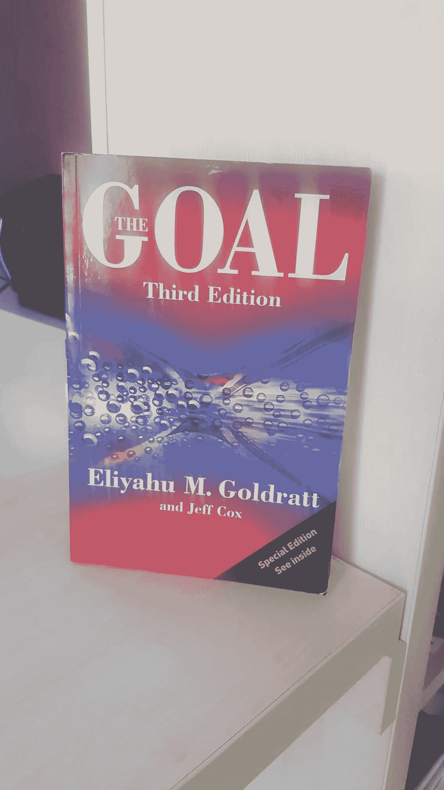

有一种叫做[约束理论](https://www.leanproduction.com/theory-of-constraints/)的东西与精益敏捷团队非常相关，特别是如果他们对看板和连续交付感兴趣的话。我不会深入这个理论，但这本书通过一本有趣的小说谈到了它。我推荐任何对敏捷领导力领域感兴趣的人阅读。这本书里非常有价值的教训。

[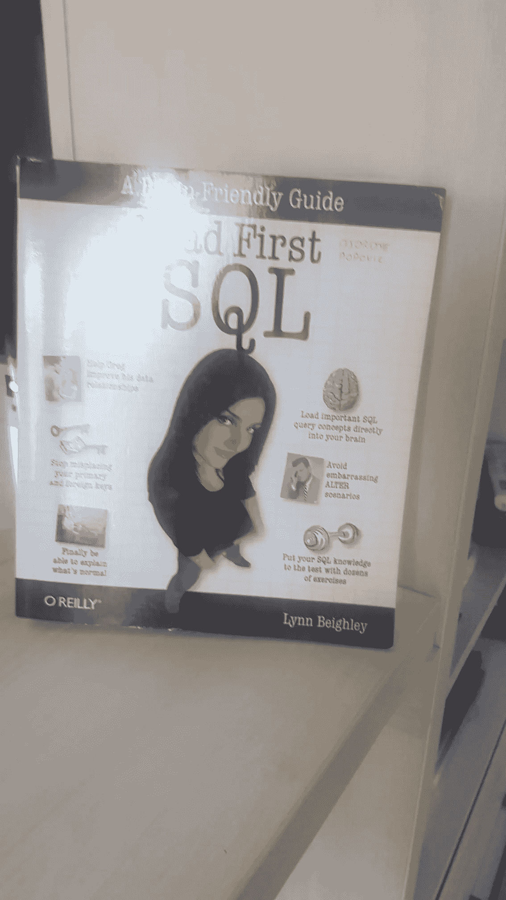](https://medium.com/javarevisited/5-best-books-to-learn-sql-and-database-design-for-programmers-and-developers-1e7839df2f3e)

哦，真酷，又一本在大清洗中幸存下来的大学书。这是一本有趣的书。Head-First 系列的大多数书读起来都很酷，而且非常实用。我也有一个关于 Java 的，但我把它作为礼物送给了一个正在起步的朋友。任何从 SQL 开始的人都可以从这本书中受益。

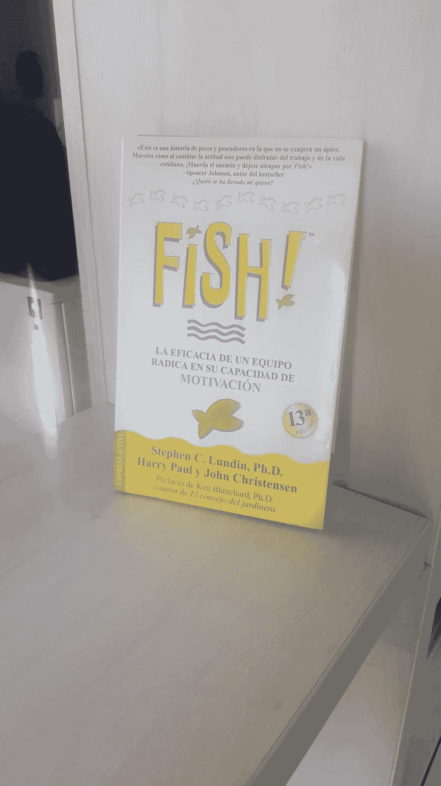

当我开始对敏捷感兴趣时，我发现团队的良好表现和效率还有其他方面，不仅仅与技术方法或复杂过程相关。有些事情与动机有关。

你听过这句话吗“如果你相信你能，你就成功了一半”？开发团队中激励的力量被大大低估了。很多招聘人员都搞错了，建立一个有凝聚力的团队不仅仅是技能和以往的经验，它也是动力、文化和态度...

这本书真的很小，我不认为它有 100 页。你会喜欢读它的。

这本书我认为可以称之为 it 书籍，因为它是关于 HFT(高频交易)领域的，基本上是计算机算法，交易货币、股票或其他金融工具的速度比人类快。我对此产生了兴趣，因为我参加了一个关于外汇交易的免费讲座，纯属偶然，我听说了 HFT，有人推荐我读这本书。一个真正迷人的领域和故事。这真的让我大开眼界，我发现快速性能对一些系统来说是多么重要，甚至需要在地理上进行配置，甚至需要购买土地来建立基础设施以铺设光缆。是一个非常有趣的故事。

IT 安全总是有趣且相关的。了解如何保护您的 web 应用程序免受 SQL 注入、XSS 攻击和其他攻击非常重要。我想从攻击者的角度学习一些安全知识，于是我找到了这本书。里面有相当有趣的东西。不是一本编程书，只是一本攻击性的安全基础书。也许在这个领域有其他更好的书，但是因为我不是专家，我不能推荐或者说这本书有多好。我个人很喜欢。

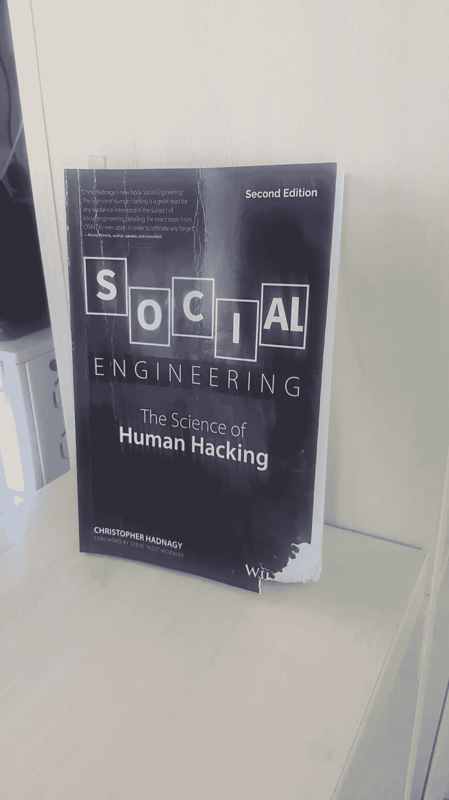

猜猜每个系统的弱点是什么？使用它的人。社会工程和开源智能的这个领域真的很神奇。我有更多的时间来研究这个问题，因为这个话题非常广泛。但是我得到了这个，因为我总是对系统安全的心理学方面感兴趣。这本书不谈论软件，它谈论社会工程和开源智能的原则，以及他们如何被笔测试人员和其他安全专业人员使用。我真的很喜欢这本书，这本书里有非常有趣的真实生活案例和故事。还有，我忘了说，很抱歉这张照片，我去了商店，看完书后把书放在沙发上，我的狗开始吃它。幸运的是，它仍然可读。

当我在看社会工程书籍时，我不确定该买哪本书。所以我买了两个，前一个和这个。但是我还没有读完，因为读完另一本后我有点忙，而这本又有点大，所以我想推迟阅读。不过我觉得这个也不错。似乎是一个有很多技术细节的参考，而我读的前一本书更小，更多的是关于用例和真实生活的故事。在这一点上我不能说太多，我已经把它列在我的待办事项里了，等我有时间的时候我会看看的。

我想做一点移动，因为我从来没有真正做过，也因为我想尝试向孩子们展示编程。在大学期间，我曾经教其他学生编程来获得一些零花钱，我一直认为教孩子会很有趣，因此我决定买这本书。对于初学者来说，App Inventor 是一个很好的工具，但很快我意识到这对一些孩子来说太高级了，所以我决定用 scratch 来代替，毕竟对更小的孩子来说。

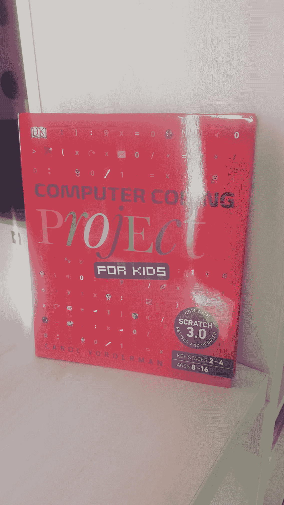

在我空闲的时候，我用这本书教一些孩子 scratch 和一些编程概念，包括我的家人。他们都喜欢它。Scratch 非常有趣，而且很酷，可以激发孩子们的创造力。顺便说一下，我在伦敦的一家乐购超市发现了这本书，只卖 5 英镑。

那些是我的 IT 书籍，正如我在开头所说的，我丢了一些。

如果你喜欢这篇文章，请给我一个掌声👏关注此博客，了解即将推出的其他有趣内容。