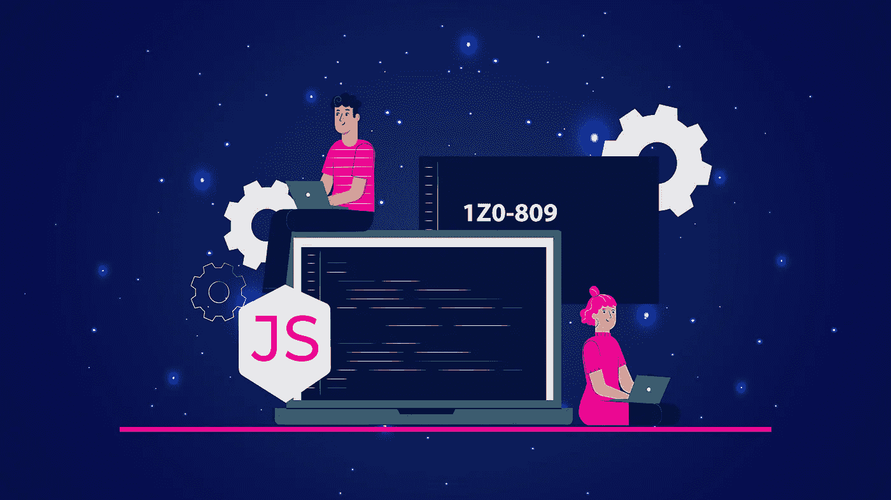
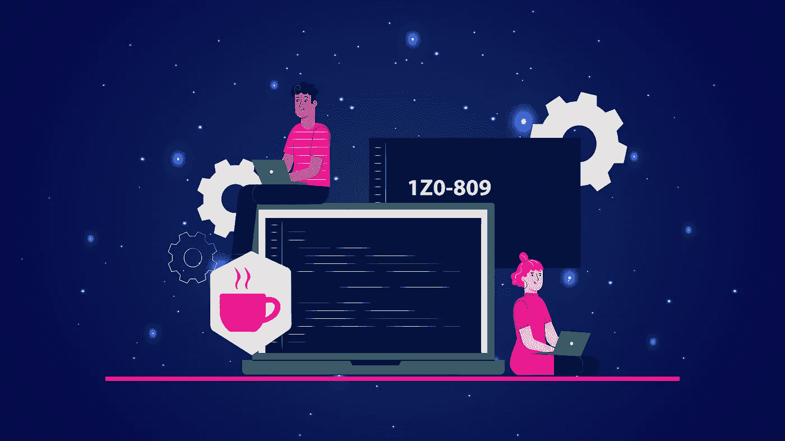

# 我在 Udemy 上的 Java SE 8 程序员 II——OCPJP[1z 0–809]模拟测试现已上线！！

> 原文：<https://medium.com/javarevisited/my-java-se-8-programmer-ii-ocpjp-1z0-809-practice-test-on-udemy-is-live-now-15744a016258?source=collection_archive---------3----------------------->

## 阅读这篇文章，找到你的独家 9.9 美元优惠券，以获取我在 Udemy 上的新课程。

朋友们好，

我很兴奋地宣布，我的 [**新课程 OCP 1z 0–809 模拟考试**](https://www.udemy.com/course/new-java-se8-programmer-certification-ocpjp-1z0-809-exam-practice-test/?couponCode=LAUNCH) 现在可以在 Udemy 上使用了。

当我去年第一次启动我的[Java SE 11 1z 0–819 证书考试](https://www.udemy.com/course/java-se-11-certification-exam-1z0-819-practice-tests/?couponCode=BLACKFRIDAY)时，你们中的很多人问我关于 OCAJP 8 和 OCPJP 8 的问题，我认为这是一个好主意，因为这两个证书仍然有效，并且可能是现在成为认证 Java 开发人员最容易的证书。

OCAJP 8 模拟测试仍在进行中，但我希望很快发布，然后我将开始 Java SE 17 认证测试，该测试尚未推出，但很快就会推出。

如果你正在考虑是参加 Java SE 11 认证还是 Java SE 8 认证，我建议你参加 Java SE 11 认证，如果你从事过模块方面的工作，但是如果你没有参加过，并且因为任何原因需要获得认证，那么 Java SE 8 认证是你最好的选择。

以下是您将在本课程中获得的内容:

1.  5 次全程模拟考试
2.  350 多个带解释的问题
3.  与考试主题保持一致
4.  讲师 QnA
5.  终身访问，包括移动设备和桌面设备

鉴于其课程发布和节日期间，这里有 [**您的独家 9.9 美元优惠券**](https://www.udemy.com/course/new-java-se8-programmer-certification-ocpjp-1z0-809-exam-practice-test/?couponCode=LAUNCH) 以最低价格在 Udemy 上获取我的课程。

祝你在 2022 年获得 Java 认证一切顺利。

如果您对 [Java](https://javarevisited.blogspot.com/2019/12/how-to-crack-java-se-11-certification.html) 、[云](https://javarevisited.blogspot.com/2020/04/how-to-crack-microsoft-azure-fundamentals-certification-az-900-exam.html)或 [Spring 认证、](https://javarevisited.blogspot.com/2018/08/how-to-crack-spring-core-professional-certification-exam-java-latest.html)有任何疑问，欢迎随时提问，乐意效劳。

贾文