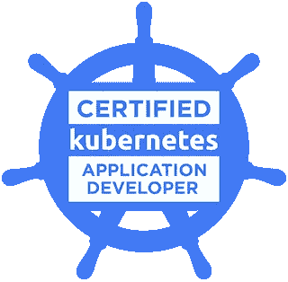

# 我的“认证 Kubernetes 应用程序开发人员(CKAD)”之旅

> 原文：<https://medium.com/javarevisited/my-journey-into-certified-kubernetes-application-developer-ckad-47f2c4682936?source=collection_archive---------0----------------------->

## 动机

在开始这次旅程之前，我并不是 Kubernetes 的忠实用户，我工作的一部分是断断续续地处理 Kubernetes 规范文件，尝试使用 kubectl 命令等等。但是我对它做得越多，我就越喜欢它的架构定义方式，以及它对容器编排的强大功能。所以，我决定…