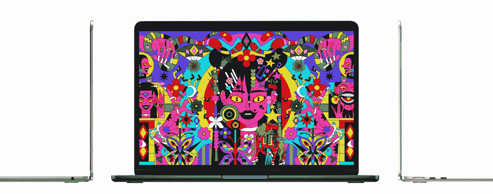

# 我的新 MacBook Air 在 Java 开发方面击败了 M1 Max

> 原文：<https://medium.com/javarevisited/my-new-macbook-air-beats-m1-max-for-java-development-6090642e49ef?source=collection_archive---------2----------------------->

这是一个令人震惊的…我刚刚换了笔记本电脑，我以为我是从 64gb (14.1 英寸版本)的“顶级”M1 Max 降级到“只有”24gb 内存的“微型”MacBook Air M2。结果证明我错了。对于我作为 Java 开发人员的用例来说，新的 M2 似乎明显更快了。起初我很震惊，但现在回想起来，我想这是有道理的。

我最近辞去了在 Lightrun 的工作。我通常购买自己的笔记本电脑，因为我不喜欢在工作或处理私人事务时不断更换设备。但由于我在 Lightrun 工作了这么长时间，我接受了他们提供的笔记本电脑。拿到新笔记本电脑一年后，我发现自己离开了公司。所以可以说这是一个大错误。结果不是。

我想买同样的机器。我对 M1 Max 非常满意。它功能强大，速度快，重量轻，并且有一个可以永久使用的电池。它跑起来很酷，看起来也很酷。我向当地一家服务最差的供应商下了订单。最后取消了。然后我开始四处寻找。

我最初不喜欢 MacBook Airs。我过去有几台 MacBook Airs，它们在某些方面很不错。但是我现在做了很多视频编辑，我也不能忍受他们的尖锐边缘。在某些情况下，拿着它们会不舒服。新款 MacBook airs 终于加大了 RAM。没有达到我想要的 32gb，但 24gb 已经比老式设备的 16gb 有了很大的提高。它们也有黑色的，价格比同等的专业产品低得多。MacBook Airs 更轻更薄。我流动性很大，因为我到处旅行，也因为我在任何地方工作。对我来说，轻薄的设备是一个巨大的优势。你可以在苹果网站上查看一下[对比工具](https://www.apple.com/mac/compare/?modelList=MacBook-Pro-14,MacBook-Air-M2,MacBookPro-13-M2)。

它们确实有两大缺点:

*   没有 HDMI 端口——这有点糟糕。在没有加密狗的情况下参加会议感觉很好。但这不是我经常做的事情，AirPlay 适用于大多数其他用例。
*   只有一台外接显示器—我工作时不使用外接显示器，所以这对我来说不成问题。如果您是那种需要两台显示器来工作的人，那么这款笔记本电脑不适合您。

因为这两个对我来说都不是问题，而且其他好处也很大。我存了些钱，买了空气。我预计性能会受到影响。结果我的性能得到了大幅提升！

# 移民

我使用 Time Machine 备份了我的旧 Mac，并将其恢复到新 Mac。就安装的软件和设置而言，两台设备应该完全相同。在旧机器上运行的东西也应该在新机器上。包括所有可能减缓它的遗产。然而，我不认为我的发现是科学的，因为这不是一个干净的环境。一切都基于我的用例。专业站点对于常见用例有更好的基准。我建议参考他们更完整的图片。

然而，对我来说，这台机器要好得多。可能最引人注目的是 IDE 启动。我在大部分日常工作中使用 IntelliJ/IDEA Ultimate。在完成我的新书后，我刚刚开始写一本新书，为此我安装了一个新版本的 IntelliJ 社区版。它不包括我的典型安装中的所有插件和设置。这是检查 IDE 启动时间的完美环境。注意我是用秒表 app 测的这个，不理想。我用图标点击启动秒表，当 IDE 完全加载 Codename One 项目时停止。

*   MBP M1 最大 64gb — 6.30
*   工商管理硕士 M2 24gb — 4.54

这是一个相当大的性能差距，这与这些类型的 IO 绑定操作是一致的。在 Codename One 项目上运行 mvn 包，两者都显示了稍微低一些但仍然一致的改进。我运行了多次，以确保:

*   MBP M1 最大 64gb — 20.211
*   工商管理硕士 M2 24gb — 18.346

这些不是中间值或平均值，只是一个特定执行的输出。但我反复运行构建，数字与 M2 的大约 2 秒优势一致。请注意，我使用的是 JDK 的 ARM 版本，而不是 x86 版本。

作为我工作的一部分，我也创造媒体和演示。我在 keynote 中做了很多工作，并从中导出内容。下一个明显的测试是将我做的一个小演示导出到 PDF 和电影中。在 PDF 导出中，我让两者都导出构建的所有阶段。

*   MBP M1 最大 64gb — 2.8
*   工商管理硕士 M2 24gb — 2.13

这再次显示了 M2 装置的健康优势。但这里有一个转折，当出口到一部电影时，基准完全翻转，MBP 与 MBA 擦肩而过。

*   MBP M1 最大 64gb — 26.8
*   工商管理硕士 M2 24gb-39.59

# 说明

回想起来，这些数字本不应该让我感到惊讶。对于这种负载，M2 会更快。木卫一会更快。M1 将获得优势的唯一一点是如果 24gb 的空气将被耗尽。这在目前的测试中不太可能，所以空气赢了。

空气流失的地方是在 GPU 绑定的工作。我假设电影导出代码在 M1 Max 上巨大而强大的 GPU 上完成所有编码。我希望这不会对我的视频编辑工作造成问题，但我想我会用我现有的东西来处理。

尽管这个设备小了一英寸，但在这一点上，只有尺寸上的差异是很难适应的。我过去曾在 MacBook Air 上工作过，所以我相信随着我习惯它，这一切都会过去。这是一个过程。我对自己的决定感到兴奋，在那些银色和灰色的苹果电脑之后，黑色的设备给人耳目一新的感觉。电源模块也小得多，这是对经常出差的人来说非常重要的细节之一。

# 为什么我要用 Mac？

这可能是显而易见的问题。我不用 iPhone，不如像个好黑客一样弄个 Linux 笔记本电脑。我仍然在 Codename One 上开发东西，在这里我偶尔需要一台 Mac 来完成 iOS 相关的工作。虽然不常发生，但还是会发生。第二个原因是我现在已经很习惯了。对我来说，Linux 上的桌面仍然不那么高效。

我考虑回归 Linux 有一个原因，那就是 docker。我喜欢 M1/2 芯片。他们太棒了。不幸的是，许多 docker 图像都是英特尔独有的，在设置复杂的东西时很难使用。随着 ARM 机器获得牵引力，这个问题正在自行解决。但是我们还没有到那一步。

# 最后

是的，我知道。这篇文章令人震惊:新机器比旧机器更快。但请记住，M1 在各方面都是顶级的，Air 拥有一半的性能核心。它更薄，无风扇，重量轻约 30%。这在一代更新中是惊人的。

令人惊讶的是，我认为 MacBook Air 中的 M2 对大多数人来说已经足够强大了。我想即使 M1 Max 在同样的价位，我也会选择它。更好看。它更轻。大多数对我来说重要的事情在广播中表现得更好。它很小，但也不算太小，屏幕也很大。我可以忍受所有这些。它没有老版本 MBA 那种怪异的锐利。这是一台伟大的机器。希望当蜜月期结束时，我会有同样的感觉，所以如果你在 2023 年看到这篇文章，请随时评论/ping 我，我可能会有更多的见解。

我感到矛盾的一点是贴纸。黑色的表面非常漂亮。但是我想要贴纸。我费了好大劲才把它们从 M1 机器上拆下来。太快了…