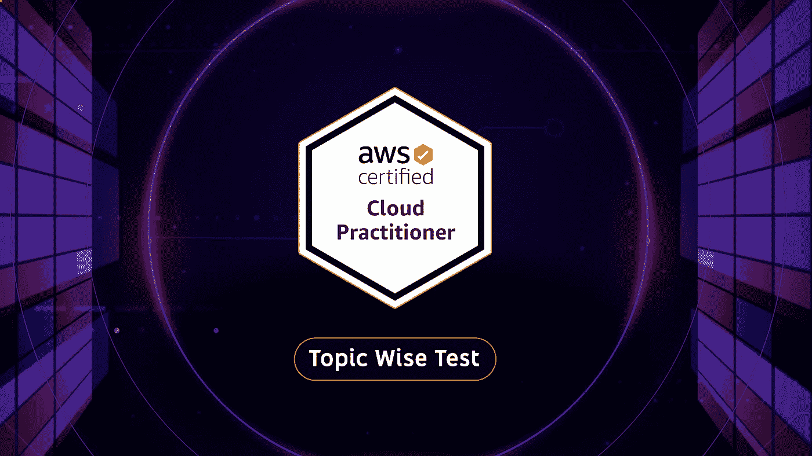
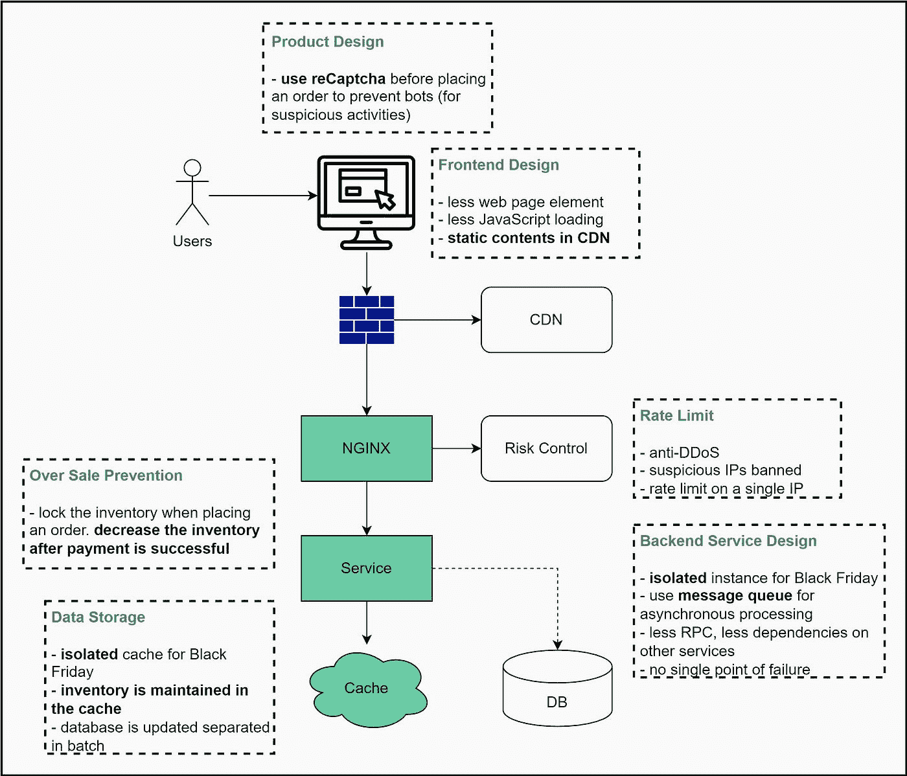

# 我的新 Udemy 课程— AWS 云从业者主题明智实践测试现已推出(有折扣)

> 原文：<https://medium.com/javarevisited/my-new-udemy-course-aws-cloud-practitioner-topic-wise-practice-test-now-available-with-disc-14ed78a621d4?source=collection_archive---------4----------------------->

## 想在 2023 年成为 AWS 云从业者？我的 topic wise practice test 可以帮助您更好地学习和准备，以便在第一次尝试中通过考试，并在 2023 年开始您的 AWS 和云计算职业生涯。

大家好，

感恩节快乐！！。🎁

我真的希望你和你的家人朋友过得愉快。现在，如果你正在考虑 2023 年的目标，特别是如果你正在关注 AWS 和云计算，那么我有一个好消息要告诉你。

刚刚在 Udemy 上推出了新课程— [***AWS 云从业者专题睿智实践考试***](https://www.udemy.com/course/aws-cloud-practitioner-clf-c01-practice-questions-test/?referralCode=AAB01559CD68D6CA87A0) 准备 AWS 云从业者认证考试。

这是 AWS 认证系列中的第一次考试，如 AWS 开发人员认证、AWS SysOps 认证和 AWS 解决方案架构师认证，如果你想培养自己的 AWS 和云技能，那么这项认证可以成为你简历中的一个很好的补充。

以下是你在本课程中学到的:

*   **300+练习题**
*   **5 次模拟测试，检查你的速度和准确性**
*   **详细解释及链接了解更多信息**
*   **QnA 讲师您可以在哪里向我提问**
*   **终身访问及更多**

如果你现在正在准备 AWS 云从业者考试，或者想在 2023 年获得认证，你可以使用你的特殊 9.9 美元优惠券加入。

是的，只需 [**点击此链接，就能以 9.9 美元**](https://www.udemy.com/course/aws-cloud-practitioner-clf-c01-practice-questions-test/?couponCode=LAUNCH22) 的价格获得该课程

# 2023 年开发商的最佳网络星期一交易

因为这是一年中我们购买明年提升技能所需的所有东西的时候，我想和你分享几个出现在我收件箱里的好交易。

从上周开始，我一直在分享很棒的交易，但它们还在继续，看起来每个人都在这个时候给予巨大的折扣。

我已经买了很多东西，但我仍然得到不可抗拒的交易，如这个 [**区块链认证交易**](https://www.shareasale.com/r.cfm?b=1713885&u=880419&m=105464&urllink=&afftrack=) ，其中 101 区块链提供其受欢迎的区块链认证的 50%折扣**和 60%的会员折扣。**

区块链是小众，前景光明。在你的简历中学习区块链开发可能会在 2023 年改变游戏规则。如果你对这个领域感兴趣，你一定要看看这个交易。

如果你想在 2023 年获得最好的交易来促进你的学习和提升你的技能，那么这是正确的时间，因为流行的在线平台提供 40%到 85%的折扣。

*   [bael dung Spring Boot 球场七折优惠](https://www.baeldung.com/learn-spring-course?affcode=22136_bkwjs9xa)
*   [**plur sight 年度套餐五折优惠**](https://pluralsight.pxf.io/c/1193463/424552/7490?u=https%3A%2F%2Fwww.pluralsight.com%2Flearn)
*   Coursera Plus 订阅优惠 100 美元
*   [**data camp 年度订阅享受 65%的折扣**](https://datacamp.pxf.io/c/1193463/1012793/13294?u=https%3A%2F%2Fwww.datacamp.com%2Fpricing)
*   [**CodeCademy 年度计划五折优惠**](https://www.gopjn.com/t/TUJGR0lLR0JHRklJSkhCR0ZISk1N?url=https%3A%2F%2Fwww.codecademy.com%2Fsubscriptions%2FproAnnualV3%2Fcheckout%3FdiscountCode%3DCYBER21)
*   [101 区块链学院区块链课程五折优惠](http://shrsl.com/349rm)
*   [**教育性不限打八折**](https://www.educative.io/subscription?affiliate_id=5073518643380224)
*   [参加 Vlad 的 Java 高性能 Hibernate 课程可享受 40%的折扣](https://vladmihalcea.teachable.com/p/high-performance-java-persistence-mach-3-online?coupon_code=BLACKFRIDAY22&affcode=172599_kuoszt8s)
*   [**Teachable(最佳课程平台)35 折**](https://teachable.sjv.io/rnLVgy)
*   
*   **[**我的 Java 和 Spring 书籍打五折**](https://bit.ly/3Bu2VtF)**
*   **[**苹果 AirPods Pro 八折(还可以赠送)**](https://www.amazon.com/dp/B0BDHWDR12?tag=javamysqlanta-20)**
*   **[启动开发课程七五折优惠](https://boot.dev/?via=javin)**
*   **[whiz labs 课程和培训半价优惠](https://shareasale.com/r.cfm?b=413930&u=880419&m=43514&urllink=https%3A%2F%2Fwww%2Ewhizlabs%2Ecom%2F&afftrack=)**

**有这么多的交易，但这些是最好的最好的东西，你可以投资你的钱。它不太贵，因为大多数都有很大的折扣，如果你想投资提升自己的技能，这是以低于半价获得这些会员资格和订阅的最佳时机。**

**而且，如果你想知道如何为黑色星期五的流量设计一个高度并发的系统，这里有一个来自 [**ByteByteGo**](https://bit.ly/3P3eqMN) 的好图，这是我最喜欢学习系统设计的地方之一。**

****

**以上是关于程序员、创造者和开发者的**最佳黑色星期五交易**。你可以看到折扣每天都在飞来飞去，但它们是最短的时间，所以最好在它们过期前抓住它们。如果你热爱 udemy 课程，我已经公布了你在今年黑色星期五和网络星期一销售中应该购买的 [**最佳 Udemy 课程**](/javarevisited/15-best-udemy-courses-programmers-can-buy-on-black-friday-and-cyber-monday-2020-a803874f41d9) 。**

**再次感谢大家对我和我工作的支持。**

**祝你学习顺利，感恩节快乐。**

**我的书也可以打五折，现在你可以使用优惠券“黑色星期五”来获得折扣。这里是链接—[https://javinpaul.gumroad.com/l/hrUXKY](https://javinpaul.gumroad.com/l/hrUXKY)**