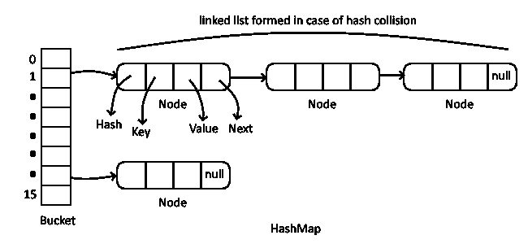
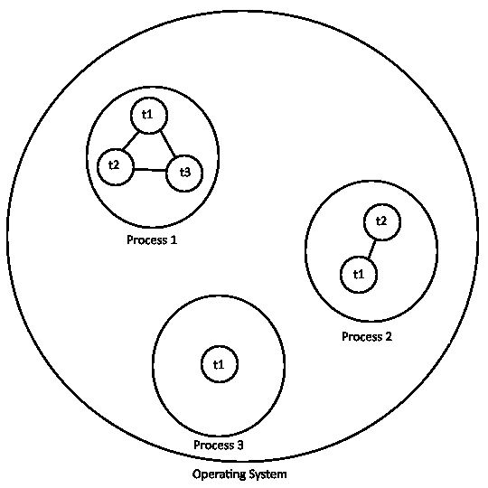
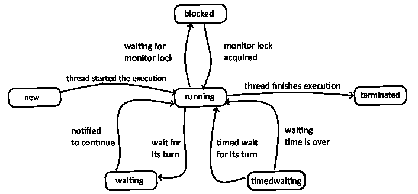

# 我对您下一次 Java 面试的个人意见

> 原文：<https://medium.com/javarevisited/my-personal-note-for-your-next-java-interview-ecbf9b6e14d4?source=collection_archive---------1----------------------->

分享我的个人笔记，帮助你准备下一次 Java 面试。


# 介绍

我在和你分享我用来准备面试的个人笔记。Java 面试并不容易，涉及的话题很多，可以问的问题也很多。我的方法很简单，包括问自己一些问题(面试官经常问的)，这些问题涵盖了基本概念和高级概念。

> **免责声明:**请把我的回答当作是对你**已经**知道的事情的**记忆刷新**。如果不是这样，请搜索特定主题的专用教程，并尝试自己多练习。

# 创建 Java 程序

## 如果我们将 main 方法设置为 private 会发生什么？

代码将被编译，主私有函数将被视为普通的静态函数。但是，程序不会运行，因为缺少公共 main 函数。

## 如果我们用一个 java 文件执行这个命令会发生什么？

```
java HelloWorld.java
```

*java* 用于运行编译后的文件。然而，在这种情况下，它会在内存中编译给定的 java 类并立即运行它。

# 决策和循环

## 循环中的中断和继续有什么区别？

一个' *break* 语句导致它所应用的语句终止 *(switch、for、do 或 while)* 。

' *continue* '语句用于结束当前循环迭代，并将控制返回给循环语句。

## while {..}做和做{..}而？

While 循环执行零次或多次，因为它在给定条件为真时开始循环。然而，do-while 循环至少执行一次，因为在执行循环体之后检查了条件。

# 使用 Java 核心 API

## 以下代码的结果是什么？你能解释一下吗？

```
String a = "Hello world";        
String b = "Hello world";                
System.out.println(a == b);
```

结果会是真的。对于对象，运算符==用于比较引用。但是，对于这段代码，第一个字符串将存储在字符串池中。第二个字符串也将具有对从字符串池中拉回的对象的相同引用，以使 ***a*** 和 ***b*** 两个变量具有相同的引用。

## 什么是自动装箱？

自动装箱是 Java 编译器在基本类型和它们对应的对象包装类之间进行的自动转换。比如将一个' *int* 转换成一个' *Integer* '，一个' *float* '转换成一个' *Float* '，等等。如果转换以另一种方式进行，这称为取消装箱。

```
Float f1 = new Float(6.f); // Boxing
float f2 = (float)f;       // Unboxing
Float f3 = 6.f;            // AutoBoxing
```

## 自动装箱的目的是什么？

它允许我们在原语和对象类型之间轻松切换，而不需要强制转换或包装。此外，它允许我们使用泛型类型，因为 java 中的泛型不支持基本类型。

## StringBuilder/StringBuffer 有什么区别？

StringBuffer 是线程安全和同步的，而 StringBuilder 不是。这解释了为什么 StringBuilder 比 StringBuffer 快。

## 描述一下 JAVA 流 API？

流 API 用于处理对象集合。流是支持各种方法的对象序列，这些方法可以被流水线化以产生期望的结果，并且它支持并行执行。

```
List<String> greetings =
       Arrays.asList("Hello", "Hola", "Bonjour", "Hallo");

greetings
    .stream()
    .map(String::toUpperCase)
    .sorted()
    .forEach(System.out::println);
// BONJOUR
// HALLO
// HELLO
// HOLA
```

# 序列化

## 序列化是什么意思？

序列化是一种将对象状态转换为字节流的机制。

## 什么是 SerialVersionUID？

SerialVersionUID 在反序列化过程中用于验证序列化对象的发送方和接收方是否兼容。

## 什么是“瞬时”关键词？

“transient”关键字用于标记属性，而不是序列化。

# 理解方法和封装

## 能否解释一下 Java 中的访问级别？


## 封装的目的是什么？

数据封装的主要目的是对其他类隐藏类或方法的实现细节。此外，它可以帮助我们使用 getters 和 setters 为封装的属性设置验证规则。

## 方法重写和方法重载有什么区别？

覆盖一个方法就是在子类中创建一个具有相同签名(名称和参数)的方法。覆盖也称为动态多态，因为它发生在运行时。

重载一个方法就是在一个类中声明两个或多个方法，它们具有相同的方法名但不同的参数。重载也称为静态多态，因为它发生在编译时。

# 班级设计

## 静态方法和实例方法有什么区别？

静态方法属于类。它与整个类相关联，而不是与特定的实例相关联。每个对象将共享静态方法的一个公共副本。每个类只有一个副本，不管从它创建了多少个对象。但是，实例方法是与对象相关联的。它要求在使用之前创建一个实例对象。实例方法可以访问实例和静态(字段/方法)，而静态方法只能访问静态(字段/方法)。

## 当一个类实现两个具有相同默认方法名的接口时会发生什么？

由于每个接口都有自己的默认实现，java 编译器会要求为该方法设置一个新的实现。

## 为什么我们需要实现“hashcode”和“equals”方法？

未被覆盖的' *hashCode* ()'和 *'equals()'* 会阻止对象在基于散列的集合中正常工作。“*等于*()”和“*哈希码*()”之间的契约为:

1.  如果两个对象相等，那么它们必须有相同的哈希代码。
2.  如果两个对象具有相同的哈希码，它们可能相等，也可能不相等。

# 泛型和集合

## 什么是泛型，我们为什么要使用它们？

泛型用于创建类、接口和方法，这些类、接口和方法具有它们所使用的类型的占位符。它支持通用解决方案的实现，这些解决方案可以在多种类型中重用，而无需强制转换。

## Vector/ArrayList 的区别？

Vector 和 ArrayList 都是可调整大小的数组。主要区别是 Vector 的方法是同步的，而 ArrayList 的方法不是。

## HashMap 内部是如何工作的？

HashMap 包含一个内部数组(缺省情况下有 16 个元素),这个数组由称为 Buckets 的链表组成，用来存储节点。对于每个元素，hashmap 将 hashcode 除以数组大小，并将其余部分作为桶中的位置，如果不存在，则将值添加到链表中。



# 处理异常

## 解释 JAVA 中异常的类型？

在 Java 中，我们有两种类型的异常:

1.  **检查异常:**是一个异常，必须由抛出它的应用程序代码声明或处理。它是“*异常*的子类。
2.  **未检查的异常:**Is Exception 是任何不需要被抛出的应用程序代码声明或处理的异常。它是' *RuntimeException* '的子类。

# 并发和多线程

## 进程和线程的区别是什么？

**进程**
一个进程，称为一个任务，由多个线程组成。每个进程由一个单独的线程启动，通常称为主线程，但是可以从它的任何线程创建额外的线程。

**线程**
线程是进程的子集，共享其地址空间。该线程可以使用“wait()”、“ *notify()* ”和“ *notifyAll()* ”方法轻松地与同一进程中的其他线程进行通信。



## 在 java 中运行一个线程的不同方法？

*   从' *Thread* '类继承并覆盖' *run()'*
*   实现' *Runnable* 接口

## 什么是“同步”关键字？

它用于一次只允许一个线程进入特定的代码段，从而允许我们保护，例如，变量或数据不被不同线程的同时修改所破坏。

## 同步的缺点是什么？

同步关键字的主要缺点是增加了线程的等待时间，影响了系统的性能。如果没有具体要求，不建议使用它。

## 线程 run()和 start()有什么区别？

如果你只是直接调用' *run()'* ，它会在调用线程上执行，就像任何其他方法调用一样。需要 Thread.start()' 来实际创建一个新线程，以便并行执行 runnable 的 run 方法。

## 解释线程生命周期？

1.  **New:** New 是已创建但尚未启动的线程的线程状态。
2.  **Runnable:** 线程当前正在执行。
3.  **阻塞:**线程正在等待监控锁处于这种状态。
4.  **TimedWaiting:** 线程正在等待指定的时间。
5.  **等待:**线程正在等待未指定的时间。
6.  **终止:**线程执行完 *'run()'* 方法后，转入终止状态。



# 垃圾收集工

## **什么是垃圾收集器？**

Java 垃圾收集是 Java 程序执行自动内存管理的过程。垃圾收集是一个自动的过程。它实现了分代垃圾收集策略，根据年龄对对象进行分类。

## JVM 内存中有哪些不同的代？

有三代人:

1.  年轻(伊甸园，幸存者 1 和幸存者 2)一代:新创建的对象。它们是在次要收集事件中收集的。
2.  老一代:年轻一代遗留下来的对象。它们是大型收藏活动中的收藏品。
3.  Perm 代(针对 java 老版本)。从 Java 8 开始，它被元空间所取代:当元空间达到最大值时，对象被清理。

## 有哪些不同类型的 GC 算法？

*   **串行:**所有垃圾收集事件在一个线程中串行进行。压缩在每次垃圾收集后执行。
*   **并行:**多线程用于少量垃圾收集。单个线程用于主要的垃圾收集和旧代压缩。
*   **CMS(并发标记清除):**多线程用于较小的垃圾收集，使用与并行相同的算法。主要的垃圾收集是多线程的。(在 JDK 9 中已被否决)
*   **【垃圾第一】:****替换为 CMS。它像 CMS 一样是并行和并发的，但是它的工作方式却完全不同。**
*   **Z 垃圾收集器(ZGC): ZGC 同时执行所有昂贵的工作，不停止应用程序线程的执行。(可从 JDK 11 获得)**

# **结论:**

**在这篇文章中，我们用简单的答案探究了面试官经常问的多个问题。我希望这篇文章能成为你准备下一次 Java 面试的一部分资产。祝你好运！**

# **参考资料:**

**[https://docs . Oracle . com/javase/tutorial/Java/javaOO/access control . html](https://docs.oracle.com/javase/tutorial/java/javaOO/accesscontrol.html)**

**[https://docs . Oracle . com/javase/tutorial/collections/streams/index . html](https://docs.oracle.com/javase/tutorial/collections/streams/index.html)**

**[https://docs . Oracle . com/javase/tutorial/essential/concurrency/proc thread . html](https://docs.oracle.com/javase/tutorial/essential/concurrency/procthread.html)**

**【https://docs.oracle.com/javase/8/docs/api/java/lang/Thread. State.html**

**[https://docs . Oracle . com/en/Java/Java se/11/GC tuning/available-collectors . html](https://docs.oracle.com/en/java/javase/11/gctuning/available-collectors.html)**