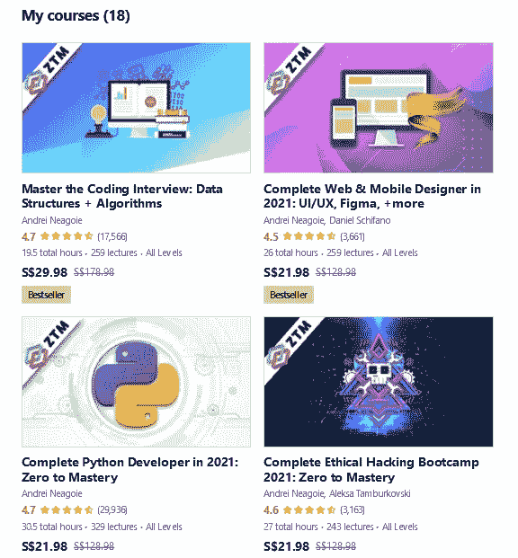

# 安德烈·内戈伊和 ZTM 学院的《2023 年完全 Python 开发者:零到精通》课程值得吗？[综述]

> 原文：<https://medium.com/javarevisited/my-review-of-the-complete-python-developer-in-2021-zero-to-mastery-course-udemy-ztm-academy-371f6de92019?source=collection_archive---------0----------------------->

## 我对初学者和中级开发人员的较好 Python 课程之一的评论 Andrei 的《Python 开发人员 2023:零到精通》。

image_credit — Udemy

大家好，如果你想在 2023 年学习 Python，并寻找一个全面的初级到中级 Python 课程，或者希望加入 Udemy 或 ZTM 学院的 Andrei Neagoie 的 2023 年完全 Python 开发者零到精通课程 ，那么你来对地方了。

此前，我已经分享了 2023 年要加入的 [**最佳 Python 3 课程**](/javarevisited/10-best-python-certification-courses-from-coursera-4576890eb6b3) ，今天的文章涵盖了 2023 年学习 Python 编程语言的最佳在线课程之一的回顾，适用于没有任何经验需要开始的绝对初学者。

这是一门综合课程，有将近 31 个小时的内容，也是 Udemy 上学习 Python 的最新课程之一。

许多人认为学习一门编程语言[来开始软件开发的职业生涯可能是一项艰巨的任务，但是如果我告诉你，你可以只在一门课程中学习这种叫做 python 的语言，而不用花费那么多时间和精力，那会怎么样呢？](/javarevisited/python-or-java-which-programming-language-beginners-should-learn-in-2020-de992b2650ec)

我在网上搜索了很多类似 [Coursera](/javarevisited/10-best-python-certification-courses-from-coursera-4576890eb6b3) 、 [Udemy](/javarevisited/10-best-python-3-courses-on-udemy-ddd4e3ec5dbf) 、 [edX](/javarevisited/10-free-best-edx-certifications-and-courses-to-learn-online-3473d466f968) 等关于学习 python 的最佳在线课程的平台，也找到了很多。

其中一些课程可能需要你几个月才能完成，但是我们今天将介绍的这门课程，名为[***2023 年完整的 Python 开发人员:零到精通课程***](https://academy.zerotomastery.io/a/aff_yp0m7fjx/external?affcode=441520_zytgk2dn) 只需要几周就可以完成并开始这一领域的职业生涯。

 [## 学习 Python。获得聘用|完整的 Python 开发人员训练营|零到精通

### 从头开始学习 Python，获得聘用，并在学习过程中享受最现代、最新的(完全更新为…

academy.zerotomastery.io](https://academy.zerotomastery.io/a/aff_yp0m7fjx/external?affcode=441520_zytgk2dn) 

这门课程需要一台电脑和一个互联网连接，不需要以前的经验，如果你真的对学习 python 有热情，那么继续阅读关于课程内容和教师声誉的整篇文章，看看它是否符合你的需要，或者你需要寻找另一门 [python 课程。](/javarevisited/8-advanced-python-programming-courses-for-intermediate-programmer-cc3bd47a4d19)

# Andrei Negaoie 的《2023 年完整 Python 开发者回顾:零到精通课程——值得吗？

不浪费你更多的时间，让我们开始回顾这个可怕的 Python 课程。我将评估分为多个参数，如教师的质量和教学经验、课程结构、内容质量、测验、参与度和总体性价比。

这将帮助你决定这个 Python 课程是否适合你。

# 1.讲师声誉

这门课的创始人不是别人，正是 Andrei Negaoie，他是最畅销的 Udemy 讲师之一，也是我的最爱之一。

[Andrei Neagoie](https://click.linksynergy.com/deeplink?id=JVFxdTr9V80&mid=39197&murl=https%3A%2F%2Fwww.udemy.com%2Fuser%2Fandrei-neagoie%2F) 是一名软件开发人员，曾在硅谷和多伦多的多家公司工作多年。现在，他追随自己的热情，在 Udemy 和他的许多其他网站上制作 python 和 web 开发之类的在线课程。

Andrei Neagoie 在 Udemy 有超过 550，000 名学生，他们中的许多人已经在软件开发领域的苹果、谷歌和微软等公司开始了职业生涯，这足以证明，当你参加这个 python 课程开始你在这个领域的旅程时，你是一个很好的人。

如果你看看这份 Udemy 简介，他已经创建了 18 个球场，其中大部分都是高质量和最畅销的。如果你喜欢 Andrei 的教学风格和课程质量，我强烈建议你也去看看他的其他课程。

他还创办了自己的网校，名为 [**ZTM 学院**](https://academy.zerotomastery.io/p/complete-python-developer-zero-to-mastery?affcode=441520_zytgk2dn) ，这是一个会员制平台，你只需一个会员就可以获得他所有的课程。

年度计划的会员费用约为每月 39 美元。如果你喜欢他的课程并想加入他的学院，你也可以使用我们的代码**朋友 10** 获得 10%的折扣。

 [## 学习 Python。获得聘用| 2023 年完成 Python 开发:零到精通

### 成为一名专业的 Python 开发人员并被录用,“学习面向对象编程”“构建 12 个以上的真实世界……

academy.zerotomastery.io](https://academy.zerotomastery.io/p/complete-python-developer-zero-to-mastery?affcode=441520_zytgk2dn) 

# 2.课程结构和内容

该课程面向没有编码经验的人，教授你许多技能，如使用 PDF 和 CSV 文件、数据科学、机器学习和 12 个不同的项目。让我们探索一下本课程的内容:

## 2.1.Python 基础

第一部分将向您介绍 Python 的基础知识，如数据类型、运算符、表达式、格式化字符串以及 range 和 enumerate 之类的函数。你将会学到这门语言的基础，你将会在接下来的章节中用到它。

## 2.2.高级 Python

在这里，您将深入了解 OOP ( [面向对象编程](/javarevisited/my-favorite-courses-to-learn-object-oriented-programming-and-design-in-2019-197bab351733))以及继承和函数式编程，如 lambda 表达式和列表理解。您还将了解错误处理和生成器，以及更多内容。

## 2.3.模块调试和正则表达式

本节将教你使用名为 pip 的软件包安装程序和 python 内置模块，这些模块将简化你的代码，使其更加强大，并处理路径和文件，以及使用[正则表达式](/javarevisited/7-best-regular-expression-courses-for-developers-to-learn-in-2021-9b8cb37bb3a5)。

## 2.4.使用 Python 编写脚本

本节将教你如何使用 python 来完成任务，如处理图像和处理 PDF 文件，如合并两个 PDF 文件、使用 python 发送电子邮件、密码破解、[网页抓取](https://javarevisited.blogspot.com/2020/06/top-5-web-scrapping-tools-best-of-lot.html)、请求信息等等。

## 2.5.使用 Python 进行 Web 开发

这一节将教你如何使用一些叫做 [Flask](/javarevisited/5-best-python-flask-courses-for-beginners-2f262f8e23da) 的 python 框架来创建网站的后端，并使用 [HTML](/javarevisited/10-best-html-and-css-courses-for-beginners-in-2021-6757eec00032) 和其他前端技术来创建一个简单的网站和一个作品集项目。

## 2.6.机器学习+数据科学

本节将教你一些机器学习的基础知识，以及计算机如何利用一些数据和[数据科学](/javarevisited/my-favorite-data-science-and-machine-learning-courses-from-coursera-udemy-and-pluralsight-eafc73acc73f)进行学习，这是当今世界最受欢迎的工作之一。

# 3.人物评论

在 ZTM 学院 [*上 2023 年完整 Python 开发者:零到精通课程*](https://academy.zerotomastery.io/a/aff_yp0m7fjx/external?affcode=441520_zytgk2dn) 被评为平台上最好的课程之一，评分超过 4.7，报名人数超过 110k

有些部分的视频和练习对初学者来说很好也很容易，特别是如果你以前从未尝试过编程，不要忘记提到注册这门课程的人的良好反馈，其中 64%的人已经开始学习，这是一个很好的迹象，表明这门课程真的值得你花时间和精力开始学习编码。

这里是加入这个令人敬畏的 Python 课程的链接—[**2023 年完全 Python 开发者:零到精通**](https://academy.zerotomastery.io/a/aff_yp0m7fjx/external?affcode=441520_zytgk2dn)

image_credit — Udemy

以上是关于回顾 ZTM 学院最好的 Python 课程，Andrei Neagoie 的**2023 年完整 Python 开发者:零到精通**。正如我所说的，这是学习 Python 的最新和最吸引人的课程之一，非常适合初学者。

您现在就可以 [**加入这个 Python 课程**](https://academy.zerotomastery.io/a/aff_yp0m7fjx/external?affcode=441520_zytgk2dn) 开始您的软件开发之旅，使用著名且最受欢迎的编程语言 Python，现在您离梦想成真仅一步之遥。那么，您还在等什么呢，现在就加入课程，开始学习 Python 吧。

顺便说一句，正如我所说的，你需要一个 [**ZTM 会员**](https://academy.zerotomastery.io/a/aff_c0gnlvf7/external?affcode=441520_zytgk2dn) 才能观看这个课程，这个课程每月花费大约 39 美元，但也提供了许多像这样超级吸引人和有用的课程。您还可以使用我的代码 **FRIENDS10** 获得您选择的任何套餐的 10%折扣。

 [## 学习需求技能。被录用。推进你的事业。|零到精通

### 不要在无聊、过时的教程上浪费时间。加入 750，000 多名学生的行列，学习受欢迎的技能，并在…

academy.zerotomastery.io](https://academy.zerotomastery.io/a/aff_c0gnlvf7/external?affcode=441520_zytgk2dn) 

其他 **Python 文章和资源**你可能会喜欢
如果你真的想深入学习 Python，这里有更多免费和付费的资源供你进一步学习:

*   [2023 年学习 Python 的 10 个理由](https://javarevisited.blogspot.com/2018/05/10-reasons-to-learn-python-programming.html)
*   [面向初学者的 15 门免费 Python 编程课程](/swlh/5-free-python-courses-for-beginners-to-learn-online-e1ca90687caf)
*   [深入学习 Python 的 10 门免费在线课程](https://javarevisited.blogspot.com/2018/12/10-free-python-courses-for-programmers.html)
*   [学习数据科学的 5 大 Python 书籍](https://javarevisited.blogspot.com/2019/08/top-5-python-books-for-data-science-and-machine-learning.html)
*   [面向程序员的 10 本免费 Python 编程书籍](http://www.java67.com/2017/05/top-7-free-python-programming-books-pdf-online-download.html)
*   [Python 开发者的五大 Web 开发框架](https://javarevisited.blogspot.com/2019/04/top-5-python-web-development-frameworks.html)
*   [Python 和 JavaScript——从哪个开始比较好？](https://javarevisited.blogspot.com/2019/05/python-vs-javascript-which-programming-language-beginners-should-learn.html)
*   [5 Python 中的数据科学和机器学习课程](https://javarevisited.blogspot.com/2018/03/top-5-data-science-and-machine-learning-online-courses-to-learn-online.html)
*   [10 门 Python 课程和程序员认证](https://javarevisited.blogspot.com/2020/02/10-best-coursera-courses--for-python.html)
*   [2023 年网络开发者路线图](https://hackernoon.com/the-2019-web-developer-roadmap-ab89ac3c380e)
*   [8 个 Python 项目，适合初学者学习 Python](/javarevisited/8-projects-you-can-buil-to-learn-python-in-2020-251dd5350d56)
*   [为什么 Python 是数据科学的最佳编程语言](https://javarevisited.blogspot.com/2020/05/why-python-is-best-programming-language.html)
*   [免费学习 Python 编码的五大网站](https://javarevisited.blogspot.com/2019/09/5-websites-to-learn-python-for-free.html)

感谢您阅读本文。如果你喜欢我对这个热门 Python 课程的评论——*2023 年完全 Python 开发者:零到精通，*那么请把这篇文章分享给你的朋友和同事。

如果您有任何问题或反馈，请留言，如果您有我应该参加或阅读的 Python 课程或书籍，请随时与我们分享。

**P. S. —** 如果你更喜欢互动阅读和边做边学，而不是看书或者看视频，也可以看看 Educative 的 [**Python 101 —学习互动课程**](https://www.educative.io/courses/python-101-interactively-learn-how-to-program-with-python-3?affiliate_id=5073518643380224) 。这是一门通过实践来学习 Python 的很棒的课程。

 [## Python 101:交互式学习如何用 Python 3 编程-交互式学习

### 欢迎学习 Python 101！我创建这个课程是为了帮助你学习 Python 3。我的目的是让你熟悉…

www.educative.io](https://www.educative.io/courses/python-101-interactively-learn-how-to-program-with-python-3?affiliate_id=5073518643380224)