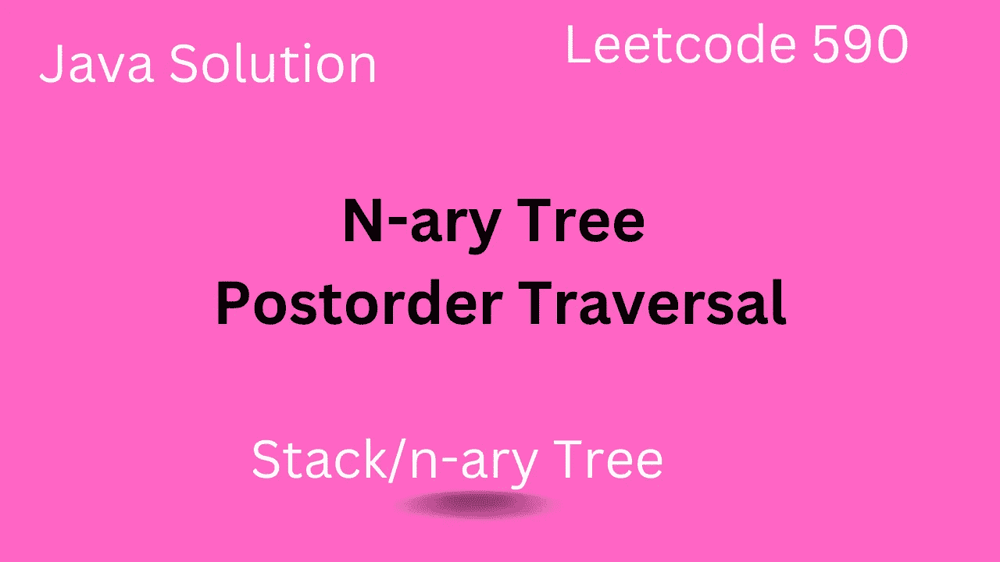

# n 元树后序遍历— Leetcode 590

> 原文：<https://medium.com/javarevisited/n-ary-tree-postorder-traversal-leetcode-590-7465e6c7cc75?source=collection_archive---------3----------------------->

## Leetcode 590 的 Java 解决方案

> 最初发表于

****

## **介绍**

*   **在本文中，我们将解决 Leetcode 590 问题中哪个问题好到[练习树数据结构](/javarevisited/20-binary-tree-algorithms-problems-from-coding-interviews-c5e5a384df30)**
*   **我们还将看看这个问题的基于堆栈的解决方案以及递归解决方案。**