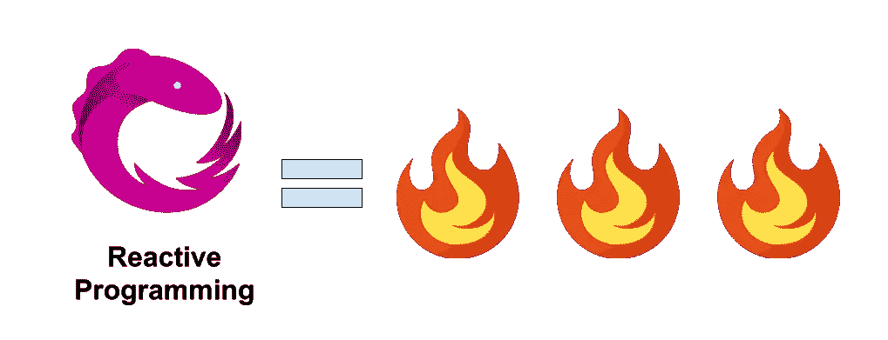

# 使用 RxJava 的网络链接

> 原文：<https://medium.com/javarevisited/network-chaining-with-rxjava-9fcd066b1c65?source=collection_archive---------0----------------------->

图片鸣谢[https://medium . com/corebuild-software/why-you-should-learn-reactive-programming-51b 6 ffc 31425](/corebuild-software/why-you-should-learn-reactive-programming-51b6ffc31425)

移动应用程序比以往任何时候都更加强大。它支持所有类型的用户交互，并连接多个数据源，人们的要求越来越高，并期待更多优秀的应用程序，Android 开发者有责任满足现代用户的需求，构建响应更快、更强大、更易于使用的应用程序。Kotlin 的反应式编程将帮助你实现这个目标。