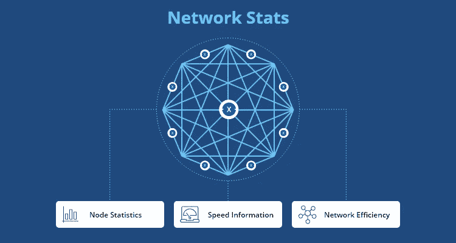

# 网络统计-XDC 区块链的网络浏览器

> 原文：<https://medium.com/javarevisited/network-stats-the-network-explorer-for-the-xdc-blockchain-ced5a3cef12b?source=collection_archive---------0----------------------->

即将在 XDC 网络上发布的 *Network Stats* 分散式应用程序将增加 XDC 生态系统的可见性，并为区块链行业的其他项目提供模板，以更加用户友好的方式呈现重要的网络数据。

网络统计爬 XDC 网络，然后存储和提供访问有关网络节点的有价值的信息。实时和历史网络数据将包括地理位置、性能数据(如平均交易率和网络正常运行时间)以及链上创建的节点列表等数据。这将是 XDC 网络用户的一个有价值的工具，并展示了在 XDC 网络上开发的创新技术解决方案。

# **为什么我们需要一个工具来观察节点？**

在 web2 范式中，爬虫通常被称为访问网站、阅读内容并为搜索引擎索引创建条目的程序。类似地，区块链网络爬虫查询该网络上的节点，收集关于它们的总体高级数据，并返回它们以供以某种方式使用。

为了收集和组合这些数据，Network Stats 使用节点发现协议来搜索 XDC 网络。收集的数据通过节点资源管理器用户界面呈现。通过这种公共访问，我们邀请其他人使用这些数据来构建他们自己的应用程序和网络可视化的替代方法。

# **网络统计提供什么样的数据？**

网络统计的当前版本提供了以下三个类别的指标:

## 1.节点统计

**活动节点** 当前链上活动节点的数量。

**国家** 精确定位国家的活动节点的地理位置。

**节点历史记录** 显示过去七天内创建的节点数量的图表。

## 2.速度信息

**最佳块** 网络上创建的总块数。

**最后一个块** 最后一个块创建的时间。

**平均封锁时间** 创建一个封锁所需的平均时间。

## 3.网络效率

**气价
气价**当前 XDC 网上的气价。

**平均交易率** 执行一笔交易所需的平均时间。

**正常运行时间** XDC 网络的总启动和运行时间。

随着 Network Stats 的推出， [XDC 网络](https://medium.com/xdc-foundation-communications)为全球[区块链](https://www.java67.com/2020/07/top-5-websites-to-learn-blockchain-in.html)空间做出了重大贡献。这项技术将帮助用户更好地了解不断增长的 XDC 网络，并将通过图表和统计数据为开发人员、研究人员、安全开发人员、节点运营商和媒体记者提供许多见解。