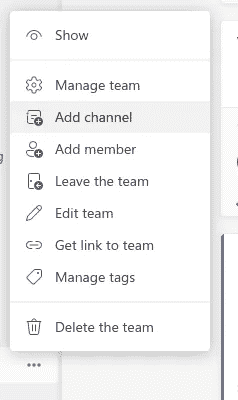
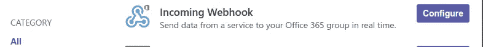
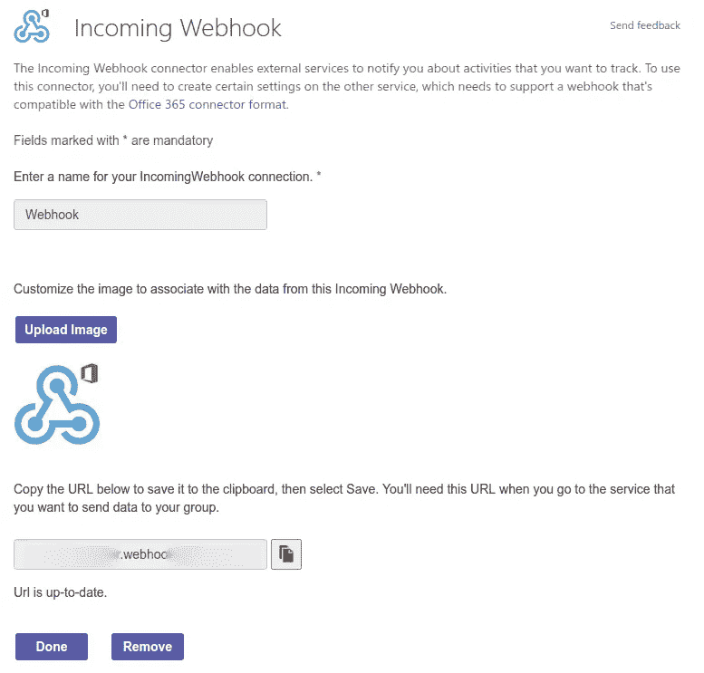
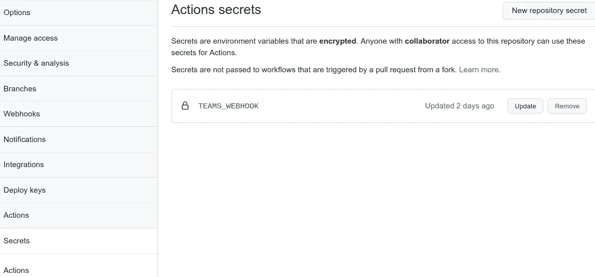
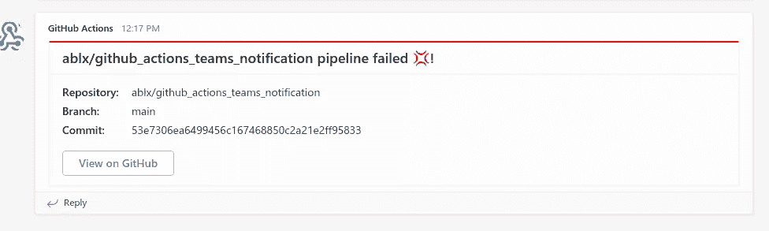

# 如何在构建中断时通知微软团队！

> 原文：<https://medium.com/javarevisited/never-overlook-a-broken-build-again-get-notified-in-microsoft-teams-d020a24292cd?source=collection_archive---------1----------------------->

## 不要成为那个在工作结束前破坏构建的人。

迪米特里·卡拉斯泰列夫在 [Unsplash](https://unsplash.com/?utm_source=unsplash&utm_medium=referral&utm_content=creditCopyText) 上拍摄的照片

今天是星期五，下午四点半。你完成了那个重要的特写。您提交和推送，CI 服务器会将其部署到测试系统。太棒了。周一，你可以向客户展示你的作品。

但这是什么？为什么管道是红色的？几秒钟前一切正常！你看看建造历史。该死的。杰克几小时前就破坏了这个版本，却没有修复它！干得好，杰克…

现在怎么办？当杰克享受他的周末时，你修理他的愚蠢代码。否则，客户周一会生你的气。

不要像杰克一样。如果构建中断，让 CI 服务器通知您。**收到一条团队关于不完整构建的消息。**

<https://verbosemode.dev/membership>  

## 配置 Microsoft 团队

如果您没有频道，请为接收通知的团队添加一个频道。点击团队名称旁边的圆点，然后选择`Add Channel`。

在团队中添加新频道

要添加网页挂钩，请点击频道旁边的圆点，然后点击`Connectors`。

添加网页挂钩

配置一个`Incoming Webhook`。点击`Create`后，Teams 会显示 Webhook URL。在下一步中复制此 URL。

配置网页挂钩

## 连接 GitHub 动作和团队

打开存储库，它会在构建失败时通知您。前往`Settings`，然后前往`Secrets`。为`Actions`添加一个名为`TEAMS_WEBHOOK`的秘密。

## 将通知步骤添加到工作流中

打开您的`workflow.yml`并添加以下步骤:

此步骤仅在管道之前出现故障时运行。它为 Teams Webhook 创建有效负载，并执行 POST 请求。

对于下一个中断的构建，您将在团队中收到通知:

失败生成的通知。

你可以点击按钮打开 GitHub，看到破损的管道。**就是这样！现在，您可以更快地对破裂的管道做出反应！**

## 额外收获:详细的团队有效载荷

让我们检查一下有效载荷:

注意，我们使用了 *GitHub Actions 环境变量*来给消息添加有用的内容。你可以在[官方文档](https://docs.github.com/en/actions/learn-github-actions/environment-variables#default-environment-variables)中看到所有可用的变量。

`themeColor`字段处理通知中的红色条。更多字段和示例见 [Webhook 文档](https://docs.microsoft.com/en-us/microsoftteams/platform/webhooks-and-connectors/how-to/connectors-using?tabs=cURL)。

想要从团队中获得更多？查看以下文章:

</javarevisited/react-faster-alertmanager-to-teams-fa888bcd7c01> 