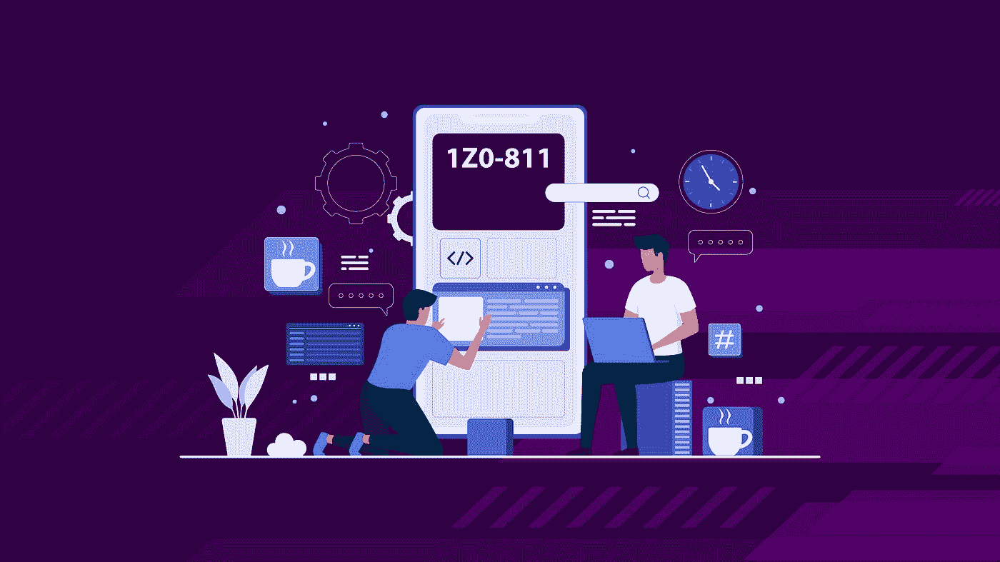

# 【新课程】Java 基础考试【1z 0–811】练习题！！

> 原文：<https://medium.com/javarevisited/new-course-java-foundations-exam-1z0-811-practice-test-83bed1e6483f?source=collection_archive---------3----------------------->

## 我的新 Udemy 课程是为了准备 2022 年的 Java 基础助理考试 1z 0–811 认证

大家好，

我很兴奋地宣布我的新课程，一个 [Java 基础考试【1z 0–811】](https://www.udemy.com/course/java-foundations-exam-1z0-811-practice-tests-new/?couponCode=5DAYSLAUNCH)的模拟考试

很多人不知道这个认证，但这是最好的入门级 Java 认证之一，如果你想成为认证 Java 开发人员，或者更准确地说，认证 Java 助理，那么这个考试是最好的开始。

Java 基础是成为 Java 认证助理的入门级 Java 认证，如果你想在 2022 年成为 Java 认证助理，那么这可能是最容易的认证。

**及格分数是 65%** 所以你仍然需要练习，这就是本课程将帮助你的地方。

在本课程中，您将获得:

- 3 个全长测试

- 225 个问题

-详细解释

这是给你们所有人的 9.9 美元的优惠券，在接下来的 5 天内有效。代码—**5 天启动**

[https://www . udemy . com/course/Java-foundations-exam-1z 0-811-practice-tests-new/？couponCode=5DAYSLAUNCH](https://www.udemy.com/course/java-foundations-exam-1z0-811-practice-tests-new/?couponCode=5DAYSLAUNCH)

此外，自从我的新课程推出以来，你们中的许多人在 Twitter 上向我索要 9.9 美元的 Udemy 课程优惠券，所以它们在这里，在接下来的 5 天内有效:

*   [$9.9 的 VMware Spring 专业测试优惠券](https://www.udemy.com/course/spring-professional-practice-test-questions-vmware-edu-certification/?couponCode=BESTPRICEJAN2021)
*   [$9.9 的 Java SE 11 开发者认证实践测试优惠券](https://www.udemy.com/course/java-se-11-certification-exam-1z0-819-practice-tests/?couponCode=JAN2022LAUNCH)
*   [$9.9 的 Java SE 8 程序员 II 认证测试优惠券](https://www.udemy.com/course/new-java-se8-programmer-certification-ocpjp-1z0-809-exam-practice-test/?couponCode=JAN2022LAUNCH)
*   [$ 9.9 DP-900 Azure 数据基础考试优惠券](https://www.udemy.com/course/dp-900-azure-data-fundamntals-exam-mock-test-practice-questions/?couponCode=JAN2022LAUNCH)
*   [$9.9 的 Java EE 7 应用开发者考试优惠券](https://www.udemy.com/course/java-ee-application-developer-exam-practice-tests/?couponCode=JAN2022LAUNCH)
*   [$ 9.9 AZ-900 Azure 基础考试测试优惠券](https://www.udemy.com/course/az-900-practice-test-azure-fundamentls-certification-exam/?couponCode=JAN2022LAUNCH)
*   [$9.9 的 ACP-100 JIRA 行政考试模拟测试优惠券](https://www.udemy.com/course/acp-100-jira-server-administrator-exam-practice-tests-quizes/?couponCode=JAN2022LAUNCH)
*   [AZ-300 Azure Technologies 架构师实践测试的 9.9 美元优惠券](https://www.udemy.com/course/az-303-microsoft-azure-architect-technologies-practice-tests/?couponCode=JAN2022LAUNCH)
*   [$9.9 的 Java Lambda Udemy 课程优惠券](https://www.udemy.com/course/java-lambda/?couponCode=JAN2022LAUNCH)

请确保在它们过期之前使用它们，并且您可以自由地与您的朋友和任何准备 Java、Spring 和 Cloud 认证的人分享。使用代码 **JAN2022LAUNCH**

祝您 2022 年的认证之旅一切顺利