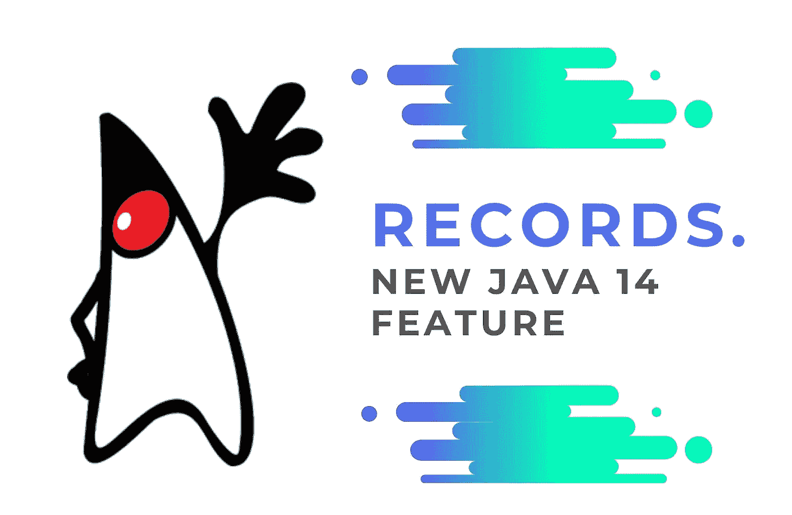

# Java 14 的新特性:记录

> 原文：<https://medium.com/javarevisited/new-java-14-feature-records-e8a3617e56e9?source=collection_archive---------0----------------------->

最近 Oracle 发布了新的 JAVA 14 版本。其中一个新特性是 ***记录*** 。这是 P [评论语言特色](https://openjdk.java.net/jeps/12)的一部分。记录为声明类提供了紧凑的语法，这些类是浅不可变数据的透明持有者。

> 预览语言或 VM 特性是 Java SE 平台的一个新特性，它是完全指定的、完全实现的，但不是永久的。