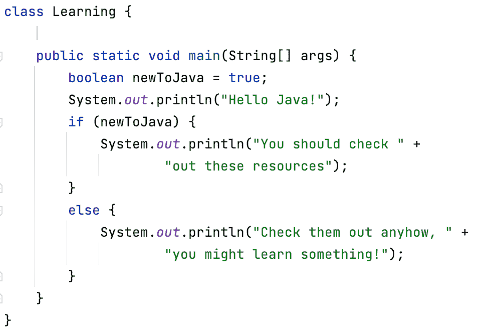

# Java 新手？一些资源—海伦·斯科特

> 原文：<https://medium.com/javarevisited/new-to-java-some-resources-helen-scott-cd3b742adf35?source=collection_archive---------2----------------------->

在这条推文的[中，有人问我是否有针对 Java 新手的资源列表。我当时没有，但我花了一些时间研究，这是清单。](https://twitter.com/helenjoscott/status/1372477062263496704?s=21)

我列出了免费和付费的内容。并不是说一种类型就高人一等；只是给你很多选择。这些是我用来重新学习 Java 的资源，现在仍然在使用。所以，如果你是 Java 的新用户，或者想在休息一段时间后重新开始，这个博客是为你准备的。

另外超级重要的一点是，每个人学习的方式都不一样；有些人喜欢阅读，有些人喜欢做，有些人喜欢看，我们大多数人都喜欢各种东西的混合。我倾向于在它们之间切换，这取决于我想了解什么和我的感受。你们可能很相似，所以选择一种适合你的方法。

# 学习平台

先说学习平台。有很多可供选择，所以你可以选择一个适合你的学习和预算风格的。

[JetBrains Academy](https://www.jetbrains.com/academy/) 是一个相当新的学习平台，我一直用它来提高 Java 技能。我把它和其他学习材料一起使用。我喜欢理论和实践任务的结合。当然，与 IntelliJ IDEA 的巧妙整合也是一个额外的收获。

在我的 Java 学习之旅中，我也使用了 Udemy。这里有丰富的内容，您可以在购买前先试用其中的大部分。

最后，我玩了一下 [codewars](https://www.codewars.com/) 。这是对 katas 的一个很好的介绍(很快会有更多介绍)，不管你在编码之旅的哪个阶段。它没有 JetBrains Academy 或 Udemy 那么结构化，并且可以在你有心情的时候提供一些轻松的编码休息。

# 团体

Java 社区是一个丰富的、充满活力的、受欢迎的地方。这在它周围涌现的社区中得到了体现。

[Virtual JUG](https://virtualjug.com/) 就是它听起来的样子；一个虚拟的 Java 用户组，主持讲座和分享知识。他们有一个休闲和聚会的空间，所以你可以听到伟大的演讲者，说出你自己，并向你的同龄人学习。

由于我在英国工作，我也想对[伦敦 Java 社区](https://twitter.com/ljcjug)和[曼彻斯特 Java 社区](https://twitter.com/mcrjava)表示感谢。他们都是巨大的信息资源和支持社区。我完全期望这在世界范围内的其他 Java 用户组中得到反映，所以我建议您找到离您最近的一个(或者设置一个(！))并参与其中。谈到参与，创造内容是一个很好的方式。

Java 专家[是由](https://www.javaspecialists.eu/) [@heinzkabutz](https://twitter.com/heinzkabutz) 运营的另一个活跃团体。亨氏也有一份每周时事通讯，我推荐你看看。

[Code Ranch](https://coderanch.com/) 对于 Java 新手来说是一个非常友好的地方，在这里你可以发布问题，向他人学习，并尝试编码问题。[论坛](https://coderanch.com/forums/c/1/java)也真的很活跃(哦，还有我有没有提到这里的每个人都超级可爱？).

# 代码卡塔斯

相对来说，我是一个代码形的新手，但我真的很喜欢把它们作为一种学习方式。它们是独立的迷你谜题，你可以在闲暇时解开。

[@TheDonRaab](https://twitter.com/thedonraab) 在为 Eclipse 集合保持这些更新方面做得很好:[https://github.com/eclipse/eclipse-collections-kata](https://github.com/eclipse/eclipse-collections-kata)

[@CGuntur](https://twitter.com/CGuntur) 也为你创建了这些 Java 形，有非常好的说明和更新:[https://github.com/c-guntur/java-katas](https://github.com/c-guntur/java-katas)

我还没有开始做这些，但是我喜欢它们的样子，因为测试就在那里。

# 特定的 Java 资源(包括框架)

这是一个有点包罗万象的部分，但是有一些我遇到过的非常有用的资源；它们列在这里。

[这门来自](https://angiejones.tech/free-java-course-test-automation/) [@techgirl1908](https://twitter.com/techgirl1908) 的课程是我在熟悉 Java 过去 20 年的旅程中最先使用的资源之一。我发现它节奏很好，温和，非常有用。

[@marcobehler](https://twitter.com/marcobehler) 围绕 Java，特别是 Spring，创造了很多内容。[这个博客](https://www.marcobehler.com/guides/spring-framework)，还有[这个春季课程](https://www.marcobehler.com/courses/spring-professional)，有点像洋葱。它从春天之前的生活开始，并建立了复杂性，这样当你使用 [Spring](/javarevisited/10-best-spring-framework-books-for-java-developers-360284c37036) (以及随后的 [Spring Boot](/javarevisited/top-10-courses-to-learn-spring-boot-in-2020-best-of-lot-6ffce88a1b6e) )时，你会感觉像个巫师，并理解魔法是如何实现的以及为什么。我觉得这里有一个洋葱双关语，但我会很快继续。

Baeldung 网站上有大量的 Java 信息。我没有一个具体的博客可以指向，但是当我用谷歌搜索 Java 时，这个网站上总会有一个博客解释如何去做。就数量和质量而言，这些内容的丰富程度总是让我感到惊讶(许多作者都为此做出了贡献)。

我想提到的另一件事是官方的 Oracle Java 文档。我这样说是因为你不必把 Java 语言储存在你的脑子里。查找资料并不可耻(这是技术面试如此失败的另一个原因)。

把你的时间花在学习编码的艺术方面，而不是记住谷歌搜索就能找到的东西。当然，随着时间的推移，您会学到更多，但是当您开始您的 Java 之旅时，这不需要成为您的优先事项。

当然，有很多专门的 Java 博客,你可以在谷歌上快速找到，但是我想保留这个资源列表，专门针对那些新手可能会觉得有帮助并且我已经使用过的内容。

# 书

我喜欢书；可以说，比起视频，我更喜欢它们。正如我在这里列出的所有其他资源一样，它们并不缺乏。这些是我特别发现有帮助的。

由 Kathy Sierra 和 Bert Bates 编写的 Head First Java。是的，这本书在 Java 的规模上是*的老书*，但是它仍然非常非常好，可能会吸引你大脑的学习方式。我是从这本书开始的，我不后悔。

[每个 Java 程序员都应该知道的 97 件事](https://www.amazon.co.uk/Things-Every-Java-Programmer-Should-ebook/dp/B088P8GV8X/ref=sr_1_1?dchild=1&keywords=97+things+java&qid=1617782728&sr=8-1)。我包括这个是因为我和 [@trisha_gee](https://twitter.com/trisha_gee) 一起工作吗，不，我包括这个是因为我从中获得了很多价值？我喜欢广泛的话题，我可以很快地进入和退出，因为所有的内容都是独立的。许多非常有经验的 Java 专业人士为此做出了贡献，所以在我看来，他们值得一听！

[Joshua Bloch 的《有效的 Java》](https://www.amazon.co.uk/Effective-Java-Joshua-Bloch/dp/0134685997/ref=sr_1_4?dchild=1&keywords=java&qid=1617782657&sr=8-4)不是你入手的那本书，但它是一本入门门槛相对较低的书，也是一本我从中获得了很多价值的书(现在我有了更多的知识，可能需要重读)。

[头像第一设计图案第二版](https://www.amazon.co.uk/Head-First-Design-Patterns-Object-Oriented/dp/149207800X/ref=sr_1_1?dchild=1&keywords=head+first+design+patterns&qid=1617782892&sr=8-1)。这本书刚印刷出来，墨水可能还没干。我要坦白说，我还不拥有它，但我计划很快拥有它。我拥有第一版，它非常棒。我完全期待第二版会一样好，如果不是更好的话。无论你的编码目标是什么，设计模式的知识和理解都会很好地为你服务。

# Java 认证

关于 [Java Oracle 认证](/javarevisited/10-best-it-certifications-for-java-developers-5b4a78e3605d)的一个注意事项:这是一个容易引起意见分歧的话题。我认为认证对于深入理解 Java 语言是非常有价值的，如果你想学习并获得它，它会很好地为你服务。

我不认为你*需要*这样的认证，我怀疑 [Java](/javarevisited/10-best-hands-on-courses-to-learn-programming-with-java-python-and-javascript-53539498fd52) 的在职知识会给你提供同样丰富多样的语言体验，尽管是从不同的角度。这完全取决于你，但是如果你想追求 Java 认证，这里是我对资源的推荐。

从[珍妮·博雅斯基](https://twitter.com/jeanneboyarsky)到[斯科特·塞利科夫](https://twitter.com/scottselikoff)都有[的优秀书籍](https://www.amazon.co.uk/Oracle-Certified-Professional-Developer-Complete/dp/1119619130/ref=sr_1_6?dchild=1&keywords=Exam+1Z0-816&qid=1617727785&sr=8-6)。我没有参加考试，但我发现这些书非常有用，这些例子也很有启发性。

我的同事 [Mala Gupta](https://twitter.com/emalagupta) 也是 Java 认证的热情拥护者，她的 Java SE 11 书正在预览中，所以你已经可以看到了！

# 目标、学习风格和时间

不管你是编程新手，还是 Java 新手，还是暂时脱离 Java，这份资源列表都可以帮助你快速入门。

我建议你找到对你有用的，然后建立你的清单。对一个人有用的东西不一定对另一个人有用，所以请随意探索丰富的内容。你的学习方式也会起到一定的作用，你有多少时间也是如此。

无论你做什么，享受旅程，记住你的目标是什么。永远不要忘记*为什么*；那会让你到达你想去的地方。

*原载于 2021 年 4 月 15 日*[*https://www.helenjoscott.com*](https://www.helenjoscott.com/posts/new-to-java-resources)T22。