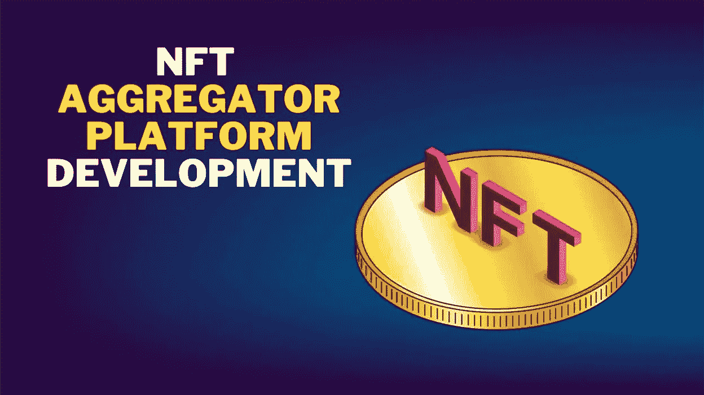

# NFT 聚合器平台:获取您的 NFTs 的一站式解决方案！

> 原文：<https://medium.com/javarevisited/nft-aggregator-platform-one-stop-solution-for-grabbing-your-nfts-8c192ce8317a?source=collection_archive---------2----------------------->

你已经看到了一个图书馆，一个单词字典，现在又看到了一个 NFT 池的平台？一个 NFT 爱好者或追随者还能要求什么呢？这一切都在及时发生，这就是让人们相信数字世界的进步。

NFT 聚合器是一个充满 NFT 的平台。您可以找到来自不同平台的 NFT，从而实现互操作性。你不需要在 Web3 空间里寻找符合你期望的 NFT。你可以在一个地方找到所有的东西。

这是佩戴数码表冠所需的最新潮流。交易变得很容易，因此你会发现一个充满了令人难以置信的 NFT 收藏品的洞穴。

因此，开始寻找一个 [**NFT 聚合器市场开发**](https://www.chaincella.com/) 提供商，这样每个人都可以使用你的平台来查看 NFT，并与不同平台上的产品进行比较，然后进行交易。

> **NFT 聚合平台:你的 NFT 池可以一起保持数字平衡！**

## **为什么首先会出现对 NFT 聚合平台的需求？**

对 NFT 集合器的需求是由许多因素造成的，而不仅仅是 NFT 数据集合。

*   尽管当前的大多数 NFT 都是由以太坊托管的，但是大量的新区块链正在开发中。像 Solana、Polygon、Flow 和 Avalanche 这样的区块链只是对 NFTs 做出重大贡献的几个例子，并且很可能在未来占据主导地位，这增加了对聚合器平台的需求。
*   随着非功能性翻译进入广泛的行业，消费者正在寻找各种类型的非功能性翻译。非关税壁垒的交换通常在多个市场进行。这导致了对一个位置的需求，在那里你可以很容易地查看市场上特定类别的所有可用的 NFT。
*   需求的另一个原因是用户需要能够跨不同平台比较价格和交易费用。这些平台拿捏的恰到好处，让人见证他们不可思议的能力。
*   它也有助于定位在其他市场上以其他非功能性食品的名义销售的假冒或仿制的非功能性食品。

NFT 聚合器平台的开发最近已经开始起步，该平台提供来自不同 NFT 市场的特定区块链上的 NFT 的聚合。此外，一些通用市场在其平台上提供来自其他市场的 NFT 收藏。

## **所需的聚合**

自从一个更大的数字球体上的令牌出现以来，一切都在广阔的空间中展开。要想获得无尽的财富或它们提供的好处，你需要得到所需的总和。

因此，随着聚合器平台的发展，这一切都在发生。你可以把所有东西放在一个屋檐下，让不可思议的事情发生。该平台还具有多种特性和多种优势，使其成为 NFTs 的首选平台。

当你倾向于更多地了解聚合器平台时，你肯定会选择 [**NFT 聚合器市场开发服务**](https://www.chaincella.com/) 。

> **聚合平台:提升你的买卖体验！**

## **NFT 市场聚合器如何改善购买和销售部门？**

一个 [**NFT 集合市场**](https://www.chaincella.com/) 的发展将会有很高的需求，使得每个人买卖代币变得更简单。由于其潜力，新的代币正在进入市场，并在竞争最激烈的领域测试他们的勇气。

由于 NFT 市场开发公司积累了丰富的知识，这一过程变得更加简单快捷。投资者可以通过分析销售排名来明智地比较投资。流程如下:

## **检查情况**

尽管分散的 NFT 项目在扩大，但由于缺乏互操作性和数据共享工具，人们已经被赶出了更大的生态系统。NFT 聚合器市场开发公司的有效数据聚合的目标是测量、预测、设定目标和支持决策。

## **创造知识**

NFT 市场聚合器给出统计数据，而不是模糊的概念估计，让用户做出明智的决定。然而，收集的数据无法理解 NFT 集合市场的低流动性和其他意想不到的特征。因此，仍然有必要使用数字和排名来评估市场状况，以便在它们转变为危机之前确定它们的潜力。

## **实施计划**

知识分子总是支持活跃的数据收集和分析的增长[**NFT**](https://www.chaincella.com/)。这些知识被转化为提高生活质量的技术。如果你是投资者，NFT 集合市场可能是你下一步行动的最佳选择。聚合器让人们更容易理解 NFT 的实际概念，这对于一些人来说很难理解。由于这些平台，行业、企业主和个人可以轻松地研究和比较令牌。

## **最后一步**

投资者可以使用 [**NFT 集合器解决方案**](https://www.chaincella.com/) 观察市场动向。您可以在收到产品后评估潜在的不可替代令牌，并继续使用它们。除此之外，市场上还可以看到主要的 NFT 持有者。当你正确地比较市场趋势和模式时，你就可以根据需求进行投资。

## **聚合器平台的有效特征**

现在像 OpenSea 这样的市场正在向其他 EVM 兼容的连锁店敞开大门，跨连锁店市场更有可能出现。尽管如此，由于极其苛刻和不断增长的用户群，迫切需要一个可以处理一切的聚合器。一些重要的功能包括:

*   集中式仪表板
*   个性化推荐
*   价格比较
*   钱包整合
*   NFT 类别
*   高效搜索过滤器
*   用户概要
*   NFT 广告公司

## **聚合器平台开发提供的优势**

你可能想知道 [**NFT 聚合平台**](https://www.chaincella.com/) 是否只提供 NFT 数据的市场聚合。下面列出了各种好处供您参考。

*   作为 NFT 行业最全面的数据来源，NFT 聚合器不仅涵盖了市场上大量的 NFT 数据，还提供了多维度的数据。用户只需要一个平台，他们也可以直接购买，以了解最新的 NFT 数据和市场状况。
*   该平台可以为广大用户提供量身定制的推荐。对于投资者，收藏家，甚至新手，它提供了很好的整合 NFT 数据。它提供了独特的浏览体验，并使每个人都可以使用这个平台。
*   该平台包括一个数据分析工具，因为其主要目的是提供各种非功能性测试的比较分析。用户将能够了解不同非森林交易之间的差异，如市场容量、持有人数量等。，通过这个。
*   由于该平台增强的搜索功能，用户不需要打开额外的标签。用户可以使用元数据甚至自然语言通过搜索引擎功能搜索任何 NFT。强大的搜索算法和排序大大增强了信息的有效收集，也增强了搜索结果的呈现。

重要的是要记住，平台的操作应该尽可能简单明了。如今，基于区块链的平台经常将平台功能置于用户体验之上。让平台对用户友好是至关重要的，尤其是对初学者，因为它旨在帮助所有 NFT 用户，无论他们的经验水平如何。

## **包装完毕！**

一家 [**NFT 聚合器市场开发**](https://www.chaincella.com/) 公司提供最明智的解决方案来实现您的 NFTs。你可以确保把 NFT 放在一个平台下，然后帮助人们。一家杰出的公司为增强型平台提供了经济高效的解决方案。所以，在最好的平台制造商那里试试你的手，抓住一个统治未来的机会。