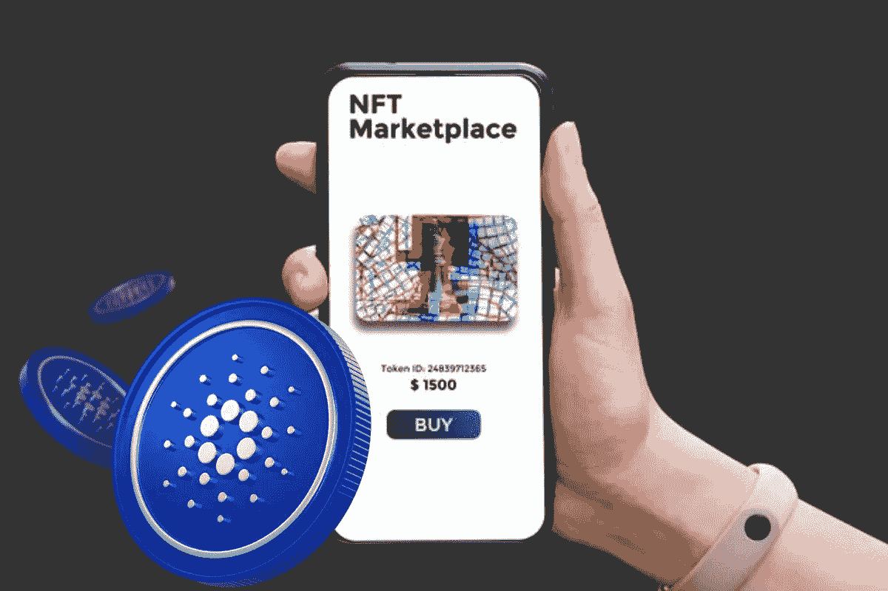
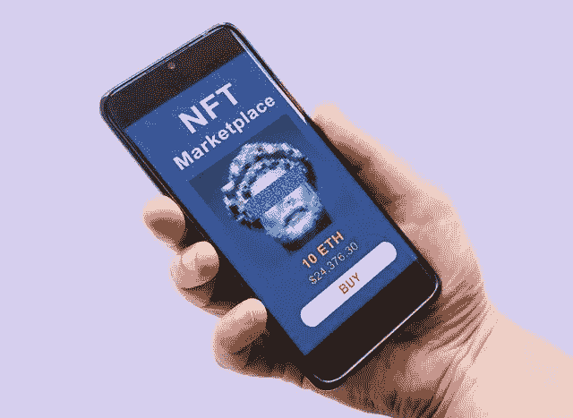

# Cardano 上的 NFT 市场开发:在 Cardano 区块链上推出 NFT 平台

> 原文：<https://medium.com/javarevisited/nft-marketplace-development-on-cardano-launch-nft-platform-on-cardano-blockchain-71a518cd1f?source=collection_archive---------4----------------------->

NFTs 的出现高度期待个人在 NFT 诗歌中一试运气。NFT 市场也为企业家提供了各种创收渠道。在这些各种各样的创业想法中，启动 NFT 市场将是赚取巨额收入的一个好方法。

谈到 NFT 市场的发展，[区块链科技](/javarevisited/7-free-courses-to-learn-blockchain-in-2020-764e66b47ebe) y 是其运营和功能背后的策划者。区块链技术完全是关于存储所有数据和交易的数字账本。在这个意义上，各种[区块链](/javarevisited/best-blockchain-courses-and-certification-in-2020-63729f8f04d0)是存在的，并且基于它们的凭证；它们被项目采用。

在区块链网络的名单上，Cardano 是最近进入 NFT 生态系统的一个。以下是你如何在卡尔达诺 区块链科技上启动 [**NFT 市场。**](https://www.appdupe.com/nft-marketplace-development)

**卡达诺区块链技术简介**

这些年来，区块链技术的发展分为三代。第一代区块链属于比特币，第二代属于[以太坊](https://javarevisited.blogspot.com/2022/01/5-best-courses-to-learn-cryptocurrency.html)。

卡尔达诺是第三代区块链，解决了前两代面临的挑战。它解决了这些挑战，并带来了一个伟大的解决方案，将促进高可伸缩性，可持续性和互操作性，以支持更快的交易。

Cardano 有许多优点，这使它成为建设 NFT 市场的可靠解决方案。Cardano 提供的巨大好处吸引了 crypto 爱好者。

为了给它的皇冠增添光彩，它被标记为第一个通过同行评审研究和基于证据的方法开发的[区块链](https://javarevisited.blogspot.com/2022/01/5-best-blockchain-certifications-and.html)。根据密码专家的说法，这个区块链比以太坊，第二代[区块链](https://www.java67.com/2018/02/5-free-blockchain-technology-courses.html)要好得多。Cardano 分布式账本技术的不变性保护了交易细节，并保护平台免受虚假交易和黑客攻击。

**Cardano 的相关特性使其成为开发者的可靠选择**

卡尔达诺，在更广泛的范围内，有充分的特点，被证明是更先进的面对市场。深入探索卡尔达诺的特点。

*   如前所述，Cardano 主要关心的是为用户提供安全的交易。为了增强交易的安全性，它嵌入了共识机制和协议、利害关系证明和 Ouroboros，这将支持系统提供安全交易的可持续性能。
*   Cardano 使用基于证据的方法开发，用于开发高风险应用。然而，通过这一点，他们可以出现他们的需求和创新。
*   卡尔达诺无与伦比的安全性将在市场上开辟新的机会。
*   激励机制将奖励用户作为开发者、股份池操作员和股份委托人所做的贡献。
*   当谈到增强性能和增加模块时，Cardano 在另一个[区块链](https://dev.to/javinpaul/5-best-courses-to-learn-blockchain-for-beginners-in-2022-2me4)中表现最佳。

> 想在 Cardano 上启动一个 NFT 平台吗？ [**获得 NFT 市场专家咨询**](https://www.appdupe.com/nft-marketplace-development)

**为什么在卡尔达诺开设 NFT 市场是一个理想的选择？**

最近几天，卡尔达诺给相当多的观众留下了深刻的印象。在面临其他区块链的缺点后，企业家开始寻找替代方案。这时候卡多纳作为救世主出现了。以下是你应该推出 [**Cardano 支持的 NFT 市场**](https://www.appdupe.com/nft-marketplace-development) 的令人满意的理由，

*   可扩展性是区块链网络的主要特点，因为当企业专注于扩展时，它应该积极提供支持。当流量增加到 NFT 平台时，区块链网络应该能够处理这种情况。Cardano 解决了这个问题，它将高速、网络带宽和数据存储的事务机械化。
*   利益一致机制的证明将支持以更高的速度进行交易。
*   Cardano 采用修剪、压缩和分区等技术来解决与数据存储相关的问题。
*   它使用一种称为 RINA 的技术，将网络分成子网，并降低节点的带宽要求。
*   卡尔达诺区块链将保留一份关于卡尔达诺 NFTs 的起源和历史的记录，通过它你可以追踪资产的所有权。
*   像普路托斯和马洛这样的专业智能合同平台将实现可扩展性并支持链的灵活性。这样，它还能以较低的交易成本提供高质量的服务。
*   互操作性是 Cardano 网络的最大特点，因为它将允许多种货币在多个链中并存。

**NFT 市场在卡达诺区块链上的优势**

为什么在卡达诺推出 NFT 市场？作为一名企业家，你可能会有这个问题。好了，下面是你问题的答案！

**利润丰厚的商业模式**

卡尔达诺支持 NFT 市场赋予企业家多种创收方式。作为 NFT 市场的主人，你将从每笔交易中获得一笔费用，并且你还将因展示他们的 NFT 而获得一笔广告费。

**跨链顺应性**

位于卡尔达诺的 NFT 市场将支持和互动广泛的区块链资产。这肯定会增加你的 NFT 市场的用户数量。

**安全**

就卡达诺区块链而言，它支持数字资产的高安全性和耐用性。分散的设计和分散的服务器将让 NFT 市场的信息得到安全可靠的存储。

**流动性**

用户将通过 NFT 的互操作功能获得快速流动性。卡尔达诺区块链将允许交易员在执行相同资产的交易后立即购买或出售资产。在以卡尔达诺为基础的 NFT 市场的发展中，即时流动性是可能的，因为消费者进行交易没有冷却期。

> 获得 NFT 市场的白标解决方案并立即启动您的 NFT 平台？ [**跟我们聊天**](https://direct.lc.chat/8256261)

**如何在卡尔达诺创建一个 NFT 市场？**

NFT 市场的发展将使创作者和收藏家能够接触到买家和卖家，以获得他们的数字资产。在开发 NFT 平台时，您必须遵循某些步骤。以下是您在开发基于 [**Cardano 的 NFT 平台**](https://www.appdupe.com/nft-marketplace-development) 时必须遵循的步骤，

**定义目标利基**

在开始开发 NFT 市场之前，你必须确定你在 NFT 投资的目标市场。你可以决定数字艺术家，买家，卖家的类型，最重要的是，你的 NFT 市场的利基领域。

确定区块链的先决条件。

NFT 市场是在多个区块链上发展起来的。在开发 NFT 市场时，你必须建立所有权节点，这被认为是最重要的先决条件之一。

**定义用户角色**

在这个阶段，你必须为创作者和艺术家提供最好的用户体验。只有这样，你才能继续开发你的平台的 UI。

**用户界面/UX 设计**

NFT 平台的用户界面在吸引更多用户使用您的平台方面发挥着重要作用。UI 的设计应该基于创作者和交易者的用户便利性。市场应该拥有多种功能，并显示 NFT 收藏品的价格。

**智能合同开发和审计**

下一步是继续为您的市场开发智能合同。智能合同扮演着数字合同的角色，它将监控平台内[NFT](https://savingsfunda.blogspot.com/2022/05/how-to-create-and-sell-nft-non-fungible.html)的开发。它还将以策展人的身份监测平台的所有活动和运作。然而，Cardano 提供了三种语言的智能合约开发，即哈斯克尔语、普路托斯语和马洛语。你可以根据你的可行性选择任何人。

**总结一下，**

卡尔达诺的 NFT 市场开发因其可扩展性和各种其他原因而受到企业家的广泛赞誉。加入游行，在久负盛名的 [**NFT 市场发展公司**](https://www.appdupe.com/nft-marketplace-development) 的支持下，开始在卡尔达诺发展自己的 NFT 市场。