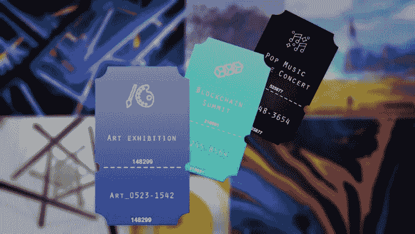

# 票务中的 NFTs

> 原文：<https://medium.com/javarevisited/nfts-in-ticketing-ea861bda4a1?source=collection_archive---------1----------------------->

NFT 是一个创新的概念，已经创造了一个围绕数字艺术的主要嗡嗡声，并准备进入所有其他市场。

一个这样的位置是一个活动市场，在那里 NFT 可以弥合实体和数字票务之间的鸿沟。

你还记得人们过去收集旧的学校门票吗？每张票都是独一无二的，让人想起维也纳的歌剧之夜，英国的世界杯，或者加利福尼亚的音乐节。毫无疑问，数字化简化了门票，但一个基本的二维码，后面没有解释，看起来不太有趣。如今，门票缺少人们在移动或旅行时希望随身携带的记忆成分。

目前，票务系统缺乏记忆，这种记忆用来提醒以前事件中值得纪念的场合。引入 NFT 是为了增强票据的功能性和可记忆性。纸质车票可能会放错地方或受潮损坏。此外，由于纸质车票可能会被放错地方，因此使用纸质车票出行很困难。此外，纸质门票很容易伪造，组织者没有得到足够的保护。对于组织者来说，二维码似乎是一个可行的选择，但对于购买二维码的与会者来说，这是无效的。

使用 NFTs 时你不需要做出让步，因为这项技术对组织者和参与者都有帮助。现在让我们了解一下 NFT 在票务行业是如何工作的。

## 在票务方面，NFT 是如何运作的？

NFT 是加密的独特数字令牌，保存在[区块链](/javarevisited/best-blockchain-courses-and-certification-in-2020-63729f8f04d0)上。一旦在区块链生成，它们就可以以数字形式出售给消费者。然后，客户可以将 NFTs 存储在可从任何设备访问的安全钱包中。

活动组织者可以在票务系统中使用他们首选的[区块链平台](/javarevisited/7-free-courses-to-learn-blockchain-in-2020-764e66b47ebe)铸造适当数量的 [NFT 门票](https://www.leewayhertz.com/how-nft-ticketing-works/)。他们可以对 NFTs 进行编码，以确定销售价格，或者以拍卖的形式进行销售，参与者可以开始对门票进行投标。然后顾客购买 NFT 的票，并把它们存在他们的手机钱包里。他们在访问活动时生成 NFT

# 利用 NFT 票务有什么优势？

购买门票时，NFT 有能力改善与会者和组织者的体验。让我们看看如何

*   ***防止伪造和欺诈***
    [区块链技术](https://www.java67.com/2018/02/5-free-blockchain-technology-courses.html)为持票人和组织者建立了单点真理。NFTs 从最初销售到转售的过程被不变地记录在[区块链](https://javarevisited.blogspot.com/2020/07/top-5-online-courses-to-learn-blockchain.html#axzz6tFYADc00)上，允许各方独立验证门票的合法性。在禁止转卖门票的情况下，NFTs 可以被创建为不可转让的，不能实际转让给另一个客户。
*   ***节省成本***
    与旧的票务系统相比，出售和铸造非功能性票据的费用很少。您可以以较低的制造成本获得不可伪造的门票，允许客户和组织者验证链中每张门票的有效性，并监控其所有权历史。
*   **快速制造在不到一分钟的时间里，NFT 就可能被铸造出来并准备出售。**
*   *****永久收入***
    因为可编程 NFTs 可以包括商品、内容、转售和版税分割的内置规则，所以组织者可以分析二级市场上未来转售或创意内容的利润分享百分比，并在保证它们不会在 NFT 编码内改变的情况下收集资金。**
*   *****新的收入来源***
    以 NFT 为基地的门票就像可编程的货币一样，创造了无数新的收入来源。例如，将 NFT 门票作为收藏品转售，利用 NFT 门票提供食品和饮料折扣，以及奖励已经积累了大量活动门票的粉丝。**

# **NFT 票务为客人提供什么服务？**

*   **受益于活动组织者的福利和激励。**
*   **出售你不能参加的活动的门票。**
*   **出售别人想要收藏的独一无二的古董票。**
*   **安全保存门票，保存回忆。**
*   **让自己参与进来，成为活动组织者社区的一员。**

# **NFT 票务如何让组织者受益？**

> **制作艺术票，讲述一个事件的故事，吸引人们去收集它们。**
> 
> **确定每张票的有效性和所有者。**
> 
> **当 NFT 门票的所有者转售门票时，可以获得一部分奖励。**
> 
> **访问预期数据，以便改进以后的事件。**
> 
> **通过电子邮件或短信快速简单地分发 NFT 门票。**

**如你所知，现场活动行业是一个著名的行业，因此可以完全受到 NFTs 的影响。在这个行业中，票务公司和音乐会制作人必须不断寻找新的可能性，开发能够改善现场活动的技术。**

**此外，NFT 是影响几乎每个行业的新兴技术趋势之一，包括票务。[票务 NFTs】增加平台的透明度，让二级买家放心，他们购买的是他们感兴趣的活动的真正门票。](https://www.leewayhertz.com/how-nft-ticketing-works/)**