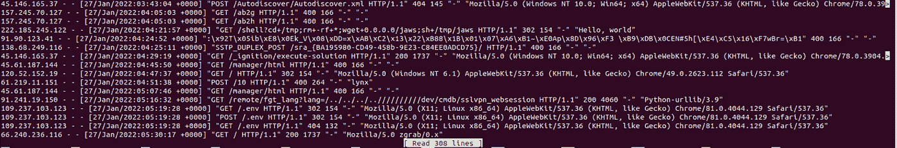

# Nginx 文件配置和日志(第 3 部分)

> 原文：<https://medium.com/javarevisited/nginx-file-configuration-and-logs-part-3-62e71ad1c3a0?source=collection_archive---------2----------------------->

[](https://www.java67.com/2020/07/top-5-courses-to-learn-linux-in-depth.html)

# 简介:

安装后，进入 nginx 目录/etc/nginx，我们可以看到 Nginx 文件，如 nginx.config 和网站可用文件和其他重要文件

每个文件都有一个角色和任务来使 Nginx 正确工作。

在这篇文章中，我将解释重要的文件，使正确的 Nginx 和处理所有的请求没有任何问题。

**Nginx 文章的所有部分:**

*   [Nginx Web 服务器介绍(第一部分)](/javarevisited/intro-to-nginx-web-server-part-1-bb590fad7035)
*   [安装 Nginx 并由命令管理(第二部分)](/javarevisited/installing-nginx-and-managed-by-command-part-2-b6b32b90b62d)
*   这是 Nginx 系列的第三部分
*   使用 Nginx(第 4 部分)对两个项目进行简单配置**即将推出**

# Nginx 文件:

*   如果我们通过 terminal /etc/nginx 转到这个路径，默认情况下我们可以看到以下文件

> *访问 nginx 目录。在* [*Linux 操作系统*](/javarevisited/6-best-websites-to-learn-linux-4861ac21bfdf)

```
root@ubuntu-16gb-hel1-1:/etc/nginx# cd /etc/nginx/
```

要查看 Nginx 目录中的所有文件，可以使用以下命令

```
root@ubuntu-16gb-hel1-1:/etc/nginx# ls
```

上述命令的输出:

> *你可以在这里看到所有的 nginx 文件。*

添加替代文本

[](https://javarevisited.blogspot.com/2021/06/5-websites-to-learn-linux-command-line.html)

我们将从 nginx.config 开始:

*   etc/nginx.config:

所有 Nginx 的主要配置都可以在这里找到，

我们可以在这个文件中编写自己的配置，并在这里设置 Nginx。

我们可以在这里编写 HTTP 块来定义我们在所有 Nginx 系统中配置。

> *在下一节将写我们的配置并谈论 Nginx 配置中的每个块*

*   /etc/nginx/sites-可用/

在这里，我们可以将站点域和服务器块的配置写入特定的应用程序，当重新加载 Nginx 时，nginx.config 将读取 etc/sites-available/ folder 中的所有文件。

但是要启用这个特性，您必须在 nginx.config 中编写以下配置

nginx 默认情况下会在启用了站点的站点中创建相同的文件名。

```
include /etc/nginx/sites-enabled/fileName;
```

*   etc/nginx/sites-启用/

创建新目录时，您必须通过站点启用与配置文件链接

您必须链接站点可用/启用站点/因为/nginx.config 需要链接/站点启用/来启用您的配置

*   /etc/nginx/snippets

如果我们在服务之间有任何重复的配置，我们可以包含在这个文件中，并与其他配置文件共享。

好了，现在我们知道在哪里可以进行配置，但是在哪里可以看到我的日志

> *当安装 nginx 时会在/var/log/nginx 中创建文件*

在这个目录中，我们可以找到 Nginx 服务的所有日志。

好的，让我们转到上面的目录，看看日志提供了什么服务

要转到上述目录，您可以使用以下命令:

```
cd /var/log/nginx/
```

要查看/var/log/nginx 中的所有文件，请编写以下命令:

```
ls
```

之后，您可以在输出中看到这个文件。

添加替代文本

[](https://www.java67.com/2018/02/5-free-linux-unix-courses-for-programmers-learn-online.html)

我将在本文的日志部分解释两个重要的文件。

*   /var/log/nginx/access.log

收到的每个对 Nginx 的请求都会记录在这个文件中，如下图所示。

添加替代文本

[](https://javarevisited.blogspot.com/2021/06/5-websites-to-learn-linux-command-line.html)

> 我们可以从配置文件中修改这个文件。

*   /var/log/nginx/error.log

每个 Nginx 错误都会记录在这里，如下图所示。

添加替代文本


> *我只有一个错误:)*

# 结论:

在这篇文章中，我们现在知道了 Nginx 中的文件作业是什么，以及在 Nginx 系统中我们需要每个文件的位置。

现在我们知道在哪里可以找到系统中每个请求的日志，也知道在哪里可以定义我们的配置。

Nginx 易于使用，我将在下一篇文章中解释配置

**Nginx 文章的所有部分:**

*   [Nginx Web 服务器介绍(第一部分)](/javarevisited/intro-to-nginx-web-server-part-1-bb590fad7035)
*   [安装 Nginx 并通过命令进行管理(第二部分)](/javarevisited/installing-nginx-and-managed-by-command-part-2-b6b32b90b62d)
*   这是 Nginx 系列的第三部分
*   使用 Nginx(第 4 部分)**对两个项目进行简单配置**

> **别忘了在文章上拍手，每篇文章可以拍手 50 次。**

# 参考资料:

*   [https://kinsta.com/knowledgebase/what-is-nginx/](https://kinsta.com/knowledgebase/what-is-nginx/)
*   [https://medium . com/devopscorry/what-is nginx-understanding-the-basics-of-nginx-in-2021-f8e E0 F3 D3 d 54](/devopscurry/what-is-nginx-understanding-the-basics-of-nginx-in-2021-f8ee0f3d3d54)
*   [https://www . digital ocean . com/community/tutorials/how-to-install-nginx-on-Ubuntu-20-04](https://www.digitalocean.com/community/tutorials/how-to-install-nginx-on-ubuntu-20-04)