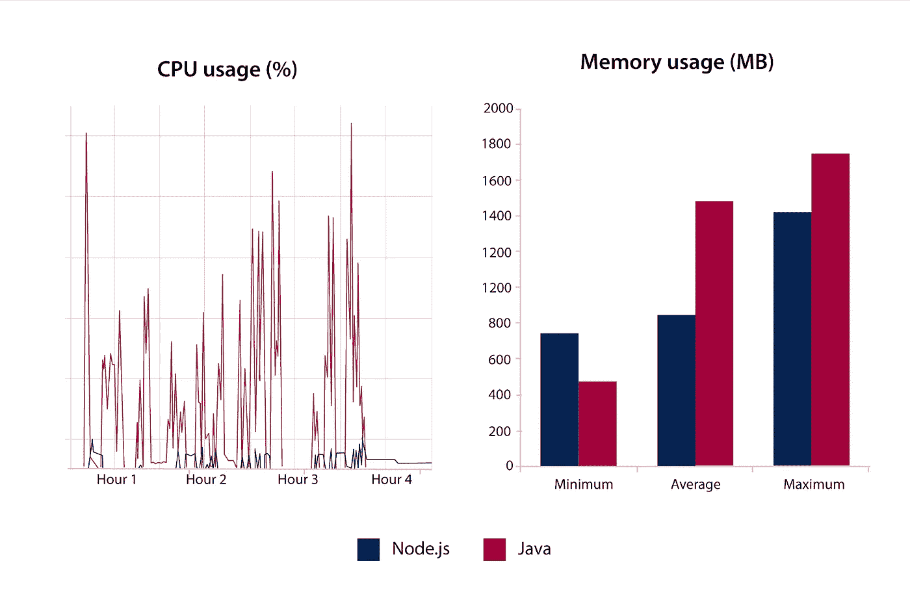
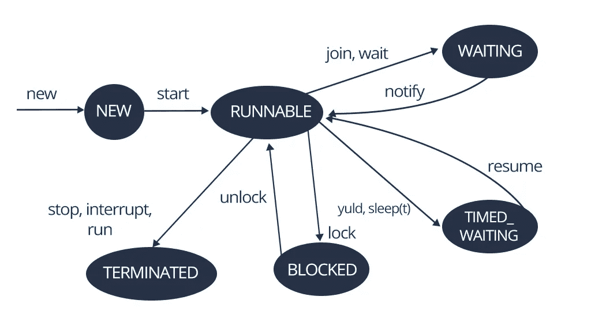
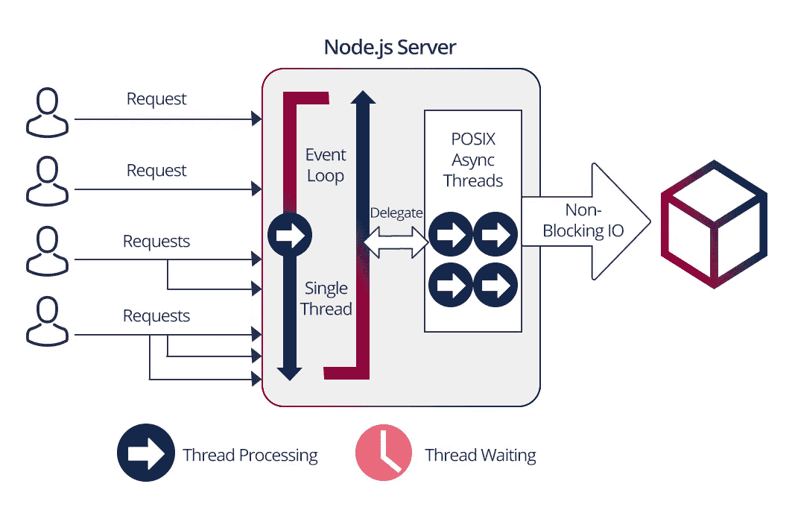

# Node.js vs Java:为什么要比较？

> 原文：<https://medium.com/javarevisited/node-js-vs-java-why-compare-b3e19b11cd55?source=collection_archive---------0----------------------->

最近，我和我的同事讨论了两种技术的流行，特别是 Java 和 node.js。在一次简短的网上冲浪会议后，发现这些技术被许多信息巨头用来开发和维护他们的平台。下面，我只提其中的几个。

*使用 Java 的公司:*

*使用 node.js 的公司:*

一个更有趣的事实是，据 indeed.com(2019 年 6 月 28 日)称，Java 开发人员(30272 个职位)和 node.js 开发人员(7401 个职位)非常抢手。

# 为什么要比较它们

Java 是一种语言，而 node.js 可以称为是建立在 js 基础上的生态系统，最重要的是，建立在 Google 的 [V8](https://nodejs.dev/the-v8-javascript-engine) 引擎的基础上。

然而，当我们谈论 Java 时，我们谈论的不仅仅是语言，而是 Java 虚拟机(JVM)，以及围绕这台机器构建的整个生态系统和基础设施。这是我们可以比较它们的第一个原因。

结果，**在这两种情况下，我们都有了执行环境。对于 Java 来说，它是一个虚拟机**。在 node.js 的例子中，这是大多数操作系统上的 V8 引擎，比如 Windows、Linux、MacOS 和那些不太知名的操作系统。开发人员可以使用相同的语言编写代码，由于存在运行时环境，这将在不同的操作系统上以或多或少相同的方式工作。执行环境会影响它与操作系统的交互方式。此外，它们可以进行比较，因为它们用于**解决类似范围的任务**。

# V8 和 JVM

当 JS 代码进入 V8 时，由于在虚拟机中使用的[即时](https://en.wikipedia.org/wiki/Just-in-time_compilation) (JIT)编译，它被编译成字节代码，因此 JS 代码运行得更快。

字节码是一种中级的高级语言，所以在 JVM 中，他们不仅用 Java 写，还用 Scala 和 Kotlin 写。

有一些先决条件，在不久的将来，V8 不仅可以使用 JS，还可以使用 TypeScript 或其他。目前，这些语言在 JS 中的转换正在进行。从技术的角度来看，它们可能会得到开箱即用的支持，并且一切都将运行得更快。

现在，当 V8 不断发展的时候，新 node.js 版本的出现是和 V8 引擎新版本的出现联系在一起的。它们是直接相关的。

# node.js 的利与弊

Node.js 由 Ryan Dahl 于 2009 年创建。

node.js 本身包括几个关键组件:

*   V8 发动机；
*   [libuv](https://libuv.org/) 库，负责节点的核心部分——事件循环，与操作系统交互，以及异步 I/O；
*   一组不同的 JS 库和 JS 语言本身。

现在让我们来看看 node.js 的利弊。

**优点:**

*   代码编写的简易性和速度；
*   轻盈；
*   简单性(与 Java 相比)；
*   [节点包管理器](https://www.npmjs.com/)(一行可以安装的海量库)；
*   每个库都属于一个依赖树，这一切都很容易完成；
*   不断开发(TypeScript 正在积极开发中，它将类型引入到 JS、decorators 中，并用于例如 Angular)。

**缺点:**

*   灵活性和快速开发也造成弊端，由于需要不断监控更新，有些东西测试不够；
*   有一个[案例](https://blog.npmjs.org/post/141577284765/kik-left-pad-and-npm)，一个开发者从 NPM 删除了他的库，许多使用它的应用程序停止了工作；

# Java 的利与弊

相比之下，我们来考虑一下 Java 的主要特点。

**优点:**

*   速度；
*   流行程度(很多国家的大学都教 Java
*   一大堆图书馆。

**缺点:**

*   沉重；
*   一些 Java 范例是很久以前创建的，已经过时了；
*   JDK 是专有的，所以 Java 发展缓慢。

最近 JS 开始赶超 Java 了。Java 也正在离开 Android 世界:它正在被 Kotlin 取代，尽管使用 JVM，但它仍然是一种不同的语言。

# 甲骨文和谷歌的冲突

*来源:*[*giphy.com*](http://giphy.com/)

Java 是由[孙](https://www.oracle.com/technetwork/java/javase/overview/javahistory-index-198355.html)创造的，后来被甲骨文收购。由于这个原因，对于许多公司来说，Java 的使用会引起一些问题。

当甲骨文开始在 Android 上使用 Java 的试验时，谷歌遇到了问题。正因为如此，谷歌非常积极地采用了独立出现的 Kotlin。

Java 是专有的。但是有一个 Oracle 虚拟机，还有一个开放的 Java 虚拟机(open JVM)，用的是 Linux，开源写的。有时会有一些不兼容的地方，但是最近这些已经少了。

顺便说一句，谷歌不可能完全放弃 Java。在 Android 中作为核心的 [Dalvik](https://www.javatpoint.com/dalvik-virtual-machine) 中，利用了 JVM。也许有一天他们会改变这一点，但这将是非常困难的，因为整个 Android 生态系统都是建立在 Java 上的，特别是在升级的 JVM 上。在某种程度上，这也是甲骨文和谷歌之间冲突的原因，因为甲骨文禁止 JVM 的现代化。这是 Java 最重要的部分。然而，语言本身可以不受限制地使用。

# Java 与 node.js:性能和资源密集度

首先，需要注意的是，Java 的性能要比 JS 高得多，相应地，node.js 也是如此。

*node . js 和 Java 的性能*

如果你运行一个简单的任务，比如平方，那么在测试中指标可能相差 10 倍。如果在数百万的计算任务中运行循环，Java 几乎总是会超过 node.js。

另外，Java 和 node.js 的巨大区别是 node 是单线程的，这可能是它的优点，也是它的缺点。

Java 可以与操作系统级支持的线程一起工作，事实证明，用 Java 编写的程序可以充分利用操作系统的特性。如果你需要编写一个高负载的应用程序，它将使用大量的计算，那么 Java 肯定会更好地解决这个问题。

问题是，即使是用 Java 编写的小型服务器也会占用大量内存——包括磁盘内存和运行内存。

Node.js 是轻量级的，因为它基于事件的架构。它是作为 web 服务器而构建的，可以很好地处理轻量级任务。例如，一个简单的查询，如计算或写入数据库，发生得非常快。如果有很多请求，我们想将系统扩展成一个节点，可以使用 Nginx 或 Apache web 服务器。您可以拥有许多相同的节点实例。然后一切将通过负载均衡在[循环](https://www.nginx.com/resources/glossary/round-robin-load-balancing/)上分配。如果我们分别在 16 个内核上运行 8 个节点实例，操作系统本身将在内核之间分配实例。节点不控制这一点，它将有一个线程。

# Java 和 node.js 中的线程控制

在 Java 中，我们可以创建一个应用程序并在其中运行 8 个线程。由于与操作系统有更紧密的交互，您可以分散负载。

用 Java 编写的著名 web 服务器之一是 [tomcat](http://tomcat.apache.org/) 。您可以清楚地看到，当用户发出请求时，会启动额外的线程。当对一个节点的请求到达时，事件循环将被处理并发送回，然后下一个请求将出现。而且，由于我们没有等待第一个结果，它也将被拾起。如果请求是轻量级的，一切都很好。但是，当执行繁重的计算时，即使只有一个实例，节点也会停止，并发生超时。

*Java 中的线程控制*

在 node 中，您可以编写几行代码，得到一个简单的 web 服务器。当然，对于更广泛的功能，将会有通知、授权、记录等等。实现起来更加困难，但是有一些框架允许您解决这样的问题。

*node . js 中的线程控制*

Java 有一个开发好的 API — [并发 api](https://docs.oracle.com/javase/8/docs/api/index.html?java/util/concurrent/package-summary.html) ，它允许你使用竞争流。但与此同时，并发性的一个问题是，这是一件非常困难的事情，不是每个开发人员都能够很好地理解并能够实现。

Web， [REST API](https://restfulapi.net/) 是节点的东西，有时候就是用来做那个的。但是如果我们要处理复杂的计算，还是用 Java 比较好。

# 我的 Java 项目

我有一个有趣的 Java 项目——一个分布式应用程序，其中的关键任务是处理大量的图形信息，以便在目录中进一步使用。创建目录时，需要准备大量不同分辨率的图像集，以便在创建目录时使用。简而言之，这是一个自动化印前目录准备的应用程序。

以前，摄影师必须手动完成所有工作。一开始，需要使用一些小应用程序来上传所有的图像。接下来，创建目录的专家必须使用另一个应用程序开发目录结构。然后，在另一个应用程序中，他们应该创建一个工作流，将图片分散到预先创建的结构中。总的来说，这个过程相当困难。[使用了适用于 Linux、Windows 和 MacOS 的 ImageMagick](https://imagemagick.org/index.php) 。我们与 Linux 合作。

例如，一个大小为 200–300 MB 的. tiff 图像被加载到应用程序中；有必要制作各种分辨率的图片，剪下一些东西，或者制作一个背景。

该应用程序的第一个版本无法处理大负载；即使是配备 16 核处理器的服务器也是不够的。为了不从根本上改变应用程序的操作，我们改进了应用程序的架构，以便同时使用几个实例。许多实例启动并相互交互，每个实例处理一部分任务。这很困难，但我们设法在几个月内成功地实现了一切。而且这个系统还在工作。这一进程必须处理竞争力和互动的各个方面。

这个项目中的一些事情仍然可以在 node 中完成，但是一些事情仍然必须在 Java 中完成，因为有许多不同的计算。基本上，我们可以在 node 中创建一些部件，这些部件可以调用 Java 上的某些部件，并使用其微服务架构。我们可以使用混合版本。但是这种方法并不总是有效的，因为专门研究 node 的开发人员可能不是 Java 专家，反之亦然。找到多才多艺的开发人员要困难得多。

# 根据 node.js 的经验

有一个组织大量数据的项目。类似于上面描述的项目。但是这里我们有一个上传的文件，它包含了大量的信息，这些信息需要通过第三方服务(用 Java 编写)进行多次验证，并且根据不同的规则进行验证。它需要处理数百千兆字节的信息，而 node 并不打算这样做。

设计系统架构特别有趣，因为应用程序由几个微服务组成，包括第三方服务。当与执行验证的第三方服务合作时，我们使用了 [RabbitMQ 消息代理](https://www.rabbitmq.com/tutorials/tutorial-one-python.html)。我们向第三方服务器提供了必要的信息，并在验证结束时收到来自 RabbitMQ 的消息，然后对数据进行分段处理，以避免出现内存不足的错误。

如果应用程序最初处理一个包含 10，000 个条目的文件，现在它可以处理多达一百万个条目。在 node.js 的帮助下，我们仍然设法解决了这个问题，尽管在 Java 中，这个问题本来可以更简单地解决。客户坚持使用 node.js，因为他们需要用 js 编写的微服务的单一基础设施和架构。使用 node 来解决这个问题要困难得多，也要花费更多的时间，但是 node.js 由于其可伸缩性而胜出。这就是为什么现在我们可以增加工作人员的数量，处理越来越多的数据。在 Java 中，这要复杂得多。

事实上，任何问题都可以通过两种方式解决，但正如我之前所说，如果有大量的计算，那么最好使用 Java，如果没有，那么使用 node。

# 成果与展望:node.js 能否超越 java？

现在有一种趋势，node.js 将经常被用作“包装器”，而“填充物”将用其他语言编写。它的缺点已经很明显了。例如，单线程这样的条件缺陷已经被修复。node 的最新版本提供了使用多线程的能力。

Java 最初是作为替代 C++的轻量级解决方案而创建的，现在已经成为重量级解决方案。这就像一种进化。也许有一天会有某种东西取代 node.js。

**—Java vs node . js 的开发**

*目前，根据请求数量，以及我自己的感觉，node.js 已经超过 Java 了。JS 正在积极开发，并将继续这样做。但是，目前还没有潜在的竞争者可以取代 Java 或 node.js。*

*问题是最近 Java 发展相当缓慢，node.js 的发展速度如此之快，以至于在最近的将来它不可能被取代。*

*你在工作中使用哪种技术？在评论中分享你的想法，有趣的项目和问题。*