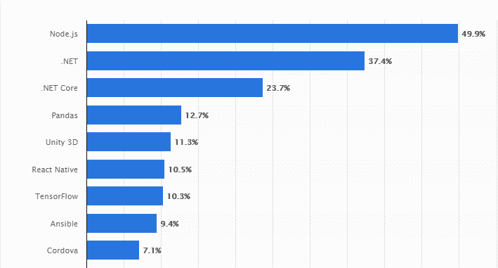
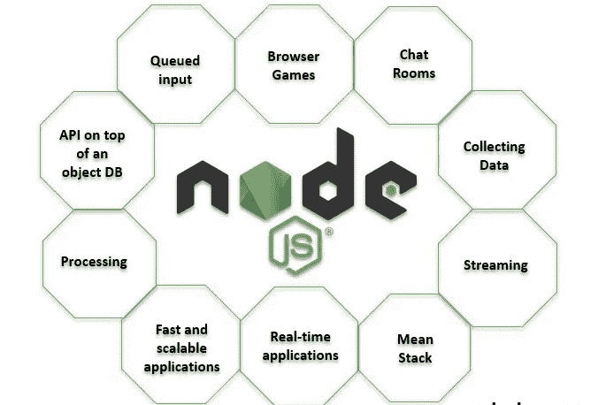

# nodejs vs . Go——哪一个才是你的正确选择？

> 原文：<https://medium.com/javarevisited/nodejs-vs-go-which-one-is-the-right-choice-for-you-7e085a720f7e?source=collection_archive---------1----------------------->

[来源](https://www.esparkinfo.com/node-js-vs-golang.html)

你已经决定开始创建你自己的应用程序的旅程，那太好了！但是一个问题马上产生了，你应该使用哪种编程语言？是[节点 JS](/javarevisited/top-10-online-courses-to-learn-node-js-in-depth-8ef0e31ca139) 还是[围棋](/@javinpaul/what-is-go-or-golang-programming-language-why-learn-go-in-2020-1cbf0afc71db)？他们相似吗？它们有什么不同？

毫无疑问,[应用程序开发的世界](https://www.valuecoders.com/application-development)正以令人难以置信的速度前进，这两种语言在过去的几年里达到了一个新的高度。

它们已经在互联网上一些最著名的网站和应用程序中使用，包括网飞、贝宝和沃尔玛。

两者都是开源的，都是跨平台的，并且都可以使用事件驱动的架构来创建服务器端应用程序。

此外，在构建 API 和 web 应用程序时，它们非常受欢迎。然而，它们有一些不同的用例、优点和缺点。

根据最近的[报告](https://www.esparkinfo.com/node-js-development-trends.html)，到 2021 年，大约 50%的开发者集成 Node.js 技术来开发[高效的网络应用](https://www.valuecoders.com/blog/technology-and-apps/top-10-web-application-ideas-for-successful-online-business/?utm_source=webblog&utm_medium=S05&utm_id=govsnodejs)。

[来源](https://www.esparkinfo.com/node-js-development-trends.html)

通过这篇博文，我们将帮助你决定哪种语言最适合你。我们将从特性、开发过程、性能等方面比较 Node JS 和 Go。

通过这种方式，您将能够自己决定哪一个适合您的软件开发需求。

所以，事不宜迟，我们行动吧！

# 什么是 Node JS？

[Node JS](/javarevisited/7-free-courses-to-learn-node-js-in-2020-2f1dd6722b49) 是一个开发高效 web 应用的运行时环境。它用于构建服务器端应用程序，也可用于前端开发。

Node JS 使用事件驱动的非阻塞 I/O 模型，这使它变得轻量级和高效。它在聊天、游戏和流媒体等实时应用中很受欢迎。而且，它是开源的，可以免费使用。

Node JS 有一个庞大而活跃的社区，它创建模块和工具来简化 Node JS 的开发。也有许多公司在生产中使用 Node JS，包括 LinkedIn、沃尔玛和网飞。

# 为什么要用 Node JS？

[来源](https://www.educba.com/uses-of-node-dot-js/)

Node.js 近年来变得非常流行，这是有原因的。以下是您必须使用 Node.js 来构建动态应用程序的一些重要原因。

*   Node.js 非常适合开发可伸缩的网络应用程序。
*   Node.js 简单易学，使用起来也很有趣。
*   Node.js 有一个很大的开发者社区，他们总是愿意提供帮助。
*   Node.js 是开源的，完全免费使用。
*   Node.js 运行在 Windows、 [Mac](https://javarevisited.blogspot.com/2022/02/top-5-macos-courses-for-beginners-in.html) 和 [Linux](/javarevisited/6-best-websites-to-learn-linux-4861ac21bfdf) 上。

# Golang 是什么？

Golang 是谷歌开发的一种令人惊叹的编程语言，强调并发显式错误处理，并具有一流的功能。

它为开发人员提供了带有垃圾收集、运行时类型断言和并发原语的静态类型的编译代码。

Golang 在 web 开发和系统编程方面越来越受欢迎。

它是由罗伯特·格里斯默、罗布·派克和肯·汤普森创建的。它于 2009 年 11 月发布，第一个稳定版本于 2012 年 3 月发布。Golang 是在 Apache 2 许可下发布的开源软件。

此外，许多公司和组织都在使用 Golang，包括谷歌、脸书、网飞、Dropbox 和 Heroku。

# 为什么要用 Golang？

[来源](https://www.miquido.com/blog/golang-vs-java/)

您可能想使用 Golang 的原因有很多，但这里有一些最有说服力的原因:

*   Golang 是一种编译语言，因此它可以快速高效地生成代码。
*   它有一个简单的语法，很容易学习。
*   Golang 是静态类型的，这意味着您不必担心运行时错误。
*   Golang 拥有全面的标准库，可以轻松构建强大的应用程序。
*   它是一种并发语言，这意味着您可以编写利用多核处理器的代码。
*   Golang 是开源的，由一个庞大的开发者社区提供支持。

# Node.js vs. Golang:激战

# Node.js 与 Go:性能

当谈到 node.js 与 Go 的性能时，Node.js 比 Golang 快已经不是什么秘密了。然而，Node.js 与 Go 语言之间的性能差异并不像人们想象的那样明显。

Redmonk 进行的基准测试发现，node.js 在启动时间方面比 Golang 快 12%，在执行时间方面比 Golang 快 20%。虽然这些差异很大，但并非不可逾越。

就整体性能而言，Golang 在某些场景下实际上能够胜过 node.js。例如，Golang 可以处理比 node.js 更多的并发连接，而不会对性能产生任何负面影响。

此外，在某些情况下，Golang 能够比 node.js 更快地执行任务。你也可以[雇佣 Golang 开发者](https://www.valuecoders.com/hire-developers/hire-golang-web-developers?utm_source=guest-nodejsvsgo&utm_medium=S05)来创建高效的应用程序。

总的来说， [Golang](https://javarevisited.blogspot.com/2021/11/top-5-golang-courses-for-beginners-to.html) 对于需要高性能的项目来说是一个很好的选择，而 node.js 对于需要快速启动时间的 app 开发项目来说是一个极好的选择。

# Node.js 与 Go:可伸缩性

Node.js 是需要快速伸缩的应用程序的绝佳选择。由于其事件驱动的非阻塞 I/O 模型，Node.js 可以处理大量请求，而不会使系统陷入瘫痪。此外，npm 庞大的模块库使得根据需要向应用程序添加功能变得容易。

在 Node Js vs. Go 中，对于需要快速伸缩的应用，Go 也是不错的选择。Go 对简单性和可伸缩性的关注使其成为大规模企业应用程序的绝佳选择。

此外，Go 编译器生成高效的代码，使其适合在低功耗设备上运行。您也可以联系 Golang web 开发服务提供商来为您构建应用程序。

# Node.js 与 Go:易用性

当比较 Node.js 和 Go 时，Node.js 通常被认为是更加用户友好的。Node.js 的事件驱动、非阻塞 I/O 模型使得构建快速和可伸缩的应用程序变得容易。

此外，npm 存储库中的大量模块使您可以轻松找到应用程序所需的功能。

Go 不像 Node.js 那样用户友好，Go 的语法比 Node.js 更加冗长复杂，学习和使用起来更加困难。然而，一旦你掌握了过去的学习曲线，Go 就是一种强大的、富有表现力的编程语言，非常适合大规模的企业应用程序。

# Node.js 与 Go:错误处理

Node.js 有着不如 Go 稳定的名声。这是因为 Node.js 使用异步编程模型，这使得错误处理更加困难。但是，有许多工具和库可以帮助您管理 Node.js 应用程序中的错误。

当比较 Node.js 和 Go 时，Go 也有更稳定的名声。这是因为 Go 是一种编译语言，这使得它不容易受到运行时环境和软件库引入的错误的影响。

此外，Go 对简单性的关注使得编写不易出错的代码变得更加容易。

# Node.js 与 Go:简单性

Node.js 一般被认为比 Go 复杂。这部分是由于 Node.js 使用异步编程模型，这使得代码更难阅读和理解。

此外，npm 存储库中的大量模块会使您很难找到应用程序所需的功能。

Go 一般被认为没有 Node.js 复杂，Go 的语法比 Node.js 更冗长简洁，更容易学习和使用。此外，对简单性的关注使得编写不易出错的代码变得更加容易。

# Node.js 与 Go:安全性

Node.js 一般被认为比 Go 更安全。这是因为 Node.js 使用沙盒环境，这有助于防止恶意代码在您的系统上运行。

此外，npm 存储库中的大量模块使得查找和使用与安全相关的模块变得非常容易。

Go 也被认为比 Node.js 更安全，这部分是因为 Go 是一种编译语言，这使得攻击者对你的代码进行逆向工程更具挑战性。

此外，对简单性的关注使得编写不易受安全漏洞影响的代码变得更加容易。你也可以通过雇佣网络开发公司来利用网络开发服务。

# Node.js 与 Go:工具和库

Node.js 有一个庞大的工具和库生态系统。npm 的存储库包含超过 300，000 个模块，可以轻松找到您的应用程序所需的功能。

此外，Node.js 社区很大，也很活跃，在需要时很容易获得帮助和支持。

Go 也有大量的工具和库可用。Go 社区也很大，很活跃，在需要的时候很容易找到帮助和支持。然而，由于该语言对简单性的关注，Go 的存储库中的模块数量比 Node.js 少。

Node.js 的一个显著优点是它使用单线程进行事件循环。这意味着 Node.js 可以轻松处理多个并发请求。事实上，Node.js 能够处理的并发请求几乎是 Go 的两倍！

另一方面，Go 使用 goroutines 实现并发。Goroutines 是轻量级线程，可用于同时运行多个任务。Go 的 goroutine 调度器能够在一个线程上高效地调度数千个 go routine！

# Node.js vs. Go:社区

Node.js 有一个庞大而繁荣的社区。Node.js 生态系统非常庞大，在 npm 上有超过 300，000 个可用的包。您还可以获得大量在线资源来帮助您开始 Node.js 开发。

围棋团体规模较小，但发展迅速。Go 生态系统的可用软件包不到 50，000 个，但这个数字正在快速增长。然而，有几个在线资源可以帮助你开始开发 Go。

# Node.js 与 Go:熟练专业人员的可用性

在寻找有技能的专业人士方面，Node.js 拥有优势。这是因为 Node.js 存在的时间更长，比 Go 更受欢迎。Node.js 有大量技术熟练的专业人员可供雇佣。

而且网上有数百个 [Node.js 课程](/javarevisited/top-10-online-courses-to-learn-node-js-in-depth-8ef0e31ca139)和教程，让你轻松学习这门编程语言的基础知识。

围棋社区仍然相对较小，因此找到熟练的专业人士可能很难。然而，网上提供的[围棋课程和教程](/javarevisited/7-online-courses-to-learn-golang-or-go-programming-languages-in-2020-f599a25cf14a)的数量正在迅速增加。

# 使用 Node.js 的公司

# 网飞:

网飞将 Node.js 用于其面向客户的网站和网络应用。

# LinkedIn:

LinkedIn 也在其许多网络应用程序中使用 Node.js。

# PayPal:

Paypal 在其几个核心产品中使用 Node.js，如 PayPal 移动应用程序和 Venmo 应用程序。

# 易贝:

易贝在它的几个网络应用中使用 Node.js，包括易贝搜索引擎和易贝市场。

# 中等:

Medium 使用 Node.js 作为其博客平台。

# 沃尔玛:

沃尔玛在其电子商务平台中使用 Node.js。

# 使用 Go 的公司

# 谷歌:

谷歌的许多内部应用都使用 Go，比如谷歌搜索引擎和 YouTube。

# 脸书:

脸书的大量后台服务都使用 Go。

# Dropbox:

Dropbox 在其几个核心产品中使用 Go，比如 Dropbox 文件系统和 Dropbox 同步客户端。

# 优步:

优步将 Go 用于其实时旅行地图服务。

# 每日运动:

Dailymotion 的视频流媒体服务使用 Go。

# 声音云:

SoundCloud 的几项微服务都使用 Go。

# 最后一击

Node.js 和 Go 都是流行的编程语言，为开发人员提供了独特的优势。Node 非常快，提供了大量的模块，而 Go 拥有优秀的[并发能力](/javarevisited/7-best-scala-frameworks-for-concurrency-web-development-and-big-data-to-learn-fbd52dbe0a9a)，可用模块较少。

如果你正在考虑下一个项目使用哪种语言，考虑你的应用程序的需求，然后在做决定之前权衡每种语言的利弊。

此外，这两个平台之间的关键区别在于它们的社区:Node.js 的社区更大，而 Go 的社区更小，但与 Node js 相比，它的社区增长迅速，在线资源更多。

最终的选择归结于你需要你的平台做什么:如果你关注并发性，那么 Go 可能最适合你的需求。

但是，如果您希望访问尽可能多的模块和库，那么节点可能更符合您的需求。

仅此而已！