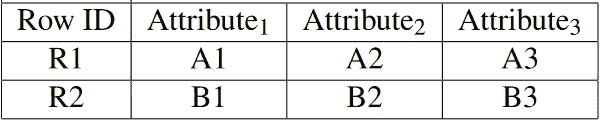
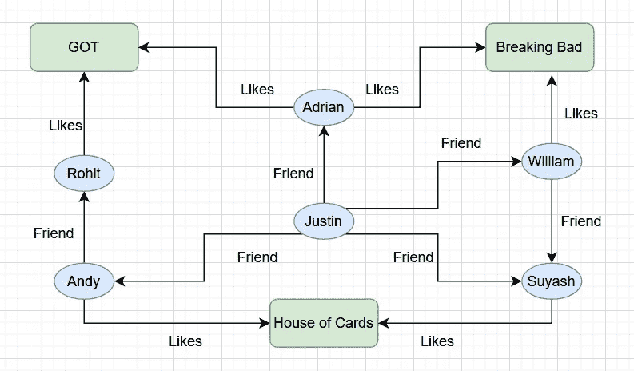

# NoSQL 数据库

> 原文：<https://medium.com/javarevisited/nosql-databases-4314fcc2a2a7?source=collection_archive---------2----------------------->

## NoSQL 数据库有哪些类型？

弗兰基·查马基在 [Unsplash](https://unsplash.com?utm_source=medium&utm_medium=referral) 上拍摄的照片

在 NoSQL 空间中，有四大类数据模型:

*   键值
*   文档，
*   柱族
*   图表

前三个数据模型(即键值、文档、列族)共有的共同特征称为聚合方向。

## 面向集合的数据库

与关系数据库不同，面向聚合的数据库不支持扩展到多个聚合的 ACID 事务。相反，它们允许单个聚合级别的原子性。应用程序需要处理跨聚合的任何原子操作。让我们更深入地研究每个面向聚合的数据库及其结构。

## 键值数据模型

键值数据存储可以理解为一个巨大的哈希表，可以使用一个键和一个有效的哈希函数进行查询。该功能允许键值数据存储在大型集群上以高度可伸缩的方式执行数据查找和操作。但是，对于基于聚合值的查询非常重要的情况，键值存储并没有进行优化。键值存储非常适合数据存储的一些用例有:

*   Web 会话
*   用户配置文件
*   购物车

然而，在少数情况下，这样的数据存储不是最合适的。例如，跨越多个键的事务，在数据存储中具有相关的键，并使用键-值对的值部分进行查询。键值数据存储的例子包括 Amazon DynamoDB、
Riak 等等。

## 文档数据模型

文档数据模型将文档(命名字段和数据的集合)存储为集合，概念上类似于键值存储。然而，文档数据库公开了它们的集合，使得应用程序能够通过使用这些字段中的值来查询和过滤数据。使用文档数据库，我们可以根据集合中的字段向数据库提交查询，我们可以检索集合的一部分，而不是全部。与 RDMS 不同的是，在该数据模型中，关系中的每个元组必须遵循相同的模式文档，它们可以属于相同的集合，但却具有不同的模式。此类数据存储适用于以下用例:

*   电子商务应用中的订单
*   用于实时分析的 Web 应用程序访问者
*   管理文档
*   博客平台中的个人资料

与键值数据存储类似，跨文档的事务和查询不太适合这种数据存储。基于文档的数据库的 get 和 put 类似于基于键值的数据库。然而，与基于键值的数据库不同，我们只能更新文档的一部分。一些流行的文档数据库有 MongoDB、Amazon DocumentDB 和 Couchbase。

## 键值和文档数据存储之间的选择

数据和应用程序需求可以用来在键值数据库和文档数据库之间进行权衡。键值数据库和文档数据库都是许多数据库应用程序的绝佳选择。如果查询模式和数据结构相对简单，并且需要获取整个集合，那么键值数据库是正确的选择。随着查询和实体复杂性的增加，文档数据库成为更好的选择，尽管键值和文档数据存储之间的界限很窄。

## 柱状数据模型

与其他通过对行进行序列化来存储数据的数据库不同，列数据库通过对列进行序列化来存储数据。让我们通过下表中的一个例子来进一步理解它。

表格格式的样本数据集

如果行上的数据是序列化的，那么一行中的所有列将一起存储在磁盘上，磁盘上的结构可能类似于:**【A1，A2，A3】| R2，[B1，B2，B3]** 。然而，在列数据库的情况下，数据是通过将多行的
列保存在一起来存储的，磁盘上的结构可能是这样的: **[(R1，A1)，(R2，B1)]，[(R1，A2)，(R2，B2)]，[(R1，A3)，(R2，B3)]**

柱状数据存储的一个很好的例子是 Amazon Redshift，这是一个针对海量数据的数据分析而优化的
云托管数据仓库解决方案。

## 图形数据模型

关系数据库使用外键来存储使用外键的数据实体之间的关系。然而，关系数据库的局限性在于连接是在查询时计算的，因此它不能有效地扩展到通常超过两层的关系之外。

随着社交网络的出现，出现了对可以存储更复杂关系的数据模型的需求，社交网络在图形数据库的普及中发挥了至关重要的作用。为了从高度相关的数据中保存和检索重要的关系，基于图的数据模型将数据实体保存为节点，将这些实体之间的关系保存为边。遍历实体间存储的关系使得
关系链接的遍历比在关系数据库中查询时计算要便宜得多。

这种基于图的数据库在社交网络应用、基于位置的服务或任何需要存储复杂关系的应用中是有用的。然而，这种数据库在分析解决方案中表现不佳，在分析解决方案中，更新应用于所有节点的属性。数据查找性能取决于一个节点对另一个节点的访问。通过存储相邻节点的物理 RAM 地址和缓存直接相关节点的链接，可以增强这种性能。

在图数据模型中，数据实体和关系信息分别作为属性存储在节点和边中。对图结构的查询称为遍历，它通过将属性存储为索引来提高效率。假设所有节点都已经添加到名为 *nodeIndex* 的索引中，让我们通过评估图表数据模型上的几个图表查询来更深入地了解一下。

一个群体喜爱的电视剧的图形数据模型

疑问 1:贾斯汀的所有朋友。
在这里，我们将获取 justin 所有以边方向为方向的关系。外向，我们可以过滤类型为朋友的关系。

查询 2:找到所有喜欢《纸牌屋》的人，并且彼此是好友。

这里，我们将获取所有以边方向为方向的 houseOfCards 的关系。输入，我们可以过滤喜欢类型的关系。

在这一点上，我们可以应用样板逻辑来找到喜欢 GOT 和 House of Cards 并且彼此是朋友的人。

应用程序不再局限于单个数据库，而是可以根据数据存储需求灵活地使用不同的数据存储。例如，在一个电子商务平台中，我们可能为它的每个组件提供不同的微服务，并且每个微服务可能使用完全不同的数据存储，这取决于用例。

我们需要了解这些概念，以便在设计系统时选择合适的 NoSQL 数据库。我希望这篇文章阐明了 NoSQL 数据库的特点。我们将在未来涵盖更多的系统设计概念。敬请关注。快乐学习！