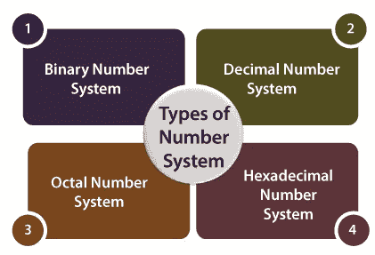

# Java 编程语言中的数字系统

> 原文：<https://medium.com/javarevisited/number-system-in-java-programming-language-486ef8774f79?source=collection_archive---------2----------------------->



Java 中的数字系统

java 编程语言中有四种类型的数字系统。

1.  二进制数系
2.  八进位数制
3.  十进数制
4.  十六进制数系统

**二进制数系统:**

*   在这个数字系统中，我们使用“0b”(2 为基数)作为前缀，将二进制转换为整数格式。

```
class Demo{
     public static void main(String[] args){
              int a=0b1010;
              System.out.println(a);
        }
}
```

*   上例的输出是 10。

**八进制数系统:**

*   在这个数字系统中，我们使用“0”(以 8 为基数)作为前缀，将八进制格式转换为整数格式。

```
class Demo{
     public static void main(String[] args){
              int a=033;
              System.out.println(a);
         }
}
```

*   上例的输出是 27。(不是 33)

**十进制数字系统:**

*   在这个数字系统中，它是一个正常的十进制数值(以 10 为基数)，我们称之为整数。
*   下面给出了例子。

```
class Demo{
     public static void main(String[] args){
              int a=123;
              System.out.println(a);
        }
}
```

*   输出是 123

**六进制数字系统:**

*   在这个数字系统中，我们使用“0x”(16 为基数)作为前缀，将十六进制格式转换为整数。
*   在下面的代码中，我们可以看到这个例子。

```
class Demo{
     public static void main(String[] args){
              int a=0xAB;
              System.out.println(a);
       }
}
```

*   上述程序的输出是 171。(A=10，B=11=> 16*A+1*B==171)。