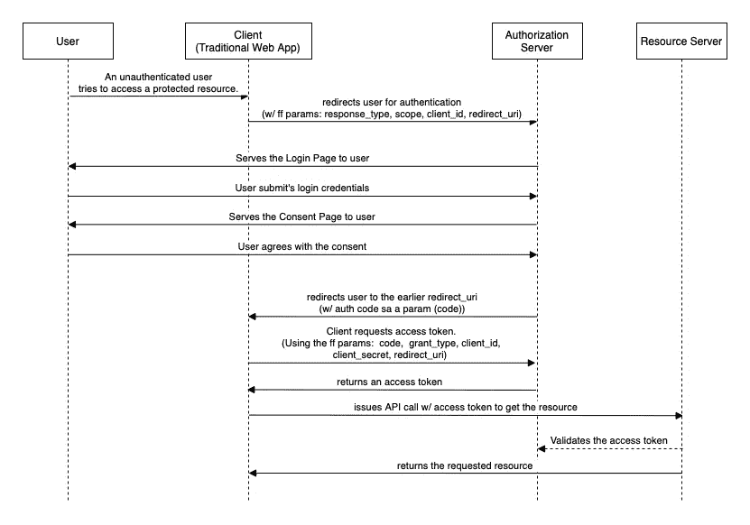
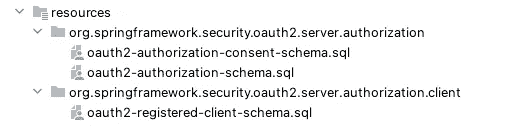
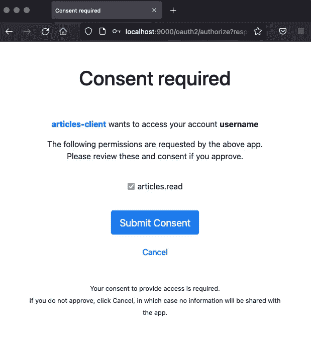
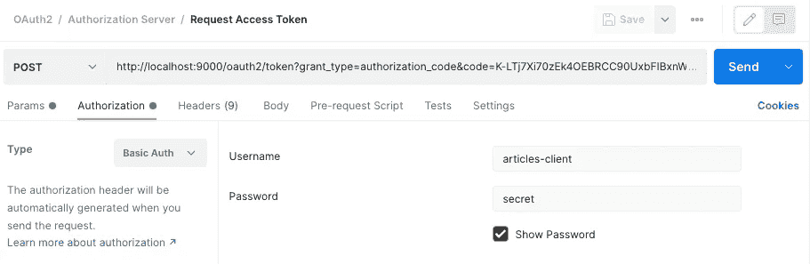
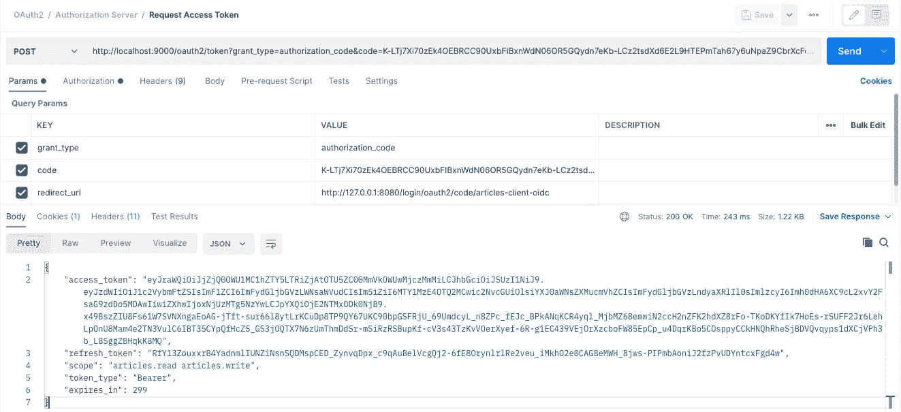
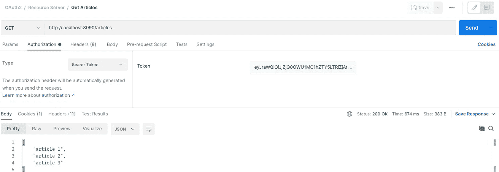

# OAuth 2.0:Spring Boot 的授权代码流

> 原文：<https://medium.com/javarevisited/oauth-2-0-authorization-code-flow-in-spring-boot-d8ff393f316d?source=collection_archive---------0----------------------->

学习什么，什么时候，如何。

## **简介**

在本教程中，我们将讨论以下内容:

*   授权代码流程是什么
*   当适合在其他 OAuth 流上使用时
*   如何在 [Spring Boot](/javarevisited/10-free-spring-boot-tutorials-and-courses-for-java-developers-53dfe084587e) 实现

上面，通过序列图，我们可以看到整个流程。我们边走边详细谈吧。

鉴于我们要讲的内容很多，让我们开始吧！

## **授权码流程是什么？**

> “OAuth 2.0 中的授权代码流是一个过程，其中客户端从授权服务器获取授权代码，然后使用该代码从令牌服务器获取访问令牌。”GPT 三号。

现在，让我们后退一步，比较现实世界中的对象流，以便更好地将其可视化:

想象一下走进一家酒店。我们作为`client`、**、**需要进入一个房间(`resource`)。然后，我们向前台申请钥匙。前台就像一个`authorization server`一样，可能会要求我们的身份证明(在这种情况下相当于身份验证)。

假设一切顺利，前台会交给我们一把钥匙(`access token`)。最后，现在我们可以进入房间(让我们希望并假设手边的钥匙是正确的)。

## 当适合在其他 OAuth 流上使用时

首先，让我们来看看一些流程(并非详尽无遗):

*   授权代码
*   授权码 w/ PKCE
*   资源所有者
*   客户端凭据

有了这些，让我们仔细看看我们的序列图。请注意，身份验证只发生在授权服务器中。另一方面，授权最多发生在客户端(传统/服务器端应用程序)和授权服务器之间，这使得访问令牌隐藏起来，用户无法访问。

因为这些，**授权代码流在默认情况下往往是最安全的**；然而，如前所述，只有当我们的客户端是传统/服务器端应用程序时，这才是合适的。

如果我们有客户端应用程序，如移动应用程序/spa/PWAs，最好使用授权码 w/ PKCE。接下来，相反，资源所有者流将身份验证和授权都委托给了客户端应用程序本身，而不是授权服务器，这使得它非常不安全——除非它是我们自己管理的内部应用程序。

最后，客户端凭证流用于服务之间的通信，不涉及用户——这意味着它也不适用于我们的情况。

## 如何在 Spring Boot 实施

首先，作为实现的准备，值得一提的是 Spring Authorization Server 项目在 2021 年 8 月 19 日的发布——因此， [Spring Security OAuth](/javarevisited/3-best-spring-security-books-and-resources-for-java-programmers-653d05c8afd4?source=user_profile---------1----------------------------) 项目被弃用了。

这样，让我们使用 spring-security-oauth 2-authorization-server 作为依赖项:

现在，让我们检查授权服务器的功能。方便的是，通过 [RFC-8414 — OAuth 2.0 授权服务器元数据](https://datatracker.ietf.org/doc/html/rfc8414)，我们可以得到 JSON 格式的这些信息:
`curl -X GET [http://localhost:9000/.well-known/oauth-authorization-server](http://localhost:9000/.well-known/oauth-authorization-server)`

(或者，我们也可以安装 jq 来美化 JSON 响应:
`curl -X GET [http://localhost:9000/.well-known/oauth-authorization-server](http://localhost:9000/.well-known/oauth-authorization-server) | jq .`)

从这个响应中，我们可以看到授权端点和令牌端点都是可用的。

接下来，我们必须找出需要具体实现的核心组件或接口。以下是官方入门视频指南:

这是一个伟大的演示。无论如何，这里是主要组成部分:

*   oauth 2 authorizationserver configuration
*   提供设置
*   JWKSource
*   注册客户资料库
*   OAuth2AuthorizationService
*   oauth 2 authorizationconsentservice

让我们首先创建一个 AuthorizationServerConfig。在这个配置上，让我们定义 SecurityFilterChain、ProviderSettings 和 JWKSource 的 beans:

为了简洁起见，我们省略了要点中的一些部分。无论如何，关于 authServerSecurityFilterChain 方法，为了简单起见，我们应用了默认的安全性；**但是，请注意，如果需要动态客户端注册，我们需要实现一个自定义的。**

接下来，对于剩余的存储库和服务，让我们通过定义以下 beans 来利用 spring-security-oauth 2-authorization-server 依赖项中可用的具体实现(而不是实现我们自己的实现):

上述 beans 将从令牌端点和授权端点执行必要的验证和持久性逻辑。

接下来，我们需要为数据库中的相应表提供模式。它位于依赖项的资源文件夹中:

最后，为了简单起见，让我们将其整理到一个 schema.sql 文件中:

## **演示**

首先，让我们运行授权服务器和资源服务器。(所有资料都可以在下面的 Github 链接上找到。)

现在，让我们用序列图作为参考。假设我们需要从资源服务器中检索文章列表。因为我们还没有通过认证，所以应该会重定向到授权服务器。让我们把这个 URL 粘贴到浏览器上来模拟:
`[http://localhost:9000/oauth2/authorize?response_type=code&scope=articles.read%20articles.write&client_id=articles-client&redirect_uri=http://127.0.0.1:8080/login/oauth2/code/articles-client-oidc](http://localhost:9000/oauth2/authorize?response_type=code&scope=articles.read%20articles.write&client_id=articles-client&redirect_uri=http://127.0.0.1:8080/login/oauth2/code/articles-client-oidc)`

既然授权服务器已经为登录页面提供了服务—让我们输入凭据。(如果你一直跟着，用户名是“*用户名”*，密码是“*密码”*):

这一次，授权服务器提供同意页面。另一方面，如果我们将注册的客户端设置设置为可选，我们可以跳过这一步。无论如何，现在让我们提交表单:

既然我们被重定向到了客户端应用程序的 URL——让我们检查一下参数。让我们模拟使用 postman 获取访问令牌，而不是构建客户端应用程序。

首先，对于授权，让我们使用基本的 Auth —并设置注册客户机的**用户名**和**密码**:

接下来，对于参数，我们有以下内容:

*   **授权类型**:授权代码
*   **redirect_uri** : <注册客户端配置的重定向 uri >
*   **代码** : <从之前的 URL 生成的授权代码>

最后，给定访问令牌，让我们尝试从资源服务器检索文章(再次使用 [postman](/javarevisited/7-best-courses-to-learn-postman-tool-for-web-service-and-api-testing-f225c138fa5a) ):

就是这样！

## **结论**

使用 Spring 授权服务器作为依赖项，我们已经推出了一个授权服务器。然后，我们实现了必要的部分，并成功模拟了授权代码流。

然而，尽管有趣，在我看来，如果你的项目需要一个授权服务器，最好使用像 [Okta](https://www.okta.com) 这样可用且可信的平台。我和 Okta 没有任何关系(虽然我希望我是😆).我只是他们的服务和倡议的粉丝——比如 OAuth 游乐场。

不管怎样，和往常一样，源代码可以在 [GitHub](https://github.com/emyasa/medium-articles/tree/master/spring-boot-oauth) 获得。