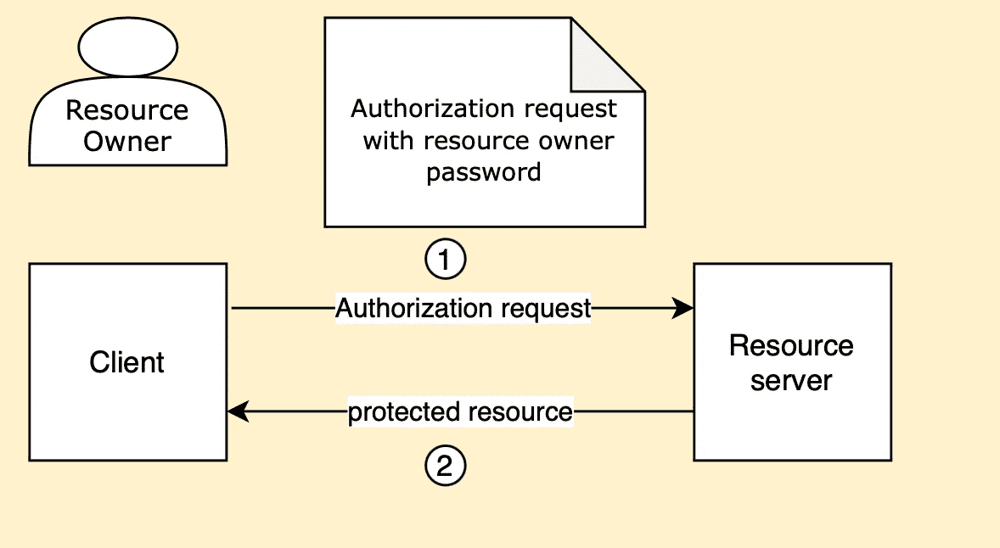
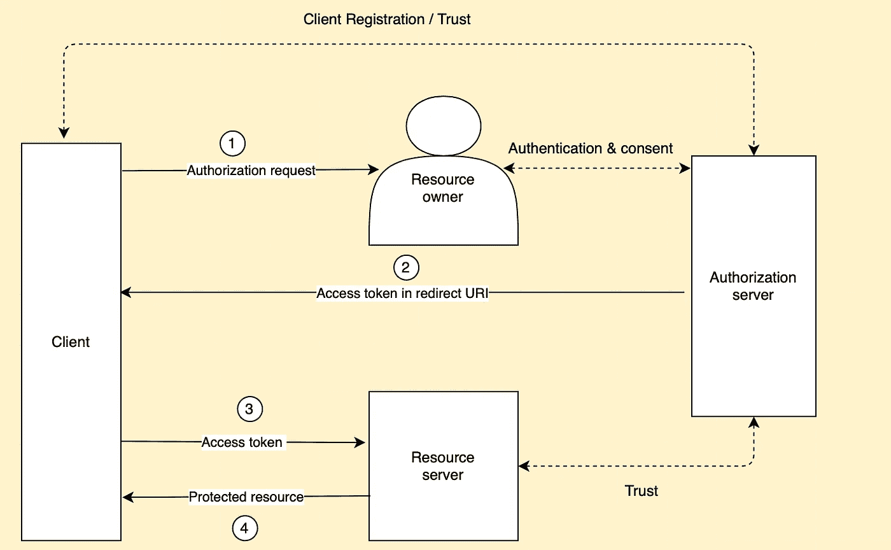
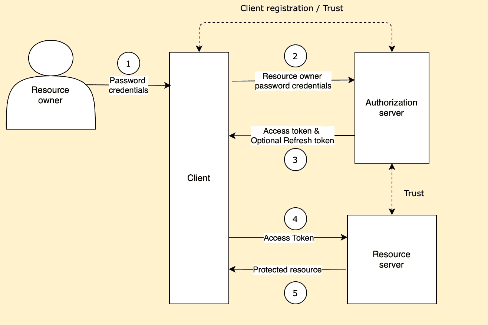
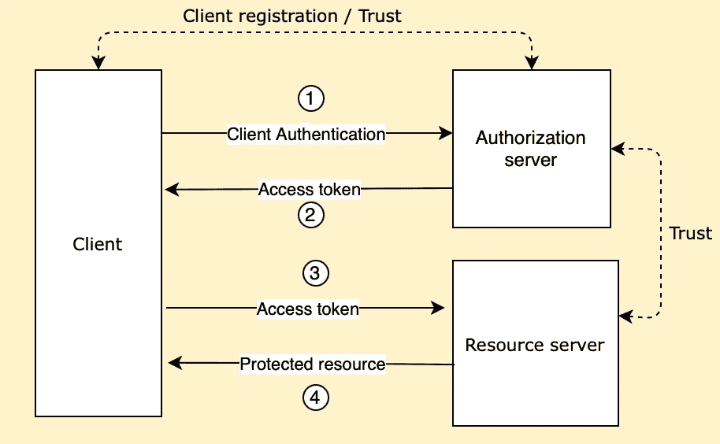
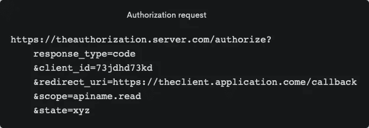
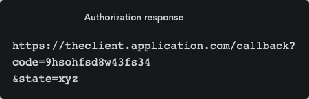
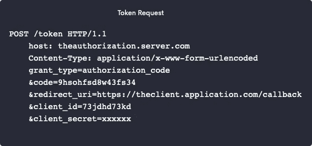
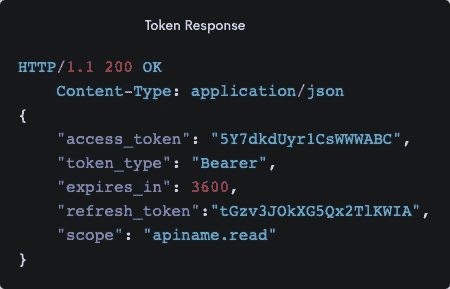
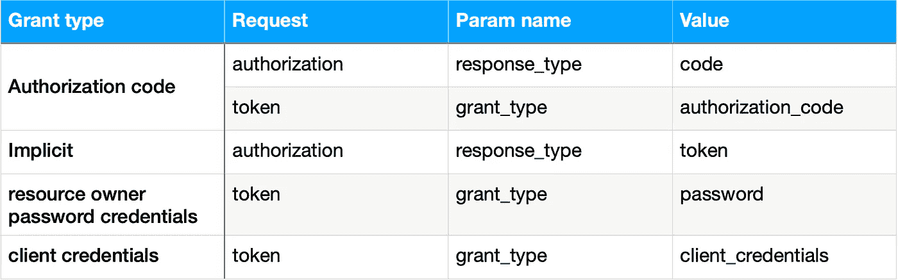

# OAuth 2.0 基础

> 原文：<https://medium.com/javarevisited/oauth-2-0-basics-b732e857cb25?source=collection_archive---------2----------------------->

在本文中，我们将借助问答技术来了解 OAuth 2.0 的基础知识。问答是我最喜欢的学习新概念的方式，因为它更具互动性，有助于记忆。所以让我们开始吧，我希望你也会觉得这很有帮助-

## **什么是 OAuth 2.0？**

OAuth 2.0 代表**开放授权**，是授权的行业标准。OAuth 使客户端(第三方应用程序)能够代表资源所有者**对**受保护资源**进行**范围的访问**，而无需知道或存储**资源所有者(最终用户)的**凭证**。

***(*** *术语* ***【客户】*** *和* ***第三方应用*** *在本文中用作同义词)*

## **为什么我们不能使用传统的客户端服务器授权模式？**

在传统的客户端服务器授权模型中，为了访问受保护的资源，客户端需要知道/存储资源所有者的凭证，以便在服务器上成功地进行身份验证，并且对于该资源所有者，必须与客户端共享凭证。

传统的客户端服务器授权模型

这有许多限制，其中一些主要的限制是

*   由于客户端存储资源所有者的凭据，客户端应用程序中的任何安全漏洞都会导致资源所有者的密码泄露。
*   客户端应用程序获得超过所需的对资源所有者的受保护资源的访问，并且资源所有者没有任何能力来限制访问的**范围**和**持续时间**。

## 好吧，但是 OAuth 2.0 如何解决这些限制呢？

OAuth 2.0 通过添加一个**授权服务器来解决这些限制。**

使用 [OAuth 2.0，](/javarevisited/top-10-courses-to-learn-spring-security-and-oauth2-with-spring-boot-for-java-developers-8f0222d6066d?source=---------5-----------------------)访问受保护的资源，客户端在资源所有者的批准下从授权服务器获得一组不同的凭证(**访问令牌**)。

访问令牌代表资源所有者授予的访问的**范围**和**持续时间**。

## 你能更详细地解释 OAuth 2.0 流程吗？

当然，我们来看看**授权码授予类型**流程。

授权码授权类型— OAuth 2.0 流程

1.  客户端向资源所有者请求**授权**。这个请求通常通过作为中介的授权服务器来完成。*(如客户端引导资源所有者到授权服务器的* ***授权端点*** *进行认证并获得同意)。*
2.  客户收到**授权许可。**授权许可表示资源所有者访问受保护资源的授权。客户端使用它来获得**访问令牌** **。**
3.  客户端通过传递在上一步中收到的**授权许可**并通过**向授权服务器认证**自身来请求访问令牌。
4.  授权服务器验证客户端凭证(例如，客户端 id、客户端机密等)。)，授权许可并发布一个**访问令牌**(以及可选的**刷新令牌**)
5.  客户端通过传递访问令牌向资源服务器请求受保护的源。
6.  资源服务器验证访问令牌并返回受保护的资源。

## **你能解释一下客户端认证和授权服务器部分吗？**

作为 OAuth 2.0 的先决条件，客户机向授权服务器注册自己。有不同的客户注册方式，最常见的是使用基于网络的注册表格。注册是一种与授权服务器建立信任并获得客户端属性(客户端标识符、客户端秘密等)的手段。).通常在注册期间，客户提供-

*   客户类型
*   客户端重定向 URI

## **客户类型**

*   **机密** —能够安全地存储他们的凭证，例如托管在安全服务器上的 web 应用程序
*   **公共** —不能安全地存储他们的凭证。例如基于本地设备/桌面的应用和基于用户代理的应用(其中代码在用户代理(例如浏览器)中执行)

## **什么是授权许可？**

授权许可代表资源所有者访问受保护资源的授权，它被客户端用来获得**访问令牌**

在核心 OAuth 2.0 规范中，有 4 种授权类型

## 隐式授权流

隐式授权流

## 资源所有者密码凭据

资源所有者口令身份证明授予类型流程

## 客户端凭据授予类型

客户端凭据授予类型流程

## 什么是访问令牌？

访问令牌是用于访问受保护资源的凭证。它们代表特定的访问范围和持续时间，由资源所有者授予，由资源服务器和授权服务器强制执行。

## **什么是刷新令牌？**

当**访问令牌到期**或**失效**时，客户端可以使用**刷新令牌**从授权服务器获得新的**访问令牌**。刷新令牌**从不发送到资源服务器**，并且仅用于授权服务器。

## **OAuth 2.0 中涉及哪些不同的端点？**

授权服务器公开 2 个端点-

*   **授权** —这个端点处理所有的用户交互，通常是通过浏览器。它用于在授权服务器上授权资源所有者。
*   **令牌** —该端点用于获取访问令牌，仅适用于机器。它是通过远离浏览器的安全 API 调用来调用的。

## 您能展示这些端点(授权和令牌)的示例请求和响应吗

## **授权请求**

授权请求

*   **response_type** —该查询参数的值用于标识授权流将要使用的授权类型。**【代码】**用于授权代码授权类型流程。
*   **客户端 id** —客户端应用程序的唯一标识符
*   **redirect_uri** —这是授权服务器将重定向资源所有者的端点(在资源所有者成功授权并同意之后)。该重定向 URI 必须已经向授权服务器注册。
*   **范围** —用于定义访问范围。它可以有空格分隔的值。这些值由授权服务器定义。如果在 url 中不存在，则授权服务器可以使用默认范围处理请求，或者使请求失败。
*   **状态** —建议使用该查询参数，以防止跨站请求伪造。这是一个可选参数，但是如果在请求中出现，授权响应也应该使用完全相同的值。

## **授权响应**

在资源所有者验证并同意客户端请求的内容(范围)后，授权服务器会将资源所有者重定向到 **redirect_uri** (这是授权请求的一部分)，并且 redirect_uri 会在查询参数(**代码**)中具有**授权代码值**

授权响应

## 令牌请求

在令牌 POST 请求中，我们传递**授权类型**(本例中为**授权 _ 代码**)、实际**授权代码值**(在授权响应中接收)、**重定向 _uri、** **客户端 _id** 和**客户端 _ 秘密**。

令牌请求示例

## 令牌响应

访问令牌和令牌类型在令牌响应中返回，然后在授权头中使用，以访问受保护的资源。

令牌响应

## 不同授权许可类型的授权和令牌请求的 response_type 和 grant_type 值。

不同授权类型的 response_type 和 grant_type 参数值

## 摘要

在本文中，我们讨论了什么是 OAuth 2.0，以及它如何解决传统授权模型的局限性。然后，我们研究了各种授权类型、何时使用每种类型及其高级流程。我们还讨论了不同的客户端类型。在文章的最后，我们看了示例授权和令牌请求/响应。

## 结论

我们已经介绍了 OAuth 2.0 规范的基础知识，如果您有兴趣深入研究我们在本文中讨论的一些概念，我强烈建议您阅读 OAuth 2.0 规范的原始版本 **RFC 6749。**