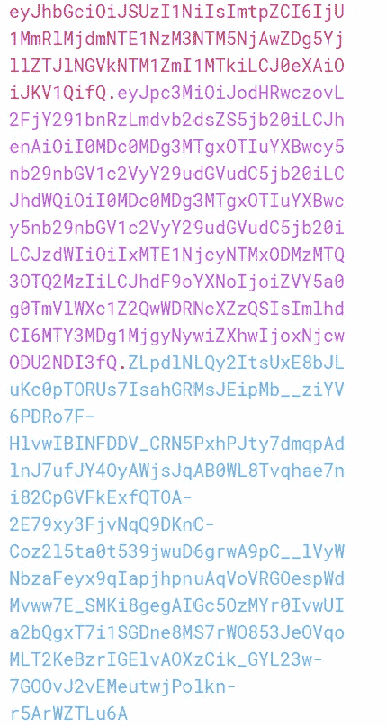
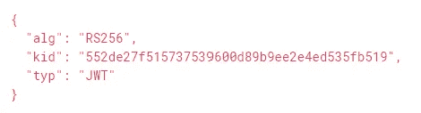
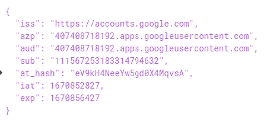
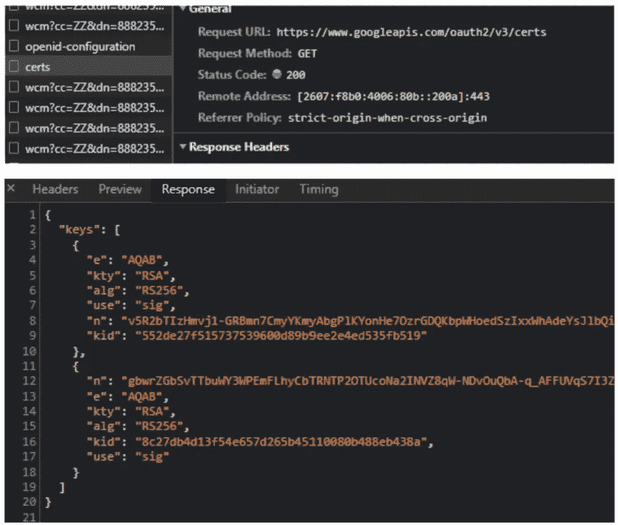
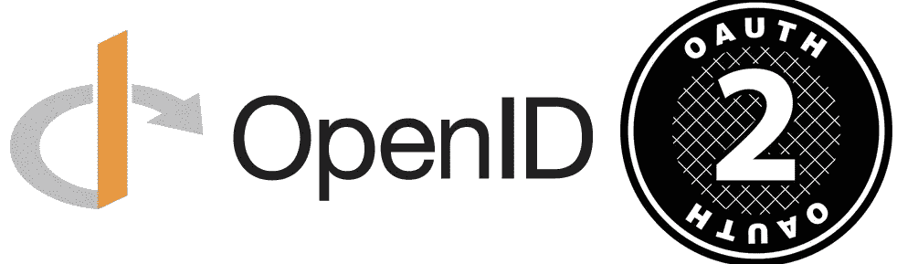

# 真相和误解

> 原文：<https://medium.com/javarevisited/oauth-and-misconceptions-fe2005fecd72?source=collection_archive---------1----------------------->

用简单的类比解释

OAuth 已经很多年了，但是仍然有一个困惑

*   是为了**认证**还是为了**授权**或者两者都是？
*   需要如何验证令牌？
*   ID 令牌与访问令牌
*   SAML 与 OpenID 连接

让我们试着在这篇文章中澄清一些事情。

**内容**

*   [认证 vs 授权](#f5f6)
*   谁需要它们？
*   【OAuth 如何做到两者兼得？
*   [如何验证访问令牌？](#286f)
*   [接入令牌没有用户信息吗？](#5f49)
*   [访问令牌可以包含哪些信息？](#7494)
*   [为什么选择 OpenID Connect？](#0934)
*   OIDC 强调什么标准？
*   如何在客户端验证生成的 id 令牌？
*   [可以从用户信息端点检索用户吗？](#8d7f)
*   JWT 看起来怎么样？
*   储存这些代币的最佳方式是什么？
*   [OIDC vs SAML](#00cd)
*   我们能在 SAML 中使用 OAuth 吗？
*   [对比授权流量](#9050)

> 身份验证与授权

**认证**答案，

*   如果*你在*系统*中*
*   你是你声称的那个人*吗*
*   您是否登录了

**授权**答案，

*   你是否有权限访问资源

我们拿一个**保管箱**来类比一下，更好理解。

让我们考虑一下，**保险箱**在**银行**，当用户需要访问**保险箱时，**用户向**银行助理**提供他们的*驾驶执照*或*某种照片 id* 到**证明他们是谁**，这是**认证**过程的一部分。

一旦完成，用户使用银行提供的*门禁卡来访问*保险箱**，**，但是同一张卡不能用来打开*不属于该用户或无权访问*的其他储物柜，这种**根据对某一资源的访问**来限制用户的方式就是**授权**过程。

> 谁需要它们？

我们要注意的是，[认证和授权](#f5f6)不仅仅是**给人类**用户**到*访问*受**保护的资源**。也有这样的情况，涉及**机器***与**交谈***其他** **机器**到**获取受保护的信息，**只能被某些机器访问。

[认证和授权](#f5f6)是**保护资源**免受**人类(** *用户* **)** 和**机器(** *客户端/服务器* **)** 攻击的技术。因此，实现应该*验证* & *允许/限制*他们尝试访问**资源服务器**。

> 它是如何实现两者的？

核心 [OAuth 规范](https://oauth.net/specs/)只谈**授权。**

**了解 OAuth 角色&术语**

当与**银行储物柜**类比**【实际平方值】**中的角色进行比较时，

*   **资源所有者**是**拥有保管箱的用户。【用户名密码用户】**
*   **资源服务器，**顾名思义就是**银行保险箱**，存放受保护用户的贵重物品。**【托管 API 的服务器】**
*   **访问令牌**是颁发给**资源所有者/用户**的**物理访问卡，用于访问特定的**保险箱。[编码字符串可以包含任何格式的任何自定义信息]****
*   **代理**是**银行保险箱的物理读卡器。【浏览器】**
*   **客户端**是在物理读卡器上运行 *的**软件。**【React/Angular SPA 或手机 App 或客户端服务器或网关】*****
*   **范围**是访问的类型，比如说**向/从银行储物柜存取**东西。比如说，如果**用户**和**配偶**都可以访问**同一个保险箱，**那么*的访问限制可以配置为*使得*用户的配偶*只能存款，并且可以拥有*无取款权限【T23:)**【产品:读取，产品:写入，产品:更新，个人资料，openid，电子邮件—范围为列表】***
*   **授权服务器**是**服务器，它根据可能位于远程的作用域来验证和授权或拒绝访问**。**【负责发放访问令牌的服务器】**

如果我们仔细观察，资源所有者的**配偶**可以*拿到资源所有者的门禁卡*并从保险箱中取出东西，因为配偶正在使用资源所有者的门禁卡。

由 [R.D. Smith](https://unsplash.com/@rd421?utm_source=medium&utm_medium=referral) 在 [Unsplash](https://unsplash.com?utm_source=medium&utm_medium=referral) 上拍摄的照片

也就是说，*对**访问令牌**拥有访问*权限的人可以根据令牌的**范围**访问资源。它只关心访问的委托，而不关心是谁，这转化为**授权过程**。

> 等一下。如何验证**访问令牌**？

[OAuth](https://auth0.com/docs/secure/tokens/access-tokens/validate-access-tokens) 核心规范没有指定任何机制来[验证令牌](https://auth0.com/docs/secure/tokens/access-tokens/validate-access-tokens)。 [OAuth 2.0 自测扩展](https://datatracker.ietf.org/doc/html/rfc7662)谈到使用**自测端点**或**使用授权服务器和资源服务器都能理解的格式**。

> **访问令牌**没有用户信息吗？

[访问令牌](https://oauth.net/2/access-tokens/)可以有任何信息，可以是 OAuth 核心规范没有限制的任何格式。负责验证的是 [API。](https://auth0.com/docs/secure/tokens/access-tokens/validate-access-tokens)

> 如果**访问令牌**可以拥有**任何信息**，那么为什么它不能拥有**用户信息**？

当然，我们可以使用**访问令牌**来**存储用户信息。** [**OAuth**](/javarevisited/top-10-courses-to-learn-spring-security-and-oauth2-with-spring-boot-for-java-developers-8f0222d6066d) 并不限制它，但是在**访问令牌**中实现**用户信息**的人有责任注意这些陷阱，并教育团队他们自己的处理方法。

这里有一些需要注意的陷阱，

*   根据 **OAuth 规范**,**客户端**不应读取用户信息，因为[访问令牌](https://oauth.net/2/access-tokens/)是针对 **API** 或**资源服务器的。**因此，如果使用[授权码授予](#6b93)或[隐式授予](#6b93)，并且如果客户端需要用户信息，那么它将需要*一个单独的机制*来处理用户信息。
*   由于访问令牌仅用于委托，一旦访问令牌被盗，持有访问令牌的人将有权访问资源，因此*必须实施单独的机制*来避免这种情况。
*   使用[隐式授权](#6b93)时，当**状态**参数未被跟踪时，注入攻击。那么，什么是状态参数。它是一个随机生成的字符串，存储在**代理**中，并检查响应是否包含相同的**状态。**

**隐式流程**用**状态**参数授权端点

*   当令牌响应被发送时，它没有指定令牌是给谁的或者令牌是做什么的——缺少受众，这最终必须被处理。

请点击此处查看详细信息，

 [## 使用 OAuth 2.0 的最终用户身份验证- OAuth

### OAuth 2.0 规范定义了一个委托协议，该协议对于跨…

oauth.net](https://oauth.net/articles/authentication/#common-pitfalls) 

> 为了**克服**认证中的这些陷阱，避免每个人*执行*他们自己的*机制*来处理事情。2014 年建立了一个**标准，称为 [**OpenID Connect**](https://openid.net/connect/) 来处理**认证**。**

> OpenID Connect 强调的是什么标准？

据说，当**作用域 *openid*** 和其他作用域一起被传递时，**授权服务器**会返回一个带有用户信息的 [JWT](#b9d0) ，可以被**客户端访问。**

**身份提供者**又名 ***组织/商业实体*** 维护用户的**目录，还运行**身份服务器**以显示**登录页面**并发布[身份令牌](https://www.oauth.com/oauth2-servers/openid-connect/id-tokens/)来建立认证。已经出示给*银行助理*认证的*行驶证*，类似于 [**身份证**](https://cloud.google.com/docs/authentication/token-types#id) **。****

*   **身份提供者**就是发放行驶证的**车管所**
*   **身份证令牌** [**债权**](#ade4) 是驾驶证上**姓名、出生日期、地址**的键值对

> 如何在客户端验证生成的 **id 令牌**？

[Open ID Connect](https://openid.net/specs/openid-connect-core-1_0.html#IDTokenValidation) 指定了声明列表，如 *iat、aud、acr、auth_time* ，但它随不同的提供者而不同。

还有一些提供[自省 url](https://developer.okta.com/docs/reference/api/oidc/#introspect) 进行验证。

> 难道我们不能访问 ***userinfo*** 端点来获得相同的用户信息，而不是使用来自 **id 令牌**的**声明**吗？

绝对正确。我们可以使用 **userinfo 端点**来检索*简档*信息、*偏好*和*用户特定*信息，以防获得 [**id 令牌**](https://cloud.google.com/docs/authentication/token-types#id) 中不存在的信息。从 [**id 令牌**](https://cloud.google.com/docs/authentication/token-types#id) 中获取信息，以避免不必要的网络调用，这将是非常有益的。

> JWT 是什么样子的？

被称为 [**的 JSON Web 令牌**](https://jwt.io/) 遵循一个由**点(.).通常它们有三个部分**

*   **标题** base64 编码
*   **有效载荷** base64 编码
*   [签名人签名](https://medium.suriyaprakhash.com/cryptography-algorithms-e86ce7e2bb9b#1182)

**红色**部分是**头部**，**紫色**部分是**有效载荷**，**蓝色**部分是**签名**

*   **第 1 部分** —包含算法、JWK 密钥 id 和类型

带有 **kid** 的典型 JWT 收割台从 **JWKS 终点**到**获取 **JWK** 验证**有效载荷中的**签名**

*   **第 2 部分** —关键值对声明

JWT 有效载荷与键值**声明**

*   **第 3 部分**—**签名**到**验证令牌**是否是由实际 OAuth 提供者签名的**，**

在上述 JWKS enpoint 中匹配 kid 以获取 JWK 字符串/ [公共证书](https://medium.suriyaprakhash.com/cryptography-algorithms-e86ce7e2bb9b#41bc)

使用来自 JWT 报头的密钥 id (kid)从 **JWKS 端点**到**获取 **JWK** ，验证**第 3 部分中的**签名**。

要了解更多关于[签名和验证](https://medium.suriyaprakhash.com/cryptography-algorithms-e86ce7e2bb9b#1182)的信息，请阅读以下内容。

 [## 加密算法

### 需要记住的简单备忘单

medium.suriyaprakhash.com](https://medium.suriyaprakhash.com/cryptography-algorithms-e86ce7e2bb9b) 

> 储存这些代币的最好方法是什么？

通常建议以安全的方式存储 **id 令牌**或**访问令牌**，例如在**加密数据库**或**安全服务器端存储**。这完全取决于所使用的资助类型。

在理解它之前，我们需要知道下面的[会话](https://auth0.com/docs/manage-users/sessions)是在*成功登录*之后创建的，

*   您的[客户端](#b311)中的本地会话—希望应用程序团队需要担心安全地存储它们。
*   在[授权服务器](https://auth0.com/docs/glossary?term=authorization-server)中创建的会话
*   在使用来自[谷歌](https://developers.google.com/identity/openid-connect/openid-connect)或[脸书](https://developers.facebook.com/docs/facebook-login/limited-login/token/)的 [OpenIDConnect](#7494) 的情况下，在它们的终端创建第三个会话来维护[认证](#f5f6)。

## 带后端的 SPA

*Angular* 或 *React* 具有后端的应用程序将主要使用 [**授权代码**](#6b93) grant，其中代码被发送到*后端网关*或*后端应用程序*，后者将**调用令牌端点以获取令牌**，并将用户的 **id 令牌**和**访问令牌**存储在 db 中。现在，可以了

*   [用*会话信息*和](/javarevisited/lets-taste-cookies-30fd342e60cf#0546)[http only](/javarevisited/lets-taste-cookies-30fd342e60cf#2f8d)&[Secure](/javarevisited/lets-taste-cookies-30fd342e60cf#deb8)[cookie 属性](/javarevisited/lets-taste-cookies-30fd342e60cf#83fb)创建一个 cookie 并发送回前端，这样 SPA 就不能以 [**加密格式**](/@suriyaprakhash/cryptography-algorithms-e86ce7e2bb9b#0584) **访问它。**
*   发送**所需的非敏感用户信息**作为[非 http only](/javarevisited/lets-taste-cookies-30fd342e60cf#9cf6)[Secure](/javarevisited/lets-taste-cookies-30fd342e60cf#deb8)[cookie](/javarevisited/lets-taste-cookies-30fd342e60cf#83fb)，以便*SPA 可以访问用户信息*用于**显示或其他目的**。

## 没有后端的 SPA

比方说，如果流是一个被 SPA 使用的[**隐式授权**](#6b93) 或[**【PKCE】**](#6b93)，而没有后端**，**，我们可能会被迫将令牌存储在 [Cookie](https://medium.suriyaprakhash.com/lets-taste-cookies-30fd342e60cf) 、本地存储或会话中，或者存储在内存中。

**id 令牌**的**签名形式**或**加密形式**可以存储在 [cookie](https://medium.suriyaprakhash.com/lets-taste-cookies-30fd342e60cf) 或本地存储中，以屏蔽**用户信息**和**声明**。并且**访问令牌**可以存储在**启用了[静默认证](https://auth0.com/docs/authenticate/login/configure-silent-authentication)的内存**中，或者以**加密格式**存储在 [cookie](/@suriyaprakhash/lets-taste-cookies-30fd342e60cf#deb8) 或本地存储中。

**注意**如果有人能够访问**源代码**和**cookie**或**本地存储**就有可能危害您的系统。

## 本机应用程序

这个问题没有直接的答案，因为基于应用程序的类型有不同的实现。

更多信息请参考 [**原生/移动应用**](https://auth0.com/docs/quickstart/native#native) 。

## 服务对服务

在后端试图访问另一个后端服务的情况下，简单直接的答案是使用[客户端凭证授权](#6b93)。可以在后端表中轻松跟踪令牌和本地会话。

> 这是否意味着 OIDC 类似于 SAML 的断言？

是的。两个**身份协议**处理相同的认证机制。两个设施都是 SSO。

[SAML](https://developer.okta.com/docs/concepts/saml/) 用户直接向身份提供商认证，而 OIDC it 使用服务提供商。

SAML 使用 XML 断言，而 OIDC 以 JSON 格式传输断言。

> 我们可以和 SAML 一起使用 OAuth 吗？

是的。 **SAML 2.0** 支持[授予式流程](https://developer.okta.com/docs/guides/implement-grant-type/saml2assert/main/#grant-type-flow)。客户端可以获得 [SAML 断言，并使用 base64 编码的断言调用授权服务器](https://developer.okta.com/docs/guides/implement-grant-type/saml2assert/main/#about-the-saml-2-0-assertion-grant)来获取访问令牌。

> 赠款流量比较

**OAuth 2.0** 支持以下流程:

*   [授权代码流程](https://oauth.net/2/grant-types/authorization-code/)
*   [代码交换的证明密钥](https://oauth.net/2/pkce/)
*   [客户证书授予流程](https://oauth.net/2/grant-types/client-credentials/)
*   [设备授权许可](https://oauth.net/2/grant-types/device-code/)
*   [隐式流](https://oauth.net/2/grant-types/implicit/)
*   [资源所有者密码授予流程](https://oauth.net/2/grant-types/password/)

**SAML 2.0** 支持[授权型流程](https://developer.okta.com/docs/guides/implement-grant-type/saml2assert/main/#grant-type-flow)

**开放 ID 连接**支持以下流程:

*   使用 [OAuth 授权代码流](https://openid.net/specs/openid-connect-basic-1_0.html)的基本基于 Web 的依赖方
*   使用 [OAuth 隐式流程](https://openid.net/specs/openid-connect-implicit-1_0.html)的基本基于 Web 的依赖方

OAuth 2.0 让[来选择包含什么**范围**](https://developer.okta.com/docs/concepts/oauth-openid/#openid-connect) 。但是，根据 OpenID connect 规范，它使用 [**id 令牌**](https://cloud.google.com/docs/authentication/token-types#id) 作为结果，同时尝试调用**授权**端点**范围**被设置为 ***openid*** 以及其他自定义范围，这些自定义范围告知**授权服务器**在响应中发布 [**id 令牌**](https://cloud.google.com/docs/authentication/token-types#id) 以及

这里是**秋田犬游乐场**穿行在每一个人流中，

 [## OAuth 2.0 游乐场

### 这些示例通过与一个模拟的 OAuth 2.0 授权服务器进行交互，引导您完成各种 OAuth 流程。

www.oauth.com](https://www.oauth.com/playground/index.html) 

相同的详细视频可以在下面的链接中找到，