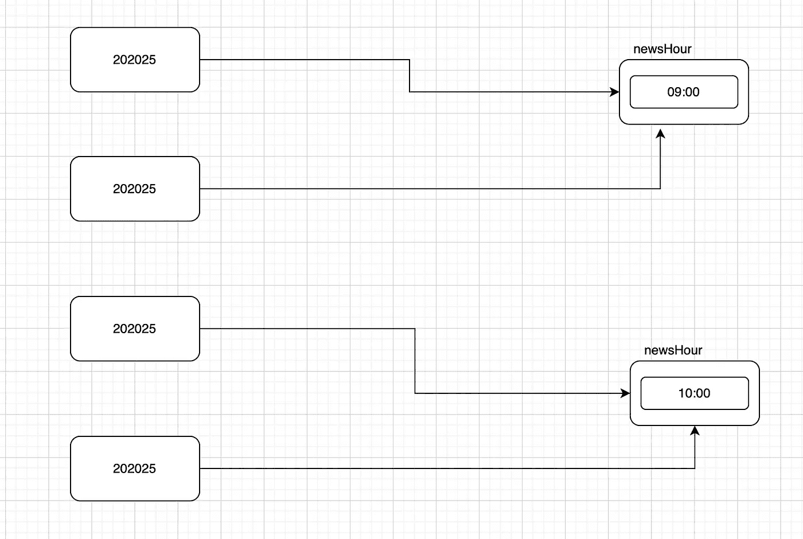
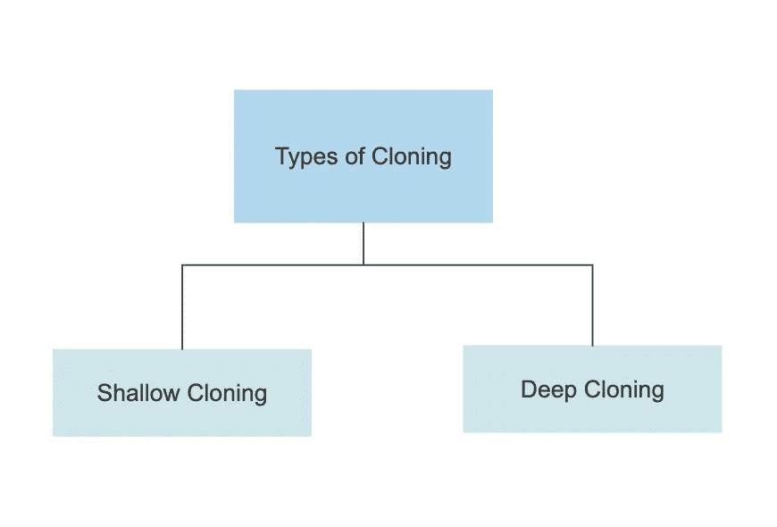

# Java 中的对象克隆

> 原文：<https://medium.com/javarevisited/object-cloning-in-java-e6c7d5707579?source=collection_archive---------2----------------------->

因此，在理解对象克隆之前，让我们先了解一下克隆这个词。根据谷歌字典， ***“一个*** [***克隆体***](https://javarevisited.blogspot.com/2013/09/how-clone-method-works-in-java.html) ***是用科学方法从一个植物或动物的细胞中产生的一个精确的复制品”*** 。现在在 java 中，我们有一个对象类，它是 java.lang 包中预定义的类。它是所有 java 类的默认超类，这意味着您可以在程序中引用对象类的所有成员，而无需扩展对象类。

当我们说[对象克隆](https://javarevisited.blogspot.com/2014/03/how-to-clone-collection-in-java-deep-copy-vs-shallow.html)时，意味着我们正在创建该对象的精确副本。当你想创建一个原始变量的副本时，你可以使用赋值操作=

```
class CloneVar{
public static void main(String args[]){
    int x = 25 ;
    int y = x;
    y = y++;
  }
}
```

这里从上面的代码中，你可以清楚地看到，在创建了原始变量的副本后，如果我们对复制的变量做一些修改，那么原始变量值不会受到影响。那么当我们使用赋值操作符时会发生什么呢？当我们使用赋值操作符创建引用变量的副本时，现有对象的地址将被复制到引用变量中。

当我们使用复制的引用变量修改对象数据时，原始对象值将被修改，因为两个引用变量指向同一个对象。

```
class News{
String newsHour;  
public static void main(String args[]){
  News news = new News();
  news.newsHour = "9:00";

  News news2 = news;
  news2.newsHour = "10:00";
  }

}
```

[](https://www.java67.com/2013/05/difference-between-deep-copy-vs-shallow-cloning-java.html)

对象克隆

java 中有两种类型的对象克隆

1.  浅层克隆
2.  深度克隆



对象克隆的类型

# 浅层克隆

所以从上面的解释中，我们可以说克隆是一个创建现有对象的副本的过程。现在是时候了解浅层克隆了，创建对象的按位副本的过程称为浅层克隆。现在让我们更深入地理解它。如果主对象包含原始变量，则将在克隆对象中创建精确的副本，但是如果主对象包含任何引用变量，则不会创建相应的对象，而是创建指向旧的包含对象的副本变量。所以我们可以说，上述克隆的例子只不过是肤浅的克隆。它是 java.lang.Object 类 clone()方法的默认实现。

> **现在让我们理解 object clone()方法是做什么的。**

**受保护的本机对象 clone()抛出 CloneNotSupportedException**

这里 protected 是访问修饰符，native 是过去使用的关键字，显示了该方法的平台相关实现。clone()是一个内置的方法，它抛出一个内置的异常。

所以当我们说 clone 方法是受保护的时，我们可以在 java.lang 包之外的子类中直接访问它，或者只使用子类对象。当我们想要克隆任何类对象时，我们需要实现一个名为 java.lang.Cloneable 的标记接口，这意味着我们需要覆盖该类中的 clone()方法，以实现对象克隆。如果我们在没有实现可克隆接口的情况下克隆任何类对象，那么在这种情况下，JVM 将抛出**“CloneNotSupportedException”**

# **深度克隆**

现在我们来理解一下我们说的深度克隆是什么意思。创建完全相同的独立副本(包括所包含的对象)的过程称为深度克隆。深度克隆没有 java.lang.Object 类的默认实现，我们需要定义实现。在这种类型的克隆中，如果主对象包含任何原始变量，那么在克隆对象中，将创建一个重复的副本。

如果主对象包含任何引用变量，那么相应的对象也将在克隆副本中创建。这意味着如果我们修改克隆对象的数据，它不会影响实际的对象。如果我们要修改成员对象的数据，那么它也不会影响其他对象。现在问题出现在我们的脑海中，那么我们应该什么时候去进行深度克隆呢？答案很简单，当对象包含引用变量时，我们应该进行对象的深度克隆。

```
 import java.io.*;
public class GFG implements Cloneable {

// Defining a method as clone method is protected
// Defining within the class called cloneable interface
public Object clone() throws CloneNotSupportedException
{
return (GFG)super.clone();
}

 // Main driver method
 public static void main(String[] args) throws CloneNotSupportedException
 {
  // Creating first object of GFG class
  GFG t1 = new GFG();

  // Using clone() method to create duplicate object
  // of t1 reference variable
  // else for every object manually object needs
  // to be copied in deep copying
  // clone() ease this manual effort
  GFG t2 = (GFG)t1.clone();

  // Comparing two objects just after deep copying
  // Returning true for shallow(by default) copying
  // Returning false for deep copying
  System.out.println(t1 == t2);
 }
}
```

这个例子取自 Geeks for Geeks 为了理解深度克隆。我希望你明白这个主题，如果你有任何困惑，请告诉我，以便我可以用一些更具互动性的例子来更深入地解释它。更多类似的话题，请关注，如果你喜欢这些内容，请鼓掌。敬请期待！

