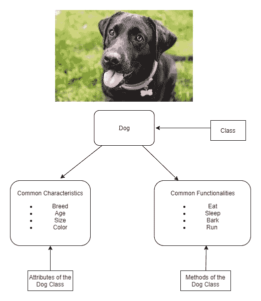
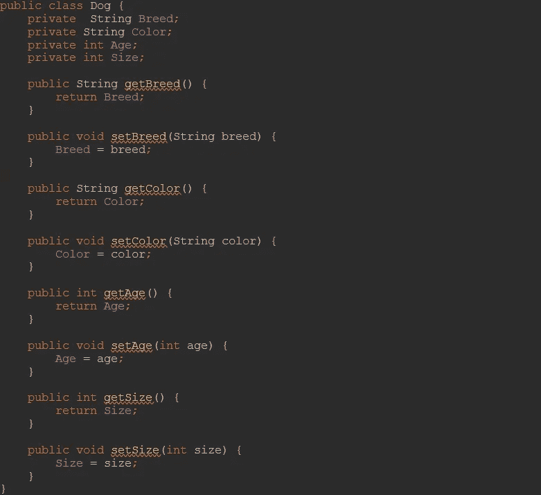
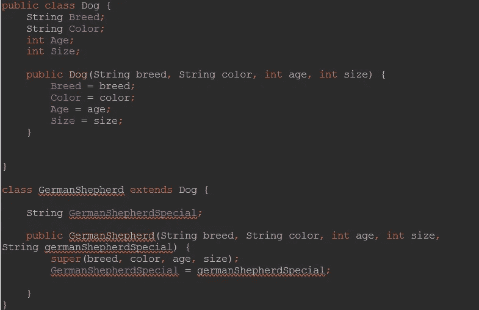
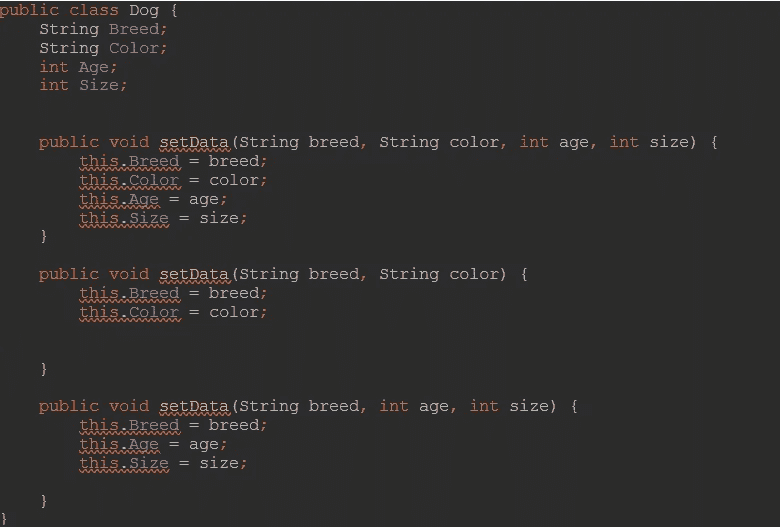
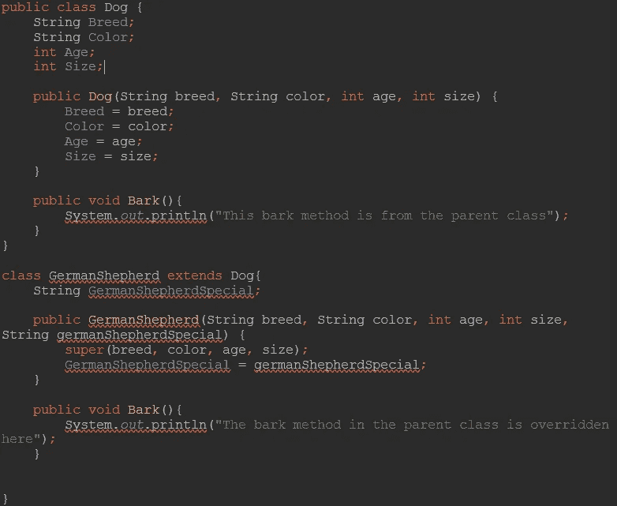

# 面向对象编程和 Java OOP 概念

> 原文：<https://medium.com/javarevisited/object-oriented-programming-and-java-oop-concepts-1e38928a88e7?source=collection_archive---------1----------------------->

照片由 [Fotis Fotopoulos](https://unsplash.com/@ffstop?utm_source=medium&utm_medium=referral) 在 [Unsplash](https://unsplash.com?utm_source=medium&utm_medium=referral) 上拍摄

面向对象编程是几乎每个开发人员都使用的基本编程范例。这被认为是最著名的编程范例之一，从程序员职业生涯的早期开始，它就被作为一种标准的编码方式教授给程序员。

OOP 的概念是一个在我们的日常生活中可以看到的概念，但是我们看不到或者记不下来。[面向对象编程](/swlh/5-free-object-oriented-programming-online-courses-for-programmers-156afd0a3a73)主要处理现实生活中的对象，以及它们如何在编程世界中被合并和复制。这个概念主要依赖于类和对象的概念。

## 班级

类可以简单地定义为简单、抽象的代码，作为创建相应[类](https://javarevisited.blogspot.com/2011/10/class-in-java-programming-general.html)的对象的不同实例的蓝图，它也可以被称为对象实例化的更广泛的概念。这些类具有在实例化时被对象继承的属性和功能。这些方法仅适用于相应的对象类型，不适用于其他类型。

## 目标

对象可以被定义为一个类的实例。一个[对象](https://javarevisited.blogspot.com/2012/12/what-is-object-in-java-or-oops-example.html)可以包含类中的属性和相关方法，它主要是现实生活中对象的软件表示。

## 属性

属性是存储在类中的信息。这些属性将保存被实例化的对象的数据，并且由这些属性保存的数据可以因使用各自的类创建的对象而异。

## 方法

方法代表类的行为。他们可以执行操作，甚至更新各自类的对象。

如果我要通过一个现实生活中的例子来解释类和对象的概念，我们可以以宠物为例，更准确地说，我们可以以狗为例，狗有所有狗共有的属性，如品种、年龄、大小、颜色，以及一些共同的功能，如吠、跑、坐、吃。因此，为了在一个软件实体中表示这个真实的模型，我们可以使用 dog 作为类，它充当可以从中创建 dog 对象的蓝图。

作为类的属性，我们可以指定上面提到的狗的属性，我们也可以通过为类的方法指定我们前面讨论过的狗的功能来做同样的事情。

# OOP 概念

谈到面向对象编程，有 3 个主要的面向对象概念。这些可以简单地列举为，

1.[抽象](https://javarevisited.blogspot.com/2010/10/abstraction-in-java.html#axzz6oOeSmpNw)

2.[封装](https://javarevisited.blogspot.com/2012/03/what-is-encapsulation-in-java-and-oops.html)

3.[传承](https://javarevisited.blogspot.com/2012/10/what-is-inheritance-in-java-and-oops-programming.html)

4.[多态性](https://www.java67.com/2012/10/difference-between-polymorphism-overloading-overriding-java.html)

## 抽象

抽象可以简单地解释为隐藏所有不必要数据的形式，只显示对象的必要数据。类是对象抽象表示的完美例子，因为它只展示了类的相关字段和方法，而忽略了对象不需要的细节。

示例:

在上面的例子中，创建的狗类包含了所有狗的特征和功能。在这里，类 Dog 作为狗的概念的抽象模型。

## 包装

[封装](http://www.java67.com/2012/08/difference-between-abstraction-and-encapsulation-java-oops.html)可以定义为将数据和对象连接和绑定在一起并保护它们免受外部干扰和误用的过程。这可以通过将类[的字段设为私有](https://javarevisited.blogspot.com/2012/10/difference-between-private-protected-public-package-access-java.html#axzz6j8KhisSX)并使用公共方法提供对这些字段的访问来实现。下面的代码片段会让你更清楚地理解这一点。

在上面的代码片段中，我们可以看到该类的所有属性都是私有的，因此这些属性不能在该类之外直接访问。来访问这些 getter 和 setter 方法。setter 方法初始化或更改属性值，getter 方法返回属性值。

## 访问修饰符

Java 支持 4 种类型的访问修饰符，我们可以用它们来定义类、属性甚至方法的可见性。我们可以根据我们的逻辑和系统的需求来使用这些修饰符。

## 遗产

继承可以定义为一个对象获得另一个对象的属性的过程。通过使用这些信息，可以按照层级顺序对其进行管理。这个概念通过取出多个类中的公共代码并将其分配给一个超类，有助于减少代码的重复。

有 3 种类型的继承

1.单一遗传

2.分层继承

3.多重遗传

然而[由于钻石问题，多重继承不能在 Java](https://javarevisited.blogspot.com/2011/07/why-multiple-inheritances-are-not.html) 中实现。

在上面的代码片段中，我们可以看到`GermanShepherd` 类是通过扩展 Dog 类创建的，通过这样做，子类 GermanShepherd 类继承了父类(在本例中是 Dog 类)的所有属性和方法。这里父类的构造函数在子类中被称为“超级”。传递给 super 的参数的数量/类型必须与超类的一个构造函数的参数相匹配。如果存在，必须是第一个语句。

## 多态性

多态性可以被定义为允许不同的对象以不同的方式对相同的消息做出反应的过程。

这可以通过[方法重载](https://javarevisited.blogspot.com/2011/12/method-overloading-vs-method-overriding.html#axzz5Y4Kd7uK1)和[方法重载](http://www.java67.com/2012/08/what-is-method-overriding-in-java-example-tutorial.html)来实现。

## 方法重载

方法重载是方法名相同但参数类型和数量不同的过程。这些方法可能有也可能没有返回类型。为了更好地理解，请参见下面的代码。

上面的代码片段描述了方法重载的使用。这里使用了名称相同但参数和参数数量不同的方法。编译器将重载方法视为完全不同的方法，并且编译器知道根据所用参数的数量和类型调用哪个方法。

## 方法覆盖

方法覆盖是当子类想要覆盖超类中定义的方法时使用的过程。这可以通过在子类中编写完全相同的方法并相应地改变方法的主体来实现。在子类中重写超类中的方法的方法应该与超类的方法具有相同的方法名、相同的参数和相同的返回类型。

在上面的代码片段中，我们可以看到 Bark()方法在 GermanShepherd 中被覆盖。在方法调用时，调用并执行子类中定义的方法，而不是超类中的方法。

我希望这篇文章能帮助你更好地理解所有的基础知识和概念。请随时提供以上反馈。非常感谢。

谢谢大家！