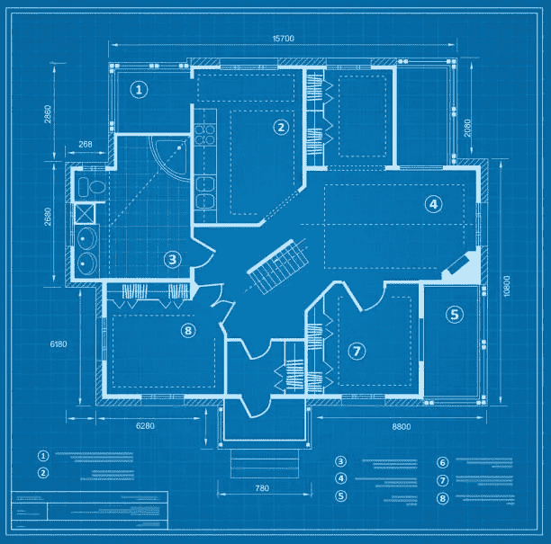
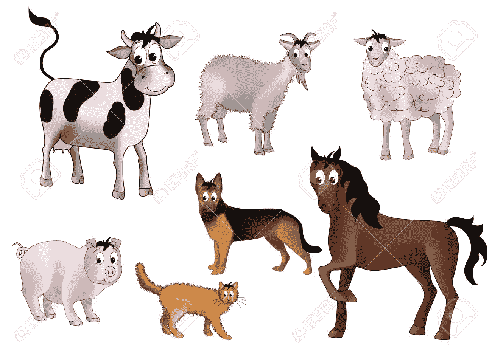

# Java 中的 OOP 概念

> 原文：<https://medium.com/javarevisited/oop-concepts-in-java-f0eb16ce498b?source=collection_archive---------3----------------------->

[*Java*](https://docs.oracle.com/javase/tutorial/java/concepts/index.html) *是一种纯粹的面向对象编程(OOP)语言。它使用类来处理对象创建。该类内部有属性和特性。*

# 我们为什么需要面向对象的概念？

通过将一个大问题分解成更小的问题来解决它需要 OOP 概念。通过解决小问题，有可能构建一个高效的复杂程序。

# *在转向 OOP 概念之前，我们需要了解一些术语。*

## *类*

*它是对象的集合。类就像房子的蓝图，通过把它看作模板，可以用它来创建对象。*

*蓝图房屋平面图。*

*在* [*Java 中*](/javarevisited/5-best-core-java-books-for-beginners-20e3f723e3a) *类的名称(首字母)以大写字母开头。*

> *动物类{*
> 
> *//变量声明*
> 
> *私有字符串名；*
> 
> *private int age；*
> 
> *//方法*
> 
> *公开作废吃(){*
> 
> *System.out.println("动物吃")；*
> 
> *}*
> 
> *}*

## *对象*

*物体是现实世界的物体。一个类的实例称为一个* [*对象*](http://www.java67.com/2014/08/what-is-difference-between-class-and-object-java-programming-oops.html) *。它有属性和方法。使用一个类可以创建许多对象。*

*有一类叫动物。动物类有像猫、狗和牛这样的对象。*

动物的图像。

对象可以具有颜色、年龄等属性，以及声音、食物等属性。

> *animal app 类{*
> 
> *public static void main(String[]args){*
> 
> *//对象创建*
> 
> *动物动物=新动物()；*
> 
> *//调用方法*
> 
> *animal . eat()；*
> 
> *}*
> 
> *}*

# OOP 概念下有 4 个主要原则。

1.  *抽象*
2.  *封装*
3.  *继承*
4.  *多态性*

## [抽象*抽象*抽象](https://javarevisited.blogspot.com/2010/10/abstraction-in-java.html#axzz6oOeSmpNw)

*程序的复杂性只向用户隐藏和显示相关信息。它不会显示不相关的信息。这就像一只猫的内部结构(解剖学)对观众是隐藏的。*

在 Java 类中，内部实现是使用抽象类或接口隐藏的。

## [*封装*](https://javarevisited.blogspot.com/2012/03/what-is-encapsulation-in-java-and-oops.html)

它限制系统中的直接访问，以保护类中存储的数据。抽象是通过提供合适的访问修饰符在 Java 中实现的。属性被授予私有访问权限，并为它们提供公共的 getters 和 setters。因此，属性和方法被包装成一个单元，并对其他类隐藏。

## [*继承*](https://javarevisited.blogspot.com/2012/10/what-is-inheritance-in-java-and-oops-programming.html)

继承一个类的所有属性和方法的机制就是继承。当一个特定的类需要一个已经存在的类的相同特性时，这有助于重用代码，而不需要再创建一个具有相同特性的新类。

可以重用以前存在的类的属性和方法。先前存在的类被称为父类、超类或基类。从父类继承特性的类称为子类或子类。

如果有两个班级，个人班级和学生班级。Person 类充当父类，Student 类充当子类。Person 类可以有许多子类，如学生、讲师和讲师。子类可以访问特性(通过使用名为 extends 的关键字从父类访问属性和方法)。

> *类人{*
> 
> *私有字符串名；*
> 
> *private int age；*
> 
> *公共作废技能{*
> 
> *System.out.println("沟通技巧")；*
> 
> *}*
> 
> *班级学生扩展人{*
> 
> */*提及除父类中的功能之外的其他功能*/*
> 
> *私弦度；*
> 
> *private int GPA；*
> 
> *公共无效研究(){*
> 
> *System.out.println("学习非全日制")；*
> 
> *}*
> 
> *}*

## [*多态性*](https://www.java67.com/2012/10/difference-between-polymorphism-overloading-overriding-java.html)

*以不同的方式执行某个动作称为多态。例如，像猫、狗和牛这样的动物会发出不同的声音。*

***Java 中的多态性是通过两种方法*** 实现的

***1。*** [***超载***](http://www.java67.com/2012/08/what-is-method-overloading-in-java-example.html)

*重载又称静态多态*

*一个类有许多同名但参数不同的方法。参数的名称、类型或数量不同。*

> *动物类{*
> 
> *//不带参数*
> 
> *公开作废吃(){*
> 
> *System.out.println("动物吃")；*
> 
> *}*
> 
> *//带一个参数*
> 
> *公共虚空吃(串食){*
> 
> *System.out.println("动物吃"+食物)。”);*
> 
> *}*
> 
> *//带两个参数*
> 
> *public void eat(String food，int amount){*
> 
> *System.out.println("动物每天吃"+量+"公斤的"+食物"。");*
> 
> *}*
> 
> *}*

***2。*** [***超越***](http://www.java67.com/2012/08/what-is-method-overriding-in-java-example-tutorial.html)

*又称动态多态性。*

子类可以覆盖父类的方法。

*只有当子类中的方法与父类中的方法具有相同的方法签名(相同的名称、相同的返回类型、相同的参数)时，这才是可能的。*

> *动物类{*
> 
> *私有字符串名；*
> 
> *//不带参数*
> 
> *公共虚空吃(){*
> 
> *System.out.println("动物吃")；*
> 
> *}*
> 
> *}*
> 
> *猫类延伸动物{*
> 
> *//不带参数*
> 
> *公开作废吃(){*
> 
> *System.out.println("猫吃鱼")；*
> 
> *}*
> 
> *}*

# *优点*

*   *提高代码可读性。*
*   *可重复使用*
*   执行更容易，节省时间(高生产率)。
*   *易于调试*
*   *易于系统升级*
*   *最低安全风险*

# *结论*

在构建复杂的应用程序时，Java 中面向对象的概念非常有用。把程序的复杂性分解成小块，有效地解决，不会混淆。