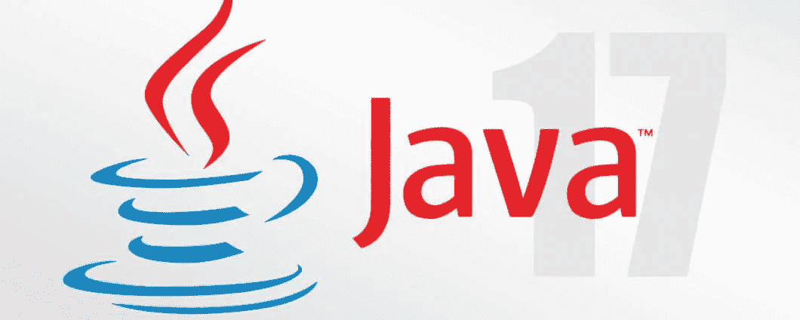

# 甲骨文 JDK 现在是免费的

> 原文：<https://medium.com/javarevisited/oracle-jdk-now-is-free-1ff0802fa5fb?source=collection_archive---------1----------------------->

大家好！对于所有 Java 开发人员和使用商业许可下的 Java 的客户来说，有一个好消息:Oracle JDK 从 JDK 17(几天前刚刚发布)开始免费提供。

9 月 14 日，Donald Smith(产品管理高级总监)在 Oracle 博客上发布了一篇文章，向我们介绍了这个消息，介绍了 **Java 免费许可证**。这是该职位的简历。