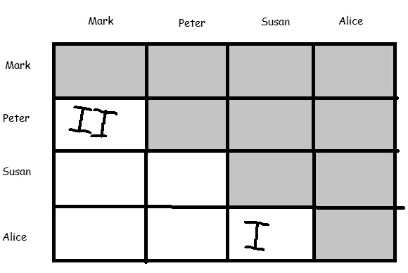

# 成对编程反模式

> 原文：<https://medium.com/javarevisited/pair-programming-antipatterns-db39dd678755?source=collection_archive---------2----------------------->

结对程序员在行动！

对我来说，结对编程是程序员最有趣的活动之一。它不仅有趣，还是知识共享和团队建设的好工具。事实上，与许多人的错误看法相反，它确实提高了生产率。但可悲的是，如此多的人讨厌它，也有如此多的公司甚至积极阻止它或对此感到不安。

人们经常用许多观点来攻击结对编程实践者。在我们进入反模式之前，我将只提到其中的两个。

1)即使证明结对编程可以显著降低成本；软件许可、硬件、培训和团队建设等等。然而，许多公司认为这是“人力资源的浪费”。在我的职业生涯中，我在多个场合冥想和思考过这个问题，我得出的结论是，当给出这个理由时，潜在的动机往往是由于对中断和变化的巨大恐惧。

2)另一个经常听到的说法是“它不适合所有人”。他们说，有些人比其他人更内向，或者有时，需要一段时间才能更清晰地思考，并能够解决问题。

我对此的看法是，这个行业中有很多人技术高超，但却无法有效沟通，说出他们的推理或想法。缺乏社交技巧的人害怕或对社交感到极度不舒服。

所以，是的，人力资源和招聘团队(特别是代理机构)在很多情况下只是为了“最好的”技术技能，但他们完全忽视了团队工作所需的沟通和社交技能。不幸的是，它被称为结对编程，但如果它被称为结对解决问题，这将暗示，这不仅仅是需要的技术技能。

这两点并不是你听到的反对结对编程的唯一理由，还有很多其他的理由。我很乐意讨论所有这些问题，但我想进入反模式，因为理解它们并思考它们，我认为可以帮助理解成功实现结对编程的障碍是什么。

这并不是一项很难实施的技术，但要充分利用它，我们应该小心我们如何接近它，我们的设置看起来如何，以及我们周围的人如何支持过渡到它的努力。有时候，一个团队第一次尝试结对编程，但是他们从错误的角度着手，可悲的是，他们最终讨厌结对编程，或者至少对结对编程形成了错误的印象。

希望理解一些这种反模式可以帮助团队在尝试过渡到结对编程时避免痛苦的经历，并可能避免错误观点的形成，比如我前面提到的两种观点。

**能影响结对编程的因素** 高效的结对编程取决于很多因素。取决于这些因素，其中包括:

*   技术(也叫实用):这是配对时的低层次的东西。涉及到你和你的搭档的事情。你们相互交往的方式，以及你们如何适应对方。
*   环境因素:与你周围环境有关的因素，这些因素有可能阻碍你们的配对。
*   组织因素:与你的公司及其对敏捷的看法或结对的某些方面有关的因素，这些因素有意或无意地给结对的实施带来了困难。
*   心理因素:一系列因素，或者通常是思想或精神状态，作为影响配对体验质量的力量。

所以不要再犹豫了，让我们来看看反模式。

**孤独的思考者。** 如果一对成员中的一个说*“给我点时间想想，我会再联系你的”*，我们就不再是一对了。我们不是在集体解决问题。

这只是意味着这对搭档不熟悉使用集体解决问题的技巧和技术。是的，他们会分开，每个人会“单独”提出一些可行的解决方案，然后进行讨论，等等…但这不是团队工作。这个问题没有被集体解决。

*解决方法:*练习结对/集体分析和/或结对/集体解决问题的技巧，帮助结对者作为一对克服阻碍因素，增强结对/集体学习。

**办公桌怀旧** 真正的一对程序员没有“他们的办公桌”他们两个一起坐在同一张桌子上。将有两个鼠标，两个键盘，也许 2 个屏幕，但只有一个 CPU。

如果有两个 CPU，那么这就不再是成对编程，成对分开的风险更高。当然，远程结对程序员将每人有一个 CPU，并使用屏幕共享技术来驱动和导航，但这将要求他们遵守纪律，以避免跑题和脱离。

*解决方法:* 不要再买那么多硬件、软件、书桌了。如果团队是分散的，可以使用一些好的屏幕共享软件，让两个程序员一起画图、高亮显示等…

**独领风骚的领航员** 领航员处于观察者的位置，而司机在打字。他/她在旅途中审查代码，给出指示并分享想法。导航员也关注更大的问题、缺陷，并记录下潜在的后续步骤或障碍。

这种角色划分的想法是对代码有两种不同的观点。司机的思维应该更具战术性，考虑细节，手头的代码行。领航员在他们的观察角色中可以更有策略地思考，并在头脑中有一个大的图景。导航员还在旅途中检查代码，以确保它遵守团队约定，给出方向，做笔记，警告潜在的问题并分享想法。如你所见，导航员需要有经验并熟悉系统，这就是为什么在结对编程中，建议当团队中有人是新人时，此人坐在驾驶员的位置上，而不是导航员的位置上。

当一个新加入者被安排到导航员的座位上，或者当两个新加入者坐在一起时，很容易出现“无头绪的导航员”。由于缺乏经验，导航员将不能引导驾驶员朝向重要的位置。如果是有经验的成员在驾驶，没有经验的导航员只会坐在那里说“啊哈”、“嗯”、“好的”。如果他们两个是没有经验的新加入者，可能会以某种令人沮丧的合作研究结束，可能会经常被其他团队成员打断。

遗憾的是，许多公司的“最佳资深”开发人员经常忙得没有时间做结对编程之类的事情，直到“忙碌期”过去(但这从来没有发生过)，所以他们只是把新来的没有经验的加入者放在一起想办法解决问题，但由于频繁的中断，这实际上最终导致了更多的瓶颈。

*解决方案:*
确保最有经验的个人参与结对编程，不要让经验不足的团队成员成为导航员，直到他们感到足够自信。这取决于不同的因素，但通常情况下，一个新加入者应该在实施了 3 到 4 个故事后准备好第一次尝试导航。

**自恋过程** 有时候一些刚开始结对编程的人会有一种被评判的感觉。当新的驱动程序被导航器到处指指点点时，他开始说这样的话，“我知道那个”，“我没有写那个”，“这已经像这样了”，“其他人做了这个”，等等…感觉被评判在新的程序员中并不罕见。随着时间的推移，随着团队越来越团结，每个人都发展出一种集体责任感和主人翁意识，这种感觉就会消失。但是在某些情况下，一些正在使用的过程和工具鼓励了自我中心/利己主义的发展态度，这使得结对编程很难实现。这些都是经常被忽视的小细节。例如，在站立会议中使用的语言不应该暗示或给人这样的感觉，即发生的事情是某人的错或“翻墙”的态度。这种小事违背了共享所有权和共享责任的敏捷原则。虽然批评某人的工作需要做得更好是可以的，但当我们试图实现结对编程时，强调某事是某人的错而不是团队的错可能是有害的，因为不断有新的团队成员将填补判断或犹豫。

此外，我们有时使用的一些工具(如 JIRA)会限制我们，因为除非启用某些功能，否则共享任务所有权是不可能的。在大多数公司里，展示在黑板上的每项任务总是由一个人来面对。商界喜欢问“谁拥有它”？他们希望答案是某个人的名字而不是某个团队。

如你所见，结对编程是一种集体努力，但是如果当我们试图建立这种集体努力时，我们周围的环境和工具不应该鼓励我们成为个人主义者。总之，自恋式过程反模式以某种方式掩盖了软件过程中违反共享所有权和共享责任原则的任何事情。

*解决方案* 利用回顾来讨论[敏捷](/javarevisited/7-best-agile-and-scrum-online-training-courses-3b191e9b65eb)的概念，特别是从构思到产品掌握在用户手中的每一步中，共享所有权和分担责任的意义。

拥有大面积开放空间的办公室经常会引起关于空调和/或供暖系统的讨论。人们不停地抱怨它，“太热”、“太冷”等等…

但是如果你正在做一对，而且暖气没有问题，你经常出汗，那么可能你们坐得太近了，甚至碰到了椅子。也许你的搭档会时不时地告诉你“请你挪一下好吗”。

*解决方案* 告诉你的经理或团队领导再买一个键盘、鼠标和显示器，这样你就不必坐得离你的同事太近，以至于碰到椅子。如果问题仍然存在，请咨询医生。

结对编程的优势之一是一个特定的任务永远不会停止。由于某种原因被打断的一对，让我们说某人来询问某事或私人电话，等等..不需要停止，如果团队成员之一处理临时情况就足够了。注意力分散多米诺骨牌是一种两个人的注意力都被外部因素吸引的情况。

*解决方案* 如果你是一名导航员，有人来了，很可能会打断你，那就通过提问来保护司机。如果司机的电话响了，而且电话真的很重要，导航员应该在司机接电话的时候暂时控制局面。

许多人讨厌结对编程的另一个原因是因为他们在编程时听不到音乐。如果团队喜欢听音乐，他们应该能够做到。结对编程确实允许音乐，但是不允许耳机。当然，团队需要在回顾中制定一个大家都同意的合适的播放列表。如果团队在一个大的空地上，注意周围的环境和附近的团队，总是询问附近的团队。但是最好的情况是，团队拥有足够大的空间，这样低音量的音乐就不会打扰附近的团队。

*解决方案* 在回顾或团队会议上，就团队也想听的音乐类型达成一致。也同意大家都满意的音乐时间。如果你认为有必要和可能的话，也可以把团队的桌子搬到更远的地方。
与附近的团队讨论打开音乐的问题，并通过询问他们是否会受到干扰来测试音量。

**害怕开车**

这在新从业者中很常见。一旦坐上驾驶座，有些人会感到困惑和恐惧，不知道该做什么，该说什么。这是完全正常的，重要的是问题和想法得到了交流，而不是静静地坐着等待指示。通过与导航员建立联系来消除开车的恐惧。学习理解他的说话方式和语速。不断提问，花时间采取行动并评估反馈。

有时害怕驾驶会导致“你来吧”,虽然在开始时这没什么，但应该被劝阻。导航员应该能够在不触摸键盘的情况下完成它的任务，通过触摸按键，驾驶员应该逐渐吸收知识。如果你在开车的时候感到害怕，试着避免“请你做”，而是花点时间去思考，如果需要的话停下来，思考一下提出的问题，如果需要的话重新提出来。导航员应该有耐心和理解。

结对编程是一个非常强大的学习工具，但是要发挥它的最大潜力，驾驶员和导航员的态度都必须正确。公司的态度也很重要。正如我已经提到的，许多公司认为学习时间是浪费时间。是的，交付的确很重要，但是建立一个强大而有能力的团队可能更重要。这些公司不明白，如果他们的“最好的公司”被“公共汽车撞了”，他们的生意可能会陷入严重的困境。结对编程可以轻松降低这种风险。

解决方案
这只是需要时间，但也要记住，缓解恐惧的最佳方法是沟通。与导航员交谈，交流，不断询问问题，一起发现适合你的节奏。还要记住，司机应该避免说“你能做吗？”。

退缩者
这两个人迟早会遇到某种路障，否则他们会把车轮陷入泥沼。当这种情况发生时，有几件重要的事情需要记住，这有助于两人一起解决问题。

首先放慢节奏，甚至停下来问问自己，我们是否感到停滞不前了？
如果答案是肯定的，那么回顾一下最后几个步骤是什么以及为什么要这样做。提出问题并分享对正在发生的事情的想法。

有时拦截器是高度技术性的，例如，堆栈跟踪起初没有意义，或者可能是来自相关系统的意外响应等。在这种情况下，这对设备继续通信是很重要的。一个问题可能没有答案，但可能会导致一个假设，通过实验验证它可以提供答案。在分裂思考然后再回来的意义上退出应该被劝阻。一对情侣应该达到这样一种程度，即不会对“另一方”的存在感到不舒服。渐渐地，随着时间的推移，你会明白“不知道”某件事是完全没问题的。

在我看来，当遇到障碍时，诸如*“别人会怎么看我？”*或者*“我够好吗？”*在大多数情况下，你会(本能地)产生下一步或下一个想法:“我觉得不舒服，我想辞职！”。

放弃者思维模式是一个巨大的反模式，它重复了很多次，最终破坏了配对的体验和实践。

对于第一次尝试结对编程的新搭档或团队来说，遇到一两次这种情况就足够了，他们会开始问类似于*这样的问题:“如果我无论如何都要离开我的搭档去解决问题，那么我为什么还要结对呢？。我可以自己做这件事”。*

如果我们要分开，为什么还要结对？这是一个我们在公司、面试、会议等场合反复听到的巨大错误。“如果我们需要思考，我们就离开，然后再回来”。

不对！！！

*解* 不要辞职而抛弃你的一对。无论如何都要和你的搭档在一起。如果他/她的某些事情让你烦恼或让你不舒服，请友好地询问。例如，如果那个人说话太快，你听不懂他们说什么，请他们说慢一点。结对作为团队建设练习。所以分裂是因为有些人觉得不舒服或者是因为由他自己会导致更好的解决办法，是不好的。这只是表明球队有某种接缝。为了修补这些裂缝，我们使用沟通和合作。结对编程是帮助我们做到这一点的工具。
一些团队为了提高结对编程的采用而做的另一件有趣的事情是，在一次或几次会议后，他们会做一个关于他们感受的问题的调查，然后互相分享。这是了解他人的好方法，下次可能会有更好的会议。

**我结对，我结对，但我还是很笨** **结对编程难道不是应该能帮助我们分享知识吗？但是，彼得仍然不知道任何关于 XYZ 微服务的事情，他已经在这里呆了 6 个月了。”**

*可悲的是，大多数公司感兴趣或关注的是个人的表现，而不是团队的表现。许多公司都在不断寻找有责任心的人。一切都围绕着个人。*

*虽然可怜的 Peter 已经尽了最大努力，但他最终还是因为过去几周围绕一些编码原则发生的小纠纷，或者不知道如何解决过去 3 年中只接触过一两次的一些模糊微服务中的一些边缘情况而受到评判和性能评估。*

*事情是这样的，结对编程将有助于更快地获取知识，但知识是分布式知识。这些知识有些在我脑子里，有些在你脑子里。随着时间的推移，它会逐渐转移，但即使不是所有的知识都 100%完全转移到每个团队成员，这也没有关系，因为持续的结对会将足够的知识转移到足够多的人，这样团队和团队中的结对会有足够多的分布式知识来解决问题或执行任务。*

**解* 止于判决。始终认为我们都在尽最大努力工作，不要批评别人知道什么或不知道什么。作为一个团队思考，用“我们是”代替“我是”。*

*要明白，知识总是会或多或少地被传播。继续回顾和轮换两人一组以及两人一组所做的任务类型。有时是一个 bug，有时是一个 spike，有时是一个故事，等等…*

*每隔几个月 3 或 6 个月召开一次会议，评估团队在知识转移方面的情况。但是，不要只关注我们对 XYZ 或美国广播公司了解多少，问问自己这个团队有多大的适应能力？。如果一个人走了会发生什么？配对会是什么样子？我们是否能够克服障碍，等等。It 配对进行得很顺利，然后当涉及到知识时，团队应该会逐渐感到越来越自信。*

***同类相残** 如果不时有同类相残的人来带走你的一些同事，把他们带到其他团队，那么很难建立一个团队。这是一个巨大的管理错误，对团队和公司造成了很大的损害。这种反模式以如此多的方式出现，几乎无法检测。*

*食人族的一些例子:*

*   *一些经理或团队领导或其他人说了这样的话:*“我们的团队做得很好，CTO 向我们表示祝贺，并说为了传播我们的一些良好实践，我们将把 xxx 调到另一个需要帮助的团队”。**
*   *公司里一个非常重要的人说:*“一个全新的产品需要在圣诞节前上市。我们需要组建一个团队，但人力资源部门需要比我们现有的时间更多的时间。因此，我们已经在与你们中的一些将要加入这个团队的人讨论*(当然是秘密的)*。**
*   *对方的产品负责人过来告诉我们:“我们想暂时借用你们中的一个”。*

*你看到了吗？以上只是灾难食谱中可以使用的许多成分中的一部分。*

*使用结对编程的好团队对这样的事实有一定程度的适应力和容忍度，即一个团队成员会在某个时候离开，一群新人会突然加入，或者会发生意想不到的事情。结对编程当然有助于减轻和最小化这类事件可能导致的大量中断。但是结对编程不是灵丹妙药，如果你有错误的公司管理文化，并且这些事件没有以团队可以接受的可管理的、预先计划和同意的速度发生，肯定会有负面后果。*

**解决方案*
不管食人族是谁，都要保护队伍。告诉他们*“不，我们很抱歉花了很长时间才走到今天这一步。”*如果他们坚持，告诉他们他们的行为会损害公司。如果他们不在乎，他们也这么做了，提高意识，向其他团队大声疾呼，告诉他们自相残杀是如何损害了一支表现出色的团队。*

*可悲的是，团队分裂的情况在大公司并不少见。很难阻止和预防。开始时有点不被注意的惯例最终变成了一个坏的管理习惯，严重损害了公司。*

*尽你最大的努力用你所拥有的任何手段来反击。*

*在结对编程中没有速度限制，你可以尽可能快地打字。你可以打开和关闭浏览器窗口和终端，并以光速拖动东西。这一切都很好。只要你的搭档能跟着你。驾驶员和导航员都需要能够理解正在发生的事情。如果有人说得太快，而另一个人不理解，那么就需要放慢速度。*

**解决方案* 导航员应该告诉司机，如果因为开得太快而无法跟得上，应该减速。*

***聋子司机** 如果导航员在说什么，而司机完全不理会，切线走，导航员需要叫住司机，问他在干什么。正在做的事情应该不断地被交流和合理化。一个不想听导航员说话的司机只是缺乏纪律性。*

**解决方案* 驾驶员和导航员应该高效沟通，并就接下来将要发生的事情达成一致。如果司机想装聋作哑，不停地说，“等一下”，“让我检查一下”，等等…
这种情况在结对编程新手中很常见。如果导航者感觉没有被听到，他/她应该说出来，否则如果这种情况发生得太频繁，与时间的配对将变得无效。*

***阴影太多** 阴影技术是一种技术，其中一对同时驾驶和导航(做所有事情)，另一对观看。虽然对于一个更有经验的团队成员来说，使用影子技术向一个新成员解释一些事情是可以的，但是如果一直这样做，将会产生负面的反作用。*

*这种学习是通过实践进行的，重要的是，只有在绝对必要时，才能将阴影的数量减少到最小。如果某个新手或经验不足的人只是坐在后面看着屏幕，这不会像他/她坐在驾驶座上那样教他/她很多东西。*

*这也是一个非常常见的错误实践，经常发生是因为最有经验的开发人员急于完成 sprint 目标或者没有时间。*

**解决方案* 司机开车，导航员导航。尽量减少阴影，甚至尽量避免。如果你发现自己过于依赖影子，问问自己这是为什么。如果有必要的话，在回顾中提出你认为结对是无效的，因为我们总是在赶时间，而你没有多少时间开车。*

***沉默的司机** 有时候当开始配对时，有些人认为唯一需要说话的人是导航员。事实并非如此。司机也应该说话，而不只是沉默地等待某种指令。司机可能会少说话，但不应该保持完全沉默。重要的是，思考过程和当前在屏幕上发生的动作被传达。驱动程序应该说“好的，现在我要检查数据库”，“这是我在调试器中看到的值”，等等。如果你经常看到一个导航器，就说“你现在在做什么？”这可能意味着司机太沉默了。*

*让司机说话，说出他的行动和想法，即使只是重复导航员刚刚说过的话。即使是不必要的，表达思想和行动对导航者来说是很好的反馈，他们在正确的路线上，做着被同意的事情。*

*想象一下医院的手术室。经验老医生正在指导一位年轻的外科医生如何做心脏搭桥手术。双方的沟通是非常重要的，即使是重复。*

*他们说，如果你喝酒就不要开车，而且你也不应该开车。如果导航器由于某种原因不能以驾驶员能够理解和推理的速度进行通信，那么配对将是无效的。如果司机认为导航员解释事情很快，或者从一个话题跳到另一个话题太快，有必要告诉导航员这样的事情:“请你重复一遍好吗？”，“我不明白你的意思你能再给我解释一下吗？”。由于驾驶员的行动没有他们预期的那么快，导航员感到沮丧的情况并不少见。这是危险的，因为可能会导致坏习惯，如导航器频繁接管。如果导航员开得太快，感到沮丧，然后接管，这就是闪电战导航的一个例子。有时会故意发生，这是破坏配对体验的好方法。让我觉得司机没用，因为他不能快速地做事情，也没有学习的机会，因为司机现在只是坐在后面，看着影子。*

**解决方案* 同样，这可以通过有效的沟通和耐心的态度来预防。配速或速度需要是双方都感到舒适的。也许司机不明白某些事情，有一些知识空白，或者可能只是睡眠时间不够。导航员应该有耐心。*

***不要成为书呆子** 虽然有时引用某本书或某个 Java 英雄曾经说过的话很有趣也很有用。抑制自我是非常重要的。没有必要炫耀或扮演一个书呆子。如果你说你认为会对配对过程有积极贡献的话，那就说出来，但是如果你只是为了你自己，那就避免这样做。结对会议涉及到很多谈话，但不是软件哲学的理论讲座。不要误解我的意思，谈论理论、原则、最佳实践、文章等等是可以的，但是如果你过多地偏离了当前的目标，要有自知之明。在你说话的时候也要听听反馈，问问是否可以因为你认为有必要而离题进入某个话题。*

**解决方案* 自我意识到你在说什么，是否切题或偏离主题。有时跑题是可以的，但要问你的同事，谈论这件事是否有利于结对练习。也要保持自我，不要在不相关或跑题的话题上打折扣。*

***不检查后视镜** 开车前我们要做的第一件事就是检查后视镜。当我们结对编程时，我们也需要这样做。作为一对，根据我们拥有的屏幕类型，我们需要决定是使用镜像显示器还是坚持分割视图。有些人喜欢一直直视，这有助于他们的姿势和思考。显然，如果我们的头转向一边，我们中的一些人就不能以同样的方式思考。*

**解决方案* 尝试使用镜像显示方法进行配对，看看你觉得怎么样。与你的搭档讨论你更喜欢哪种显示器，尝试不同的选项，观察每个选项如何影响你们的配对体验。选择你觉得更舒服的。*

***耳语
。如果这种情况发生得太频繁，要么是有人听力有问题，要么是有人说话声音太大。也可能有很多背景噪音。解决方案可能会有所不同，但重要的是找出确切的根本原因。***

**解决方案* 如果在空旷的地方有很多背景噪音，妨碍你听到对方的声音。你应该向你的经理提出这个问题，这个问题应该得到解决，如果前面的选择都不可行，也许可以放置一个标志，重新放置桌子或设定一些安静的时间。*

*如果你觉得你听不到你的搭档在说什么，因为你觉得他们在窃窃私语，询问第三个团队成员，询问他们是否也觉得那个人在窃窃私语。如果是这种情况，那么请那个人说大声一点，这样你们都能听得更清楚。但如果不是这样，考虑监测这个问题，也许请医生对你进行听力测试，以评估你是否需要某种助听器。*

***喃喃自语** 和窃窃私语一样，喃喃自语也会导致配对时出现一些困难。我们中的一些人非常外向，倾向于大声思考，但当想法还没有完全成型时，我们似乎在说半句话或喃喃自语。这让我们看起来怀疑或困惑。提出这一点或努力意识到这一点很重要。*

**解决方案* 如果我们的搭档告诉我们，我们在咕哝，我们需要试着向他们解释，我们在思考时经常大声说话，有时我们有咕哝的倾向，或者我们可以试着训练我们的意识，试着控制它。一个有趣的实用方法是，当我们想说些什么，但思维过程还没有完成时，试着写下来，而不是大声说出来。有时喃喃自语是冲动性格的标志，但在大多数情况下，配对几次后会自行纠正。*

*耳机与耳机配对，看起来是一件愚蠢的事情，是的，这可能是你遇到的最愚蠢的反模式之一。这有点极端，但信不信由你，确实有这样的例子。是的，有时人们会如此不顾及他人和自私，即使有人试图不配对，但只是看他们是否能理解某些东西，他们也会戴着耳机。与他们互动的唯一方式是轻拍他们的肩膀，但即使这样，他们也可能不喜欢这样，觉得自己的私人空间被侵犯了。*

*但是等一下，有一种方法可以让耳机用于配对。你能猜到吗？没错，就是在有很多背景噪音的情况下互相交谈。重要的是，耳机都具有噪声消除功能和麦克风。如果你在镜子屏幕旁边使用它，这实际上是非常酷的，配对是非常身临其境的。*

*当然，如果你发现自己在一个繁忙的办公室，这只是一个有用的提示，但是如果你在自己家里舒适地远程配对，你根本不会有这种问题。*

**解决方案* 如果你碰巧遇到一个自我中心的人，他懒得解释或与你互动，你觉得你只是坐在后座上，没有学习也没有贡献，那么告诉他们你想更多地互动，你觉得在配对或影子会议上戴耳机是不合适的。如果他们不在乎，就走开，和你的经理谈谈。对于一些读者来说，这可能是显而易见的，但也许一些读者是这个行业的新手，我认为他们应该知道这是不可接受的行为。*

*如果你在办公室里有很多噪音，并且你觉得你的伴侣受到了饮食的负面影响。考虑使用耳机向对方求婚，并通过语音通话进行交流，同时坐在一起。希望你能以公司的名义买几个真正昂贵且功能最好的耳机。*

***议程不同步** 想象一个开发人员正在开发一个特性，但是突然他被叫去解决一些非常紧急的事件。结对编程为团队提供了一定程度的弹性，这样即使其中一个成员停止工作，工作也可以继续进行。*

*但是这种能力不应该因为不紧急的原因而被滥用。假设我们有一个非常繁忙的议程，我们不能做结对，那么我们不应该这样做。理想情况下，只有那些能够在当天或约定时间同步日程的人才能进行配对。如果你知道你将开始一个结对会议，但是 20 分钟后你将连续参加 3 个会议，你不应该结对，其他人应该结对。*

*另一件有趣的事情是，当练习结对编程时，团队需要意识到午餐时间的对齐，并且可能需要一些其他的中断。因此，预计这对夫妇会同意他们想在什么时候吃午饭。*

*如果该对仅在绝对必要时才分开，这是有益的。在不同的时间吃午饭并不是分开两个人的绝对必要的理由。但也不被认为是一种极其糟糕的做法。在我看来，这是应该避免的，因为它可能会减少获得的知识，其中一对可能会错过一些重要的东西。如果在午餐时，两人中的一人仍在工作，但被要求处理另一个事件，当该同事回来时，他将不知道他的同事去了哪里，并且如果代码被遗忘在某件事情的中间，他也会发现很难恢复。*

**解决方案* 与你的搭档在开始起草一天的计划之前，了解彼此的会面时间，如果预计会有很多干扰，避免或推迟结对。如果你们能就去吃午饭的时间达成一致。*

*和你的搭档就任何你们可能需要的暂停或小休息达成一致，比如吃零食、上厕所等等…*

*最后，如果一个团队成员累了或者需要以不同的频率休息，也许使用“番茄工作法”是有益的，可以让你更有效率，注意力更持久。*

*不要交换座位
在驾驶和导航之间切换是很重要的。你可以和你的搭档商定什么时候交换座位。如果我们只是坚持一个角色，我们就不会最大化结对给我们的学习益处。记得我已经提到过，经验最少的成员将坐在驾驶座上，但最好尽快开始交换。*

**解决方案* 同意你的搭档在什么时候交换座位。程序员的一天是不一样的，每天都有不同的挑战，因此，在每次配对会议中至少交换一次座位是有益的，这样你们两个都可以体验一下驾驶和导航。*

*有些团队喜欢实践 TDD(测试驱动开发),这是一种非常有益的实践，在实现之前编写测试。TDD 有助于提高质量和我们代码的设计。当一对决定做 TDD 时，有一个常用的实践叫做乒乓对编程。在这种技术中，驾驶员和导航员的角色被搁置一旁，两人所做的是跟随 TDD 的节奏交换键盘。这意味着一个成员将编写一个测试(红色)，另一个团队成员将做最少的工作使测试通过，然后为他的同事编写另一个失败的测试。这两个人将轮流扮演编写测试、实现和重构的角色。这是一个很好的合作解决问题的练习，同时也提高了 TDD 技能。*

*不难看出，当一对使用驱动导航技术的人遇到需要编写的代码时，他们是如何找到绕过代码的方法的，会发生两件事:
-他们不考虑使用 TDD 和
-他们使用 TDD，他们不交换角色*

**解决方案* 当你需要编写一段新代码，并且你已经设法导航到了实现应该去的地方。向你的搭档提议打乒乓球。遵循 TDD 方法并交换角色。*

*想象一下，你正以正常的速度开车，但是你的搭档不耐烦了，告诉你。*“让我来吧，我们会更快结束”*。即使有一个截止日期，导航员应该继续导航或改进它的讲话，以便司机可以理解容易，但只是说这是不恰当的。只是说明学习和提高不是重点。基本上，你只是对你的搭档说，当你匆忙完成实现时，坐在后座上，因为你很匆忙。*

*有时这可能只是不耐烦，但很多时候只是缺乏整体团队组织，最终造成一种紧迫感。当这种情况发生时，配对开始有效，因为阿尔法分型重新出现。*

**解决方案* 专注于手头的任务而不是时钟。如果有人问什么时候能准备好，就说目前正在进行中。如果他们变得急躁或过于好奇，就说你正在努力，该准备好的时候就会准备好。不要强调外部压力，因为 99.9%的时间估计是不准确的。和你的同伴一起专注于这项任务，尽可能多的学习。*

***绩效焦虑** 有些人对自己的绩效考核有着巨大的恐惧，他们的经理甚至他们的后脑勺一直有着被解雇的恐惧。缺乏对恐惧的控制会产生不必要的紧迫感，这会破坏配对体验。*

*为了有一个安全和健康的配对经历，团队和成员应该从会让他们冲动的快乐中解脱出来。*

*此外，有时部分焦虑可能是由于团队的非技术方面缺乏透明度造成的，因为他们将进行配对。这有时会造成很多焦虑，因为人们不知道如何评估他们的表现，许多人认为如果他们结对，他们将不会得到晋升，因为这可能会被视为他们不知道如何独立工作。*

**解决方案* 为了消除团队中的这种恐惧，让它成为官方的，让每个人都知道团队的政策是永远做结对编程。团队成员应该相互支持，并在结对练习后相互给予诚实的反馈。这种对优势和劣势的反馈和认可将有助于个人提高。*

***卧底配对** 请人配对并不可耻。这不是软弱的表现，也不是懒惰的行为。那些希望结对，但在许多情况下觉得自己的团队或公司拒绝这一想法的人，通常会这样做，因为他们觉得团队中有问题，他们寻求改善团队合作的动力，并分散往往掌握在少数个人手中的知识。*

*有时他们秘密配对，但他们知道他们的团队或经理不同意。*

**解决方案* 你应该为自己想成为结对程序员而自豪，不要隐藏自己想通过练习结对编程来帮助团队的愿望。如果你看到某个经理或某人一直记下你的建议，告诉他们结对的好处。或者更好地告诉他们不配对的缺点。*

***别假装你喜欢
有些人就是不喜欢。但是为什么呢？只是因为他们没有。无论你做什么，你都说服不了他们。如果你的团队或经理中有几个这样的人，让团队进行结对编程将会非常非常困难。***

**解决方案* 解决方案其实是从招聘环节开始的。你必须诚实地问候选人，他们是否愿意每天结对编程。如果答案是否定的，那就不要雇佣他们。结对编程是一种技术，但也是一种技能，因此一直坚持下去是很重要的。只是千载难逢地做一次配对，并不能真正带来多少。从结对编程中获益最大的团队是那些已经接受结对编程作为一种策略并每天实践它的团队。*

***吉拉不支持结对编程
说明这种反模式的一个例子是，在 JIRA，不允许 pair 同时将一个以上的人分配给一张票。***

*这非常令人沮丧，因为开始在团队中产生一种缺乏透明度的潜意识感觉。所有权不是共享的，并且看起来其中一个成员什么也没做，因为没有“分配”任何东西。*

*[敏捷](/javarevisited/10-free-online-courses-to-learn-agile-and-scrum-for-beginners-e028711532ce)教导我们，我们都应该分享所有权和责任。*

**解决方案
如果他们告诉你，上述业务不符合 JIRA 的布局，那么你需要告诉他们，每个人都应该意识到这个团队想要进行结对编程，JIRA 董事会应该反映这一点**

***重新回顾和分支** 结对编程的好处之一是持续集成过程的大部分已经嵌入。如果你正在配对，你已经在不断地进行复习。因此，您可以安全地跳过代码审查这一经典步骤。这听起来很激进，但是结对时跳过复习的风险很低。当人们评审代码时，他们需要站在你的角度，检查分支，阅读标签和上下文切换来执行评审。但事实上，由于许多原因，如紧迫性或上下文切换的复杂性，大多数评论并不详尽。*

*所以，结对编程可以让你的代码随时被审查，这将加速这个过程。此外，因为你不需要一个代码审查员，如果你觉得足够勇敢，你可以只实践基于主干的开发。因为如果两个人正在做一个正在被编码的特性的回顾，那么就没有必要建立一个分支。*

**解决方案* 与团队讨论如果你已经结对编程了，为什么还要在合并之前检查代码。还询问团队是否仍然需要分支机构。*

***不使用结对阶梯** 为了确保知识在团队中共享，做好结对轮值表很重要。一个好的配对轮值表应该能够让我们在不中断或丢失上下文的情况下交换配对。一种常用的方法叫做配对楼梯。*

**

*配对楼梯*

*配对楼梯只是一个图表，团队经常在他们的简报会议上使用，以跟踪谁已经与谁配对。该图表有助于团队了解谁已经配对，以便进行交换。每次完成与同事的结对练习时，团队成员都会画一条线。在图中，我们可以看到彼得和马克配对了两次，而爱丽丝和苏珊只配对了一次。该板将提高他们的认识，并为他们提供同意和管理配对会话的灵活性。*

**解决方案* 配对楼梯是一种常见的做法，可以直观地看出谁与谁配对过，并避免重复。但是请注意，虽然成对的楼梯让你可以想象，但它们并没有真正直观地显示谁是故事中的冠军，也没有强制执行一个严格的顺序。*

***没有冠军** 当有一对交换但任务没有完成时，如果两个成员都离开任务，他们只是向另一对进行交接，这会造成混乱和浪费时间。重要的是，当你们结对但需要交换时，如果任务没有完成，其中一个成员应该留下来成为故事的冠军。*

**解决方案* 配对时不要完全交接未完成的任务。相反，两人中的一人应该留下来“支持”这个故事。留下来的成员应该是最后加入任务的成员。*

***缺乏对时间旋转 vs 特征旋转的理解** 成对楼梯告诉我们如何改变成对但是他们没有告诉我们什么时候改变。
结对交换有两种主要方式:*

*-基于时间:一旦经过了一定量的约定时间，所有配对交换(遵循配对阶梯)*

*-基于特征:一对完成一项任务会触发一对交换，即使另一组尚未完成其任务。*

*两种风格都很有趣，都很相似，都很有益。
基于时间的方法将教会两人如何在截止日期前工作。既然我们知道还剩多少时间，我们应该能够相应地计划，因为我们知道其中一个团队成员将离开这一对。*

*基于特征的方法允许至少一对有机会完全完成任务/特征。而且还能让对方措手不及。因此，这对搭档来说是一个很好的练习，随时准备迎接意想不到的事情(交换事件)。*

**解决方案* 如果您的团队已经在进行结对编程，但没有实施任何特定的结对轮换，请考虑实施基于时间的交换或基于特征的交换。尝试不同时间和大小的功能，看看你的时间更喜欢什么。很可能大多数结对编程团队会使用基于特性的交换，完成和交换之间的时间会用来放松一点。这很好，但是试着通过实施两种交换策略中的一种来为你的团队建立弹性。*

***这只是一个实验** 在许多完全不熟悉结对编程的团队中，一个非常常见的反模式是将结对编程作为一个有限边界的实验。例如，他们说，现在只有一半的团队会配对，而另一半不会。在这种情况下，结对编程的全部好处将无法释放。它需要整个团队在一段合理的时间内付诸实践，才能开始看到它的好处。进行一天或一次 sprint 的结对编程不太可能给你的团队带来很大的改变，但是坚持做几个月，记住最佳实践，并且意识到反模式，肯定会对团队产生更积极的影响。*

**解决方案* 如果你要进行结对编程，确保整个团队都致力于此，并且你已经同意至少在相当长的时间内(例如 3-6 个月)进行结对编程。这样，你肯定会开始充分利用它，好处也会开始被注意到。*

***不与其他团队结对** 很多时候，团队即使构建得很好，仍然可以生活在组织内部的筒仓中。有时邀请其他团队的成员结对是一个好习惯。这是与其他团队建立联系的好方法，也是增加对我们周围其他系统的了解的好方法。*

**解决方案* 如果不止一个团队已经通过结对建立了一定程度的灵活性和纪律性，可以考虑使用结对楼梯在团队之间交换结对，但是在结对楼梯中包括两个团队。在一个理想的世界中，如果经常这样做，两个团队将完全有能力在对方的票上工作。如果使用得当，它有可能创建跨职能团队。如果多个团队由于结对而达到这一点，这对一个组织来说是非常有益的。*

***没有好的远程配对软件** 即使一个团队是远程分布的，配对仍然是可能的但是需要好的软件。没有屏幕共享的配对实际上是不可能的。开始配对时，请确保你们共享屏幕。还有一些编辑器允许对源代码文件进行协作式实时编辑，如果你有这种软件，请不要犹豫使用它。*

**解决方案* 使用所有可用的工具来实现远程配对。不要只靠语音，要确保自己有办法看到对方的屏幕。*

***更重要的任务** 这是一个经典的反模式，有时会发生在某些人(通常是经理)不能理解基于拉的开发概念的团队中。他们觉得他们需要总是给某个故事指派一个人，而不是让团队自己管理自己。在这种情况下，如果有人试图结对，经常会因为其中一个成员害怕无法在截止日期前完成“一些更重要的任务”而分手。*

*当一个团队甚至整个公司的整体态度是纯粹的个人主义时，这真的很奇怪，也很不理性。在这种地方，团队的表现是次要的，重要的是个人的表现。有时，他们不在乎机票是否整洁，也不在乎测试结果如何。只是一种扔东西翻墙的心态。*

*这对结对没有帮助，很少见到人，因为他们觉得经理会认为他们是弱者或“非长者”。当我们处于这种非理性的环境中时，我们真的没有太多的选择。*

**解决方案*
当被一个非常不理性和个人主义的环境所包围时，可以清楚地观察到经理们只是追求他们的个人目标，而忽视任何会引起哪怕一点混乱的事情，试图结对是一个非常牵强的目标，可能会让你陷入一些经理的麻烦中，这些经理甚至可能对敏捷是什么一无所知。*

*如果你还想在那个地方工作，最好的办法是尝试寻找盟友，但不仅仅是在你的团队里，尝试在公司里四处探索，与其他经理交谈，看看他们对敏捷和结对的看法。如果你发现有人给你带来了一点希望，想办法加入他们的团队，一旦到了那里，你就有希望更好地影响结对编程和敏捷。*