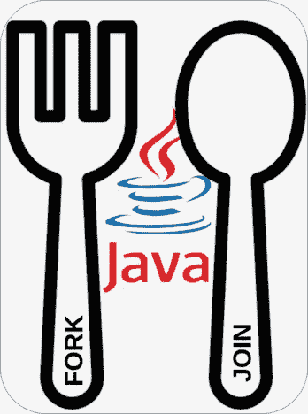

# 使用 Fork/Join 框架的 Java 并行处理

> 原文：<https://medium.com/javarevisited/parallel-processing-in-java-using-fork-join-framework-4d2861496733?source=collection_archive---------0----------------------->

## 硬件在不断发展，所以软件也要跟上。多核处理器允许并行数据处理。为了有效地使用多核微处理器并并行执行代码，Java 语言有一个 [Fork/Join 框架。](https://javarevisited.blogspot.sg/2011/09/fork-join-task-java7-tutorial.html)

