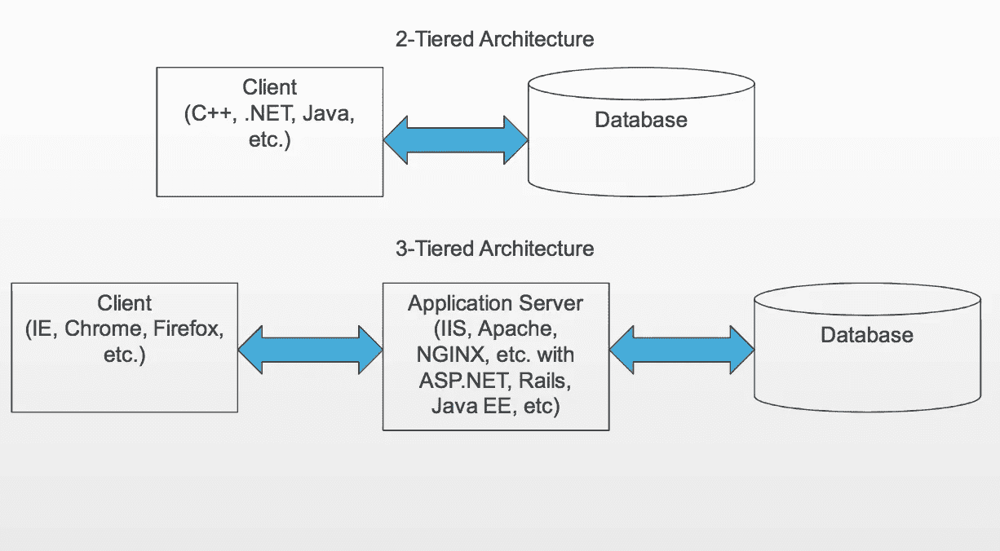
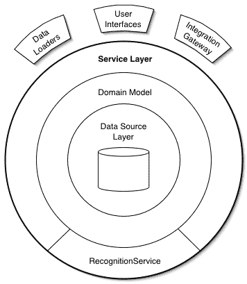

# 企业应用架构模式——组织领域逻辑

> 原文：<https://medium.com/javarevisited/patterns-of-enterprise-application-architecture-organizing-domain-logic-50efd9ea3f39?source=collection_archive---------2----------------------->

第 2 章和第 3 章概述

继续我阅读马丁·福勒的《EAA 的 T2》的旅程，这篇文章将会是关于这本书的第二章和第三章。如果你还没有阅读[第一部分](/javarevisited/patterns-of-enterprise-application-architecture-by-martin-fowler-intro-3b7f68276a67)的介绍章节，别忘了去看看。

对于这种格式，我决定不写模式的代码示例。这会让文章变得比它需要的更长，也不符合我的意图**总结**这一章的内容。

[](https://www.java67.com/2019/09/top-5-courses-to-learn-system-design.html)

图一。分层架构

# 第 1 章:分层

本章将分层作为设计复杂软件系统的核心技术。这种技术类似于分层蛋糕中各层的排列，每一层都位于下层之上。

在分层系统中，较高层使用和消费较低层公开的服务，而不知道较低层内部如何工作。

## 好处:

1.  更容易*连贯*理解一个层，而不太了解其他层。
2.  您可以用相同基本服务的替代实现来替代层。
3.  封装:您最小化了层之间的依赖性，子系统之间的松散耦合。
4.  层是标准化的好地方。TCP/IP 是标准，因为它们定义了它们的层应该如何操作。
5.  互操作性:一旦你构建了一个定义良好的层，你就可以把它用于许多其他的高级服务，例如 TCP/IP 被 FTP、SSH、HTTP 所使用。

## 缺点:

1.  层不能很好地封装所有的东西，例如，添加一个要在 UI 上显示的字段意味着将它添加到 DB 和中间的所有层。
2.  额外的层会损害性能。每一层都有额外的延迟和某种形式的数据转换。然而，封装良好的层可以进一步优化，以挤出最后一点性能。

但是分层体系结构最难的部分是知道有什么层以及每层应该有什么职责。

# 企业应用程序中各层的演变。

[](https://javarevisited.blogspot.com/2021/09/microservices-design-patterns-principles.html)

图 2:企业架构

回到 90 年代，是客户端-服务器系统的兴起。客户机是某种形式的 UI，而服务器通常是数据库服务器。对于小而简单的应用程序来说，这种设置很好，但是当应用程序决定使用复杂的领域逻辑时，问题就来了:业务规则、验证、计算等等。

这是一个没有正确解决方案的问题，无论你做什么，你都会遇到以下两个问题中的一个:

1.  将业务逻辑存储在**客户机**中是不方便的，会导致许多重复、错误，并使代码难以处理或理解。此外，无论使用哪种 UI 供应商/框架，您都会受到束缚。
2.  由于有限的结构化机制，将业务逻辑作为**存储过程存储在 DB** 中是复杂的，这又导致了笨拙的代码。

那时[面向对象](/javarevisited/6-best-object-oriented-programming-books-and-courses-for-beginners-d46235cbda49)世界正在兴起，对这个问题有了答案:进入**三层体系。**

你把你的 UI 和/或 DB 服务器从逻辑中分离出来，并把它安排在一个中间层，现在称为后端，见图 2。

# 第 2 章:组织领域逻辑

现在，我们深入探讨如何在给定的三层应用程序中组织领域逻辑的问题。这里作者提到了三种主要模式:

## 1.交易脚本

这可以被认为是存储领域逻辑的最简单的方法。*事务脚本*是一个过程，它从 UI 获取输入，用一些验证和计算来处理它，将数据存储在 [DB](/javarevisited/top-5-sql-and-database-courses-to-learn-online-48424533ac61) 中，并从其他系统调用任何操作。

**工作原理** 这种模式可以被认为是一种(**动作脚本**)方法。我们仍然会在子例程和函数中划分和安排重复的代码和逻辑，但是主要的逻辑安排风格是每个用例或动作一个脚本/方法。例如，一个零售系统会有一个*交易脚本*用于结账、向购物车添加东西等等。

*事务脚本*可以有两种组织方式:
1 .单个类:其中每个类定义一个相关事务脚本的主题区域。
2。根据*事务脚本*的类:使用[命令模式](https://en.wikipedia.org/wiki/Command_pattern#:~:text=Four%20terms%20always%20associated%20with,are%20stored%20in%20the%20command.)，你可以为你的命令定义一个超类型，指定一些*事务脚本*逻辑适合的执行方法。

**何时使用** 这种模式的荣耀在于简洁。以这种方式组织逻辑只适用于少量的逻辑。随着逻辑变得越来越复杂，这种模式将更难管理，更难扩展，也更难理解。

## 2.表格模块

> 表模块用数据库中每个表的一个类来组织域逻辑，此类的一个实例将包含对数据进行操作的各种过程。

*ِTable 模块*可以定义为处理数据库表或视图中所有行的业务逻辑的单个实例。这种模式的优势在于它允许您将数据和行为打包在一起。

**工作原理**

从表面上看，*表模块*看起来很像一个普通的物体。关键的区别在于，它对正在处理的对象没有身份的概念。要对某个特定的项目做一些有用的事情，您需要事先通过 id 获取它，例如

```
anEmployeeModule.getAddress(long employeeId)
```

通常，*表模块*与面向表的支持数据结构一起使用。这个表格形式通常是 SQL 调用的结果，保存在模拟 SQL 表的[记录集](https://wiki.c2.com/?RecordSet)中。

单词“Table”不一定表示 DB 表，这种模式适用于视图或频繁执行的查询。

**何时使用** *表格模块*基于表格数据。所以很明显，当您使用[记录集](https://wiki.c2.com/?RecordSet)和类似 SQL 的 DB 访问数据时，您会用到它。当您的访问模式涉及处理大块数据并对其进行处理时也是如此。聚合、求和以及任何类型的分析都适合这种表示。

这种模式不能让你在组织复杂系统时享受到对象的全部力量，实例到实例的关系和多态在这里不能很好地工作。

## 3.领域模型

> 领域模型是包含行为和数据的领域的对象模型。

企业软件可能会变得非常复杂，包含大量的业务规则、验证逻辑、计算和边缘案例。这种复杂性正是设计对象的目的。领域模型创建了一个相互连接的对象网络，其中每个对象代表一些有意义的个体。

**工作原理** 顾名思义，领域模型模仿了项目正在处理的**数据和业务**，最终，这就是 [DDD](https://en.wikipedia.org/wiki/Domain-driven_design) 的全部内容。一个 OO 领域模型通常看起来与 DB 模型相似，但是仍然有一些不同。

领域中通常有两种类型的领域模型:

1.  **丰富的领域模型:**这是当领域模型很复杂并且有很多移动的部分，使用继承、策略和其他著名模式的时候。
    这将导致强烈的[关系阻抗不匹配](https://en.wikipedia.org/wiki/Object%E2%80%93relational_impedance_mismatch)，并需要一个数据映射器(将在未来章节中讨论，敬请关注:)。
2.  **简单的领域模型**:这适用于小型到中型的领域模型。这种模型看起来非常像数据库模型。这种情况不需要数据映射器，可以只使用活动记录(将在以后的章节中讨论)。

人们应该小心作者所说的**臃肿的对象问题。**当一个给定的对象有一些边缘用例需要大量代码，而这些代码只在一些罕见的情况下才相关时，就会出现这个问题。

想象一个 Order 类，它和一些电子商务环境中的任何 Order 类一样有一些正常的职责，但是它有几个边缘用例，比如当用户在黑色星期五或任何其他需要检查和考虑的奇怪报价时会发生什么。

比方说，这个类有 300 行代码，其中 100 行在 95%的时间里被使用，而剩下的 200 行，只在 5%的时间里被使用。

作者在这里提到，人们试图将这样的行为从类中分离出来，放在一些特定用途的类中。然而，他不鼓励这样的努力，因为它导致一个混乱的结构，很难遵循和很难找到，并将导致相同的逻辑在最后重复。此外，他认为这样的问题并不像预测的那样频繁，所以最好在它发生时处理它，而不是过早地试图解释它。

**何时使用它** 作者在这里给出了一些何时使用它的理由，比如当你有复杂且不断变化的业务规则，涉及验证、计算等等。但是我要说的是:由于这本书是在 2002 年面向对象兴起之初写的，可以肯定地说这种方法现在已经是一种标准了。

# 服务层

> 服务层定义了应用程序与服务层的边界，服务层建立了一组可用的操作，并协调应用程序在每个操作中的响应。

[](https://medium.com/javarevisited/8-best-online-courses-to-learn-service-oriented-soa-and-microservices-architecture-94c01d6b94e6)

https://martinfowler.com/eaaCatalog/serviceLayer.html

处理域逻辑的一种常见方式是将其分为两部分:位于底层域模型或表模块之上的服务层。

在此设置中，服务层将提供:

1.  应用程序边界的清晰定义。
2.  清除应用程序上下文的 API。
3.  这是放置交易控制和安全检查等物品的天然场所。
4.  针对每个外部操作/请求的协调应用程序响应。

设计服务层的一个关键决策是**在其中加入多少行为？**要回答这个问题，我们必须绕过一个非常重要的话题。

## 各种“商业逻辑”

这里作者提到，像许多其他设计师一样，他喜欢将“业务逻辑”分为两类:

1- **领域逻辑:**纯粹与领域问题有关的逻辑，例如，在分派之前验证一些订单细节。

2- **应用程序逻辑(有时称为工作流逻辑):**与应用程序职责相关的逻辑。例如，当达到特定收入时通知经理，生成某种报告。

将两种类型的逻辑都放在域模型对象中是不可取的，因为这往往不太一致，并且很难在不同的工作流工具中重新实现应用程序逻辑，甚至很难完全重构它以使用外部工具。

回到**的问题，在服务层中放入多少行为？**作者给出了两种变体:

1.  领域外观:服务层在一种胖领域模型上实现为一组 ***瘦*** 外观。它建立了一个边界和一组操作，客户端通过这些操作与应用程序进行交互。
2.  操作脚本:服务层被实现为一组*类，这些类直接实现*应用逻辑*，但是委托给*域逻辑*的域对象类。*

# *摘要*

*正如我们所看到的，这两章讨论了软件架构中的分层概念，以及如何使用它来以一致和清晰的方式处理组织和构建“业务逻辑”的问题。*

*我很想知道你是否喜欢这个实验系列。你喜欢这种格式吗？在评论中分享你的想法！*