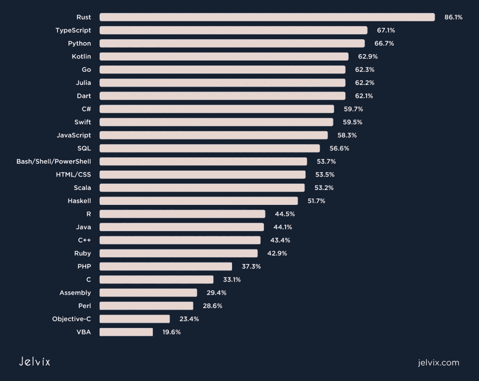
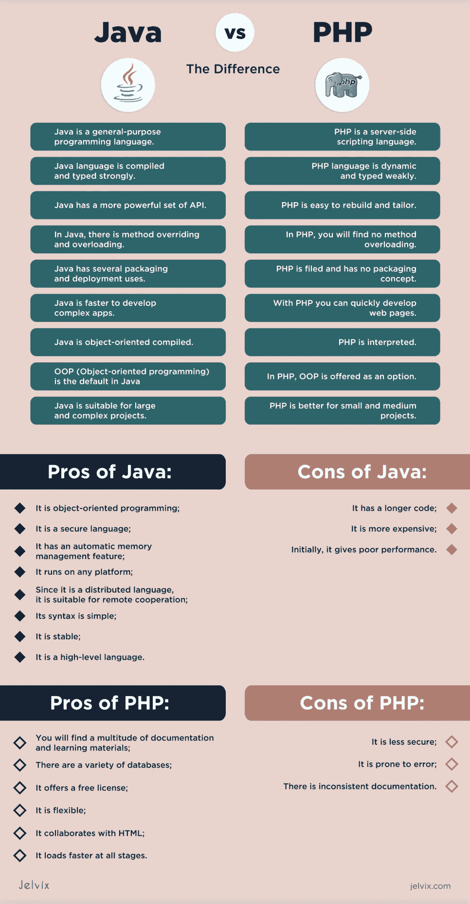

# PHP vs . Java:2022 年选择什么

> 原文：<https://medium.com/javarevisited/php-vs-java-what-to-choose-in-2022-2920d96fc18?source=collection_archive---------0----------------------->

## 你唯一需要的比较

## 很长一段时间以来，Java 和 PHP 之间一直存在竞争。我们来比较一下，看看哪个更适合你的项目。

在他们的学习阶段，许多初学者经常困惑于他们应该从哪种语言开始。这种选择通常会归结为个人喜好和自身需求。

尽管这两种语言很相似，但它们在几个方面有所不同，如指令集、面向服务器端的编程或面向对象的编程。根据需要解决的问题，这两种编程语言之间的差异可以被认为是它们的优点和缺点。

总的来说，很明显两者都有各自的优缺点，但是无论你选择哪一个，都会让你成为一名成功的开发者。

本文对这两种平台进行了公平的比较，并将帮助您选择最适合您和您的组织的方式来满足其需求。

PHP 与 JAVA——你需要的唯一对比视频

# PHP 和 Java 对比:选哪个？

# 编码和速度

Java 是一种类和[面向对象的编程语言](https://jelvix.com/blog/object-oriented-languages)。它只需要编写一次代码就可以在不同的平台上实现。代码可以在安装了 [Java 虚拟机](https://www.guru99.com/java-virtual-machine-jvm.html) (JVM)的设备上快速运行。

在 [Java](https://jelvix.com/blog/kotlin-vs-java) 中，程序员编写的源代码被改成二进制语言，供 JVM 理解和适应设备的操作系统。

相反， [PHP](https://jelvix.com/technologies/php-development) 为编码和内存消耗提供了更好的条件。在 PHP 中，代码首先被发送给解释器，然后被翻译成机器语言并被执行。

与 Java 相比，用 PHP 编写应用程序更快。

# 表演

由于这两种语言的代码解释基础不同，因此很难比较它们的性能。Java 中的代码被预编译成字节码。在 [PHP](/javarevisited/10-best-php-courses-for-beginners-and-experienced-developers-db18057a814f) 中，遵守每个请求的字节码需要时间。

虽然 [Java](/javarevisited/10-free-full-stack-java-development-courses-for-beginners-and-experienced-programmers-8473390bec03) 和 [PHP](/javarevisited/top-10-free-courses-to-learn-php-and-mysql-for-web-development-e96e69982675?source=---------34------------------) 都得到了优化，但 Java 表现出了比 PHP 更好的结果。尽管最新版本的 PHP 减少了内存消耗，但就性能而言，它还是比不上 Java。[与 PHP 相比，Java](/javarevisited/top-5-java-online-courses-for-beginners-best-of-lot-1e1e240a758) 在代码运行中表现更好。

# 安全性

谈到安全性，最新版本的 Java 提供了高级安全特性，确保了企业应用程序的高端安全性。因此，许多开发人员更喜欢 [Java](https://www.java67.com/2022/02/top-5-courses-to-learn-java-online-for.html) 而不是 PHP，因为它具有强大的安全特性。

尽管 PHP 是一种流行的编程语言，但它仍然缺乏 Java 的一些高级内置安全特性。作为开发人员，您需要利用其他 PHP 框架提供的安全特性来提高您用 PHP 创建的应用程序的安全级别。

# 稳定性

稳定性是[应用开发](https://jelvix.com/services/mobile-app-development)的一个重要方面。Java 和 PHP 已经存在很长时间了。最常见的一个论点是 PHP 代码不如 Java 代码可靠，但是哪种语言更可靠呢？

如果从稳定性上比较 Java 和 PHP，Java 更可靠。Java 允许开发人员编写更多的扩展代码。因此，它使应用程序更加稳定，并减少了应用程序频繁崩溃的机会。

# 页面加载速度

页面加载速度是任何网站的另一个重要方面。大多数用户希望在 2-3 秒内加载一个页面。稍慢一点，他们就会开始不耐烦，去别处。

通常你会得到这样的答案:Java 很慢，Java EE 应用程序没有获得与基于 PHP 的页面相同的性能。

Java 需要更多的时间来加载一个页面，特别是当它包含一些复杂的逻辑时。另一方面，PHP 加载页面很快，因为它的负载较轻，不像 JSP 引擎。

# 证明文件

Java 和 PHP 都有很长的历史，因此您将能够找到这两种编程语言的大量文档。

要看 Java 官方文档，可以去 [Oracle](https://www.oracle.com/) 。你会很容易找到你可能需要的所有信息。

PHP 从 1995 年就已经存在了。然而，您会发现它的文档有些过时，令人困惑，并且不一致。

# 流行

要比较他们的受欢迎程度，只需要看一看他们的数据就可以了。开发人员对 Java 的需求更大。

根据[的研究](https://www.statista.com/chart/21017/most-popular-programming-languages/)，19.1%的程序员愿意学习 Java，只有 6.2%的人想学习 PHP。另外，T2 的另一项研究发现，最受欢迎的语言是 Java。PHP 排名第 7。

在另一项[研究](https://insights.stackoverflow.com/survey/2020#technology-most-loved-dreaded-and-wanted-languages-loved)中，发现 44.1%的专业人士希望继续从事 Java 工作，而只有 37.3%的人希望从事 PHP 工作。

# 易于学习

PHP 和 Java 都很好学。然而，答案将取决于你以前的知识和技能。有开发者说 Java 的库太深了。其他人认为 Java 的语法比 PHP 简单，和英语相似。

如果你熟悉 [C++](https://jelvix.com/technologies/cpp-development) 或者 C，你会发现 Java 在语法上相当相似。此外，假设你了解 Oracle 和 SCRUM。在这种情况下，您将能够在开发 web 或移动应用程序时将您的技能与 Java 结合起来，而不必花时间学习这种编程语言。

# 开发成本

如果你正在做预算，PHP 是最好的选择。它编码更快，编码更便宜。此外，你不必获得执照，也不必对中小企业进行巨额投资。

谈到 Java，尽管 Oracle 允许您从许多 Java 版本中进行选择，包括 se 和 EE，但对于企业应用程序开发，您需要获得许可证，这增加了成本。

# 语言工具

app 开发的难易程度主要取决于编程语言支持的工具。

软件开发人员普遍使用 Eclipse 和 Netbeans 来编写任何级别的应用程序。除了支持那些 ide，Java 还支持 [Intellij](https://www.jetbrains.com/idea/) 、 [Notepad++](https://notepad-plus-plus.org/downloads/) 、 [DOS](https://en.wikipedia.org/wiki/DOS) 编辑器等等。它提高了开发人员编写应用程序的效率。

在使用 PHP 时，你将需要一个用于 [Eclipse](https://www.eclipse.org/) 和 [Netbeans](https://netbeans.apache.org/) 的插件。

说到调试功能，所有的编辑器都会调试 Java 应用程序。它使得 Java 开发更快更容易。PHP 只能调试打印语句。

来到打包工具，PHP 只使用打包文件，而 Java 支持多种打包工具，包括 [Maven](https://maven.apache.org/) 、 [ANT](https://ant.apache.org/) 、编辑器、Web Start。所有这些工具都允许实时开发。

# 静态类型与动态类型

由于 Java 是静态类型的，你将能够在[系统开发生命周期过程](https://jelvix.com/blog/agile-in-software-development)的初始阶段检测到错误。

另一方面，PHP 是一种动态类型语言，这意味着变量没有类型。它们可以很容易地用作字符串、数字、数组、对象，甚至函数。在 PHP 中，你不需要在使用变量之前声明它的类型。

这与 Java 之类的语言形成对比，Java 是静态类型的语言，在静态类型的语言中，变量通常在设计时具有已知的类型。

# 用例及实现

为学习而学习可能是有趣和令人兴奋的，但也可能是对时间的巨大浪费。

在你把宝贵的时间投入到一项新技术中之前，你应该首先考虑你正在从事的项目的具体类型，以及用一种特定的计算机语言你能完成的一切。毕竟技术只是达到目的的手段。

Java 作为一种通用语言，在很多情况下被开发人员使用。

**Java 用例包括:**

*   [安卓应用](https://jelvix.com/technologies/android-development)；
*   网络应用，如在线表单、Gmail、购物车等；
*   [银行](https://jelvix.com/industries/fintech)、政府、学校等领域的企业应用。像猫途鹰、Pinterest、Spotify 这样的企业使用 Java
*   Apache Tomcat、Resin、Adobe JRun 等 Web 服务器；
*   像 Eclipse、NetBeans IDE、IntelliJ Idea 等软件工具。

最初，PHP 被用于创建动态网页，但现在它被用于更重要的领域，尽管没有 Java 那么大。

**PHP 用例包括:**

*   雅虎、iStock Photo、Flickr、MailChimp 等网站；
*   ZenCart、OpenCart、UberCart 等电商 apps
*   脚本，包括 [DevOps](https://jelvix.com/blog/devops-engineer) 工具和自动化。

在你选择一种编程语言之前，一定要确定它在现实世界中的用途。Java 是一种通用语言，而 PHP 是一种服务器端脚本语言。另外，注意 Java 和 PHP 是全栈编程语言。

# 企业级 app 开发者选择哪个更好？

为公司开发基于企业的应用程序的开发者应该决定他们的新兴技术是基于 Java 还是 PHP。

谈到企业级应用程序，Java 显然已经确立了自己作为首选平台的地位。然而，许多人仍然在争论 PHP 是否可以成为一个同样合适的竞争对手。

最新的 PHP 应用程序加快了开发过程，减少了内存消耗。

另一方面，Java 实现了各种线程来管理和处理。因此，Java 速度更快，效率更高。事实上，它是搜索最多的编程语言。

尽管 PHP 和 Java 都是模块化平台，你可以付费或免费使用，但 PHP 更适合小型应用。然而，对于较大的 web 应用程序，Java 更有效。

Java 编程语言可以以一种形式与各种系统通信，包括数据库、对等网络服务、大型机后端和数据库。

因为 Java 有更好的支持工具，所以 Java 框架可以很容易地安装、很好地记录，并且在生产应用程序的监控和故障排除中很有用。

# 开发企业 mob 应用，哪个选择更好？

就像构建移动应用程序时有许多事情需要解决一样，为移动应用程序开发选择正确的编程语言是另一个需要考虑的因素。

如上所述，Java 是最流行的编程语言。然而，另一方面，PHP 是初创企业的解决方案。

Java 应用程序被称为 WORA(一次编写，随处运行)，这意味着程序员可以在一个系统上开发 Java 代码，然后在不同的 Java 系统上运行。这是可能的，因为 JVM (JAVA 虚拟机)作为一个运行时应用程序。

说到 Java，它并不把程序转换成硬件直接解释的代码。相反，它被转换成字节码(。类文件)，然后由 JVM 解释。

收集后，它会生成一个字节码文件，可以在任何使用 JVM 的系统中运行。

Java 是构建强大、可靠、可伸缩和多层应用程序的更好选择。根据开源语言的不同，任何种类的应用程序，无论是 web 应用程序、本地应用程序、基于物联网的应用程序、Android 应用程序、企业应用程序还是其他应用程序。

因此，Java 是移动应用开发的更好选择。

# 哪种语言的前景更光明？

有 700 种编程语言可以帮助企业。选择哪一个将取决于企业的需求和预算。

开发的过程对于开发者来说并不容易。每种编程语言都有其优点和缺点。

如果你在技术行业，众所周知 Java 和 PHP 是当今最流行的编程语言。两者都通过支持复杂的、面向对象的设计来实现最大的功能，从而使网站变得动态、灵敏、安全和快速。

更重要的是，Java 和 PHP 都被广泛使用，以确保未来应用程序开发的无缝进展。然而，开发人员被 Java 的流行性、安全性和丰富的语言特性所吸引。

因此，Java 现在是，将来也仍然是开发者最需要的编程语言。

# Java 与 PHP 的区别

到目前为止，您已经知道哪种编程语言在不同方面比另一种更好。但是为了让你做出更容易的决定，这里有一个 Java 和 PHP 区别的快速分类:

*   Java 是一种通用编程语言。PHP 是一种服务器端脚本语言。
*   Java 语言是编译型和强类型的。另一方面，PHP 语言是动态的，弱类型的。
*   Java 有一套更强大的 [API](https://jelvix.com/blog/what-is-api) 。PHP 很容易重建和裁剪。
*   在 Java 中，有方法覆盖和重载。在 PHP 中，你不会发现方法重载。但是，方法和函数可以有参数选择。
*   Java 有几种打包和部署用途。PHP 是归档的，没有打包概念。
*   Java 开发复杂的应用程序更快。但是，使用 PHP，你可以快速开发网页。
*   Java 是面向对象编译的。PHP 是解读的。
*   OOP ( [面向对象编程](https://jelvix.com/blog/object-oriented-languages))是 Java 中的默认。在 PHP 中，OOP 是作为一个选项提供的。
*   Java 适合大型复杂的项目。PHP 更适合中小型项目。
*   与 PHP 相比，Java 更安全。

# Java 与 PHP:显著的利弊

Java 和 PHP 都是技术行业使用的重要编程语言。然而，它们并不完全相同，这使得有时很难在它们之间做出选择。

如果你仍然很难在两者之间做出选择，这份利弊分析将帮助你做出决定。

## Java 的优点:

*   它是面向对象的编程；
*   它是一种安全的语言；
*   它具有自动内存管理功能；
*   它可以在任何平台上运行；
*   既然是分布式语言，就适合远程协作；
*   它的语法很简单；
*   它是稳定的；
*   它是一种高级语言。

## Java 的缺点:

*   它有更长的代码；
*   比较贵；
*   最初，它的性能很差。

## PHP 的优点:

*   你会发现大量的文档和学习资料；
*   有各种各样的数据库；
*   它提供一个免费的许可证；
*   它是灵活的；
*   它与 HTML 合作；
*   它在所有阶段都加载得更快。

## PHP 的缺点:

*   安全性较差；
*   它容易出错；
*   存在不一致的文档。

总而言之，Java 语言的主要好处是编程语言发展的巨大飞跃。相比之下，PHP 被迫落后，试图赶上。PHP 没有分享 Java 语言取得的许多重大突破。

# 这是一个总结！

Java 和 PHP 都有各自潜在的优缺点。

当谈到软件开发市场时，这两种语言在网站设计和提供的功能上都有着巨大的意义。

这个 Java 与 PHP 的比较旨在突出它们，帮助 web 开发人员快速决定是否使用其中一个。

不管你选择哪种语言，有一点是肯定的。如果你想在 IT 行业建立一个有前途的[职业](https://jelvix.com/company/careers)，至少学习其中一种编程语言。不管你用哪种语言编程有多好，那些寻找[合格专业人士](https://jelvix.com/services/dedicated-development-team)来完成他们的商业目标的公司总是需要它们。

*原载于*[*https://jelvix.com*](https://jelvix.com/blog/php-vs-java)*。*