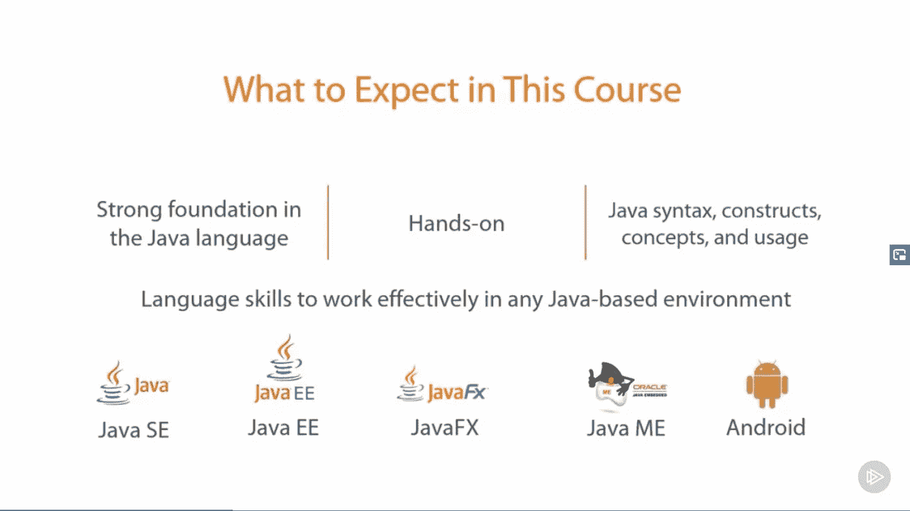
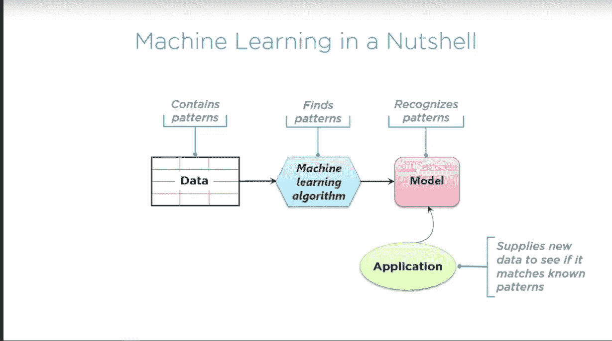
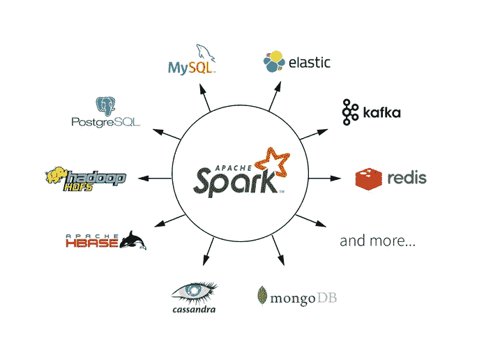
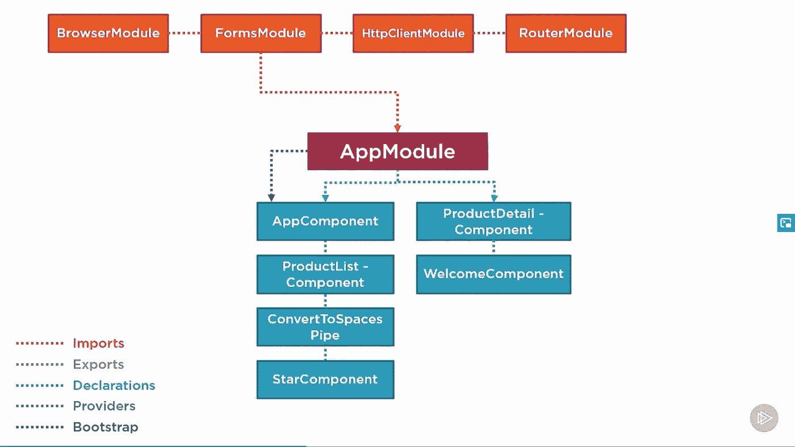
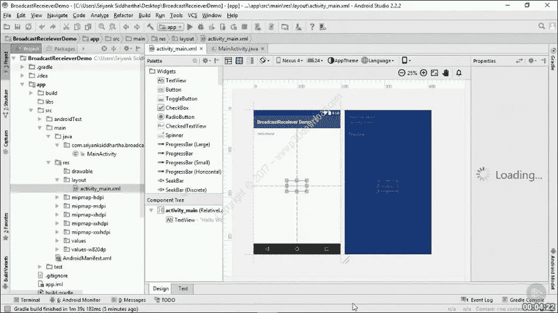

# 2023 年免费周末观光

> 原文：<https://medium.com/javarevisited/pluralsight-free-weekend-2020-3e0ff26e7a31?source=collection_archive---------0----------------------->

## 所有 Pluralsight 7000+在线课程、 **40+互动课程和 20+项目仅在本周末免费。**

免费周末观光——8 月 13 日至 15 日

大家好，我有一个好消息要和大家分享， [Pluralsight](http://pluralsight.pxf.io/c/1193463/424552/7490?u=https%3A%2F%2Fwww.pluralsight.com%2Flearn) 正在解锁他们的技术技能平台，并让他们的 7500+专家指导的视频课程和 3 个 **0+互动课程，以及 20+指导项目** **免费一个周末**仅限**11 月 19 日星期五—21 日**

> 这太棒了，不是吗？

你有机会选修你想学的任何课程，并在一个周末完成它们，这是一种学习的马拉松。

如果你想现在就开始，这里是加入的链接— [**周末免费观光**](https://pluralsight.pxf.io/c/1193463/1192599/7490)

<https://pluralsight.pxf.io/c/1193463/1192599/7490>  

顺便说一句，说实话，**一个周末算不了什么**你不能不停地学习，所以你需要挑选一些你一直想检查的最好的课程，并坚持下去，即使你完成了一两个，这也是完美利用的周末。

所以，这里有一些<http://pluralsight.pxf.io/c/1193463/424552/7490?u=https%3A%2F%2Fwww.pluralsight.com%2Flearn>**的复数课程，你可以参加或者周末观看。我尝试过包括不同垂直领域的课程，如 Java、Web 开发、数据结构和算法、Python、数据科学和机器学习、大数据和云计算、SQL、Linux 等，但这并不全面。**

**您还可以在评论中分享您最喜欢的 Pluralsight 课程，来这里寻求建议的程序员可以从中受益。**

# **2023 年 Pluralsight 免费周末要参加的 10 个最佳 Pluralsight 课程**

**因此，在不浪费你更多时间的情况下，这里有一些你可以在这个周末查看的最好的 Pluralsight 课程:**

## **1.Git 基础**

**Git 是一个流行的分布式版本控制系统(DVCS)。这是 Pluralsight 的顶级课程之一，它教您如何创建本地存储库、提交文件、将更改推送到远程存储库、修复提交中的错误，以及 Git 的许多其他功能。**

****链接加入:** — [Git 基础](https://pluralsight.pxf.io/c/1193463/424552/7490?u=https%3A%2F%2Fwww.pluralsight.com%2Fcourses%2Fgit-fundamentals)**

**它还将帮助您理解工作副本、暂存区域和存储库本身之间的区别。我的目标之一是 2023 年掌握 Git。**

****

## **2.算法和数据结构—第一和第二部分**

**在[这门课](https://pluralsight.pxf.io/c/1193463/424552/7490?u=https%3A%2F%2Fwww.pluralsight.com%2Fcourses%2Fads-part1)中，你将学习日常应用中使用的核心数据结构和算法。您将了解选择每种数据结构所涉及的权衡，以及遍历、检索和更新算法。这是包含算法和数据结构的两部分系列课程的第 1 部分。第一部分介绍了链表、栈、队列、二叉树和哈希表，第二部分介绍了图形和字符串算法。**

****链接加入:** [算法与数据结构—第一部分](https://pluralsight.pxf.io/c/1193463/424552/7490?u=https%3A%2F%2Fwww.pluralsight.com%2Fcourses%2Fads-part1)**

**<https://pluralsight.pxf.io/c/1193463/424552/7490?u=https%3A%2F%2Fwww.pluralsight.com%2Fcourses%2Fads-part1> ** 

## **3.Java 基础:Java 语言**

**这是一个针对初学者的很棒的 Java 课程。您将学习 Java 的基础知识，类、对象、数据类型、[线程](https://javarevisited.blogspot.com/2016/06/5-books-to-learn-concurrent-programming-multithreading-java.html)、文件、错误处理和其他核心 Java 概念。导师 Jim Wilson 是一位经验丰富的软件工程师，拥有 30 多年的丰富经验。

简而言之，一门从初学者角度学习 Java 的[好课程。它全面覆盖了 Java 编程语言和服务器，适用于所有基于 Java 的开发工作，例如服务器端开发和客户端开发，包括 Android 应用程序。

**链接加入课程:**](https://pluralsight.pxf.io/c/1193463/424552/7490?u=https%3A%2F%2Fwww.pluralsight.com%2Fcourses%2Fjava-fundamentals-language) [**Java 基础:Java 语言**](https://pluralsight.pxf.io/c/1193463/424552/7490?u=https%3A%2F%2Fwww.pluralsight.com%2Fcourses%2Fjava-fundamentals-language)**

****

## **4.Python 基础**

**Python 基础让你从 Python 开始，Python 是一种流行于 web 开发、大数据、科学和脚本的动态语言。导师是[奥斯汀·宾汉姆](https://medium.com/u/3c56ae1fcfcb?source=post_page-----3e0ff26e7a31--------------------------------)和@罗伯特·斯莫尔郡**

****链接加入:** [Python 基础](https://pluralsight.pxf.io/c/1193463/424552/7490?u=https%3A%2F%2Fwww.pluralsight.com%2Fcourses%2Fpython-fundamentals)**

**<https://pluralsight.pxf.io/c/1193463/424552/7490?u=https%3A%2F%2Fwww.pluralsight.com%2Fcourses%2Fpython-fundamentals> ** 

## **4.Linux 命令行界面(CLI)基础知识**

**在 AndrewMallette 的这门课程中，你将学会掌握 Linux 和 Unix 中的命令行 shell。这是为 LPIC-1 和 CompTIA Linux+认证做准备的 4 门课程中的第 2 门。**

**链接加入: [Linux 命令行界面(CLI)基础](https://pluralsight.pxf.io/c/1193463/424552/7490?u=https%3A%2F%2Fwww.pluralsight.com%2Fcourses%2Flinux-cli-fundamentals)**

**<https://pluralsight.pxf.io/c/1193463/424552/7490?u=https%3A%2F%2Fwww.pluralsight.com%2Fcourses%2Flinux-cli-fundamentals> ** 

## **6.大数据:大图景**

**这是我 2023 年要探索的新事物之一。Spark 和 Hadoop 等大数据技术是我的重点，但我会花一些时间了解更大的情况，这也是本 Pluralsight 课程将帮助我的地方。**

**链接加入— [**大数据:大图**](https://pluralsight.pxf.io/c/1193463/424552/7490?u=https%3A%2F%2Fwww.pluralsight.com%2Fcourses%2Fbigdata-bigpicture)**

**在本课程中，ZDNet 的大数据记者 Andrew Brust 将向您介绍构成大数据世界的概念、公司和技术，并设计在您的组织中采用大数据的策略。**

**<https://pluralsight.pxf.io/c/1193463/424552/7490?u=https%3A%2F%2Fwww.pluralsight.com%2Fcourses%2Fbigdata-bigpicture> ** 

## **7.理解机器学习**

**除了大数据技术，2023 年我还想探索的一件事就是机器学习。它越来越受欢迎，2023 年似乎是学习机器学习算法的正确时间。**

**如果你现在从事技术工作，你至少需要了解[机器学习](https://javarevisited.blogspot.com/2018/10/data-science-and-machine-learning-courses-using-python-and-R-programming.html)的基础知识，这是最好的 Pluralsight 课程之一，它提供了对该主题的简短介绍，假设只有基本的 IT 背景。

如果你一直在寻找机器学习的简单概述，这是你应该参加的课程。**

****以下是加入本课程的链接:** [**了解机器学习**](https://pluralsight.pxf.io/c/1193463/424552/7490?u=https%3A%2F%2Fwww.pluralsight.com%2Fcourses%2Funderstanding-machine-learning)**

****

## **8.React.js:入门**

**我最近开始做一个使用 React.js 创建视图的项目，现在我必须学习 React.js。**

**我对它有一些想法，就像它类似于[角度框架](https://javarevisited.blogspot.com/2018/06/5-best-courses-to-learn-angular.html)，但由脸书支持，但还没有深入研究，这就是为什么我选择在 2023 年参加这个多视角课程。**

**链接加入— [**React.js:入门**](https://pluralsight.pxf.io/c/1193463/424552/7490?u=https%3A%2F%2Fwww.pluralsight.com%2Fcourses%2Freact-js-getting-started)**

**<https://pluralsight.pxf.io/c/1193463/424552/7490?u=https%3A%2F%2Fwww.pluralsight.com%2Fcourses%2Freact-js-getting-started>  

本课程涵盖了 React.js 的基础知识，并为学生开始使用该库开发 web 应用程序做准备。它还解释了 React.js 的基本概念，使用一个示例 web 应用程序来演示儿童游戏中的数学技巧。** 

## **9.[星火基本面](https://pluralsight.pxf.io/c/1193463/424552/7490?u=https%3A%2F%2Fwww.pluralsight.com%2Fcourses%2Fapache-spark-fundamentals)**

**Apache Spark 是流行的大数据框架之一，也是我打算在 2023 年探索的新框架之一。**

**在我之前的文章中，我已经列出了 Pluralsight 的一些最好的 Apache Spark 在线课程，其中之一是 Pluralsight 的[Apache Spark Fundamentals](https://pluralsight.pxf.io/c/1193463/424552/7490?u=https%3A%2F%2Fwww.pluralsight.com%2Fcourses%2Fapache-spark-fundamentals)。**

**本课程将教你如何使用 Apache Spark 以闪电般的速度分析你的大数据；将 Hadoop 远远甩在身后！。如果你需要更多的课程，请点击这里查看我的完整列表。**

**下面是加入的链接: [**阿帕奇星火基础**](https://pluralsight.pxf.io/c/1193463/424552/7490?u=https%3A%2F%2Fwww.pluralsight.com%2Fcourses%2Fapache-spark-fundamentals)**

****

## **10.[角度:入门](https://pluralsight.pxf.io/c/1193463/424552/7490?u=https%3A%2F%2Fwww.pluralsight.com%2Fcourses%2Fangular-2-getting-started-update)**

**这是 Pluralsight 的另一个顶级 Angular 2 球场。本课程将教你使用 Angular 框架创建可测试的、MVC 风格的单页应用程序所需的 Angular 基础知识。**

**特别是，你将学习如何引导你的角度应用；使用角度标记和表达式；创建和使用控制器；使用内置服务，并创建自定义服务。**

**您还将学习使用 [Angular](http://www.java67.com/2018/01/top-5-free-angular-js-online-courses-for-web-developers.html) 和 MVC 模式的测试驱动开发，并学习使用路由将您的应用程序转变为 SPA，以及创建您自己的定制元素和使用指令处理事件。**

**你可以在 2023 年参加《Angular 入门》之后参加这个课程，以便更好地学习 Angular。**

****以下是加入本课程的链接** — [**Angular:入门**](https://pluralsight.pxf.io/c/1193463/424552/7490?u=https%3A%2F%2Fwww.pluralsight.com%2Fcourses%2Fangular-2-getting-started-update)**

****

## **11.[Android 开发简介](https://pluralsight.pxf.io/c/1193463/424552/7490?u=https%3A%2F%2Fwww.pluralsight.com%2Fcourses%2Fandroid-intro)**

**这是一个从初学者的角度学习 Android 的很好的课程，由 John Sonmez 教授，他是 Pluralsight 上最好的讲师之一。我在上一篇文章中已经列出了 Pluralsight 的一些最佳 Android 课程。**

**这包括 Android 的初级和中级课程。如果你也在学习 Android 或者在 2023 年提高你的 Android 技能，你可以在这里看看我的 Java 程序员入围 Android 课程的完整列表[。](http://javarevisited.blogspot.com/2017/12/top-5-android-online-training-courses-for-Java-developers.html)**

**以下是加入课程的链接— [**安卓开发入门**](https://pluralsight.pxf.io/c/1193463/424552/7490?u=https%3A%2F%2Fwww.pluralsight.com%2Fcourses%2Fandroid-intro)**

****

**这是一个很好的机会来尝试你一直想在 Pluralsight 上尝试的课程，但因为你没有订阅而无法尝试。我强烈推荐[**plural sight**](https://pluralsight.pxf.io/c/1193463/424552/7490?u=https%3A%2F%2Fwww.pluralsight.com%2Flearn)**订阅服务，每月费用约 29 美元或每年 299 美元，但可以访问他们的 7000 多门在线课程。****

****因为**一个周末什么都不是，但它确实给了你一个不用花一分钱就能体验这个平台及其优质课程、项目和互动练习的机会。**

**在 [**免费周末**](https://pluralsight.pxf.io/c/1193463/1192599/7490) 派对持续期间享受这些课程。如果你在这个周末有其他精彩的课程，或者以前学过，请和我们分享。**

**<https://pluralsight.pxf.io/c/1193463/1192599/7490>  

其他**免费在线课程**你可能喜欢探索
[5 门免费课程学习 Git 和 Github](http://javarevisited.blogspot.sg/2018/01/5-free-git-courses-for-programmers-to-learn-online.html#axzz568Oo1Jao)
[完整的 DevOps 开发者路线图](https://hackernoon.com/the-2018-devops-roadmap-31588d8670cb?gi=1490c6cb9f25)
[前 5 门课程学习 Jenkins](https://javarevisited.blogspot.com/2018/09/top-5-jenkins-courses-for-java-and-DevOps-Programmers.html)
[5 门免费 Eclipse 和 JUnit 课程学习 Java 开发者](http://www.java67.com/2018/02/5-free-eclipse-and-junit-online-courses-java-developers.html)
[10 门 DevOps 课程学习经验丰富的开发者](https://javarevisited.blogspot.com/2018/09/10-devops-courses-for-experienced-java-developers.html)
[5 门免费在线培训课程学习 Angular](http://www.java67.com/2018/01/top-5-free-angular-js-online-courses-for-web-developers.html)
[5 门免费课程](http://www.java67.com/2018/02/5-free-blockchain-technology-courses.html)
[5 门免费的 Kubernetes for DevOps 课程](https://javarevisited.blogspot.com/2019/01/top-5-free-kubernetes-courses-for-DevOps-Engineer.html)
[Pluralsight vs CodeCademy vs Udemy](/javarevisited/pluralsight-or-udemy-d9a94d2e8ee)
[7000+免费的面向程序员的 Pluralsight 课程](/javarevisited/7000-free-pluralsight-courses-to-build-in-demand-tech-skills-without-leaving-your-house-40edb50a8cf2)
[面向 Java 和 Web 开发人员的 10 大 plural sight 课程](/javarevisited/top-10-pluralsight-courses-to-learn-programming-and-software-development-during-covid-19-stay-at-30b7d8a4f88f?source=---------11------------------)

谢谢你读到这里。我希望你能从 Pluralsight 的慷慨提议中受益，并在这个周末学到一些新东西。

**附言——**如果你看不到他们的 [**Pluralsight 免费周末**](http://pluralsight.pxf.io/c/1193463/424552/7490?u=https%3A%2F%2Fwww.pluralsight.com%2Flearn) 优惠或面临任何其他问题，请在这里回复，我们也许能在某些方面帮助或指导你。这又是一个链接:

<https://pluralsight.pxf.io/c/1193463/934665/7490> **