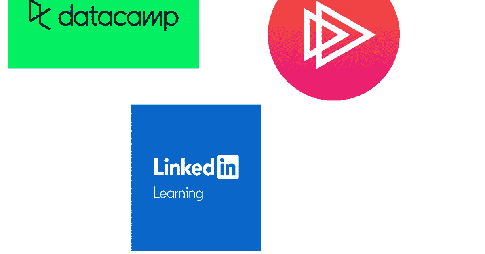
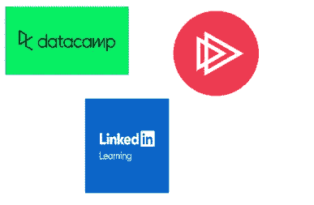
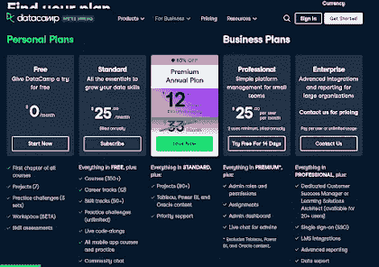

# 回顾—plural sight vs LinkedIn Learning vs data camp？2023 年学习科技技能最好的在线平台是哪个？

> 原文：<https://medium.com/javarevisited/pluralsight-vs-linkedin-learning-vs-datacamp-fb602129bfdc?source=collection_archive---------1----------------------->

## 想知道 2023 年加入哪个在线学习平台？Pluralsight，LinkedIn Learning 还是 Datacamp？让我们找出最适合您需求的平台。

伙计们，如果你想知道哪个在线平台最适合学习热门技术技能，如 Python、数据科学、SQL、Java、Web 开发等，或者你对 [Datacamp](https://datacamp.pxf.io/c/1193463/1012793/13294) 、 [Pluralsight](http://pluralsight.pxf.io/c/1193463/424552/7490?u=https%3A%2F%2Fwww.pluralsight.com%2Flearn) 和 [LinkedIn Learning](http://pluralsight.pxf.io/c/1193463/424552/7490?u=https%3A%2F%2Fwww.pluralsight.com%2Flearn) 感到困惑，那么你来对地方了。

在过去，我已经回顾了[*Udemy vs Pluralsight*](/javarevisited/pluralsight-or-udemy-d9a94d2e8ee)和[*CodeCademy vs plural sight*](/javarevisited/codecademy-or-pluralsight-which-is-a-better-platform-to-learn-coding-skills-59251a080642)，在本文中，我将通过 Datacamp 和 LinkedIn Learning 来回顾 plural sight。

老实说，****和 [Pluralsight](https://javarevisited.blogspot.com/2021/11/pluralsight-free-weekend-7500.html#axzz7CdcuJdWs) 是我学习任何东西的首选平台，但最近我也开始探索新的专业学习平台和网站，如 Educative、Datacamp 和 LinkedIn Learning，我特别发现 Datacamp 非常适合学习数据科学和 SQL 等数据技能。****

****同样，我还发现 [Educative.io](https://bit.ly/3l0CNy84) 非常适合准备编码面试，因为他们有最好的编码面试课程，而且他们也是一个非常互动和经济高效的学习平台。****

****同样， [LinkedIn Learning 的](https://javarevisited.blogspot.com/2021/01/top-10-linkedin-learning-courses-for-java-spring-developers.html#axzz6jtCYjOiK)小课程和综合目录也是许多想要短暂爆发技术知识的有经验学习者的有趣选择。****

****在线教育让你在你想要的时间里倾斜，这意味着你在学习和时间上有灵活性，你为自己设定更好的时间管理。它还允许你以自己的风格和速度学习，这有助于你获得更多的信息，如果你没有很好地理解某些东西，你甚至可以停止视频并返回到其他许多优点。****

****由于这些优势，许多企业家创建了他们的电子学习平台，并开始提供在线课程，以在 2026 年前获得 4578 亿美元的市场规模。大多数人和员工使用三个最好的电子学习平台来接受教育: [Pluralsight](https://javarevisited.blogspot.com/2017/12/top-10-pluralsight-courses-java-and-web-developers.html) 、 [DataCamp](https://javarevisited.blogspot.com/2021/09/top-datacamp-courses-to-learn-python.html) 和 [Linkedin Learning。](/javarevisited/10-best-linkedin-learning-courses-for-java-programmers-fd5ae9ff1358)****

**** [## 为个人培养更好的技术技能| Pluralsight

### 培养从网络安全到软件开发等各方面的技能。然后利用这些技能…

pluralsight.pxf.io](http://pluralsight.pxf.io/c/1193463/424552/7490?u=https%3A%2F%2Fwww.pluralsight.com%2Flearn) 

# Data camp vs . plural sight vs . LinkedIn Learning 在 2023 年学习 IT 技能和数据技能

现在，让我们来看看这些在线学习平台中的每一个，并了解它们的优势和劣势，以找出 2023 年学习编码、编程、技术和数据技能的合适平台。

我根据每个平台的定价、内容质量以及总体学习体验对它们进行了比较。

我还包括了他们的免费选项，例如 LinkedIn learning 提供 30 天免费试用，而 Pluralsight 只提供 10 天免费试用，但 Datacamp 为初学者提供免费计划。

## 1.[复数视线](http://pluralsight.pxf.io/c/1193463/424552/7490?u=https%3A%2F%2Fwww.pluralsight.com%2Flearn)

Pluralsight 是一家成立于 2004 年的美国公司，被认为是老牌在线教育平台之一。他们拥有 100 万用户，并在 2019 年创造了超过 5 亿美元的收入，这太疯狂了。Pluralsight 提供 IT 行业的课程，网络行业的一些课程，数据专业人员的一些课程，以及许多其他行业的课程。

Pluralsight 不像 DataCamp，你可以创建一个免费帐户，免费享受其中的一些内容。相反，它提供了为期 10 天的免费试用**，每月 29 美元起，这让你可以有限地访问一些课程及其功能，因此它可以让你概述 Pluralsight 的工作方式及其课程质量，但你需要付费才能继续学习。**

**此外，它还为团队和组织制定了一些计划，每个用户每年可获得高达 779 美元的费用。**

**许多企业选择利用这个平台来教育他们的员工。它只接受在该领域有经验的教师来创造和与他人分享他们的经验，并从他们的课程中获得佣金。Pluralsight 是一个物有所值的平台，需要你花时间学习新事物。**

**目前，Pluralsight 正在为他们的年度和高级计划提供高达 40%的折扣**，其中包括 7500 多门课程、项目和互动学习材料。如果你想提高你的技术技能或准备云认证，加入 Pluralsight 是一个很好的主意，如果你现在就做，你还可以节省一大笔钱。****

************

## ******2.[数据营](https://datacamp.pxf.io/c/1193463/1012793/13294)******

******DataCamp 是一个创建于 2013 年的在线学习平台。它旨在通过包含视频和文本的在线课程专业地教授人们数据科学和编程。******

******这些课程由已经在 DataCamp 公司工作的老师设计。他们在自己的领域有丰富的经验，而不仅仅是像你在许多其他平台上看到的业余教师。******

******该平台提供了许多[定价计划](https://datacamp.pxf.io/c/1193463/1012793/13294?u=https%3A%2F%2Fwww.datacamp.com%2Fpricing)，其中一个完全免费，并为您提供一些课程内容的概述以及一些其他功能，如项目组合等。******

******如果您计划深入平台中的任何主题，此计划将不适合您，但它将为您提供平台内容的概述，您可以决定升级您的计划或与另一个竞争对手合作。******

******其他计划专门针对小团队和公司，让他们创建一个帐户，并将其员工添加到帐户中，以获得更低的价格，并在他们学习新事物时为您的团队提供更好的管理。******

******你可能想知道 DataCamp 的课程和证书值不值？我会说**是的**因为有经验的老师创造了它们，它们被知名公司如 Paypal 和优步的员工使用。******

****Datacamp 最棒的一点是，现在他们在年度计划中提供高达 63%的折扣****，这意味着如果你想在 2023 年学习 Python、数据科学和 SQL 等数据技能，那么你应该现在就加入 Datacamp，利用这个惊人的优惠。********

************

# ******3.[领英学习](http://linkedin-learning.pxf.io/c/1193463/449670/8005)******

******LinkedIn Learning 是一家美国公司，致力于像前两家一样教授人们各种行业和 IT 行业。这家公司是 LinkedIn 的子公司，LinkedIn 是世界上最大的专业人士求职或公司招聘平台之一。******

******LinkedIn Learning 为其用户提供为期 1 个月的免费试用，起价为每月 29.99 美元，如果你有兴趣从这个平台获得更多教育，你可以注册每年 19.99 美元的年度计划，这比每月计划便宜得多。******

******它还为团队和企业提供更低成本的项目，你需要先联系他们，他们为你创建一个报价。******

******如果你是你所在行业的专业人士，你可以在这个平台上注册成为一名讲师，通过教别人赚钱。这意味着不是任何人都可以在这个平台上教学，这使得它值得使用，并在完成你的课程后获得认证。******

************

## ******结论******

******总之，所有这些在线学习平台，Datacamp、Pluralsight 和 LinkedIn Learning 都擅长教你 IT 行业的新技能，或者只是学习商业和营销的新技能，你需要选择你认为适合你的正确平台并坚持下去。******

******如果你想学习 Python、数据科学和 SQL 等数据技能，那么 Datacamp 是最好的平台，如果你需要一个单一的平台来学习任何技术，那么 Pluralsight 和 LinkedIn Learning 是 2023 年加入的最佳选择。******

******您可能喜欢的其他**编程**和**开发**文章:******

*   ****[Udemy vs LinkedIn learning vs edu reka](https://javarevisited.blogspot.com/2020/10/udemy-vs-edureka-vs-linkedin-learning.html#axzz6vVPaF500)****
*   ****[2023 年学习 Python 的十大 Udemy 课程](https://javarevisited.blogspot.com/2020/05/top-10-udemy-courses-to-learn-python-programming.html)****
*   ****[20 多个网站免费学习编码](https://dev.to/javinpaul/top-20-websites-to-learn-coding-with-java-python-sql-algorithms-and-git-for-free-in-2019-best-of-lot-l2l)****
*   ****[Udemy vs Pluralsight 评论——哪个更好？](https://javarevisited.blogspot.com/2019/10/udemy-vs-pluralsight-review-which-is-better-to-learn-code.html)****
*   ****[学习 Java 和 Spring 的 15 大 Udemy 课程](/javarevisited/top-15-java-and-spring-framework-courses-from-udemy-best-of-lot-d7b965b62a9f?source=rss------java-5)****
*   ****[plural sight vs Codecademy Review——哪个更好？](https://javarevisited.blogspot.com/2019/10/pluralsight-vs-codecademy-which-is-best-online-learning-platform.html)****
*   ****[2023 年 Coursera Plus 值得吗](https://javarevisited.blogspot.com/2020/08/coursera-plus-better-way-to-take-coursera-courses-specilizations-certification.html#axzz6oofWUIUh)****
*   ****[面向程序员的 DevOps 路线图](https://javarevisited.blogspot.com/2018/09/the-2018-devops-roadmap-your-guide-to-become-DevOps-Engineer.html)****
*   ****[我最喜欢的学习数据结构和算法的免费课程](https://www.freecodecamp.org/news/these-are-the-best-free-courses-to-learn-data-structures-and-algorithms-in-depth-4d52f0d6b35a/?gi=a41bf34d0c99)****
*   ****[2023 年 Java 开发者能记住的 10 件事](/swlh/10-things-java-developer-should-learn-in-2019-5e0cf388e07f)****
*   ****[Java 和 Web 开发人员应该学习的 10 个框架](https://dev.to/javinpaul/10-frameworks-java-and-web-developers-can-learn-in-2019-17ke)****
*   ****[10 门免费 Python 编程课程在线学习](https://javarevisited.blogspot.com/2018/12/10-free-python-courses-for-programmers.html)****
*   ****[2023 年学数据库和 SQL 的 5 门课程](https://hackernoon.com/top-5-sql-and-database-courses-to-learn-online-48424533ac61)****
*   ****[2023 年 Java 开发者路线图](https://javarevisited.blogspot.com/2019/10/the-java-developer-roadmap.html)****
*   ****[2023 年学习 Python 的 5 大课程](https://hackernoon.com/top-5-courses-to-learn-python-in-2018-best-of-lot-26644a99e7ec)****
*   ****[前端和后端开发者路线图](https://hackernoon.com/the-2019-web-developer-roadmap-ab89ac3c380e)****
*   ****[学习 JavaScript 的十大 Pluralsight 课程](https://www.java67.com/2020/08/top-10-pluralsight-courses-to-learn-JavaScript.html)****
*   ****[学习 React.js 的十大 Pluralsight 课程](https://javarevisited.blogspot.com/2020/08/top-10-pluralsight-courses-to-learn-React.js.html)****

****感谢您阅读本文。如果你喜欢我对 2023 年学习 IT 技能和数据技能的*Data camp vs . plural sight vs . LinkedIn Learning 的评论，请分享给你的朋友和同事。如果您有任何问题或反馈，请留言。*****

******P. S. —** 如果你正在寻找免费的在线网站和平台免费学习编码，不要着急；你会在 Udemy 上找到很多免费课程。如果你需要更多的选择，你也可以在 Medium 上查看这个 [**20+网站免费学习编码**](/javarevisited/top-20-sites-to-learn-coding-in-2020-f57ff63d9cb3) 的列表。****

**** [## 为个人培养更好的技术技能| Pluralsight

### 培养从网络安全到软件开发等各方面的技能。然后利用这些技能…

pluralsight.pxf.io](http://pluralsight.pxf.io/c/1193463/424552/7490?u=https%3A%2F%2Fwww.pluralsight.com%2Flearn)****