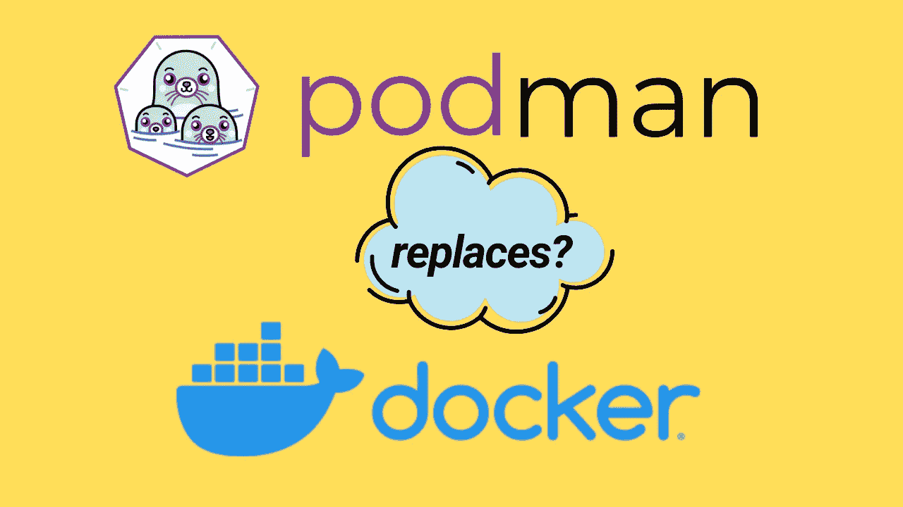

# 波德曼:开始

> 原文：<https://medium.com/javarevisited/podman-getting-started-e7fc06961994?source=collection_archive---------1----------------------->

## 你的入门指南启动波德曼之旅



*这个帖子是根据我在*[*TechPrimers*](https://www.youtube.com/TechPrimers/)*做的视频。如果你喜欢视频格式，视频的链接是* [*这里是*](https://www.youtube.com/watch?v=Za2BqzeZjBk)

# 波德曼是什么？和 Docker 有什么不同？

[Podman](https://podman.io/) 是一个可以运行 OCI 兼容镜像的无后台容器引擎。它只能在 Linux 机器上运行(目前)。如果您有 Windows 或 OSX，您将必须在 VM Box 或 Hyperkit 中使用虚拟 Linux VM。

[Docker](/javarevisited/top-5-free-courses-to-learn-docker-for-beginners-best-of-lot-b2b1ad2b98ad?source=collection_home---4------2-----------------------) 和 podman (Pod 管理工具)之间的主要区别是—

*   daemoneless——这个特性不同于 docker，后者运行一个 Docker 守护进程来执行任务。Podman 是轻量级的，不需要一个始终运行的实例来运行容器。
*   无根——Podman 可以根用户或非根用户身份运行。我们可以以非根用户的身份运行 podman 容器，并且仍然与运行的容器兼容。
*   豆荚——豆荚一词源自 Kubernetes。pod 是尽可能紧密运行的容器的集合。Podman 提供了开箱即用的特性，可以一起运行多个容器。

# 在 Linux 中安装 Podman

基于你的运行时，你可以从官方文档[这里](https://podman.io/getting-started/installation.html)选择安装 Podman 的步骤。我将使用带 [Linux](/javarevisited/top-10-courses-to-learn-linux-command-line-in-2020-best-and-free-f3ee4a78d0c0?source=collection_home---4------0-----------------------) 的[亚马逊 EC2](https://javarevisited.blogspot.com/2020/08/top-5-courses-to-learn-amazon-aws-ec-2.html) ，因此我将使用以下命令:

```
sudo curl -L -o /etc/yum.repos.d/devel:kubic:libcontainers:stable.repo https://download.opensuse.org/repositories/devel:/kubic:/libcontainers:/stable/CentOS_7/devel:kubic:libcontainers:stable.repo
sudo yum -y install yum-plugin-copr
sudo yum -y copr enable lsm5/container-selinux
sudo yum -y install podman
```

要验证是否成功安装了 podman，我们可以检查 podman cli 的版本。在这种情况下，我使用的是 podman cli 的 1.9.3 版本。

```
podman versionVersion:            1.9.3
RemoteAPI Version:  1
Go Version:         go1.13.4
OS/Arch:            linux/amd64
```

如果你熟悉 [docker](/javarevisited/top-10-free-courses-to-learn-jenkins-docker-and-kubernetes-for-devops-in-2020-best-of-lot-62a0541ffeb3) 的话，所有的命令在 podman 中都以相同的格式工作。在波德曼网站上也有一个[入门](https://podman.io/getting-started/)页面。

下面列出了一些最常用的命令

```
podman ps
CONTAINER ID  IMAGE  COMMAND  CREATED  STATUS  PORTS  NAMESpodman images
REPOSITORY   TAG   IMAGE ID   CREATED   SIZE
```

# 如何用波德曼运行 Docker 图像？

为了运行容器，我将使用一个现有的 [Docker 映像](/javarevisited/top-15-online-courses-to-learn-docker-kubernetes-and-aws-for-fullstack-developers-and-devops-d8cc4f16e773)，它是我不久前用 Docker 构建的。该图像出现在 Github 包注册表(docker.pkg.github.com)[这里](https://github.com/TechPrimers/container-images/packages/39986)。

要从 Github 包注册表中提取映像，我们需要将 podman cli 与注册表连接起来

```
podman login docker.pkg.github.com -u MovingToWeb
Password:
Login Succeeded!
```

登录成功后，我将使用`podman pull`命令提取我们需要的图像

```
podman pull docker.pkg.github.com/techprimers/container-images/containers-demo:v2Trying to pull docker.pkg.github.com/techprimers/container-images/containers-demo:v2...
Getting image source signatures
Copying blob f910a506b6cb done
Copying blob c2274a1a0e27 [==================================] 67.5MiB / 67.5MiB
Copying blob f1e7efdf3e83 done
Copying blob e7c96db7181b done
Copying config d0871171aa done
Writing manifest to image destination
Storing signatures
d0871171aaf802ebb4a80c6f2ec9ea6de95f957529bc89e1bae7d294a83e64a5Summary
```

`podman images`显示本地缓存中下载的图像

```
podman imagesREPOSITORY                                                           TAG   IMAGE ID       CREATED         SIZE
docker.pkg.github.com/techprimers/container-images/containers-demo   v2    d0871171aaf8   11 months ago   125 MB
```

该图像包含一个 [Spring Boot 包](/javarevisited/10-advanced-spring-boot-courses-for-experienced-java-developers-5e57606816bd?source=collection_home---4------0-----------------------)，其中启用了执行器。我们可以使用下面的 podman 命令将该映像作为守护进程容器运行

```
podman run -dt -p 8080:8080 containers-demo:v2
2270e63621e8b7f6db6f17c9eb3c8bfe4270ff208d95462139651b6c2532a56cpodman ps
CONTAINER ID  IMAGE                                                     COMMAND  CREATED         STATUS             PORTS                   NAMES
2270e63621e8  docker.pkg.github.com/techprimers/container-images/containers-demo:v2           11 seconds ago  Up 10 seconds ago  0.0.0.0:8080->8080/tcp  mystifying_edison
```

该命令启动一个新的容器，并将本地虚拟机的端口`8080`映射到容器的`8080`，因为 [spring boot app](/javarevisited/top-10-free-courses-to-learn-spring-framework-for-java-developers-639db9348d25) 正在`8080`上运行。

为了检查日志，`podman logs <CONTAINER_ID>`命令将帮助我们

```
podman logs 2270e63621e8.   ____          _            __ _ _
 /\\ / ___'_ __ _ _(_)_ __  __ _ \ \ \ \
( ( )\___ | '_ | '_| | '_ \/ _` | \ \ \ \
 \\/  ___)| |_)| | | | | || (_| |  ) ) ) )
  '  |____| .__|_| |_|_| |_\__, | / / / /
 =========|_|==============|___/=/_/_/_/
 :: Spring Boot ::        (v2.2.0.RELEASE)2020-09-25 12:21:21.257  INFO 1 --- [           main] c.t.c.ContainersDemoApplication          : Starting ContainersDemoApplication v0.0.1-SNAPSHOT on 2270e63621e8 with PID 1 (/containers-demo.jar started by root in /)
2020-09-25 12:21:21.261  INFO 1 --- [           main] c.t.c.ContainersDemoApplication          : No active profile set, falling back to default profiles: default
2020-09-25 12:21:24.712  INFO 1 --- [           main] o.s.b.w.embedded.tomcat.TomcatWebServer  : Tomcat initialized with port(s): 8080 (http)
2020-09-25 12:21:24.753  INFO 1 --- [           main] o.apache.catalina.core.StandardService   : Starting service [Tomcat]
2020-09-25 12:21:24.753  INFO 1 --- [           main] org.apache.catalina.core.StandardEngine  : Starting Servlet engine: [Apache Tomcat/9.0.27]
2020-09-25 12:21:24.937  INFO 1 --- [           main] o.a.c.c.C.[Tomcat].[localhost].[/]       : Initializing Spring embedded WebApplicationContext
2020-09-25 12:21:24.937  INFO 1 --- [           main] o.s.web.context.ContextLoader            : Root WebApplicationContext: initialization completed in 3533 ms
2020-09-25 12:21:26.925  INFO 1 --- [           main] o.s.s.concurrent.ThreadPoolTaskExecutor  : Initializing ExecutorService 'applicationTaskExecutor'
2020-09-25 12:21:27.474  INFO 1 --- [           main] o.s.b.a.e.web.EndpointLinksResolver      : Exposing 2 endpoint(s) beneath base path '/actuator'
2020-09-25 12:21:27.625  INFO 1 --- [           main] o.s.b.w.embedded.tomcat.TomcatWebServer  : Tomcat started on port(s): 8080 (http) with context path ''
2020-09-25 12:21:27.628  INFO 1 --- [           main] c.t.c.ContainersDemoApplication          : Started ContainersDemoApplication in 7.456 seconds (JVM running for 8.582)
```

既然应用程序已经启动并运行，让我们访问容器的`actuator`端点，我们可以使用 curl 来验证应用程序的状态

```
curl [http://localhost:8080/actuator/health](http://localhost:8080/actuator/health)
{"status":"UP"}
```

我还没有介绍使用 Podman 的构建部分。请尝试从 docker 文件构建图像。他们应该与 Docker 无缝运行，因为波德曼也遵循 OCI 兼容的图像格式。

# 摘要

简而言之，Podman 总结了 Docker 的特性，提供了一个轻量级的容器运行时，可以作为 Daemonless 和 Rootless 模式运行。

我们走，波德曼！