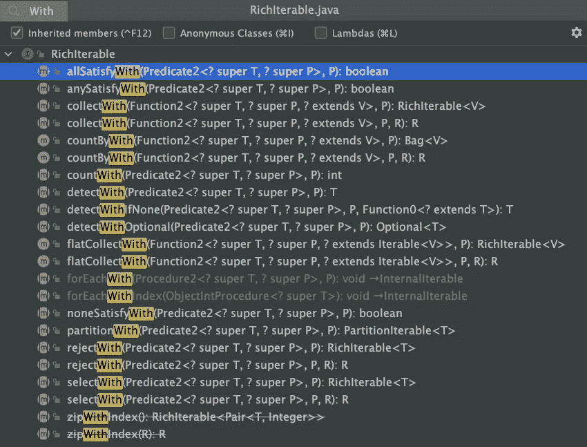

# 介词偏好

> 原文：<https://medium.com/javarevisited/preposition-preference-1f1c709b098b?source=collection_archive---------3----------------------->

怎么了？一个介词。


照片摄于新泽西州汉密尔顿的雕塑场地

我在罗格斯大学的一个朋友总是会回答这样一个问题:“你好吗？”一致的回答是:“一个介词。”我陷入这个陷阱太多次了。

# 你有没有想过我们在 Java APIs 中使用了多少介词？

我们在 [Eclipse 集合](https://github.com/eclipse/eclipse-collections)的方法中使用了几个不同的介词。每一个都表达了不同的意思。在 Eclipse 集合中多次出现的介词有`with`、`of`、`by`、`as`、`to`、`from`、`into`。当我们在方法名中使用介词时，它应该有助于清楚地表达意思。如果没有，那么没有它我们会过得更好。

## 两个介词进入。一个介词离开。

在今年的 JavaOne 大会上，我描述了我们曾经在两个介词之间为命名 Eclipse Collections API 中的集合工厂方法而发生的一场战斗。这场战斗发生在`of`和`with`之间。

```
MutableList<String> list = Lists.mutable.**of**("1", "2", "3"); ***vs.***MutableList<String> list = Lists.mutable.**with**("1", "2", "3");
```

经过激烈的辩论，我们最终为我们的集合工厂类提供了两种选择。我们认为这是一个我们可以提供多种选择的地方，允许开发者使用他们自己的偏好。然而，这并不是故事的结尾。有时候，我们要赢得的不仅仅是一场战斗。

介词`of`和`with`都可以很好地命名创建集合的工厂方法。我个人更喜欢`with`，主要是因为这是 Smalltalk 使用的。在 Smalltalk 中，我会定期写下以下内容:

```
|set|
set := Set **with**: ‘1’ **with**: ‘2’ **with**: ‘3’.
```

下面是对 Eclipse 集合使用 Java 的等效例子。

```
MutableSet<String> set = Sets.mutable.**with**("1", "2", "3");
```

如果您愿意，也可以使用 工厂方法的 ***创建一个集合。***

```
MutableSet<String> set = Sets.mutable.**of**("1", "2", "3");
```

还有一些表单将一个`Iterable`作为参数。这些被称为`ofAll`和`withAll`。

在`java.util.Collection`中，有在集合中添加和删除元素的方法。它们被命名为`add`、`addAll`、`remove`和`removeAll`。这四个方法返回`boolean`。这使得他们不适合流畅地编写代码。

我们在 Eclipse 集合中有自己的可变接口，所以我们知道可以通过使用两个介词中的一个来解决流畅性问题。我们决定用`with`，因为`with`有一个名为`without`的自然反义词。

```
Set<String> set = 
    Sets.***mutable***.with(**"1"**, **"2"**, **"3"**)
        .with(**"4"**)
        .without(**"2"**);Assert.*assertEquals*(Sets.***mutable***.with(**"1"**, **"3"**, **"4"**), set);
```

当通过`Iterable`添加元素时，这种命名模式也工作得很好。

```
Set<String> set =
        Sets.***mutable***.with(**"1"**, **"2"**, **"3"**)
                .withAll(Lists.***mutable***.with(**"4"**))
                .withoutAll(Lists.***mutable***.with(**"1"**, **"3"**));Assert.*assertEquals*(Sets.***mutable***.with(**"2"**, **"4"**), set);
```

如您所见，我们有`with`、`withAll`、`without`和`withoutAll`作为直接在我们的可变集合上的实例方法。这些方法不是返回像 add 或 remove 这样的布尔值，而是返回`this`，这是该方法正在操作的集合。这些方法与返回`boolean`的集合上的现有方法具有良好的[对称性](/@donraab/symmetric-sympathy-2c59d4541d60)，彼此之间也是如此。

我们也将这种模式扩展到了不可变集合中。

```
ImmutableSet<String> set =
        Sets.***immutable***.with(**"1"**, **"2"**, **"3"**)
                .newWithAll(Lists.***mutable***.with(**"4"**))
                .newWithoutAll(Lists.***mutable***.with(**"1"**, **"3"**));Assert.*assertEquals*(Sets.***mutable***.with(**"2"**, **"4"**), set);
```

在可变的情况下，`withAll`和`withoutAll`方法改变了现有的集合。在`newWithAll`和`newWithoutAll`的情况下，每次都返回一个新的集合，从而保持了原始集合的不变性。

## 克隆人的进攻

介词`of`在 Eclipse 集合中输掉了基于实例的集合工厂方法之战，因为`of`没有像`with`那样的好的自然反义词。也就是说，`of`有时是 Eclipse 集合 API 中其他方法名的重要部分。

```
**// Bag API - occurrencesOf** MutableBag<String> bag = Bags.***mutable***.with(**"1"**, **"2"**, **"3"**);
Assert.*assertEquals*(1, bag.occurrences**Of**(**"2"**));**// List API - indexOf** MutableList<String> list = Lists.***mutable***.with(**"1"**, **"2"**, **"3"**);
Assert.*assertEquals*(1, list.index**Of**(**"2"**));**// RichIterable API - sumOfInt, sumOfLong, sumOfFloat, sumOfDouble** MutableList<String> list = Lists.***mutable***.with(**"1"**, **"2"**, **"3"**);
long sum = list.sum**Of**Int(Integer::*parseInt*);
Assert.*assertEquals*(6L, sum);**// RichIterable API - selectInstancesOf** MutableList<String> list = Lists.***mutable***.with(**"1"**, **"2"**, **"3"**);
MutableList<String> filtered = list.selectInstances**Of**(String.class);
Assert.*assertEquals*(list, filtered);
```

## 与...的复仇



RichIterable 接口中的“With”方法

`With`在 Eclipse Collections API 中变得更加流行，因为它被用来扩充现有的方法，如`select`、`reject`、`collect`等。`RichIterable`接口中的`With`方法最初是作为优化添加的。通过提供更多的机会使匿名内部类完全无状态，它们允许我们使匿名内部类成为静态的。作为一个完全独立和意外的好处，`With`方法为我们提供了更多的机会来使用 Eclipse 集合 API 的方法引用。这是一件好事，因为我有一个**方法引用偏好**。下面是一些使用这些方法的例子，方法引用使用来自 [Eclipse 集合 Pet Kata](https://github.com/eclipse/eclipse-collections-kata) 的域。

```
boolean any =
        this.people.anySatisfy**With**(Person::hasPet, PetType.***CAT***);
Assert.*assertTrue*(any);

boolean all =
        this.people.allSatisfy**With**(Person::hasPet, PetType.***CAT***);
Assert.*assertFalse*(all);

boolean none =
        this.people.noneSatisfy**With**(Person::hasPet, PetType.***CAT***);
Assert.*assertFalse*(none);

Person found =
        this.people.detect**With**(Person::hasPet, PetType.***CAT***);
Assert.*assertNotNull*(found);

int count =
        this.people.count**With**(Person::hasPet, PetType.***CAT***);
Assert.*assertEquals*(2, count);

MutableList<Person> selected =
        this.people.select**With**(Person::hasPet, PetType.***CAT***);
MutableList<Person> rejected =
        this.people.reject**With**(Person::hasPet, PetType.***CAT***);
PartitionMutableList<Person> partition =
        this.people.partition**With**(Person::hasPet, PetType.***CAT***);
Assert.*assertEquals*(selected, partition.getSelected());
Assert.*assertEquals*(rejected, partition.getRejected());
```

**更新(2022 年 2 月):**在我最初写这篇文章的几年后，一个名为`[containsBy](https://www.eclipse.org/collections/javadoc/11.0.0/org/eclipse/collections/api/RichIterable.html#containsBy(org.eclipse.collections.api.block.function.Function,V))`的新 API 被添加到 Eclipse 集合中。我觉得有趣的是，我们重构了 Pet Kata 中的`Person`类上的`hasPet`方法，以使用 containsBy，当然是使用方法引用。

```
public boolean hasPet(PetType petType)
{
    return this.pets.containsBy(Pet::getType, petType);
}
```

好的 API 设计很难，因为命名很难。当你发现并使用一个能向其他开发者清楚传达意图的名字时，这种感觉很棒。最好的办法是，在确定名字之前，让和你一起工作的其他开发人员使用你的名字，以取得一致意见。在极少数不可能达成共识的情况下(例如，两个同样好的选择)，要么只选择一个赢家，要么承担提供两者的成本。我的偏好几乎总是选择一个赢家，然后继续前进。希望同时提供`of`和`with`工厂方法是一个罕见的例外。

*我是*[*Eclipse Collections*](https://github.com/eclipse/eclipse-collections)*OSS 项目在*[*Eclipse Foundation*](https://projects.eclipse.org/projects/technology.collections)*的项目负责人。* [*月食收藏*](https://github.com/eclipse/eclipse-collections) *是开投* [*投稿*](https://github.com/eclipse/eclipse-collections/blob/master/CONTRIBUTING.md) *。如果你喜欢这个库，你可以在 GitHub 上让我们知道。*

[](/javarevisited/what-next-for-senior-developers-in-tech-project-manager-technical-architect-or-a-devops-engineer-b532a80c9ba1) [## 高科技领域的高级开发人员下一步会做什么？项目经理、技术架构师或 DevOps 工程师

### 是时候考虑职业生涯的下一个层次了。

medium.com](/javarevisited/what-next-for-senior-developers-in-tech-project-manager-technical-architect-or-a-devops-engineer-b532a80c9ba1) [](/javarevisited/what-java-programmers-should-learn-in-2020-648050533c83) [## 2020 年 Java 程序员该学什么？

### 2020 年 Java 程序员可以学习的有用工具、技术、框架和库

medium.com](/javarevisited/what-java-programmers-should-learn-in-2020-648050533c83)