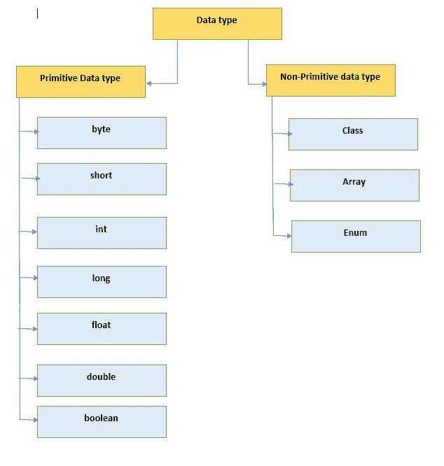

# 原始数据类型以及在 Java 中赋予它们什么默认值？

> 原文：<https://medium.com/javarevisited/primitive-data-types-and-what-default-values-are-assigned-to-them-in-java-e6ee8ee16459?source=collection_archive---------8----------------------->

## 面向对象编程

## Java 原语及其默认值和非原语数据类型。

[](https://javarevisited.blogspot.com/2019/10/the-java-developer-roadmap.html#axzz6N3akNoox)

**数据类型**

大家好，在本文中，我将介绍一个非常基本的 java 特性，即原始数据类型、它们的最小值、最大值、大小和文字类型。默认情况下，类的字段变量被赋予什么默认值？

# 原始数据类型:

1.原始数据类型是 java 中内置的数据类型，可以直接使用，无需使用`**new**` 关键字(无需创建对象)。

2.在使用任何**变量**之前，必须用**数据类型**、**名称、**和一些**初始** **值**声明。

3.记住，如果你没有声明一个变量，如果你试图使用这个变量，你将会得到一个编译时错误。

4.还要注意，如果你没有初始化变量的值，并且试图使用这个变量，你**会得到一个编译时错误。**

## 这里有一个例子:

```
int age = 20;
/*
Here int is data type and age is the name of variable which hold value 20 .
data type tells about what value variable can hold .
*/
```

> 在 java 中，我们有 8 种原始数据类型。这些不同的数据类型有不同的大小。让我们一个一个来看看。

# 1.字节:

字节数据类型是一个 **8 位**有符号二进制补码整数。其**最小值为-128，最大值为 127(含)。在大型数组中，字节数据类型对于节省内存非常有用，因为节省内存非常重要。它们也可以用来代替 int，因为它们的限制有助于澄清你的代码；变量范围有限的事实可以作为一种文档形式。**

```
eg. 
byte counter = 0 ;
```

# 2.简短:

短数据类型是一个 **16 位** **有符号二进制补码整数**。其**最小值为-32768，最大值为 32767(含)**。和 byte 一样，同样的原则也适用:在内存节省非常重要的情况下，可以在大型数组中使用 short 来节省内存。

```
eg. 
short registrationNum = 100;
```

# 3.int:

默认情况下，int 数据类型是一个 **32 位** **有符号二进制补码整数**，其**最小值为-2，最大值为 2–1**。在 Java SE 8 和更高版本中，可以使用 int 数据类型来表示一个**无符号 32 位整数，其最小值为 0，最大值为 2–1。**使用 Integer 类将 int 数据类型用作无符号整数。

```
eg 
int x = 10 ;
```

# 4.龙:

long 数据类型是一个 **64 位二进制补码整数。** **有符号长整型的最小值为-2⁶，最大值为 2⁶–1。**在 Java SE 8 和更高版本中，可以使用 long 数据类型来表示一个无符号的 64 位长整型，**，其最小值为 0，最大值为 2⁶⁴–1**。当您需要比 int 提供的值范围更大的值时，请使用此数据类型。

```
eg. 
long population = 12000000l;
```

# 5.浮动:

浮点数据类型是**单精度 32 位 IEEE 754 浮点**。它是在 Java 语言规范的浮点类型、格式和值部分中指定的。与 byte 和 short 的建议一样，如果需要在大型浮点数数组中节省内存，请使用 float(而不是 double)。**该数据类型不应用于精确值，如货币**。为此，您将需要使用`**java.math.BigDecimal**`类来代替。数字和字符串涵盖了 Java 平台提供的 BigDecimal 和其他有用的类。

```
eg. 
float percentage = 90.25f;
```

# 6.双倍:

double 数据类型是一个**双精度 64 位 IEEE 754 浮点**。它是在 Java 语言规范的浮点类型、格式和值部分中指定的。对于小数值，这种数据类型通常是默认选择。如上所述，这种数据类型不应该用于精确值，如货币。

```
eg. 
double rateOfdepreciation = 10.1525d;
```

# 7.布尔型:

布尔数据类型**只有两个可能的值** : **真**和**假**。将该数据类型用于跟踪**真/假条件**的简单标志。这种数据类型代表一位信息，但是它的“大小”没有精确的定义。

```
eg. 
boolean hasCreditCard = true;
```

# 8.字符:

char 数据类型是单个 **16 位 Unicode 字符**。最小值为 **'\u0000 '(或 0)** ，最大值为**' \ ufff '****(或 65535，含 65535)。**

```
eg. 
char firstVowel = ‘a’;
```

# 为字段变量分配了哪些默认值:

当一个**字段被声明为**时，并不总是需要赋值。已声明但未初始化的字段将被编译器设置为合理的默认值。一般来说，这个缺省值将是**零或空值**，这取决于数据类型。然而，依赖这样的默认值通常被认为是一种糟糕的编程风格。

## 下表总结了上述数据类型的默认值:

[](https://www.java67.com/2018/08/top-10-free-java-courses-for-beginners-experienced-developers.html)

数据类型

1.  局部变量略有不同；**编译器从不给未初始化的局部变量**赋默认值。
2.  如果不能在声明局部变量的地方对其进行初始化，请确保在尝试使用它之前给它赋值。
3.  访问未初始化的局部变量会导致编译时错误。

# 文字:

您可以注意到，在初始化原始数据类型的变量时，不需要使用 **new** 关键字。这些都是在语言中构建的，类中没有创建任何对象。文字是赋给原始数据类型变量的固定常数值。

## 以下是不同数据类型文字的示例:

```
boolean result = true; //true is boolean literal
char capLetterC= ‘C’; //’C’ is char literal
byte noOfGroups = 100; //100 is byte literal
short noOfStudents = 10000; //10000 is short literal
int count = 100000;//100000 is int literal
String name =”Vikram”;//”Vikram” is String literal
```

# 字符串是原始数据类型吗？

实际上，String 并不是一种原始数据类型，而是一种特殊的数据类型，它赋予程序员一种类似于原始数据类型的特权。基本上，字符串是一个**字符序列。**

当我们说:

```
String name = “Medium”;
```

它创建一个字符串对象，类似于:

```
String name = new String(“Medium”);
```

并且每个字符串都存储在一个**字符数组**中。

```
/** The value is used for character storage. */
private final char value[];
```

正如你所看到的， **value[]** char 数组是 **final** ，因此一旦一个值被分配给一个 string 对象，它就不能被改变。因此**字符串**是一个**不可变的**类。

# 类型转换:

当我们写作时

```
double rate = 12.2515f;
```

左侧写入的值是浮点值，它被分配给双精度变量，因此它将从浮点值转换为双精度值，分配给速率变量的值为:

```
rate = 12.251500129699707;
```

这很好，因为 4 字节的数据可以很容易地放入 8 字节的数据。

但是相反的是不正确的或无效的:

```
float rate = 12.2515d;
```

当我们做上面的赋值时，我们得到了错误:

```
java: incompatible types: possible lossy conversion from double to float
```

这是因为我们试图将 8 字节数据分配到 4 字节，因此它与**不兼容**。

*本文到此为止。希望你喜欢这篇文章。*

# 类似内容可以关注[维克拉姆古普塔](https://medium.com/u/2c3b611409dc?source=post_page-----e6ee8ee16459--------------------------------)。