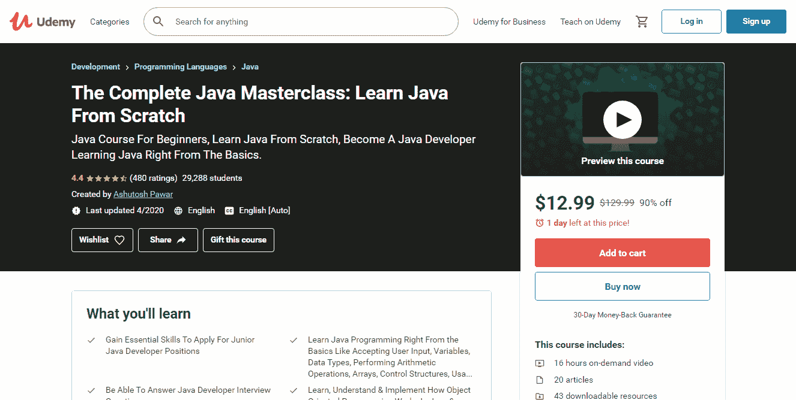
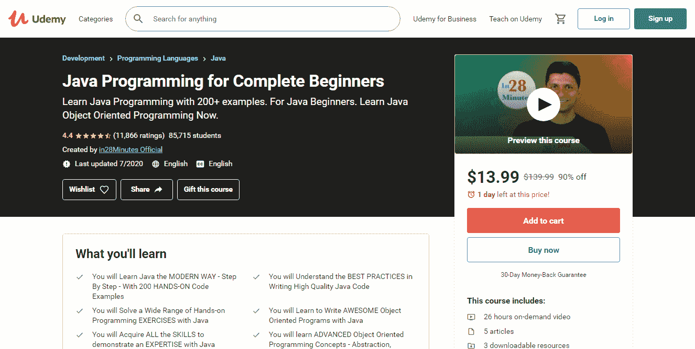
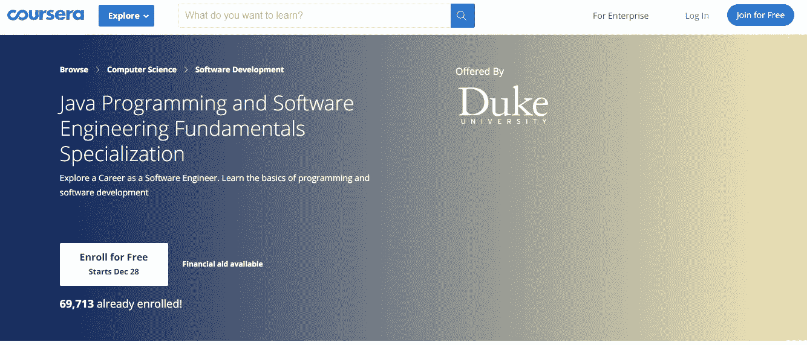
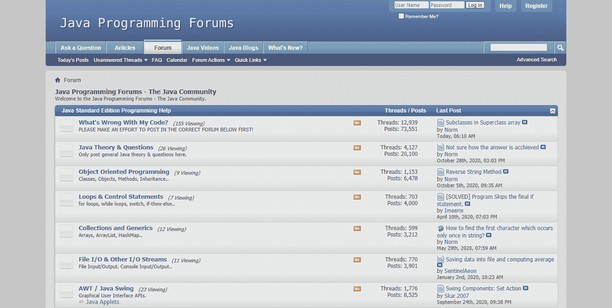
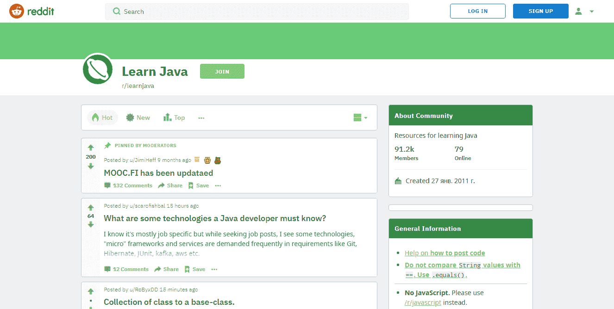
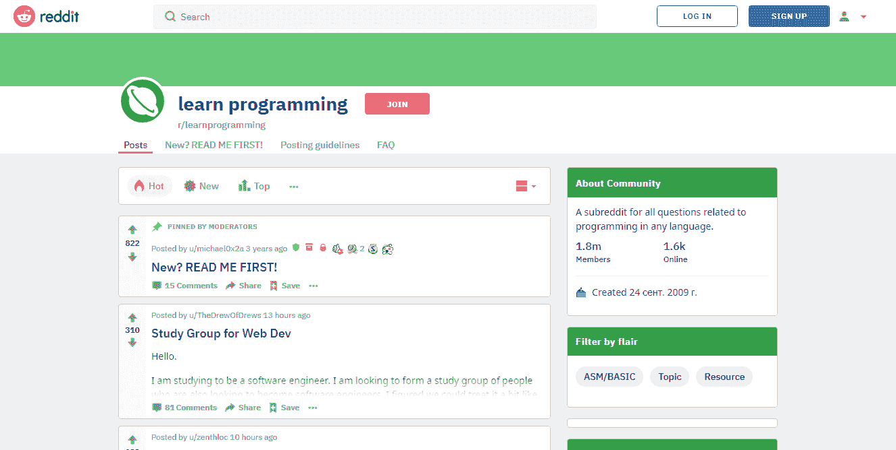

# 编程没有年龄:如何学习 Java 即使你认为太晚了

> 原文：<https://medium.com/javarevisited/programming-has-no-age-how-to-learn-java-even-if-you-think-its-too-late-3f0835e7d0f8?source=collection_archive---------1----------------------->

马丁·雷施在 [Unsplash](https://unsplash.com/s/photos/age?utm_source=unsplash&utm_medium=referral&utm_content=creditCopyText) 上的照片

随着年龄的增长，我们越来越经常地认为学习新的东西已经太晚了，尤其是编码。我们确信我们的大脑不像年轻时那样工作了，我们也不能理解编程的细微差别。换句话说，我们把自己一笔勾销。但是，事实是我们都可以[学习 Java](/javarevisited/top-5-java-online-courses-for-beginners-best-of-lot-1e1e240a758) 和其他语言，不管我们多大。

我在生活中遇到过很多人，他们在成熟的年龄开始学习编码。他们之所以成功，是因为他们这个年龄的人看待事物的方式不同，并做出明智的选择，尤其是在找到正确的学习方法的时候。后者帮助他们更容易掌握一项新的活动。

除此之外，IT 行业以其友好和接纳的社区而闻名，在这个社区中，专家的价值取决于他们的技能，而不是他们的年龄。

如果这听起来仍然难以令人信服，我建议考虑接下来的 5 个结论性论点，说明为什么你应该实现你的愿望，并在任何年龄开始学习编码。

# 年龄不是编程障碍的 5 个原因

## 1.获取新知识保持大脑工作

学习编程相当于一次脑力锻炼——你的大脑越紧张，你的注意力就越集中。

早在 2013 年， [Cesar Quililan](https://www.metrohealthinc.com/living-younger/the-importance-of-learning-something-new-as-you-age/) 在他发表于 [Sage Journals](https://journals.sagepub.com/doi/abs/10.1177/0956797613499592?papetoc=) 的研究中定义了持续参与学习新技能对人类理智的影响。这项实验涉及年龄在 60 岁到 90 岁之间的人，并鼓励他们尝试一种新的爱好或手艺，如摄影和绗缝。

虽然花了几个月的时间来获得一项新技能，但与看电影或玩简单游戏的人相比，这组参与者获得了最多的记忆。

这一切都意味着你不应该担心——在 30 岁或 40 岁时，你的大脑工作得很好！最重要的是要使它成形。

我有一个 32 岁专家的大团圆结局的故事。他从零技术能力开始，从头开始学习编码时经历了一段艰难的时间。很快，他遇到了一个在线课程，完成课程后，他有资格申请一个网站开发人员的职位。公司里没人关心他的年龄。

## 2.编程不是关于身体的灵活性和年轻神经元的速度

我还有一个朋友阿诺德，他决定在 38 岁时重新开始，像许多其他成人学习者一样，怀疑自己的能力。当他遇到他的第一个挑战时，他来找我说:“如果我没有足够的能量怎么办，事实上，为什么我决定我可以？”

当然，就在停下来怀疑自己并坚持反复练习之后，他克服了所有可能的困难。在训练时，学生们应该记住，只有耐心和系统的方法才能带领他们走向成功。[编程语言](/javarevisited/python-or-java-which-programming-language-beginners-should-learn-in-2020-de992b2650ec)不是什么需要身体准备，有生命的秋天。

## 3.教育来源不问你的年龄

如今，网络上充斥着交互式在线课程，你可以通过这些课程来学习 Java。其中一些包括:

*   [CodeGym](https://codegym.cc) ，一个在线平台，建议完成超过 1200 个学习 Java 编程的任务。注册这门课程后，你将会编写大量的代码来提高你的技能，并在将来找到一份工作。由于内置的代码验证，您可以立即检查每个任务，并接收来自虚拟导师的反馈。使用最新技术开发的课程，如游戏化和讲故事，将使你保持参与和积极性。

*   [CodeAcademy](https://www.codecademy.com/?utm_source=rakuten&utm_medium=affiliate&utm_campaign=adgoal.net&utm_content=10-1&ranMID=44188&ranEAID=a1LgFw09t88&ranSiteID=a1LgFw09t88-knH9vg3KTbGYdLmgRQg39w) ，这是一家教育公司，旨在增强您的学习体验，并激励您继续培训，提供交互式和真实世界的代码挑战。

*   CodeChef ，一个独特的平台，它将鼓励你通过参加每月三次的编程竞赛和挑战来学习编程。

绝对初学者可以从 Coursera 或 Udemy 上的视频教程开始，例如:

*   [完整的 Java Masterclass](https://www.udemy.com/course/java-programming-course/?ranMID=39197&ranEAID=a1LgFw09t88&ranSiteID=a1LgFw09t88-A5V5o3Jm9iwxzPP34gTP.A&utm_source=aff-campaign&utm_medium=udemyads&LSNPUBID=a1LgFw09t88) ，一个实用的课程，教你从基础到水平的 Java，在这里你可以使用 [OOP](/javarevisited/my-favorite-courses-to-learn-object-oriented-programming-and-design-in-2019-197bab351733?source=---------103------------------) 、接口、泛型和其他概念编写程序。

*   [面向完全初学者的 Java 编程](https://click.linksynergy.com/deeplink?id=JVFxdTr9V80&mid=39197&murl=https%3A%2F%2Fwww.udemy.com%2Fcourse%2Fjava-programming-tutorial-for-beginners%2F)(250 步)，这门课程将引导你了解主要的 Java 概念，从 Java 基础到 Java 集合、泛型、异常处理、[多线程和并发性](/javarevisited/8-best-multithreading-and-concurrency-courses-for-experienced-java-developers-8acfd3b25094)、[函数式编程](/javarevisited/8-best-lambdas-stream-and-functional-programming-courses-for-java-developers-3d1836a97a1d)联网和文件处理。

*   [杜克大学的 Java 认证](https://click.linksynergy.com/deeplink?id=JVFxdTr9V80&mid=40328&murl=https%3A%2F%2Fwww.coursera.org%2Fspecializations%2Fjava-programming)，这是一门面向新来者的 Java 入门课程，将阐明基本的编程概念，并提供解决问题所需的工具。

专业人士的指导支持可以在你通往 Java 编程的道路上给你很大的帮助。除此之外，Java 程序员以他们友好的社区而闻名，这意味着当新手遇到特定问题时，专家们愿意帮助他们。

所以，这里有一个平台列表，在那里你可以得到你的编码问题的答案或者寻求指导。

*   [Java 论坛](https://www.javaprogrammingforums.com)，这是一个标准的编程论坛，包含各种主题，分为多个部分，以确保快速、无障碍的搜索。

*   [Java World](https://www.infoworld.com/category/java/) ，一个汇集 Java 新闻、操作方法、特性、评论、博客和其他 Java 相关事物的平台。

*   CodeGym Help ，一个为新手创建的社区，提供常见问题的答案以及快速和充分的支持。

*   [r/learnJava](https://www.reddit.com/r/learnjava/) ，一个汇集学习 Java 资源的子编辑器。

*   [r/learnprogramming](https://www.reddit.com/r/learnprogramming/) ，这是一个子编辑区，可以回答任何编程语言中与编码相关的所有问题。

除了使用在线课程或视频教程练习 Java 和逛论坛之外，我还建议把博客放在列表中。作者正在关注更新和新添加的特性，以便与您分享并增强您的编码体验。我认为以下两个博客值得考虑。

*   [Java Geek](http://www.thejavageek.com/core-java/) ，提供具体案例或问题清晰讲解的资源。
*   [Bench Resources](https://www.benchresources.net) ，另一个来源包括描述的与 Java 相关的问题和案例。

## 4.你的年龄并不重要

我经常告诉那些怀疑自己能否从头再来的成年朋友，年龄只是他们经历的一个数字。毕竟，谁说人类应该一辈子做同一份工作？！我们都是成熟的个体，知道自己想要什么，也知道自己期望看到什么样的结果。所以，如果你觉得你非常想学习 Java 或任何其他编程语言，不要把你的愿望推迟到以后，现在就开始学习，你的努力很快就会得到回报。

此外，不要拿自己和其他专家比较，尤其是如果他们已经在你开始的旅程的中途。你唯一应该比较的人是在起点的你。你会很高兴地意识到，与前一阶段相比，你正在进步。

我和我课程中的一位程序员还有一次正面的经历。他来的时候没有任何技术经验，但通过了一些在线课程后，他可以找到一份理想的工作。

这个例子和其他例子再次证明，担心有限的专业知识或错误代码是没有意义的。任何年龄的人都会犯错误，尤其是在他们刚刚开始编程之旅的时候。但是一旦你提高了技能，错误就会消失，你会对[编程](https://javarevisited.blogspot.com/2020/04/top-5-courses-to-learn-functional-programming-in-java-with-lambda-and-stream.html)更有信心。

除此之外，年轻和年长的学生都同样担心没有足够的工作经验是否能找到工作。首先，技术正以闪电般的速度发展，这使得专家们很难一下子掌握所有的技术。第二，许多公司更喜欢雇佣没有什么经验的专家来为特定的项目培训他们。因此，没有真正的理由担心。

## 5.不会有比今天更好的时机了

让我们面对现实吧:人们是如此程序化，以至于他们经常等待合适的时机去开始新的事物。但说实话，合适的时机并不存在——现在是有史以来最好的时机。

此外，在疫情现实中，在 IT 行业工作相对安全和稳定，因为科技行业以及制药、物流和医疗保健受新冠肺炎的影响较小。

Harvey Nash 的首席执行官 Bev White 也表示，英国 82%的 IT 经理预计他们的员工人数将保持不变，甚至有所增加。许多公司现在正在寻找能够在短时间内帮助交付数字项目的专家。

话虽如此，现在是[开始学习 Java](/javarevisited/10-free-courses-to-learn-java-in-2019-22d1f33a3915) 或任何其他编程语言加入 IT 市场的时候了。

# 总结事情

编程不是芭蕾或花样滑冰，在那里你需要年轻、灵活和蓬勃发展。学习编码需要一些时间、努力和正确的心态，而你的年龄不应该影响训练。

相反，把你的年龄看作是能帮助你注意到年轻专业人士注意不到的事情。简而言之，学习编程会让你的注意力和专注度保持在一个较高的水平。

</javarevisited/can-you-learn-programming-and-become-a-web-developer-in-the-40s-and-50s-f9e117f32721> 