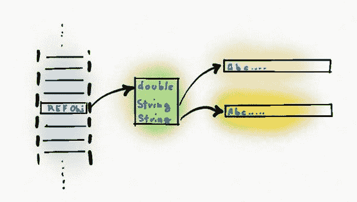
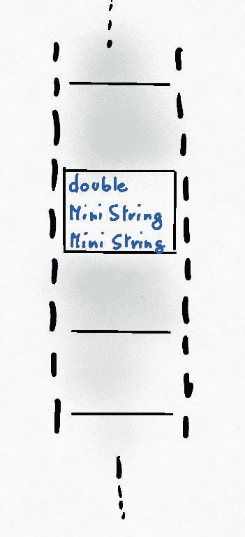
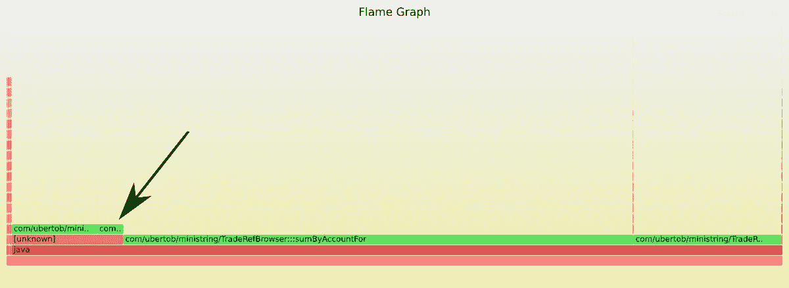
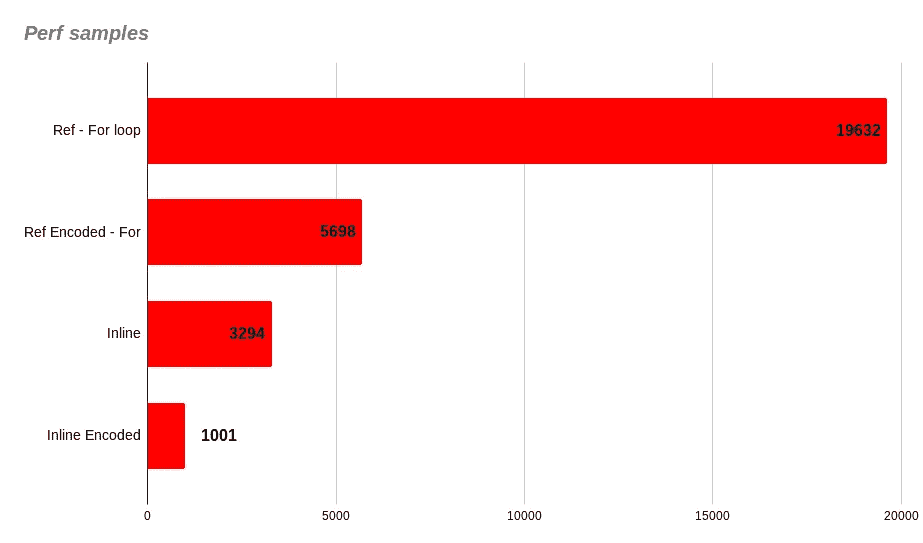

# 瓦尔哈拉工程:速度与激情 Java

> 原文：<https://medium.com/javarevisited/project-valhalla-fast-and-furious-java-ce2e46b4ee59?source=collection_archive---------0----------------------->

## 探索新内联类型的性能改进

我为 2019 年 Java 降临节日历写了这篇文章。我在这里重新发布了一些小的更正。


[https://pix abay . com/photos/fantasy-beautiful-dawn-sunset-sky-3077928/](https://pixabay.com/photos/fantasy-beautiful-dawn-sunset-sky-3077928/)

Valhalla 项目是关于 Java 和所有 JVM 的未来的最激动人心的项目之一。它仍处于实验状态，但在这篇文章中，我们将看看如何尝试它，我们将实现一个小程序来验证这种性能改进是可能的。

Valhalla 的目标是引入一种新的内联类型(又名值类型)，它将:*“代码像类一样工作，就像 int 一样”*。

目前，在 JVM 中有八种原语类型，每一种都与字母表中的一个“签名字母”相关联:

**B** 字节有符号字节
**C** char Unicode 字符用 UTF-16
**D** double 双精度浮点值
**F** float 单精度浮点值
**I** int 整数
**J** 长整数
**S** 短有符号短
**Z**

**除此之外，我们还有其他物品:**

**类名引用了类名的一个实例**

**如果你打印出一个通用对象的`toString()`方法的结果，你可能会注意到签名字母。**

**瓦尔哈拉工程为一种新类型引入了一个新字母:**

**Q ClassName 内联类型**

**这些新类型最终将取代我们应用程序中的原始类型，移除当前的装箱类型(整数等)，带来一个仅基于引用和内联类型的无缝新世界。**

**这仍是未来的事，现在让我们享受一下当前早期版本中已经有的东西。**

## **入门指南**

**为了简化设置，项目瓦尔哈拉团队在 8 月 30 日发布了一个早期访问版本。**

**你可以从这里下载并在 JAVA_HOME 中将其配置为标准的 http://jdk.java.net/valhalla/ JDK(版本 14):**

**不幸的是，目前(2019 年 12 月)IntelliJ 和 Gradle 无法编译具有该语言新功能的源代码。我们需要使用 JDK 的命令行工具或 ant。**

**我在 Github 上分享了一个[库](https://github.com/uberto/testValueTypes)，里面有几个例子和运行它们所需的 ant 构建脚本。**

## **瓦尔哈拉角**

**让我们从一些非常简单的东西开始，让我们用两个坐标字段定义一个点类型。**

```
**inline** public class Point {
  public int x;
  public int y;public Point(int x, int y) {
    this.x = x;
    this.y = y;
  }
}
```

**唯一的变化是第一行的关键字`**inline**`。Point 是一个内联类型，现在我们来看看它与普通类的区别。**

## **像类一样编码**

*   **它可以使用**新建**来创建**
*   **如您所见，您可以像普通类一样声明字段、构造函数和方法**
*   **它可以实现一个接口，重写这些方法。**
*   **它可以由泛型使用，并且可以有泛型参数**

## **像 int 一样工作**

*   **类型点是**不可变**。字段 x 和 y 被自动视为最终值。我们可以决定它们是私有的还是公共的，但是我们不能修改它们。**
*   **Point 已经自动生成了 equals、toString 和 hashcode 方法。我们可以使用像 int 和 double 这样的 **==** 运算符来测试它的相等性。**
*   **点没有空值。如果你想表示一个零点，你需要使用新的“内联加宽”，这是一种类固醇拳击。**
*   **点实例并不与它们的引用分开分配，它们直接在内存中表示，就像原始类型一样。**
*   **Point 有一个默认值，对应于 Point(0，0)。您可以使用新的 JVM `default`指令创建一个“默认”点。**
*   **点不能从另一个类型继承，并且没有任何东西可以从它继承。**

## **工作进展**

**一些特性仍未完成，它们可能无法在当前版本中工作，或者会改变它们在未来版本中的工作方式。特别是:**

*   **不可能对内联类型使用同步操作。所以没有同步的方法、锁、等待/通知。**
*   **反射:不可能将它们与参照物区分开来。为此会有一些特殊的接口。**
*   **线程安全:目前不可能有一个易变的行为并在原子操作中使用它们。**

**要想更全面地了解瓦尔哈拉项目的特性，请参阅最后链接的文章。这里我们将集中讨论它的性能方面。**

## **紧凑阵列**

**内联类最令人兴奋的特性之一是创建数组的方式。**

**在基元的情况下，数组的每个位置都有类型的直接表示；例如，在长数组的情况下，长数组的 64 位。**

**相反，在引用对象的情况下，数组将只包含对在堆上分配内存的对象的引用。**

**这意味着从数组中读取对象首先要读取引用，然后从它的实际位置获取内存。如果对象引用了字段，这些也会导致从远程内存位置获取数据。**

**另一方面，内联类型像原语一样工作。**

**为了体验一下这有多重要，让我们制作一个简单的测试程序，对一个大数组中给定账户的所有交易求和。**

**这是我们交易的简单表示，包括金额、账户和交易证券。**

```
public class TradeRef {
  public final double amount;
  public final String account;
  public final String security;

  public TradeRef(double amount, String account, String security){
    this.amount = amount;
    this.account = account;
    this.security = security;
  }@Override
  public boolean equals(Object o) {
    if (this == o) return true;
    if (o == null || getClass() != o.getClass()) return false;
    TradeRefEncoded that = (TradeRefEncoded) o;

    return Double.compare(that.amount, amount) == 0 && 
      account == that.account && security == that.security;
  }@Override
  public int hashCode() {
    return Objects.hash(amount, account, security);
  }
}
```

**类似地，我们将定义一个`TradeInline`类，与 inline 修饰符相同:**

```
inline public class TradeInline {
  final double amount;
  final String account;
  final String security;public TradeInline(double amount, String account, String sec){
    this.amount = amount;
    this.account = account;
    this.security = sec;
  }
}
```

**编译完成后，我们可以从命令行使用`javap`来打印生成的字节码:**

**`javap -s antbuild/com/ubertob/ministring/TradeInline.class`**

**这是输出结果:**

```
public final **value** class com.ubertob.ministring.TradeInline {final double amount; descriptor: Dfinal java.lang.String account; descriptor: Ljava/lang/String;final java.lang.String security; descriptor: Ljava/lang/String;public final int hashCode(); descriptor: ()Ipublic final boolean equals(java.lang.Object); descriptor: (Ljava/lang/Object;)Zpublic final java.lang.String toString(); descriptor: ()Ljava/lang/String;public static com.ubertob.ministring.TradeInline com.ubertob.ministring.TradeInline(double, java.lang.String, java.lang.String); descriptor: (DLjava/lang/String;Ljava/lang/String;)**Q**com/ubertob/ministring/TradeInline;
}
```

**我们可以看到:**

1.  **第一行中的值修饰符**
2.  **最后一个列表中的 Q 描述符**
3.  **我们的源代码中没有的自动生成的方法`hashCode`、`equals`和`toString`。**

## **将字符串编码为长整型**

**我们的`TradeInline`类仍然有两个字符串作为字段。我们能把它们串联起来吗？**

**不幸的是，目前不可能在内联类型中展平字符串和数组。未来有一个名为 Array 2.0 的计划可以实现这一点。**

**我们现在可以做的是将一个字符串压缩到一个`long`类型中，尽管我们需要接受一些限制。**

**`long`类型有 64 位，所以使用基本 64 编码(6 位)我们可以在里面存储多达 10 个字符。**

**在我们的例子中，我们假设证券和账户的最大长度为 10 个字符，并且它们仅由大写字母、数字和有限数量的特殊字符组成。**

**这是我们的`MiniString`内联类型的代码，带有编码和解码静态函数:**

```
inline public class MiniString {

  long raw;public MiniString(String str) {
    raw = encode(str);
  }public String get() {
    return decode(raw);
  }public static final int MAX_MINISTR_LEN = 10;
  public static final int MINI_STR_BASE = 64;
  public static final String letters = "=ABCDEFGHIJKLMNOPQRSTUVWXYZ0123456789 _-!?.$&%@#:[]{}()*<>:;',/^";

  public static long encode(String str) {
    String prepared = prepareString(str);
    long encoded = 0;
    for (char c : prepared.toCharArray()) {
      int x = letters.indexOf(c);
      encoded = encoded * MINI_STR_BASE + x;
    }
    return encoded;
  }private static String prepareString(String str) {
    StringBuilder prepared = new StringBuilder();
    for (char c : str.toCharArray()) {
    if (letters.indexOf(c) >= 0)
      prepared.append(c);
      if (prepared.length() > MAX_MINISTR_LEN)
        break;
      }
    return prepared.toString();
  }public static String decode(long number) {
    StringBuilder decoded = new StringBuilder();
    long remaining = number;
    while (true) {
      int mod = (int) ( remaining % MINI_STR_BASE);
      char c = letters.charAt(mod);
      decoded.insert(0, c);
      if ( remaining < MINI_STR_BASE)
        break;
      remaining = remaining / MINI_STR_BASE;
    }
    return decoded.toString();
  }
}
```

**我们将使用新的`MiniString`为帐户和安全性定义一个`TradeMiniString`内联类型。**

**这是生成的字节码:**

```
public final value class com.ubertob.ministring.TradeMiniString {
final double amount; descriptor: Dfinal com.ubertob.ministring.MiniString account; descriptor: **Q**com/ubertob/ministring/MiniString;final com.ubertob.ministring.MiniString security; descriptor: **Q**com/ubertob/ministring/MiniString;public final int hashCode(); descriptor: ()Ipublic final boolean equals(java.lang.Object); descriptor: (Ljava/lang/Object;)Zpublic final java.lang.String toString(); descriptor: ()Ljava/lang/String;public static com.ubertob.ministring.TradeMiniString com.ubertob.ministring.TradeMiniString(double, java.lang.String, java.lang.String); descriptor: (D**L**java/lang/String;**L**java/lang/String;)**Q**com/ubertob/ministring/TradeMiniString;}
```

**请注意,`MiniString`帐户的描述符是如何以内联类型的 Q 开头，而不是以引用类型的 L 开头的。**

**最后，为了进行公平的比较，我们还定义了一个`TradeRefEncoded`类，使用相同的技巧对类型为`long`的字段中的账户和证券进行编码。**

**你可以在我的 GitHub [资源库](https://github.com/uberto/testValueTypes)中找到完整的代码。**

**在查看性能之前，我们先来看看我们的交易对象是如何使用内存的。**

**第一标准`TradeRef`标准对象:**

****

**左边是我们的大数组。然后是一个指向 TradeRef 对象的指针，然后是另外两个指向字符串的指针。**

**根据创建的顺序，分配的内存区域在我们的堆中可能相距很远。**

**这是一个性能问题，因为从不同区域获取内存是 CPU 最慢的操作之一。**

**马丁·汤姆森的这篇经典帖子是较好的解释之一:
[https://mechanical-sympathy . blogspot . com/2012/08/memory-access-patterns-are-important . html](https://mechanical-sympathy.blogspot.com/2012/08/memory-access-patterns-are-important.html)**

**现在让我们看一个简单的内联级值内存表示图:**

****

**这里整个值对象直接在数组上。因此，数组比第一种情况大。因此，如果您的数组包含许多空值，压缩单元可能是一个缺点。反正对我们来说不是。**

**最后，让我们看看 TradeMiniString 是如何在内存中分配的:**

****

**您可以看到它完全停留在数组元素内部，没有外部指针。**

**这是可能的，因为我们接受对那些字符串中可以包含的内容的重大限制；尽管如此，当只使用字符串存储数据库或股票代码中的 ID 时，这是一个可以接受的折衷方案。**

## **性能比较**

**为了比较性能，我们可以创建四个 500 万个元素的数组，每个数组对应一种交易类型:**

```
static final int arraySize = 5_000_000;public TradeRef[] tradeRefs = new TradeRef[arraySize];public TradeRefEncoded[] tradesRefEncoded = new TradeRefEncoded[arraySize];public TradeInline[] tradesInline = new TradeInline[arraySize];public TradeMiniString[] tradesMiniString = new TradeMiniString[arraySize];
```

**然后我们用相同的随机值填充它们:**

```
public static void generatingTradesAndBrowing() {
  var tr = new TradeRepository();
  tr.fillWithRandomData();
  var searcherRef = new TradeRefBrowser(tr.tradeRefs);
  var searcherInline = new InlineTradeBrowser(tr.tradesInline);
  var searcherRefEncoded = new TradeRefEncodedBrowser(tr.tradesRefEncoded);
  var searcherMiniString = new MiniStringTradeBrowser(tr.tradesMiniString);
  var account = tr.tradeRefs[1000].account;while (true) {
    benchmarks(searcherRef, searcherInline, searcherRefEncoded, searcherMiniString, account);
  }
}
```

**最后，我们反复搜索每一个，打印出经过的时间。**

```
private static void benchmarks(TradeRefBrowser searcherRef, InlineTradeBrowser searcherInline, TradeRefEncodedBrowser searcherRefEncoded, MiniStringTradeBrowser searcherMiniString, String account) {
  cronoSum(() -> searcherRef.sumByAccountFor(account), "Ref with for");
  cronoSum(() -> searcherRef.sumByAccountStream(account), "Ref with stream");
  cronoSum(() -> searcherRefEncoded.sumByAccountFor(account), "RefEncoded with for");
  cronoSum(() -> searcherRefEncoded.sumByAccountStream(account), "RefEncoded with stream");
  cronoSum(() -> searcherInline.sumByAccountFor(account), "Inline with for");
  cronoSum(() -> searcherMiniString.sumByAccountFor(account), "MiniString with for");
}
```

**这里我们不太关心具体的数字，所以我们继续循环并打印结果。几分钟后，当 Java Hotspot 编译器优化并内联大多数方法时，计时趋于稳定。**

**我们可以使用两种方法进行过滤和求和:for 循环或更好的流映射和 reduce:**

```
public double sumByAccountStream(String account){
  return Arrays.stream(repo)
   .filter( trade -> trade.account.equals(account))
   .map(trade -> trade.amount)
   .reduce(0.0, (a, b) -> a+b);
}public double sumByAccountFor(String account){
  double res = 0;
  for (int i = 0; i < repo.length; i++) {
    TradeRef tradeRef = repo[i];
    if (tradeRef.account.equals(account))
      res = res + tradeRef.amount;
  }
  return res;
}
```

**不幸的是，streams(还)不支持内联类，当我尝试时，我得到了这个错误:**

```
Exception in thread "main" java.lang.ClassFormatError: Illegal class name "Qcom/ubertob/ministring/TradeMiniString;" in class file <Unknown>
at java.base/jdk.internal.misc.Unsafe.defineAnonymousClass0(Native Method)
at java.base/jdk.internal.misc.Unsafe.defineAnonymousClass(Unsafe.java:1345)
at java.base/java.lang.invoke.InnerClassLambdaMetafactory.spinInnerClass(InnerClassLambdaMetafactory.java:324)
at java.base/java.lang.invoke.InnerClassLambdaMetafactory.buildCallSite(InnerClassLambdaMetafactory.java:192)
at java.base/java.lang.invoke.LambdaMetafactory.metafactory(LambdaMetafactory.java:329)
at java.base/java.lang.invoke.BootstrapMethodInvoker.invoke(BootstrapMethodInvoker.java:127)
at java.base/java.lang.invoke.CallSite.makeSite(CallSite.java:307)
at java.base/java.lang.invoke.MethodHandleNatives.linkCallSiteImpl(MethodHandleNatives.java:259)
at java.base/java.lang.invoke.MethodHandleNatives.linkCallSite(MethodHandleNatives.java:249)
at com.ubertob.ministring.MiniStringTradeBrowser.sumByAccountStream(Unknown Source)
```

**因此目前，我们只能使用 for 循环来衡量性能。**

## **奇特的图表(终于)**

**实际的数字在这里并不重要，所以我只是抓取了一个在我的 Linux 笔记本电脑上运行该应用程序的有意义的样本。**

**我们感兴趣的不是数字，而是它们之间的相对速度。**

****

**我们可以在这里看到这种情况下的改进是多么巨大:内联 TradeMiniString 快了 20 多倍！**

**事件与 TradeRefEncoded 相比仍然快 6 倍！**

**这似乎好得难以置信，因此我们可以使用更好的方法来衡量实际性能。**

**Brendan Gregg 编写了一些方便的工具来使用 Linux 内核性能工具来分析 Java 程序。**

**有几篇博文是关于如何制作以及如何阅读火焰图的: [https://medium . com/网飞-tech blog/Java-in-flames-e 763 B3 d 32166](/netflix-techblog/java-in-flames-e763b3d32166)**

**这是我们的火焰:**

****

**你可以在 GitHub 库[这里](https://github.com/uberto/testValueTypes/blob/master/flame_java_4.svg)找到实际的 svg 文件。**

**我们可以看到四个绿色块(包括带箭头的块),表示这四种方法使用 CPU 的时间。在这个图中，绿色块是 Java 调用，而红色块是内核系统调用。**

**峰值是与结果打印和垃圾收集相关的其他方法。我们可以忽略它们。**

**从左边开始，第一个块是 InlineTrade，使用常规字符串。它明显小于最后两个块，这两个块代表 TradeRef 和 TradeRefEncoded。**

**您可能已经猜到了，箭头所指的块是 TradeMiniString duration，它非常短，您只能看到名称的几个字符。**

**性能分析中每种方法的相对持续时间如下图所示:**

****

**相对计时相似，内联比 Ref 快 6 倍，内联编码比 Ref 编码快 5.5 倍。**

## **结论**

**现在进行精确测量还为时过早，但已经很清楚，Valhalla 内嵌类型有潜力为特定类型的关键应用带来巨大的性能提升。**

**仍然有许多粗糙的边缘和痛苦的决定要做，但瓦尔哈拉工程的整体形状是非常令人兴奋的。**

**自从上一个早期版本以来，源代码已经有了很多改进。让我们希望有另一个稳定的版本来测试更多的功能。**

## **了解更多信息的资源**

**这个和其他例子的完整代码:** 

**最近一个关于德沃克斯的瓦尔哈拉的视频是
https://devoxx.be/talk/?id=41660**

**Brian Goetz 谈瓦尔哈拉国
[http://Cr . open JDK . Java . net/~ briangoetz/Valhalla/SOV/02-object-model . html](http://cr.openjdk.java.net/~briangoetz/valhalla/sov/02-object-model.html)**

**Ben Evans 对内联类型的深入解释:
[https://www.infoq.com/articles/inline-classes-java](https://www.infoq.com/articles/inline-classes-java/?itm_source=infoq&itm_campaign=user_page&itm_medium=link)**

**我之前早期访问构建的帖子:
[https://medium . com/@ ram top/a-taste-of-value-types-1a8a 136 fcfe 2](/@ramtop/a-taste-of-value-types-1a8a136fcfe2)**