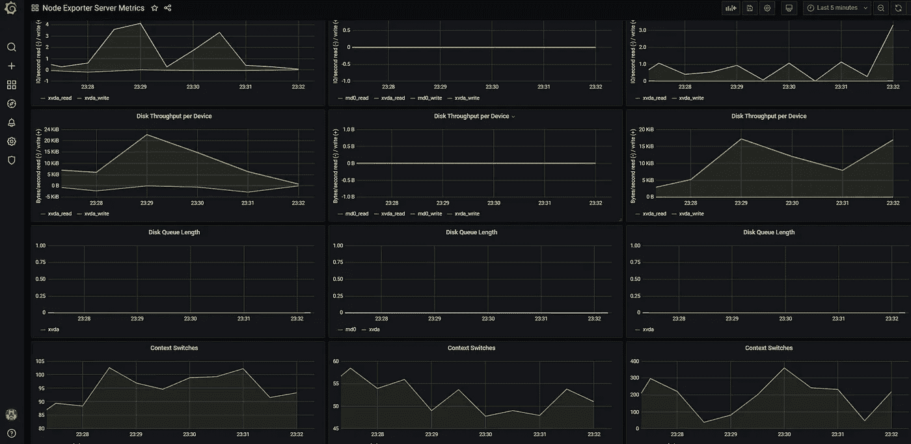

# Prometheus + Grafana 设置来可视化您的服务器— 2020 年

> 原文：<https://medium.com/javarevisited/prometheus-grafana-setup-to-visualize-your-servers-924773b83f3f?source=collection_archive---------1----------------------->

## 设置 Prometheus、Node Exporter 和 Grafana 以获得服务器指标的图形可视化。

# 普罗米修斯游戏攻略

Prometheus 是一个开源监控工具，实现了一个高维数据模型。普罗米修斯有多种模式…