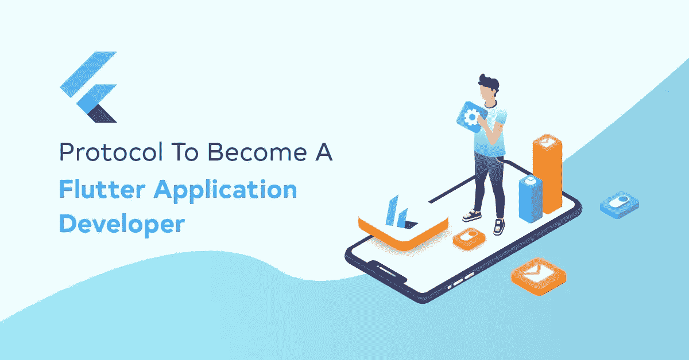

# 协议成为一个颤振应用程序开发人员

> 原文：<https://medium.com/javarevisited/protocol-to-become-a-flutter-application-developer-b11de619a953?source=collection_archive---------1----------------------->

图片来源:米兰来源:自我创造

亚伯拉罕是一名 Android 开发者，已经开发了很多手机应用，钉钉上了 Play Store。他已经看到并实践了应用程序开发中来来去去的许多趋势。有一件事一直萦绕在他的脑海里，那就是[颤动](/javarevisited/my-favorite-flutter-and-dart-programming-courses-for-beginners-9e8355710d78)。亚伯拉罕知道谷歌的开源跨平台软件开发工具包，以及它如何从单一代码库创建 [iOS 和安卓应用](/javarevisited/top-5-frameworks-to-create-cross-platform-android-and-ios-apps-in-2020-d02edf3d01f1)。他也知道自从 Flutter 进入竞技场并迅速成为镇上的话题已经有几年了。

让他头疼的是如何成为一名 Flutter 开发者。他收到了许多关于使用 [Flutter](/javarevisited/7-free-flutter-online-courses-to-build-android-and-ios-apps-in-2021-54c0c92f16f9) 开发跨平台应用程序的询问。一些初创公司希望节省预算和时间，而另一些公司则希望一次瞄准多个平台。他不想让他们失望。

虽然这很容易学，但新手 Flutter 程序员需要一个路线图来简化他们的学习旅程，确保没有遗漏任何东西。如果你的故事与亚伯拉罕的故事有某种共鸣，这里有一个解决方案，“成为一名优秀应用程序开发人员的路线图”

*没时间从头学旋舞？您可以从我们这里* [***雇佣 Flutter 开发者***](https://kodytechnolab.com/hire-flutter-app-developer)**按照您的步调学习 Flutter。**

***成为 Flutter 应用开发者的路线图***

*首先，知道作为一个 Flutter 开发者，你的主要职责是什么，这样你就可以对你需要学习的东西进行分类。*

***代码应用***

*你必须使用 Dart 编程语言在 Flutter 中编写代码，这些代码已经被编译到原生平台，即 Android 和 iOS。您可能还负责使用相同的代码库创建桌面和 web 应用程序。*

***创建用户界面***

*Flutter UI framework 以可重用的 UI 组件、可定制的小部件和丰富的工具而闻名，用于创建漂亮的应用程序和有趣的用户体验。所以你也负责前端 app 开发。*

***测试应用***

*您的工作是确保您构建的应用程序没有错误、安全，并且正确配置到目标平台。然而，Flutter SDK 用于调试代码和运行质量分析的学习工具将简化您的应用程序测试。*

***应用部署&维护***

*Flutter 应用程序开发人员还必须掌握在 Google Play 和 Apple Store 上部署应用程序的控制权。此外，根据用户反馈维护和改进应用程序也属于 Flutter 开发人员的职责。*

*上面提到的任务是基本的，角色和职责可能会根据项目需求而有所不同。如果你有深入的颤振知识，角色和责任对你来说不会有太大的区别。这就把我们带到了下一点。*

***学习颤振的先决条件***

*在你在 Flutter 中安装并开始开发应用程序之前，你必须熟悉以下基本概念。如果你已经熟悉它们，你最好开始使用颤振工具。如果没有，那么考虑一下 ABC，开始你的学习之旅，抓住这些概念。*

*   *了解面向对象的编程语言，如 [Java](/javarevisited/top-5-java-online-courses-for-beginners-best-of-lot-1e1e240a758) ， [C++](https://becominghuman.ai/10-best-c-courses-for-beginners-and-experienced-developers-fd2401c07f50) ，*
*   *熟悉面向对象的编程系统，如对象、类、继承、抽象、方法等。,*
*   *至少有一点 Android 或者 iOS 之类的原生 app 开发或者 [React Native](/javarevisited/top-5-react-native-courses-for-mobile-application-developers-b82febdf8a46) ，Xamarin，或者 Ionic 之类的移动 app 开发框架的经验，*
*   *Dart 是在 Flutter 之前必须学习的，因为它使用了谷歌的通用编程语言 Dart。然而，有 Android 经验并且熟悉 OOP 的开发者可以在几天内学会这门语言。提升您的 Dart 知识 [Dart 语言教程](https://dart.dev/guides/language/language-tour)(免费)。*

# *Flutter 适合所有人，这就是证据*

*“Java 可以做到这一点；如何在颤振中实现同样的功能？iOS 提供了这个便利的功能。Flutter 也会有吗？”当你刚刚从你的平台转移到 Flutter 时，偶然发现这样的问题是正常的。因此，Flutter dev 为来自不同平台的开发人员提供了单独的指南。看看下面的链接，看看它是否有你想要的。*

*   ***扑为** [**安卓开发者**](https://flutter.dev/docs/get-started/flutter-for/android-devs)*
*   ***扑为** [**iOS 开发者**](https://flutter.dev/docs/get-started/flutter-for/ios-devs)*
*   ***旋舞作** [**反应原生开发者**](https://flutter.dev/docs/get-started/flutter-for/react-native-devs)*
*   ***扑为** [**网页开发者**](https://flutter.dev/docs/get-started/flutter-for/web-devs)*
*   ***扑为** [**Xamarin 开发商**](https://flutter.dev/docs/get-started/flutter-for/xamarin-forms-devs)*

***你必须学会的颤振开发工具***

*现在，你必须对 Flutter 和 Dart 足够熟悉，才能开始用 Flutter 构建你的第一个 Android 或 iOS 应用。但是等等！编写代码、设计应用程序、库以及实现原生性能所需的开发工具呢？等等，找到下面的工具来有效地开发你的 Flutter 应用。*

*   ***Flutter 移动应用开发 IDE***

*Flutter 支持广泛使用的集成开发环境，允许您编写、运行和调试代码，包括:*

*   *[安卓工作室](https://javarevisited.blogspot.com/2018/09/top-5-courses-to-learn-intellij-idea-java-and-android-development.html)*
*   *[IntelliJ 理念](/javarevisited/7-best-courses-to-learn-intellij-idea-for-beginners-and-experienced-java-programmers-2e9aa9bb0c05)*
*   *[Visual Studio 代码](/javarevisited/8-best-vs-code-courses-for-beginners-to-learn-online-bd5c169f59b7)*
*   *Emacs*

*遵循 [**设置编辑**](https://flutter.dev/docs/get-started/editor?tab=androidstudio) 指南。*

*   ***用户界面在颤动***

*众所周知, [Flutter](https://www.java67.com/2020/06/5-free-courses-to-learn-flutter-in-2020.html) 也是一个 UI 框架，允许你展示你的创造力和制作吸引人的应用程序。而要在 Flutter 中构建一个 UI，就要了解 Flutter 的布局机制的基础知识，以及它是如何工作的。学习[在](https://flutter.dev/docs/development/ui/layout)中的布局。*

*Flutter 完全是关于小部件的，它为你提供了丰富的可定制的小部件。为了增加交互性，增加手势的方向，样式，应用程序的可访问性，并根据材料或 Cupertino 指南设计应用程序，这些小部件就派上了用场。*

*您必须学习的一些基本小部件有:*

*   *有状态小部件*
*   *无状态小部件*
*   *易接近*
*   *继承的小部件*
*   *主题*
*   *本地化*
*   *[T3【旋舞】和 ](/javarevisited/5-best-firebase-and-firestore-courses-for-frontend-developers-88052b0d3e74?source=---------5----------------------------)*

*当身份验证、质量分析、存储和通知是优先事项时，Firebase 是广泛使用的后端即服务应用程序开发平台之一。因为它提供了云存储、崩溃报告、实时数据库、远程配置、静态文件托管等等。*

*所以，学习[扑火](https://firebase.flutter.dev/docs/overview/)应该在你的清单上。*

*   ***颤振开发工具***

*Flutter 为开发人员提供了一套性能和调试工具，用于检查 ui、网络分析、源代码级别、内存问题调试，以及分析代码和应用程序大小。*

*所以，不要忘记学习 [Flutter DevTools](https://flutter.dev/docs/development/tools/devtools) 。*

*   ***颤振包***

*Flutter 支持共享包的使用，允许开发者利用其他开发者对 Flutter 和 Dart 生态系统的贡献。学习如何找到并[添加包依赖关系到一个应用](https://flutter.dev/docs/development/packages-and-plugins/using-packages#adding-a-package-dependency-to-an-app)将帮助你加速你的应用开发。*

*   ***文档***

*Google 的 Flutter 有一个庞大的社区，每个特性和工具都有对开发者友好的深度文档。因此，您可以始终依赖 [Flutter 文档](https://flutter.dev/docs)，它涵盖了许多主题，例如:*

*如何从颤振开始*

*a 到 Z 小部件*

*API 文档(库文档)*

*一本有教程的烹饪书，实际学习颤振*

*一些应用程序示例*

*颤振 Youtube 频道*

*尽管如此，如果你遇到任何障碍，向[颤振社区](https://flutter.dev/community)寻求帮助。*

*移动应用程序的发展趋势不会放缓，而是会上升。从初创公司到十年百年老店，品牌都依靠定制应用开发来拉近与客户的距离。*

*自从[移动应用开发](https://javinpaul.medium.com/10-frameworks-and-libraries-mobile-application-developers-can-learn-in-2020-e0b91391cade)成为商业大亨们的必做之事，科技巨头们就推出了新的开发技术和方法。加速开发过程、减少开发时间、成本和项目管理麻烦的工具。*

*[Flutter](https://javarevisited.blogspot.com/2019/07/top-5-online-training-courses-to-learn-flutter.html) 似乎是一个终极解决方案，用于在预算内和规定时间内创建吸引人的、类似原生的应用程序，具有热重装等功能。另一方面，它为开发人员提供了无限发挥创造力和高效服务客户的机会。*

*无论你是渴望赢得世界的企业家还是开发者，Flutter 都是一个稳赚不赔的机会。*