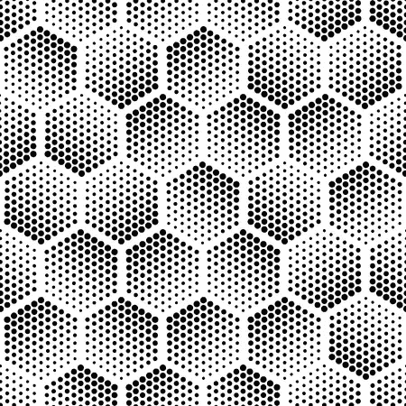
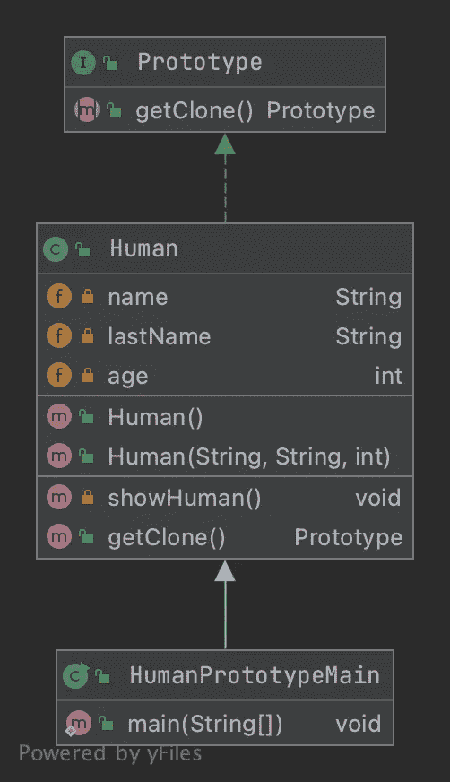

# 原型设计模式— Java

> 原文：<https://medium.com/javarevisited/prototype-design-pattern-java-79a100b0e4e8?source=collection_archive---------2----------------------->

## 原型设计模式教程



# 原型模式的定义

> **原型模式**是软件开发中一种创造性的设计模式。当要创建的对象类型由原型实例决定时，使用它，克隆原型实例以产生新的对象。

# 在哪里使用原型模式

如果创建新对象的成本很高并且耗费资源。

# 原型模式的 UML 示例

[](https://javarevisited.blogspot.com/2018/02/top-5-java-design-pattern-courses-for-developers.html)

# 构建器模式的实现

首先我们需要创建我们的原型类

*getClone()* 方法将在类中实现，该类将实现原型以返回同一类的新对象。
在下一个例子中，我们将创建一个人，然后实现克隆他的方法。

正如你所看到的， *getClone()* 将返回给我另一个**人类**，与之前创建的那个具有相同的名字、姓氏和年龄。

## 例如:

以下代码将给出以下输出

```
Human description 
---------------------------------
Name Last Name Age
Erwan Le Tutour 30
 Human description 
---------------------------------
Name Last Name Age
Erwan Le Tutour 30
```

正如您在上面看到的，我的 human2 和我的 human1 具有相同的属性值，但是只有当我实现了 [*equals()* 方法](https://javarevisited.blogspot.com/2015/01/why-override-equals-hashcode-or-tostring-java.html)时，它们才会相等。