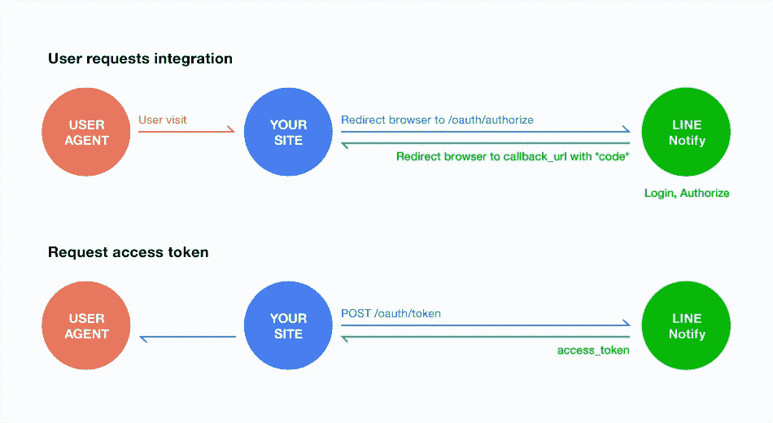
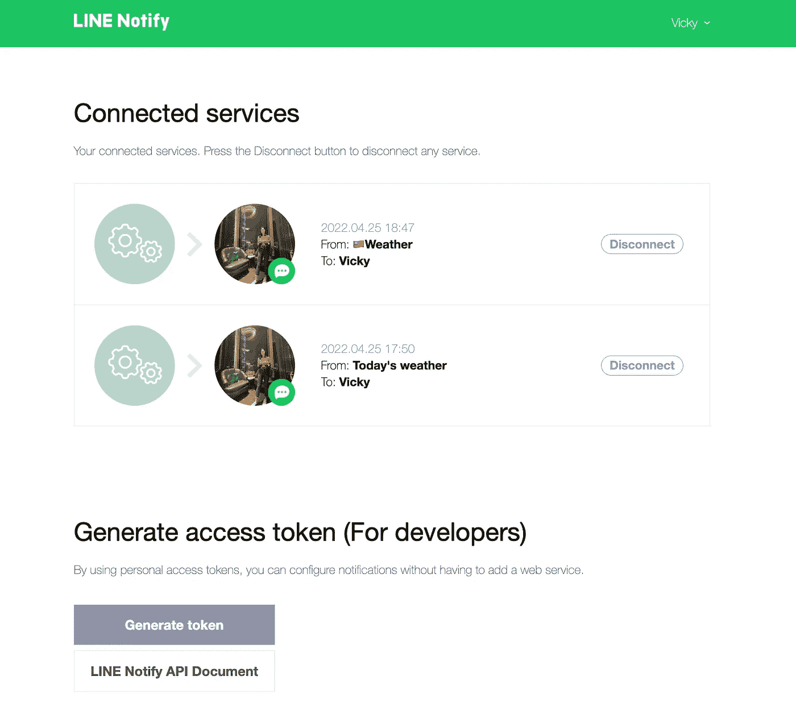
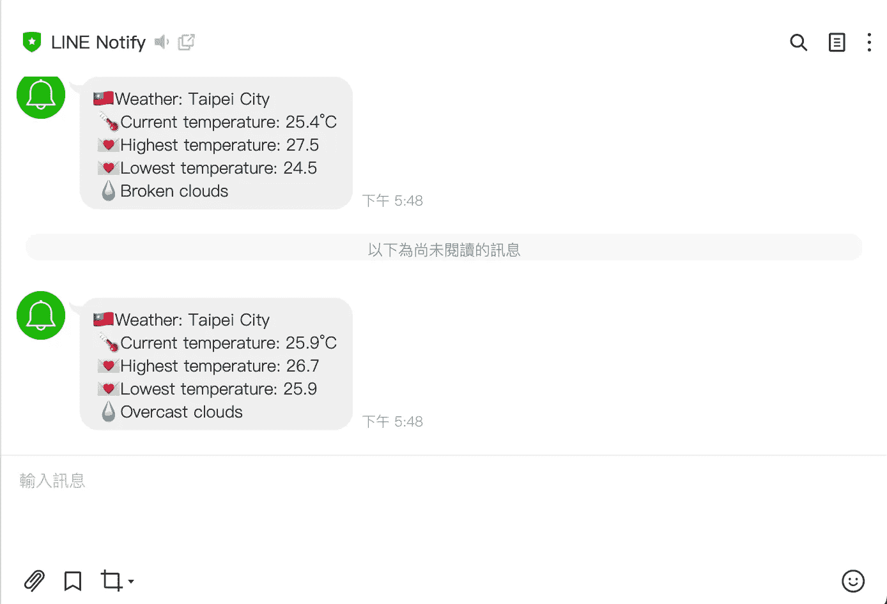

# [Python]建造一个今天的天气机器人

> 原文：<https://medium.com/javarevisited/python-build-a-todays-weather-bot-15bf12ab6e8?source=collection_archive---------0----------------------->

[](https://javarevisited.blogspot.com/2018/12/10-free-python-courses-for-programmers.html)

行通知 API

LINE 是台湾最受欢迎的消息应用。在这些特性中，带有授权令牌的 LINE Notify API 允许 web 应用程序手动或自动将通知传递给个人帐户或组帐户。

线路令牌:[https://notify-bot.line.me/my/](https://notify-bot.line.me/my/)

# 第一步。邀请线路通知到组

如果您想将信息发送到线路群组而不是您的个人帐户，请记住在发送信息之前将线路通知邀请到群组，以便群组可以首先收到信息。

# 第二步。生成令牌

在[页面](https://notify-bot.line.me/my/)生成令牌。当您点击**生成令牌**然后看到令牌时，请将其复制到安全的地方，因为注意到*如果您离开此页面，您将无法再次查看您新生成的令牌。请在离开此页面前复制令牌。*

[](https://www.java67.com/2018/02/5-free-python-online-courses-for-beginners.html)

线路 API 令牌

```
Note:
Line Notify allow you to generate a token as the key to authorization. You can apply more than one token for variant purposes. Moreover, you can remove not used tokens.
```

# 第三步。获取天气 API 凭据

有很多免费的开源天气 API。在本教程中，我将使用 OpenWeather，这是最流行的天气 API 之一。当前天气的文档可以在[这里](https://openweathermap.org/current)看到。

要获得您的 API 密钥，您应该点击“API 密钥”并从[这里](https://home.openweathermap.org/api_keys)复制您的 API 密钥。

# 第四步。密码

1.  检查 [API](/javarevisited/7-best-courses-to-learn-postman-tool-for-web-service-and-api-testing-f225c138fa5a) 是否工作。我更习惯于看到摄氏温度，所以我将 API 调用的参数替换为下面的`unit=metric`。

```
import requestsimport jsonapiKey = "Your API key from step 3"
lineToken = "Your token got from step 2"# id = city IDurl = "https://api.openweathermap.org/data/2.5/weather?id=1668338&units=metric&appid=" + keyr = requests.get(url)
data = json.loads(r.text)print(data)
```

结果将类似于下图，`status=200`表示成功获取数据:

```
{'coord': {'lon': 121.6503, 'lat': 25.0486}, 'weather': [{'id': 803, 'main': 'Clouds', 'description': 'broken clouds', 'icon': '04n'}], 'base': 'stations', 'main': {'temp': 25.9, 'feels_like': 26.37, 'temp_min': 25.33, 'temp_max': 27.26, 'pressure': 1011, 'humidity': 70}, 'visibility': 9000, 'wind': {'speed': 3.09, 'deg': 100}, 'clouds': {'all': 75}, 'dt': 1650885341, 'sys': {'type': 2, 'id': 2032887, 'country': 'TW', 'sunrise': 1650835355, 'sunset': 1650881998}, 'timezone': 28800, 'id': 1668338, 'name': 'Taipei City', 'cod': 200}
{"status":200,"message":"ok"}
```

2.因为我只需要下面消息中的城市、当前温度、最高温度、最低温度和天气描述的数据，所以处理 [JSON 数据](https://www.java67.com/2016/10/3-ways-to-convert-string-to-json-object-in-java.html)就是为了这个目的。

[](https://javarevisited.blogspot.com/2018/02/how-to-parse-json-with-date-field-in-java-jackson-example.html)

```
"""
# if units=imperial and it should be converted to metric additionally:def tempToC(fTemp):
return round((fTemp - 32) * 5 / 9, 1)
temp = data["main"]["temp"])
temp_max = tempToC(data["main"]["temp_max"])
temp_min = tempToC(data["main"]["temp_min"])
"""temp = data["main"]["temp"]
temp_max = data["main"]["temp_max"]
temp_min = data["main"]["temp_min"]
weather = data["weather"][0]["description"].capitalize()
```

3.我将通过天气机器人发送的消息由以下字符串组成:

```
msg = "%s\n 🌡Current temperature: %s°C\n 💌Highest temperature: %s\n 💌Lowest temperature: %s\n 💧%s" %(data['name'],temp,temp_max,temp_min,weather)
```

4.现在，我们可以使用 LINE notify API 发送 HTTP 请求来发送消息:

```
url = "https://notify-api.line.me/api/notify"
payload = {"message": {msg}}
headers = {"Authorization": "Bearer " + lineToken}
response = requests.request("POST", url, headers=headers, data=payload)
print(response.text)
```

5.使用`schedule`模块使代码在每天早上 7:30 例行运行:

```
import schedule
import timeschedule.every().day.at("07:30").do(sendToLine(lineToken,msg))
schedule.every(10).seconds.do(sendToLine, (lineToken))while True:
     schedule.run_pending()
     time.sleep(1)
```

瞧啊。！搞定了。！🎉