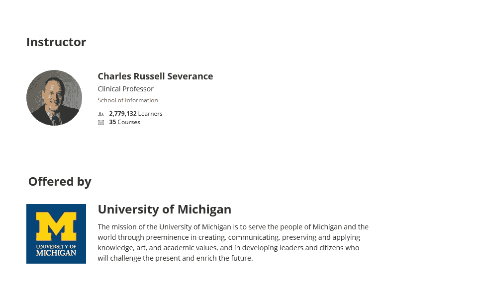
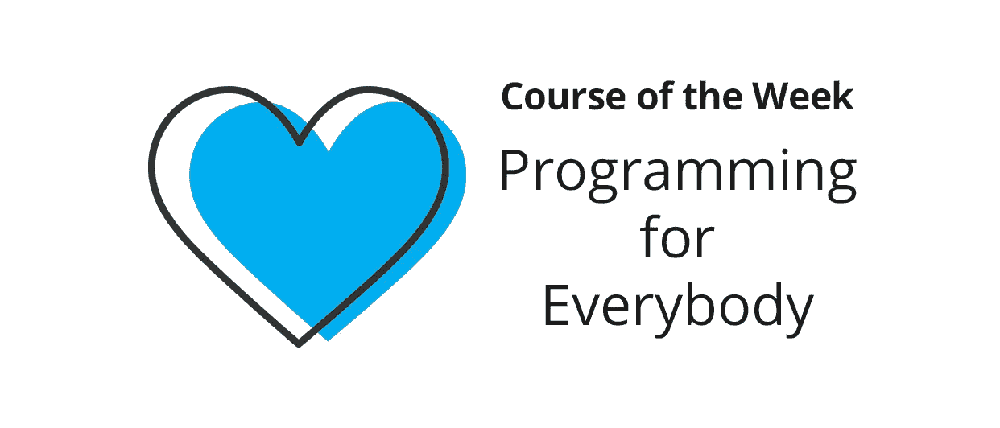
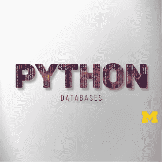
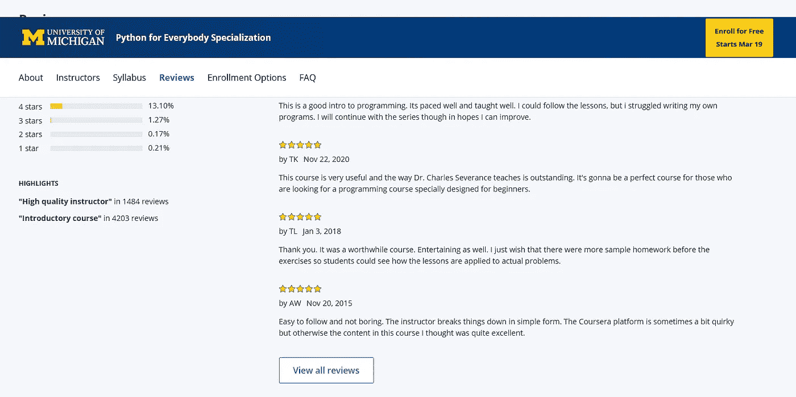

# Python for Everybody 课程回顾 2023—真的有那么好吗？

> 原文：<https://medium.com/javarevisited/python-for-everybody-course-review-is-it-really-that-good-bf84af24e28?source=collection_archive---------1----------------------->

## 我对 Coursera 的最佳 Python 认证的评论，来自密歇根大学的 Python for Everybody。如果你想参加这个课程，那么这篇评论是给你的。

你好，如果你想学习 Python 并在 Coursera 上寻找最好的 Python 课程，或者你只是想知道密歇根大学 Coursera 上的 [**Python for Everybody 课程**](https://coursera.pxf.io/c/3294490/1164545/14726?u=https%3A%2F%2Fwww.coursera.org%2Fspecializations%2Fpython) 是否值得你花费时间和金钱，那么你来对地方了。

早些时候，我已经分享了 Python 的[最佳 Coursera 认证](/javarevisited/10-best-python-certification-courses-from-coursera-4576890eb6b3)，在这篇文章中，我们将为大家回顾来自密歇根大学的 Python，这是最好的 Coursera 专业化认证之一，也是 Python 开发者的认证。

你应该在参加任何 Python 在线课程之前阅读这篇评论，但是如果你很着急，想要一个快速的是/否答案，不管你是否应该参加这个 Coursera 专业化，那么我们的答案是**是**，无论如何，你应该去参加。

这是 Coursera 上最全面的 python 课程之一，涵盖了所有必要的领域，如基础知识、[数据结构](/javarevisited/7-best-courses-to-learn-data-structure-and-algorithms-d5379ae2588?source=---------18------------------)、[数据库](/hackernoon/top-5-sql-and-database-courses-to-learn-online-48424533ac61)、[使用 Python 进行 web 报废](https://www.java67.com/2020/07/top-5-courses-to-learn-web-scraping-in-python-and-javascript.html)等等。已经有超过 75 万人参加了这个课程，这也是它的质量的一个很大的证明。

许多人说[学习一门编程语言](/hackernoon/10-best-programming-languages-to-learn-in-2019-e5b05af4a972)可能是一项艰巨的任务，甚至需要几个月才能学会最基本的东西，所以你开始开发自己的产品，无论是 web 服务还是移动应用程序，但如果我说有一种语言可以在几周内学会，那就是 python。

通过在许多平台和在线课程中的许多研究，我发现了学习这种神话般语言的最佳和全面的在线课程之一，名为[**Python for everybody specialization**](https://coursera.pxf.io/c/3294490/1164545/14726?u=https%3A%2F%2Fwww.coursera.org%2Fspecializations%2Fpython)由密歇根大学通过一个名为 Coursera 的在线平台提供。

<https://coursera.pxf.io/c/3294490/1164545/14726?u=https%3A%2F%2Fwww.coursera.org%2Fspecializations%2Fpython>  

这篇文章是对这个*大规模 Python 课程*的回顾，简单易学，所以你会看到你将在这个专业中看到什么东西，以及讲师的声誉和人们对这个课程的反馈。

# 2023 年来自 Coursera 的 Python for Everybody 认证课程回顾

让我们来看看*为什么 Python for Everybody specialization in Coursera*是深入学习 Python 的[最佳课程之一](/better-programming/top-5-courses-to-learn-python-in-2018-best-of-lot-26644a99e7ec)以及你为什么应该加入它。我们将看到一些有意义的实际原因，并帮助您决定是否应该学习这门课程来学习 Python。

## 1.讲师声誉

[**查尔斯·拉塞尔**](https://coursera.pxf.io/c/3294490/1164545/14726?u=https%3A%2F%2Fwww.coursera.org%2Finstructor%2Fdrchuck) 是密歇根大学的教授和 Udemy 的讲师，有超过 200 万名学生注册了他的 23 门课程，这些课程涉及不同的行业，从 [Python](/javarevisited/10-free-python-tutorials-and-courses-from-google-microsoft-and-coursera-for-beginners-96b9ad20b4e6) 和 [web 开发](/better-programming/my-5-favorite-courses-to-learn-web-development-in-2019-a5e74167f8b2)到 [SQL](/hackernoon/top-5-sql-and-database-courses-to-learn-online-48424533ac61) 和 web 应用程序，他还接触了其他平台，如 [edX](https://www.awin1.com/cread.php?awinmid=6798&awinaffid=631878&clickref=&p=) 。

他也是一名作家，出版了关于 python 和 Google engine 应用程序的[书籍，并且他与他人合作开发了许多 web 应用程序，例如一个名为 Sakia Moodle 的学习管理系统等等，所以当你学习这门课程时，你会得到很好的帮助。](/javarevisited/my-favorite-books-to-learn-python-in-depth-77465633b46e)

# 2.认证结构和内容

该课程旨在对初学者友好，从计算机和编程的历史开始教你，然后学习 python 及其基础。让我们探索一下本课程的内容:

## 2.1.[为大家编程](https://coursera.pxf.io/c/3294490/1164545/14726?u=https%3A%2F%2Fwww.coursera.org%2Flearn%2Fpython%3Fspecialization%3Dpython)

你将了解编程指令的基础，计算机如何理解编程语言并知道做什么，以及 [python 语言](https://javarevisited.blogspot.com/2020/05/why-python-is-best-programming-language.html)如何工作，以及计算机编程的一些基础和一般概念。

## 2.2. [Python 数据结构](https://coursera.pxf.io/c/3294490/1164545/14726?u=https%3A%2F%2Fwww.coursera.org%2Flearn%2Fpython-data%3Fspecialization%3Dpython)

有趣的部分从这里开始，你将了解用户输入和输出的变量和数据类型，以及更多的 python 基础知识，以及可以在字符串上执行的不同操作，处理文件和使用元组字典以及更多的主题。

## 2.3.[使用 Python 访问 Web 数据](https://coursera.pxf.io/c/3294490/1164545/14726?u=https%3A%2F%2Fwww.coursera.org%2Flearn%2Fpython-network-data%3Fspecialization%3Dpython)

本课程将教你如何使用 python 通过多种方法访问 web 数据，如 web API 以及套接字连接，你将处理 [HTML](/javarevisited/10-best-html-and-css-courses-for-beginners-in-2021-6757eec00032) 、XML 和 JSON，以便你在线解析和读取数据以及许多其他主题。

## 2.4.[用 Python 使用数据库](https://coursera.pxf.io/c/3294490/1164545/14726?u=https%3A%2F%2Fwww.coursera.org%2Flearn%2Fpython-databases%3Fspecialization%3Dpython)

现在转到如何在与数据库交互时使用 python，特别是 SQL 数据库技术，因此您将使用一些库来完成这项工作，您将学习如何使用这种 SQL 语言和设计数据库系统，最后，您将构建一个简单的程序，该程序可以抓取 web 并将数据存储在 [SQL 数据库](https://hackernoon.com/top-5-sql-and-database-courses-to-learn-online-48424533ac61)中。

## **2.5。** [**顶点:用 Python**](https://coursera.pxf.io/c/3294490/1164545/14726?u=https%3A%2F%2Fwww.coursera.org%2Flearn%2Fpython-data-visualization) 检索、处理和可视化数据

最后，在完成前面的课程后，您将完成一个顶点项目，在这个项目中，您将构建一个可以从 web 中检索数据的程序，然后处理和组织这些数据，最后使用名为 [D3.js](/javarevisited/7-best-online-courses-to-learn-d3-js-for-data-visualization-in-2020-1a8c79add4e4) 的 JavaScript 库将它们可视化，就这样。

## 3.社区评论

[**Python for Everybody specialization**](https://coursera.pxf.io/c/3294490/1164545/14726?u=https%3A%2F%2Fwww.coursera.org%2Fspecializations%2Fpython)被认为是学习 Python 的著名在线课程之一，注册人数超过 100 万，根据 29 万人对该课程及其内容的评分和反馈，该课程获得了 4.8 星(满分 5 分)。

视频制作和测验问题对初学者来说很好，也很友好，尤其是对那些以前从未尝试过[编码的人来说，并且忘记提到人们提交的关于他们与这位讲师的经历的积极反馈。](/javarevisited/7-best-coding-course-to-learn-programming-with-zero-experience-in-2020-52f7d0d9cb80)

你会很高兴地知道，超过 39%的学习者已经开始了 python 开发人员的新职业，而 19%的人在完成课程后获得了晋升，这意味着你将投资于一门有价值的课程。

如果你现在确定或者想了解更多，那么这里有加入这个令人敬畏的课程的链接—[**Python for ever body specialization**](https://coursera.pxf.io/c/3294490/1164545/14726?u=https%3A%2F%2Fwww.coursera.org%2Fspecializations%2Fpython)

<https://coursera.pxf.io/c/3294490/1164545/14726?u=https%3A%2F%2Fwww.coursera.org%2Fspecializations%2Fpython>  

如果你想要更多的评论，你可以在这里阅读所有的<https://coursera.pxf.io/c/3294490/1164545/14726?u=https%3A%2F%2Fwww.coursera.org%2Flearn%2Fpython%3Fspecialization%3Dpython>**。**

****

**以上是对 Coursera 最好的 Python 课程——密歇根大学的 Python for every BOD (**y)的评论。Python 编程是当今广泛使用的语言，许多开发人员已经将他们的职业转向学习 Python。****

**甚至像 Dropbox、谷歌、Instagram、网飞等大公司也在他们的系统中使用 python，无论是构建网络应用还是在系统中添加人工智能。你可以单独加入这个专业，学习是免费的，但是如果你想要一个证书，那么你需要加入这个专业，费用大约是每月 39 美元。**

**或者，你也可以加入他们的 [**Coursera Plus**](https://coursera.pxf.io/c/3294490/1164545/14726?u=https%3A%2F%2Fwww.coursera.org%2Fcourseraplus) 订阅，只需一笔费用就可以获得无限的证书。如果你打算参加多个 Coursera 课程、项目、认证和专业，这样会更好。**

**<https://coursera.pxf.io/c/3294490/1164545/14726?u=https%3A%2F%2Fwww.coursera.org%2Fcourseraplus>  

你可能喜欢的其他 **Python 编程和** **Coursera 文章**

*   免费学习 Python 的 5 个网站
*   [Python vs Java？从哪个开始比较好？](https://hackernoon.com/java-vs-python-which-is-better-to-learn-for-beginners-in-2020-yq1t3y58)
*   [2023 年学习 Python 的 10 个理由](https://javarevisited.blogspot.com/2018/05/10-reasons-to-learn-python-programming.html)
*   [5 Python 中的数据科学与机器学习课程](https://javarevisited.blogspot.com/2018/03/top-5-data-science-and-machine-learning-online-courses-to-learn-online.html)
*   [初学 Python 的 5 大课程](https://hackernoon.com/top-5-courses-to-learn-python-in-2018-best-of-lot-26644a99e7ec)
*   [Python 开发者的 5 大 Web 开发框架](https://javarevisited.blogspot.com/2019/04/top-5-python-web-development-frameworks.html)
*   [2023 年程序员 10 大课程课程](https://javarevisited.blogspot.com/2020/08/top-10-coursera-courses-specilizations-and-certifications.html)
*   [开始职业生涯的 10 大 Coursera 认证](/javarevisited/top-10-coursera-certificates-to-start-your-career-in-cloud-data-science-ai-mainframe-and-it-558690c83587)
*   [Udemy vs Pluralsight？哪个学习平台比较好？](https://javarevisited.blogspot.com/2019/10/udemy-vs-pluralsight-review-which-is-better-to-learn-code.html)
*   [学习数据科学的十大 Coursera 课程](https://javarevisited.blogspot.com/2020/08/top-10-coursera-certifications-to-learn-Data-Science-Visualization-and-Data-Analysis.html)
*   [面向程序员和开发人员的 Coursera 十大项目](https://javarevisited.blogspot.com/2020/08/top-10-coursera-projects-to-learn-essential-programming-skills.html)
*   [Coursera 证书对工作和事业有帮助吗](https://javarevisited.blogspot.com/2020/02/does-udemy-coursera-edx-educative-or.html)
*   [学习云计算的 10 门最佳 Coursera 课程](https://javarevisited.blogspot.com/2020/08/top-10-coursera-certifications-to-learn-cloud-computing-aws.html#axzz6WK1yC5WW)
*   Coursera Plus Review——在 Coursera 上学习的更好方式
*   [Udemy vs CocdeCademy vs one month？](https://javarevisited.blogspot.com/2019/09/codecademy-vs-udemy-vs-onemonth-which-is-better-for-learning-code.html#axzz6VYKcmyZz)
*   Udemy vs Educative vs Codecademy？新手用哪个比较好
*   [2023 年学习 Python 可以做的 8 个项目](/javarevisited/8-projects-you-can-buil-to-learn-python-in-2020-251dd5350d56)
*   [2023 年学习人工智能的 7 门最佳课程](/javarevisited/7-best-courses-to-learn-artificial-intelligence-in-2020-26d59d62f6fe)
*   【Coursera 的 10 项数据科学和机器学习认证

感谢阅读这篇文章。如果你喜欢我对 Coursera 最好的 Python 课程——来自密歇根大学的 Python——的评论，那么请与你的朋友和同事分享。如果您有任何问题或反馈，请留言。

**P. S.** —如果你正在寻找学习 Python 的最佳 Udemy 课程，那么我强烈推荐你加入 Udemy 上何塞·波尔蒂利亚的 [**完整的 Python 训练营:从零到英雄**](http://bit.ly/2BY5LJC) 课程。这是最受欢迎的 Python 课程，已经有超过 100 万的学生学习了这门课程。它也很实惠，在 Udemy 上只需 10 美元就能买到

<http://bit.ly/2BY5LJC> **